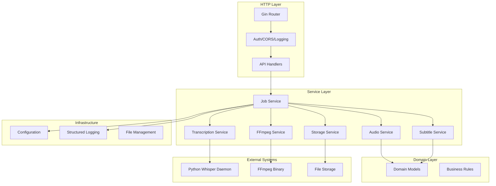
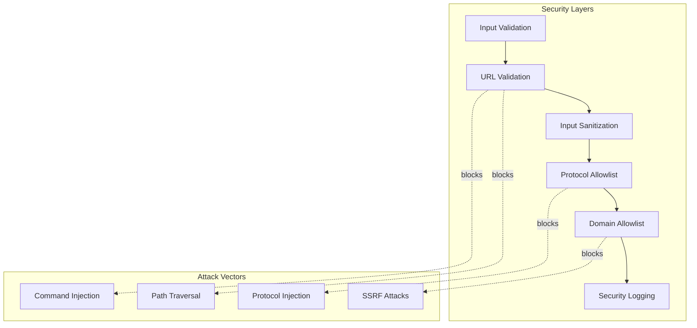
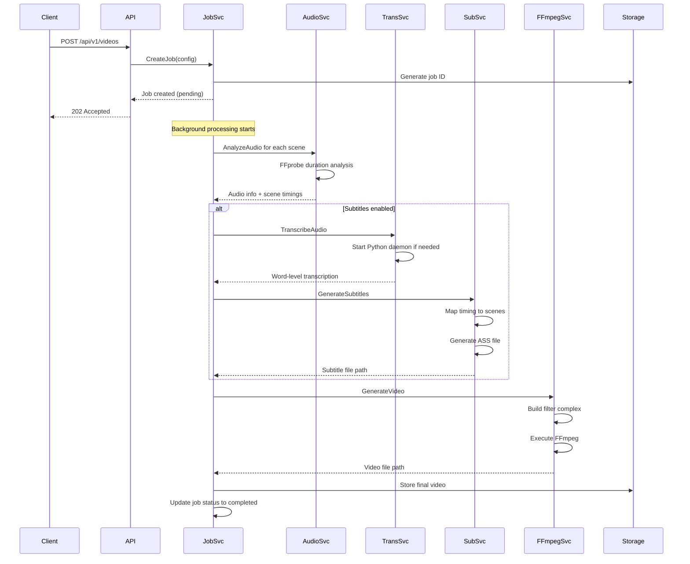

# VideoCraft - Technical Developer Documentation

## Table of Contents
1. [Architecture Overview](#architecture-overview)
2. [Core Components](#core-components)
3. [Security Implementation](#security-implementation)
4. [Data Flow & Processing](#data-flow--processing)
5. [Progressive Subtitles System](#progressive-subtitles-system)
6. [Python-Go Integration](#python-go-integration)
7. [FFmpeg Integration](#ffmpeg-integration)
8. [Configuration Management](#configuration-management)
9. [Error Handling](#error-handling)
10. [Performance Optimization](#performance-optimization)
11. [Debugging & Troubleshooting](#debugging--troubleshooting)
12. [Development Guidelines](#development-guidelines)

## Architecture Overview

VideoCraft follows a clean architecture pattern with clear separation of concerns:



### Key Architectural Principles

1. **Dependency Injection**: Services are injected via constructors for testability
2. **Interface Segregation**: Clear interfaces define service contracts
3. **Single Responsibility**: Each service has a focused, well-defined purpose
4. **Error Handling**: Comprehensive error types and propagation
5. **Concurrent Processing**: Goroutines for parallel audio analysis and transcription

## Core Components

### 1. HTTP API Layer (`internal/api/`)

**Handlers**: Process HTTP requests and coordinate service calls
- `video.go`: Video generation endpoints
- `job.go`: Job management endpoints  
- `health.go`: Health check and metrics

**Middleware**: Cross-cutting concerns
- `auth.go`: Bearer token authentication
- `cors.go`: Secure CORS configuration with domain allowlisting
- `csrf.go`: CSRF protection with token validation
- `logger.go`: Request/response logging with correlation IDs
- `error.go`: Centralized error handling and formatting
- `ratelimit.go`: Rate limiting protection

**Router**: Route configuration and middleware setup

### 2. Service Layer (`internal/services/`)

**Job Service**: Orchestrates video generation workflow
```go
type JobService interface {
    CreateJob(config *models.VideoConfigArray) (*models.Job, error)
    ProcessJob(ctx context.Context, job *models.Job) error
    GetJob(id string) (*models.Job, error)
    UpdateJobProgress(id string, progress int) error
}
```

**Audio Service**: Audio file analysis and timing calculation
```go
type AudioService interface {
    AnalyzeAudio(ctx context.Context, url string) (*AudioInfo, error)
    CalculateSceneTiming(elements []models.Element) ([]models.TimingSegment, error)
}
```

**Transcription Service**: Python Whisper daemon communication
```go
type TranscriptionService interface {
    TranscribeAudio(ctx context.Context, url string) (*TranscriptionResult, error)
    Shutdown()
}
```

**Subtitle Service**: ASS subtitle generation with progressive timing
```go
type SubtitleService interface {
    GenerateSubtitles(ctx context.Context, project models.VideoProject) (*SubtitleResult, error)
    ValidateSubtitleConfig(project models.VideoProject) error
}
```

**FFmpeg Service**: Video encoding and command generation
```go
type FFmpegService interface {
    GenerateVideo(ctx context.Context, config *models.VideoConfigArray, progressChan chan<- int) (string, error)
    BuildCommand(config *models.VideoConfigArray) (*FFmpegCommand, error)
}
```

### 3. Domain Layer (`internal/domain/`)

**Models**: Core business entities
- `VideoProject`: Complete video configuration
- `Scene`: Individual scene with elements
- `Element`: Audio, image, video, or subtitle element
- `Job`: Async processing job with status tracking
- `TranscriptionResult`: Whisper output with word-level timing

**Validation**: Business rule enforcement and input validation

## Security Implementation

VideoCraft implements a comprehensive security-first approach to protect against command injection, unauthorized access, and malicious input.

### Multi-Layered Security Architecture



### HTTP Security Layer

VideoCraft implements comprehensive HTTP-level security through specialized middleware components:

#### CORS Security (`internal/api/middleware/cors.go`)

**Key Features:**
- **Zero Wildcard Policy**: Eliminates `AllowOrigins: ["*"]` vulnerability
- **Strict Domain Allowlisting**: Only explicitly configured domains permitted
- **Origin Validation Caching**: Thread-safe performance optimization
- **Suspicious Pattern Detection**: Blocks malicious origin patterns
- **Comprehensive Security Logging**: Structured audit trail

**Configuration:**
```go
// Environment variable
VIDEOCRAFT_SECURITY_ALLOWED_DOMAINS="trusted.example.com,api.trusted.org"

// YAML configuration
security:
  allowed_domains:
    - "trusted.example.com"
    - "api.trusted.org"
```

#### CSRF Protection (`internal/api/middleware/csrf.go`)

**Key Features:**
- **Token-Based Validation**: Cryptographically secure CSRF tokens
- **State-Change Protection**: POST, PUT, DELETE, PATCH requests require tokens
- **Enhanced Token Validation**: Format validation prevents injection attacks
- **Origin Correlation**: Cross-reference with CORS-allowed domains
- **Safe Method Exemption**: GET, HEAD, OPTIONS bypass CSRF checks

**Usage:**
```bash
# Get CSRF token
curl http://localhost:3002/api/v1/csrf-token

# Include token in request
curl -X POST -H "X-CSRF-Token: your-token" http://localhost:3002/api/v1/generate-video
```

For detailed HTTP security implementation, see: [`internal/api/middleware/SECURITY.md`](internal/api/middleware/SECURITY.md)

### FFmpeg Command Injection Prevention

The FFmpeg service implements comprehensive protection against command injection attacks through multiple validation layers:

#### 1. URL Validation
```go
func (s *ffmpegService) ValidateURL(rawURL string) error {
    // Early rejection of dangerous URI schemes
    if err := s.checkForDataURI(rawURL); err != nil {
        return err
    }
    
    // Character-based injection detection
    if err := s.checkForInjectionChars(rawURL); err != nil {
        return err
    }
    
    // Path traversal detection
    if err := s.checkForPathTraversal(rawURL); err != nil {
        return err
    }
    
    // URL structure and protocol validation
    return s.validateURLStructureAndProtocol(rawURL)
}
```

#### 2. Input Sanitization
- **Prohibited Characters**: `[;&|` + "`" + `$(){}]`
- **Path Traversal**: `\.\.\/|\.\.\\`
- **Command Filtering**: Removes dangerous shell commands
- **Token Isolation**: Keeps only first valid token

#### 3. Protocol Allowlist
- **Allowed**: HTTP, HTTPS only
- **Blocked**: `data:`, `file:`, `javascript:`, `vbscript:`

#### 4. Domain Allowlist (Optional)
```go
type SecurityConfig struct {
    AllowedDomains []string `mapstructure:"allowed_domains"`
}
```

#### 5. Security Logging
All security violations are logged with structured data:
```go
func (s *ffmpegService) logSecurityViolation(message string, fields map[string]interface{}) {
    s.log.WithFields(fields).Errorf("SECURITY_VIOLATION: %s", message)
}
```

### Security Integration Points

Security validation is integrated at critical points in the video generation workflow:

1. **Command Building**: All URLs validated before FFmpeg command construction
2. **Configuration Processing**: Input sanitization during config parsing
3. **External Resource Access**: Domain allowlist enforcement
4. **Error Handling**: Security violations properly logged and reported

### Security Testing

Comprehensive test coverage includes:
- **34 security-focused tests** across main and edge case scenarios
- **Command injection prevention** testing
- **Performance testing** (1000 URLs validated in <1ms)
- **Edge case handling** (Unicode, encoding, case sensitivity)

#### Example Security Tests
```go
func TestFFmpegService_URLValidation_CommandInjectionPrevention(t *testing.T) {
    maliciousURLs := []struct {
        url           string
        expectedError string
    }{
        {"http://example.com/video.mp4; rm -rf /", "prohibited characters"},
        {"file:///etc/passwd", "Protocol not allowed"},
        {"data:text/plain;base64,SGVsbG8=", "Protocol not allowed"},
        {"http://example.com/../../../etc/passwd", "path traversal sequences"},
    }
    
    for _, test := range maliciousURLs {
        err := service.ValidateURL(test.url)
        require.Error(t, err)
        assert.Contains(t, err.Error(), test.expectedError)
    }
}
```

### Configuration

Security features are configurable via environment variables:

```bash
# Domain allowlist (comma-separated)
VIDEOCRAFT_SECURITY_ALLOWED_DOMAINS=trusted.example.com,cdn.trusted.org

# Rate limiting
VIDEOCRAFT_SECURITY_RATE_LIMIT=100

# Authentication
VIDEOCRAFT_SECURITY_ENABLE_AUTH=true
```

### Security Best Practices

1. **Defense in Depth**: Multiple validation layers prevent bypass attempts
2. **Allowlist over Blocklist**: Protocol and domain allowlists are more secure
3. **Input Sanitization**: Clean inputs before processing
4. **Comprehensive Logging**: All security events are logged for monitoring
5. **Regular Testing**: Automated security tests prevent regressions

## Data Flow & Processing

### Video Generation Workflow



### Key Processing Steps

1. **Configuration Validation**: JSON schema validation and business rules
2. **Audio Analysis**: Parallel duration analysis using FFprobe
3. **Scene Timing Calculation**: Map audio durations to scene boundaries
4. **Transcription**: Word-level timing via Python Whisper daemon
5. **Subtitle Generation**: ASS file creation with progressive timing
6. **FFmpeg Command Building**: Complex filter chain construction
7. **Video Encoding**: FFmpeg execution with progress monitoring
8. **Storage & Cleanup**: File management and temporary cleanup

## Progressive Subtitles System

### The Timing Challenge

Traditional subtitle systems use simple concatenation of transcription durations, leading to timing gaps. VideoCraft solves this by using **real audio file durations** for scene timing.

### How Progressive Subtitles Work

1. **Audio Duration Analysis**:
```go
func (as *audioService) AnalyzeAudio(ctx context.Context, url string) (*AudioInfo, error) {
    // Use FFprobe to get REAL file duration, not just speech duration
    cmd := exec.CommandContext(ctx, "ffprobe", 
        "-v", "quiet", 
        "-print_format", "json", 
        "-show_format", url)
    // Parse duration from format.duration field
}
```

2. **Scene Timing Calculation**:
```go
func (ss *subtitleService) calculateSceneTimings(transcriptionResults []*TranscriptionResult, audioElements []models.Element) ([]models.TimingSegment, error) {
    currentTime := 0.0
    var timings []models.TimingSegment
    
    for i, element := range audioElements {
        // Get REAL audio duration using AudioService (like Python ffprobe)
        audioInfo, err := ss.getAudioDuration(ctx, element.Src)
        duration := audioInfo.Duration // Real file duration, not speech duration
        
        timing := models.TimingSegment{
            StartTime: currentTime,
            EndTime:   currentTime + duration,
            AudioFile: element.Src,
        }
        timings = append(timings, timing)
        currentTime += duration
    }
    return timings, nil
}
```

3. **Word Timing Mapping**:
```go
func CreateProgressiveEventsWithSceneTiming(words []WordTimestamp, sceneTiming models.TimingSegment) []SubtitleEvent {
    sceneStartTime := time.Duration(sceneTiming.StartTime * float64(time.Second))
    
    for _, word := range words {
        // Map Whisper timestamps (relative to audio file) to absolute video timeline
        startTime := sceneStartTime + time.Duration(word.Start*float64(time.Second))
        
        event := SubtitleEvent{
            StartTime: startTime,
            EndTime:   endTime,
            Text:      word.Word,
        }
    }
}
```

### ASS Subtitle Generation

VideoCraft generates Advanced SubStation Alpha (ASS) files with rich styling:

```go
type ASSConfig struct {
    FontFamily   string
    FontSize     int
    Position     string
    WordColor    string
    OutlineColor string
    OutlineWidth int
    ShadowOffset int
}
```

Progressive subtitles create individual events for each word with precise timing, enabling word-by-word highlighting effects.

## Python-Go Integration

### Whisper Daemon Architecture

VideoCraft uses a long-running Python daemon for efficient Whisper AI integration:

```python
# scripts/whisper_daemon.py
class WhisperDaemon:
    def __init__(self):
        self.model = None
        self.idle_timer = None
        self.IDLE_TIMEOUT = 300  # 5 minutes
    
    def load_model(self, model_name="base"):
        if self.model is None:
            self.model = whisper.load_model(model_name, device="cpu")
    
    def transcribe_with_words(self, audio_url):
        # Capture stdout to prevent "Detected language" from interfering with JSON
        captured_output = io.StringIO()
        with contextlib.redirect_stdout(captured_output):
            with contextlib.redirect_stderr(captured_output):
                result = self.model.transcribe(audio_url, word_timestamps=True)
        return result
```

### Go-Python Communication

The Go transcription service communicates with Python via stdin/stdout:

```go
type transcriptionService struct {
    cmd    *exec.Cmd
    stdin  io.WriteCloser
    stdout *bufio.Reader
    stderr *bufio.Reader
    mu     sync.Mutex
}

func (ts *transcriptionService) startDaemon() error {
    ts.cmd = exec.Command(ts.cfg.PythonPath, ts.cfg.WhisperDaemonPath)
    
    // Setup pipes for communication
    stdin, _ := ts.cmd.StdinPipe()
    stdout, _ := ts.cmd.StdoutPipe()
    stderr, _ := ts.cmd.StderrPipe()
    
    ts.stdin = stdin
    ts.stdout = bufio.NewReader(stdout)
    ts.stderr = bufio.NewReader(stderr)
    
    return ts.cmd.Start()
}

func (ts *transcriptionService) TranscribeAudio(ctx context.Context, url string) (*TranscriptionResult, error) {
    request := map[string]interface{}{
        "action": "transcribe",
        "url":    url,
        "model":  ts.cfg.WhisperModel,
    }
    
    // Send JSON request via stdin
    requestJSON, _ := json.Marshal(request)
    ts.stdin.Write(append(requestJSON, '\n'))
    
    // Read JSON response from stdout
    responseJSON, _ := ts.stdout.ReadLine()
    var result TranscriptionResult
    json.Unmarshal(responseJSON, &result)
    
    return &result, nil
}
```

### Daemon Lifecycle Management

- **Lazy Loading**: Daemon starts on first transcription request
- **Idle Timeout**: Automatic shutdown after 5 minutes of inactivity
- **Graceful Shutdown**: Proper cleanup on service shutdown
- **Error Recovery**: Restart daemon on communication failures

## FFmpeg Integration

### Command Generation

VideoCraft generates complex FFmpeg commands with multiple inputs and filter chains:

```go
func (fs *ffmpegService) BuildCommand(config *models.VideoConfigArray) (*FFmpegCommand, error) {
    cmd := []string{"ffmpeg", "-y"}
    
    // Input files
    cmd = append(cmd, "-i", backgroundVideo)
    for _, audioFile := range audioFiles {
        cmd = append(cmd, "-i", audioFile)
    }
    for _, imageFile := range imageFiles {
        cmd = append(cmd, "-i", imageFile)
    }
    
    // Filter complex for overlays and timing
    filterComplex := fs.buildFilterComplex(config)
    cmd = append(cmd, "-filter_complex", filterComplex)
    
    // Subtitle overlay
    if subtitleFile != "" {
        cmd = append(cmd, "-vf", fmt.Sprintf("ass=%s", subtitleFile))
    }
    
    // Output settings
    cmd = append(cmd, "-c:v", "libx264", "-preset", "medium", "-crf", "23")
    cmd = append(cmd, outputPath)
    
    return &FFmpegCommand{Args: cmd, OutputPath: outputPath}, nil
}
```

### Filter Complex Generation

For scene-based timing and overlays:

```go
func (fs *ffmpegService) buildFilterComplex(config *models.VideoConfigArray) string {
    var filters []string
    
    // Background video scaling
    filters = append(filters, "[0:v]scale=1920:1080:force_original_aspect_ratio=decrease,pad=1920:1080:-1:-1[bg]")
    
    // Audio concatenation with scene timing
    audioInputs := make([]string, len(scenes))
    for i, scene := range scenes {
        timing := sceneTimings[i]
        filters = append(filters, 
            fmt.Sprintf("[%d:a]adelay=%d|%d[a%d]", 
                i+1, int(timing.StartTime*1000), int(timing.StartTime*1000), i))
        audioInputs[i] = fmt.Sprintf("[a%d]", i)
    }
    
    // Mix all audio tracks
    filters = append(filters, fmt.Sprintf("%samix=inputs=%d[audio]", 
        strings.Join(audioInputs, ""), len(audioInputs)))
    
    // Image overlays with timing
    currentVideo := "[bg]"
    for i, overlay := range imageOverlays {
        timing := overlayTimings[i]
        nextVideo := fmt.Sprintf("[v%d]", i)
        filters = append(filters, 
            fmt.Sprintf("%s[%d:v]overlay=%d:%d:enable='between(t,%.2f,%.2f)'%s",
                currentVideo, overlay.InputIndex, overlay.X, overlay.Y, 
                timing.StartTime, timing.EndTime, nextVideo))
        currentVideo = nextVideo
    }
    
    return strings.Join(filters, ";")
}
```

### Progress Monitoring

FFmpeg progress is monitored via stderr parsing:

```go
func (fs *ffmpegService) Execute(ctx context.Context, cmd *FFmpegCommand) error {
    execCmd := exec.CommandContext(ctx, cmd.Args[0], cmd.Args[1:]...)
    
    stderr, _ := execCmd.StderrPipe()
    
    go func() {
        scanner := bufio.NewScanner(stderr)
        for scanner.Scan() {
            line := scanner.Text()
            if strings.Contains(line, "time=") {
                // Parse time progress and update
                progress := fs.parseProgress(line)
                fs.updateProgress(progress)
            }
        }
    }()
    
    return execCmd.Run()
}
```

## Configuration Management

### Environment Variables

```go
type Config struct {
    Server struct {
        Port string `mapstructure:"port"`
        Host string `mapstructure:"host"`
    } `mapstructure:"server"`
    
    Auth struct {
        APIKey string `mapstructure:"api_key"`
    } `mapstructure:"auth"`
    
    Python struct {
        Path              string `mapstructure:"path"`
        WhisperDaemonPath string `mapstructure:"whisper_daemon_path"`
        WhisperModel      string `mapstructure:"whisper_model"`
        WhisperDevice     string `mapstructure:"whisper_device"`
    } `mapstructure:"python"`
    
    FFmpeg struct {
        Path    string `mapstructure:"path"`
        Timeout int    `mapstructure:"timeout"`
    } `mapstructure:"ffmpeg"`
    
    Storage struct {
        OutputDir string `mapstructure:"output_dir"`
        TempDir   string `mapstructure:"temp_dir"`
        MaxAge    int    `mapstructure:"max_age"`
    } `mapstructure:"storage"`
    
    Security struct {
        APIKey         string   `mapstructure:"api_key"`
        RateLimit      int      `mapstructure:"rate_limit"`
        EnableAuth     bool     `mapstructure:"enable_auth"`
        AllowedDomains []string `mapstructure:"allowed_domains"`
        EnableCSRF     bool     `mapstructure:"enable_csrf"`
        CSRFSecret     string   `mapstructure:"csrf_secret"`
    } `mapstructure:"security"`
}
```

### Configuration Loading

Using Viper for flexible configuration:

```go
func Load() (*Config, error) {
    viper.SetConfigName("config")
    viper.SetConfigType("yaml")
    viper.AddConfigPath("./config")
    viper.AddConfigPath(".")
    
    // Environment variable mapping
    viper.SetEnvPrefix("VIDEOCRAFT")
    viper.AutomaticEnv()
    viper.SetEnvKeyReplacer(strings.NewReplacer(".", "_"))
    
    // Default values
    setDefaults()
    
    if err := viper.ReadInConfig(); err != nil {
        // Config file is optional, continue with env vars and defaults
    }
    
    var config Config
    return &config, viper.Unmarshal(&config)
}
```

## Error Handling

### Error Types

```go
// Domain errors
type DomainError struct {
    Code    string `json:"code"`
    Message string `json:"message"`
    Details any    `json:"details,omitempty"`
}

// Service errors
var (
    ErrAudioAnalysisFailed     = errors.New("audio analysis failed")
    ErrTranscriptionFailed     = errors.New("transcription failed")
    ErrSubtitleGenerationFailed = errors.New("subtitle generation failed")
    ErrVideoGenerationFailed   = errors.New("video generation failed")
)

// HTTP errors
type HTTPError struct {
    StatusCode int    `json:"status_code"`
    Message    string `json:"message"`
    RequestID  string `json:"request_id"`
}
```

### Error Propagation

```go
func (js *jobService) ProcessJob(ctx context.Context, job *models.Job) error {
    // Update job status to processing
    if err := js.UpdateJobStatus(job.ID, models.JobStatusProcessing, ""); err != nil {
        return fmt.Errorf("failed to update job status: %w", err)
    }
    
    // Process with error handling
    if err := js.processJobInternal(ctx, job); err != nil {
        // Update job status to failed with error message
        js.UpdateJobStatus(job.ID, models.JobStatusFailed, err.Error())
        return fmt.Errorf("job processing failed: %w", err)
    }
    
    // Update job status to completed
    return js.UpdateJobStatus(job.ID, models.JobStatusCompleted, "")
}
```

## Performance Optimization

### Concurrent Processing

```go
func (as *audioService) AnalyzeMultipleAudios(ctx context.Context, urls []string) ([]*AudioInfo, error) {
    var wg sync.WaitGroup
    results := make([]*AudioInfo, len(urls))
    errors := make([]error, len(urls))
    
    // Limit concurrent analysis
    semaphore := make(chan struct{}, 4)
    
    for i, url := range urls {
        wg.Add(1)
        go func(index int, audioURL string) {
            defer wg.Done()
            semaphore <- struct{}{}        // Acquire
            defer func() { <-semaphore }() // Release
            
            info, err := as.AnalyzeAudio(ctx, audioURL)
            results[index] = info
            errors[index] = err
        }(i, url)
    }
    
    wg.Wait()
    
    // Check for errors
    for _, err := range errors {
        if err != nil {
            return nil, err
        }
    }
    
    return results, nil
}
```

### Memory Management

- **Streaming Processing**: Large files processed in chunks
- **Temporary File Cleanup**: Automatic cleanup of intermediate files
- **Model Caching**: Whisper model cached in daemon process
- **Connection Pooling**: Reuse HTTP connections for file downloads

### Resource Limits

```go
type ResourceLimits struct {
    MaxConcurrentJobs       int
    MaxConcurrentAnalysis   int
    MaxFileSize            int64
    MaxAudioDuration       time.Duration
    MaxTranscriptionTime   time.Duration
    MaxVideoGeneration     time.Duration
}
```

## Debugging & Troubleshooting

### Logging Strategy

Structured logging with correlation IDs:

```go
type Logger interface {
    WithFields(fields map[string]interface{}) Logger
    WithError(err error) Logger
    Info(msg string)
    Error(msg string)
    Debug(msg string)
}

// Usage in services
func (js *jobService) ProcessJob(ctx context.Context, job *models.Job) error {
    logger := js.log.WithFields(map[string]interface{}{
        "job_id":     job.ID,
        "request_id": ctx.Value("request_id"),
    })
    
    logger.Info("starting job processing")
    
    if err := js.processJobInternal(ctx, job); err != nil {
        logger.WithError(err).Error("job processing failed")
        return err
    }
    
    logger.Info("job processing completed")
    return nil
}
```

### Debug Information

Enable debug mode for verbose logging:

```bash
export VIDEOCRAFT_LOG_LEVEL=debug
export VIDEOCRAFT_FFMPEG_LOG_LEVEL=info
```

### Common Issues & Solutions

**1. Whisper Daemon Not Starting**
```bash
# Check Python environment
python3 -c "import whisper; print('OK')"

# Test daemon manually
python3 scripts/whisper_daemon.py
```

**2. Audio Analysis Failures**
```bash
# Test FFprobe access
ffprobe -v quiet -print_format json -show_format "your-url"
```

**3. Timing Gaps in Subtitles**
```bash
# Check audio duration vs transcription duration
# Real audio duration should be used for scene timing, not speech duration
```

**4. FFmpeg Command Errors**
```bash
# Enable FFmpeg debug logging
export VIDEOCRAFT_FFMPEG_LOG_LEVEL=debug
```

### Monitoring & Metrics

Health check endpoint provides system status:

```go
type HealthStatus struct {
    Status      string                 `json:"status"`
    Timestamp   time.Time             `json:"timestamp"`
    Services    map[string]string     `json:"services"`
    System      SystemMetrics         `json:"system"`
    Jobs        JobMetrics           `json:"jobs"`
}

type SystemMetrics struct {
    Memory      MemoryMetrics        `json:"memory"`
    Disk        DiskMetrics          `json:"disk"`
    Goroutines  int                  `json:"goroutines"`
    Uptime      time.Duration        `json:"uptime"`
}
```

## Development Guidelines

### Code Organization

1. **Package Structure**: Follow Go standard package layout
2. **Interface Design**: Define interfaces in consuming packages
3. **Dependency Injection**: Use constructor injection for services
4. **Error Handling**: Use wrapped errors with context
5. **Testing**: Unit tests for business logic, integration tests for workflows

### Testing Strategy

```go
// Unit test example
func TestAudioService_AnalyzeAudio(t *testing.T) {
    service := &audioService{
        cfg: &config.Config{},
        log: logger.NewNoop(),
    }
    
    ctx := context.Background()
    info, err := service.AnalyzeAudio(ctx, "test-url")
    
    assert.NoError(t, err)
    assert.NotNil(t, info)
    assert.Greater(t, info.Duration, 0.0)
}

// Integration test example
func TestVideoGeneration_EndToEnd(t *testing.T) {
    // Test complete video generation workflow
    config := &models.VideoConfigArray{ /* test config */ }
    
    job, err := jobService.CreateJob(config)
    require.NoError(t, err)
    
    err = jobService.ProcessJob(context.Background(), job)
    require.NoError(t, err)
    
    assert.Equal(t, models.JobStatusCompleted, job.Status)
}
```

### Git Workflow

1. Use conventional commits: `feat:`, `fix:`, `docs:`, `refactor:`
2. Create feature branches from main
3. Require code review for all changes
4. Run tests and linting before merge
5. Use semantic versioning for releases

### Code Quality

The project uses a modernized CI/CD pipeline with parallel job execution for faster feedback:

#### Local Development Commands
```bash
# Linting (matches CI lint job with golangci-lint v2.1.6)
golangci-lint run

# Testing with coverage (matches CI test job)
go test -v -race -coverprofile=coverage.out ./...
go tool cover -html=coverage.out

# Security scanning (matches CI security job)
gosec ./...
govulncheck ./...

# Dependency checking
go mod tidy
go mod verify

# Run all quality checks (comprehensive validation)
make quality-check
```

#### CI/CD Pipeline Structure
The GitHub Actions workflow runs parallel jobs for optimal performance with 2025 best practices:

**Job Architecture:**
- **Lint Job**: golangci-lint v2.1.6 + go vet (10min timeout)
- **Test Job**: Unit tests with coverage reporting (30min timeout)
- **Integration Job**: Integration tests with real dependencies (20min timeout, depends on test)
- **Security Job**: Security scans (gosec, govulncheck) (15min timeout)
- **Coverage Job**: Codecov upload (depends on test)
- **Benchmark Job**: Performance benchmarks (15min timeout, depends on test)
- **Docker Job**: Container build and test (10min timeout, depends on test)

**Key Features:**
- **Go 1.24.4** with built-in caching via setup-go@v5
- **Parallel execution** reduces CI time by ~50%
- **Concurrency control** cancels previous runs on PR updates
- **Structured output** with JSON test results and coverage reports
- **Artifact management** with retention policies (7-30 days)

All jobs use proper permissions (`contents: read`) and timeout limits for security.

---

This technical documentation should be used alongside the package-specific CLAUDE.md files for complete system understanding. Each service and component has detailed implementation notes in their respective documentation files.