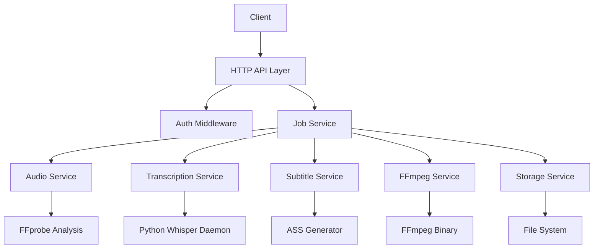
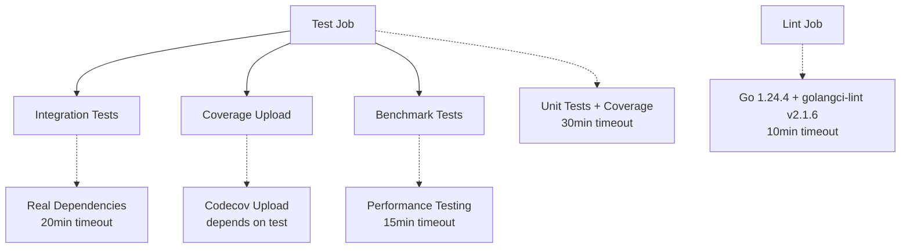

# VideoCraft - Advanced Video Generation Platform

## 🚨 CRITICAL SECURITY UPDATE

**🔒 Security-First Implementation in v0.0.1**

This version introduces **mandatory security enhancements** that require configuration updates:

### ⚠️ SECURITY FEATURES ALERT
- **No CORS Wildcards**: `AllowOrigins: ["*"]` never permitted for security
- **Domain Allowlisting Required**: Must configure `VIDEOCRAFT_SECURITY_ALLOWED_DOMAINS`
- **CSRF Protection**: POST/PUT/DELETE requests require CSRF tokens in production
- **API Authentication**: Built-in authentication requirements

### 🛠️ REQUIRED CONFIGURATION
```bash
# 1. Configure allowed domains (REQUIRED)
export VIDEOCRAFT_SECURITY_ALLOWED_DOMAINS="yourdomain.com,api.yourdomain.com"

# 2. Enable CSRF protection (recommended for production)
export VIDEOCRAFT_SECURITY_ENABLE_CSRF=true
export VIDEOCRAFT_SECURITY_CSRF_SECRET="your-secure-secret"

# 3. Get CSRF token for API requests
curl http://localhost:3002/api/v1/csrf-token

# 4. Include CSRF token in state-changing requests
curl -X POST -H "X-CSRF-Token: your-token" http://localhost:3002/api/v1/generate-video
```

📖 **Configuration Guide**: See [Security-First Implementation Guide](security-first.md) for complete details.

---

## Overview

VideoCraft is a high-performance Go-based video generation platform that creates dynamic videos from JSON configurations. It specializes in automated video production with scene-based composition, progressive subtitles, and intelligent audio synchronization.

## Key Features

### 🎬 Scene-Based Video Composition
- **Multi-scene architecture**: Structure videos into distinct scenes with individual timing and elements
- **Flexible element support**: Audio tracks, image overlays, background videos, and subtitle integration
- **Precise timing control**: Automatic audio duration analysis for perfect scene synchronization

### 🎯 Progressive Subtitle System
- **Word-level timing**: Advanced Whisper AI integration for precise word-by-word subtitle timing
- **ASS format generation**: Rich subtitle styling with fonts, colors, positioning, and effects
- **Multiple display modes**: Progressive (word-by-word) and classic (full-line) subtitle styles
- **JSON configuration**: Per-request subtitle customization with intelligent global config fallback (v0.0.1+)
- **Real-time transcription**: Python Whisper daemon with 5-minute idle timeout for efficiency

### 🔧 Robust Architecture
- **Microservice design**: Clean separation of concerns with dedicated services
- **Async job processing**: Background video generation with progress tracking
- **RESTful API**: Comprehensive HTTP API with authentication and rate limiting
- **Security-first design**: Multi-layered security validation and input sanitization
- **Secure error handling**: Advanced error sanitization preventing information disclosure
- **Container-ready**: Docker and Kubernetes deployment support
- **AI-powered documentation**: Automated documentation review with Claude AI integration

### ⚡ High Performance
- **Concurrent processing**: Parallel audio analysis and transcription
- **FFmpeg integration**: Optimized video encoding and filter complex generation
- **Resource management**: Intelligent cleanup and memory optimization
- **Scalable job queue**: Handle multiple video generation requests simultaneously

## Quick Start

### Prerequisites
- Go 1.24+ (CI uses Go 1.24.4)
- FFmpeg
- Python 3.8+ (for Whisper daemon)
- Docker (optional)

### Installation

#### Option 1: Docker (Recommended)
```bash
git clone https://github.com/activadee/videocraft.git
cd videocraft
docker-compose up -d
```

#### Option 2: Local Development
```bash
git clone https://github.com/activadee/videocraft.git
cd videocraft

# Install dependencies
go mod download

# Install Python requirements for Whisper daemon
pip install -r scripts/requirements.txt

# Build and run
make build
./videocraft
```

The server will start on `http://localhost:8080`

## API Usage

### 🔐 SECURITY REQUIREMENTS (v0.0.1+)

### ⚠️ Critical Security Setup Required

Before using the API, you **MUST** configure security settings:

#### 1. Configure Domain Allowlist (REQUIRED)
```bash
# For production - replace with your actual domains
export VIDEOCRAFT_SECURITY_ALLOWED_DOMAINS="yourdomain.com,api.yourdomain.com"

# For development
export VIDEOCRAFT_SECURITY_ALLOWED_DOMAINS="localhost:3000,127.0.0.1:3000"
```

#### 2. Get Your API Key
VideoCraft automatically generates a secure API key on first startup. Check the logs:
```bash
# The API key will be shown in the startup logs
docker-compose logs videocraft | grep "API key"
```

Or set your own:
```bash
export VIDEOCRAFT_SECURITY_API_KEY="your-secure-api-key"
```

#### 3. Configure CSRF Protection (Production)
```bash
export VIDEOCRAFT_SECURITY_ENABLE_CSRF=true
export VIDEOCRAFT_SECURITY_CSRF_SECRET="your-secure-secret"
```

### Generate Video (with CSRF)
```bash
# 1. Get CSRF token (if CSRF enabled)
CSRF_TOKEN=$(curl -s http://localhost:3002/api/v1/csrf-token | jq -r '.csrf_token')

# 2. Generate video with security headers
curl -X POST http://localhost:3002/api/v1/generate-video \
  -H "Content-Type: application/json" \
  -H "Authorization: Bearer YOUR_API_KEY" \
  -H "X-CSRF-Token: $CSRF_TOKEN" \
  -H "Origin: https://yourdomain.com" \
  -d @config.json
```

### ⚠️ Without Domain Configuration
If you don't configure `VIDEOCRAFT_SECURITY_ALLOWED_DOMAINS`, cross-origin requests will be **blocked** with a 403 error.

### Check Job Status
```bash
curl http://localhost:3002/api/v1/jobs/{job_id}/status \
  -H "Authorization: Bearer YOUR_API_KEY"
```

### Download Video
```bash
curl http://localhost:3002/api/v1/download/{video_id} \
  -H "Authorization: Bearer YOUR_API_KEY" \
  -o output.mp4
```

## Configuration Format

VideoCraft uses a comprehensive JSON configuration format:

```json
{
  "comment": "Example video configuration",
  "resolution": "custom",
  "width": 1920,
  "height": 1080,
  "quality": "high",
  "elements": [
    {
      "type": "video",
      "src": "https://example.com/background.mp4",
      "volume": 0.3,
      "z-index": -1
    },
    {
      "type": "subtitles",
      "language": "en",
      "settings": {
        "style": "progressive",
        "font-family": "Arial",
        "font-size": 48,
        "word-color": "#FFFFFF",
        "outline-color": "#000000",
        "position": "center-bottom"
      }
    }
  ],
  "scenes": [
    {
      "id": "intro",
      "elements": [
        {
          "type": "audio",
          "src": "https://example.com/intro.mp3"
        },
        {
          "type": "image",
          "src": "https://example.com/logo.png",
          "x": 100,
          "y": 50
        }
      ]
    }
  ]
}
```

## Architecture Overview



### Core Components

- **HTTP API Layer**: RESTful endpoints with Gin framework and secure error handling
- **Job Service**: Async job processing and queue management  
- **Audio Service**: Audio file analysis and duration calculation
- **Transcription Service**: Go-Python daemon communication for Whisper AI
- **Subtitle Service**: ASS subtitle generation with progressive timing
- **FFmpeg Service**: Video encoding with command injection prevention
- **Storage Service**: File management and cleanup
- **Security Layer**: Comprehensive error sanitization and threat assessment

## Progressive Subtitles Deep Dive

VideoCraft's progressive subtitle system provides word-level timing accuracy:

### How It Works
1. **Audio Analysis**: Extract real audio file duration using FFprobe
2. **Scene Timing**: Calculate precise scene start/end times based on audio durations
3. **Transcription**: Python Whisper daemon generates word-level timestamps
4. **Timing Mapping**: Map Whisper relative timestamps to absolute video timeline
5. **ASS Generation**: Create styled subtitle file with word-by-word timing

### Key Innovation
Unlike simple concatenation approaches, VideoCraft uses **real audio file durations** instead of transcription speech durations for scene timing, ensuring continuous playback without gaps.

**📖 Complete Technical Details**: See [internal/core/media/subtitle/CLAUDE.md](internal/core/media/subtitle/CLAUDE.md) for comprehensive implementation documentation including:
- URL-first audio analysis without downloads
- Python-Go daemon communication protocol
- Word-level timing algorithms and ASS generation
- Security patterns and validation strategies
- Performance optimizations and testing approaches

## CI/CD Pipeline

VideoCraft uses a modern GitHub Actions workflow with 2025 best practices and streamlined execution for fast feedback:

### Pipeline Features
- **Streamlined Job Execution**: 5 essential jobs for optimal performance (reduced from 7)
- **Latest Tooling**: Go 1.24.4, golangci-lint v2.1.6, codecov-action v5
- **Built-in Caching**: Automatic dependency caching with setup-go@v5
- **Quality Focus**: Essential testing and quality assurance maintained
- **Performance Testing**: Automated benchmarks for regression detection
- **Workflow Optimization**: Removed security scan and Docker test jobs for faster execution (Issue #50)

### Streamlined Pipeline Jobs


### Performance Improvements (Issue #50)
- **28.5% job reduction** (7→5 jobs) for faster CI execution
- **5–10 minute time savings** per workflow run
- **Built-in Go module caching** reduces dependency installation
- **Optimized job dependencies** prevent unnecessary waiting
- **Essential quality gates maintained** while removing redundant validations
- **Workflow validation scripts** ensure refactoring correctness

## Development

### Project Structure
```text
videocraft/
├── cmd/                    # Entry points (server, CLI)
├── internal/
│   ├── api/               # HTTP handlers and middleware
│   ├── services/          # Business logic services  
│   ├── domain/            # Models and domain logic
│   └── config/            # Configuration management
├── pkg/                   # Shared packages
├── scripts/               # Python Whisper daemon
└── deployments/           # Docker and K8s configs
```

### Building & Testing
```bash
# Development build
make build

# Production build
make release-build

# Run tests (matches CI test job)
make test

# Run linting (matches CI lint job with golangci-lint v2.1.6)
make lint

# Run security scans (matches CI security job - gosec + govulncheck)
make security

# Run benchmarks (matches CI benchmark job)
make benchmark

# Run integration tests (matches CI integration job)
make test-integration

# Run all quality checks (comprehensive validation)
make quality-check
```

### Environment Variables

#### 🔒 Security Variables (REQUIRED)
```bash
# CRITICAL: Domain allowlist - REQUIRED for cross-origin requests
VIDEOCRAFT_SECURITY_ALLOWED_DOMAINS="yourdomain.com,api.yourdomain.com"

# Authentication - API key (auto-generated if not set)
VIDEOCRAFT_SECURITY_API_KEY="your-secure-api-key"
VIDEOCRAFT_SECURITY_ENABLE_AUTH=true

# CSRF protection - REQUIRED for production
VIDEOCRAFT_SECURITY_ENABLE_CSRF=true
VIDEOCRAFT_SECURITY_CSRF_SECRET="your-secure-secret"

# Rate limiting
VIDEOCRAFT_SECURITY_RATE_LIMIT=100
```

#### 🖥️ Server Configuration
```bash
PORT=8080
HOST=0.0.0.0
```

#### 📁 Storage Configuration
```bash
OUTPUT_DIR=./generated_videos
TEMP_DIR=./temp
```

#### 🎤 Whisper Daemon Configuration
```bash
PYTHON_PATH=/usr/bin/python3
WHISPER_MODEL=base
WHISPER_DEVICE=cpu
```

#### 🎬 FFmpeg Configuration
```bash
FFMPEG_PATH=/usr/bin/ffmpeg
FFMPEG_TIMEOUT=600
```

### ⚠️ Security Configuration Examples

#### Development Environment
```bash
# Minimal security for local development
export VIDEOCRAFT_SECURITY_ALLOWED_DOMAINS="localhost:3000,127.0.0.1:3000"
export VIDEOCRAFT_SECURITY_ENABLE_CSRF=false
export VIDEOCRAFT_SECURITY_ENABLE_AUTH=false
```

#### Production Environment
```bash
# Maximum security for production
export VIDEOCRAFT_SECURITY_ALLOWED_DOMAINS="app.yourcompany.com,api.yourcompany.com"
export VIDEOCRAFT_SECURITY_ENABLE_CSRF=true
export VIDEOCRAFT_SECURITY_CSRF_SECRET="production-secure-secret"
export VIDEOCRAFT_SECURITY_ENABLE_AUTH=true
export VIDEOCRAFT_SECURITY_RATE_LIMIT=100
```

## API Reference

### Authentication
All endpoints require Bearer token authentication:
```
Authorization: Bearer YOUR_API_KEY
```

### Endpoints

#### Video Generation
- `POST /api/v1/videos` - Create video generation job
- `GET /api/v1/jobs/{id}/status` - Check job status
- `POST /api/v1/jobs/{id}/cancel` - Cancel job

#### Video Management  
- `GET /api/v1/videos` - List generated videos
- `GET /api/v1/videos/{id}` - Get video info
- `GET /api/v1/videos/{id}/download` - Download video
- `DELETE /api/v1/videos/{id}` - Delete video

#### System
- `GET /api/v1/health` - Health check
- `GET /api/v1/metrics` - System metrics

## Deployment

### Docker Compose
```yaml
version: '3.8'
services:
  videocraft:
    build: .
    ports:
      - "8080:8080"
    environment:
      - API_KEY=your-secret-key
      - OUTPUT_DIR=/app/videos
    volumes:
      - ./videos:/app/videos
      - ./cache:/app/cache
```

### Kubernetes
Kubernetes deployment manifests can be created based on the Docker configuration including:
- Deployment with resource limits
- Service and Ingress configuration  
- ConfigMap for environment variables
- PersistentVolumes for video storage

## Performance Considerations

### Resource Requirements
- **CPU**: 2+ cores recommended (FFmpeg encoding is CPU-intensive)
- **Memory**: 4GB+ (Whisper model loading requires significant RAM)
- **Storage**: SSD recommended for video I/O performance
- **Network**: High bandwidth for external audio/video downloads

### Optimization Tips
- Use appropriate Whisper model size (base/small for speed, large for accuracy)
- Configure FFmpeg threading based on available CPU cores
- Implement video storage cleanup policies
- Use Redis for job queue in production environments

## 🔄 Security Configuration Guide

### Security Feature Matrix

| Feature | Status | Configuration Required | Production Recommended |
|---------|--------|----------------------|------------------------|
| CORS Wildcard Block | ✅ Active | ✅ Domain Allowlist | ✅ Always |
| Domain Allowlisting | ✅ Required | ✅ Environment Variable | ✅ Always |
| CSRF Protection | ✅ Available | ⚠️ Optional | ✅ Recommended |
| API Authentication | ✅ Built-in | ⚠️ Optional | ✅ Recommended |

### 📋 Initial Setup Checklist

#### Before First Run
- [ ] Identify all domains that need API access
- [ ] Plan CORS configuration strategy
- [ ] Decide on CSRF token implementation (production)
- [ ] Test configuration in development environment

#### Required Configuration Changes
```bash
# 1. REQUIRED: Configure domain allowlist
export VIDEOCRAFT_SECURITY_ALLOWED_DOMAINS="yourdomain.com,api.yourdomain.com"

# 2. OPTIONAL: Enable CSRF (recommended for production)
export VIDEOCRAFT_SECURITY_ENABLE_CSRF=true
export VIDEOCRAFT_SECURITY_CSRF_SECRET="your-secure-secret"
```

#### Configure Client Applications
```javascript
// Insecure approach - Never use wildcard CORS in production
fetch('http://api.videocraft.com/generate-video', {
  method: 'POST',
  body: JSON.stringify(config)
});

// v0.0.1+ - Secure approach with proper Origin header and CSRF token
// 1. Get CSRF token
const csrfResponse = await fetch('/api/v1/csrf-token');
const { csrf_token } = await csrfResponse.json();

// 2. Include CSRF token in requests
fetch('http://api.videocraft.com/generate-video', {
  method: 'POST',
  headers: {
    'Content-Type': 'application/json',
    'X-CSRF-Token': csrf_token,
    'Authorization': 'Bearer YOUR_API_KEY'
  },
  body: JSON.stringify(config)
});
```

#### Post-Setup Verification
- [ ] Verify all cross-origin requests work from allowed domains
- [ ] Test CSRF token generation and validation
- [ ] Confirm authentication still works
- [ ] Monitor logs for security violations

### 🔒 Security Features Details

#### 1. CORS Security Implementation
- **Feature**: `AllowOrigins: ["*"]` never permitted
- **Impact**: Cross-origin requests only allowed from configured domains
- **Action Required**: Configure `VIDEOCRAFT_SECURITY_ALLOWED_DOMAINS`

#### 2. CSRF Protection
- **Feature**: POST/PUT/DELETE requests may require CSRF tokens
- **Impact**: State-changing requests need additional header when enabled
- **Action Required**: Get token from `/api/v1/csrf-token` and include in `X-CSRF-Token` header

#### 3. Built-in Authentication
- **Feature**: API key validation and security logging
- **Impact**: Secure API access with proper Authorization header format
- **Action Required**: Use `Authorization: Bearer YOUR_API_KEY` format when enabled

### 🔄 Emergency Disable

If you need to temporarily disable security features (development only):

```bash
# Temporarily disable security features (development only)
export VIDEOCRAFT_SECURITY_ALLOWED_DOMAINS="localhost:3000,127.0.0.1:3000"
export VIDEOCRAFT_SECURITY_ENABLE_CSRF=false
export VIDEOCRAFT_SECURITY_ENABLE_AUTH=false
```

⚠️ **Warning**: Only disable security features in development environments.

### 📞 Configuration Support

- **Documentation**: [Security-First Implementation Guide](security-first.md)
- **Issues**: Report configuration problems via GitHub Issues
- **Security Questions**: Tag issues with `security` label

## Troubleshooting

### 🔒 Security Issues (v0.0.1+)

**CORS Errors - "Access to fetch blocked by CORS policy"**
```bash
# Symptom: Browser console shows CORS policy errors
# Solution: Add your domain to the allowlist
export VIDEOCRAFT_SECURITY_ALLOWED_DOMAINS="yourdomain.com,api.yourdomain.com"

# Debug: Check server logs for CORS_ORIGIN_REJECTED events
docker-compose logs videocraft | grep "CORS_ORIGIN_REJECTED"
```

**CSRF Token Errors - "CSRF token required"**
```bash
# Symptom: POST/PUT/DELETE requests return 403 with "CSRF token required"
# Solution: Get CSRF token and include in headers
CSRF_TOKEN=$(curl -s http://localhost:3002/api/v1/csrf-token | jq -r '.csrf_token')
curl -X POST -H "X-CSRF-Token: $CSRF_TOKEN" http://localhost:3002/api/v1/generate-video

# Debug: Check for CSRF_TOKEN_MISSING or CSRF_TOKEN_INVALID logs
docker-compose logs videocraft | grep "CSRF_SECURITY_VIOLATION"
```

**Authentication Errors - "Authorization header required"**
```bash
# Symptom: 401 Unauthorized responses
# Solution: Include API key in Authorization header
curl -H "Authorization: Bearer YOUR_API_KEY" http://localhost:3002/api/v1/videos

# Get API key from logs if auto-generated
docker-compose logs videocraft | grep "Generated API key"
```

**Cross-Origin Requests Blocked**
```bash
# Symptom: All cross-origin requests return 403
# Solution: Configure allowed domains environment variable
export VIDEOCRAFT_SECURITY_ALLOWED_DOMAINS="trusted.example.com,api.trusted.org"

# For development with localhost
export VIDEOCRAFT_SECURITY_ALLOWED_DOMAINS="localhost:3000,127.0.0.1:3000"
```

### Common Application Issues

**Whisper Daemon Not Starting**
```bash
# Check Python requirements
pip install -r scripts/requirements.txt

# Test Whisper installation
python -c "import whisper; print('OK')"
```

**FFmpeg Errors**
```bash
# Verify FFmpeg installation
ffmpeg -version

# Check audio file accessibility
ffprobe "your-audio-url"
```

**Memory Issues**
- Reduce Whisper model size
- Decrease concurrent job limits
- Implement file cleanup policies

### 🛠️ Debug Commands

```bash
# Test CORS configuration
curl -H "Origin: https://yourdomain.com" -X OPTIONS http://localhost:3002/api/v1/videos

# Get CSRF token
curl http://localhost:3002/api/v1/csrf-token

# Test authentication
curl -H "Authorization: Bearer YOUR_API_KEY" http://localhost:3002/api/v1/health

# Check security logs
docker-compose logs videocraft | grep "SECURITY_VIOLATION"
```

## AI-Powered Documentation

VideoCraft includes an AI-powered documentation review system using Claude AI to ensure high-quality, accurate documentation.

### Features
- **Automatic Review**: Documentation changes are automatically reviewed on commits to main
- **Code-Docs Sync**: Detects when code changes require documentation updates
- **Security Focus**: Special attention to security-related documentation
- **Quality Standards**: Ensures consistency, accuracy, and completeness

### Setup
1. Add `ANTHROPIC_API_KEY` to repository secrets (for API-based integration)
2. Or install the Claude GitHub app (for OAuth integration)
3. The workflow automatically triggers on documentation or code changes

See the GitHub Actions workflow configurations in `.github/workflows/docs-*.yml` for setup details.

## Contributing

1. Fork the repository
2. Create feature branch (`git checkout -b feature/amazing-feature`)
3. Commit changes (`git commit -m 'Add amazing feature'`)
4. Push to branch (`git push origin feature/amazing-feature`)
5. Open Pull Request

### Development Guidelines
- Follow Go best practices and idioms
- Add unit tests for new functionality
- Update documentation for API changes
- Use conventional commit messages
- Documentation changes trigger AI review for quality assurance

## License

This project is licensed under the MIT License - see the [LICENSE](LICENSE) file for details.

## Support

- **Documentation**: See individual package CLAUDE.md files for detailed technical docs
- **Issues**: Report bugs and feature requests via GitHub Issues
- **Contributing**: See the Contributing section above for development guidelines

---

Built with ❤️ using Go, FFmpeg, and Whisper AI