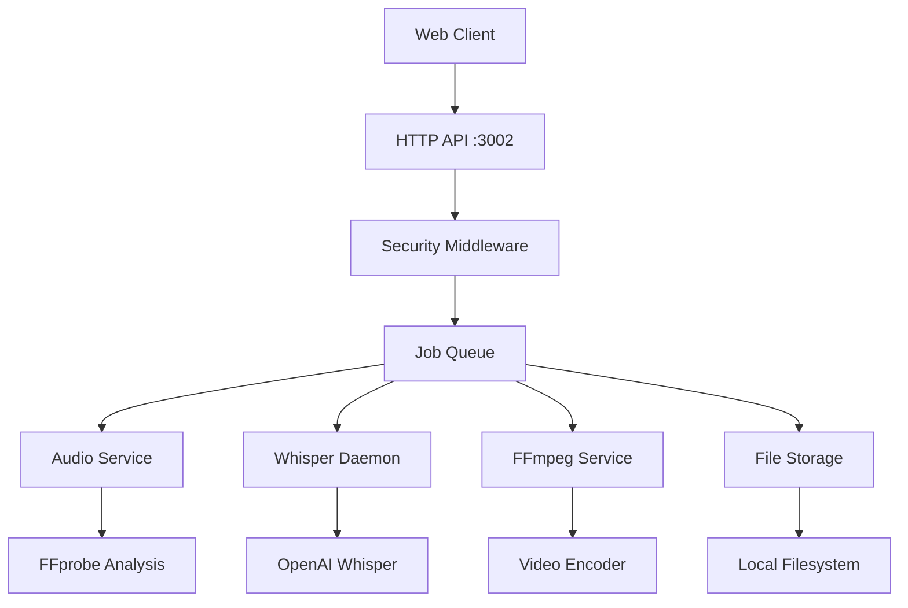

# VideoCraft

A secure, AI-powered video generation platform that creates videos from JSON configurations using FFmpeg and OpenAI Whisper.

## What VideoCraft Does

VideoCraft transforms JSON configurations into complete videos with:
- **Automatic scene composition** from multiple media sources (video, audio, images)  
- **AI-powered progressive subtitles** with word-level timing precision
- **Security-first architecture** with comprehensive input validation and CSRF protection
- **Production-ready deployment** with Docker and Kubernetes support

## Key Innovation: Progressive Subtitles

Unlike traditional subtitle systems, VideoCraft uses OpenAI Whisper to generate **word-by-word timing** for progressive subtitle animations. Each word appears precisely when spoken, creating engaging, TikTok-style subtitle effects.

```json
"subtitles": {
  "style": "progressive",
  "settings": {
    "font_family": "Arial Black",
    "font_size": 32,
    "word_color": "#FFFFFF",
    "outline_color": "#000000"
  }
}
```

## Quick Start

### Prerequisites
- **Go 1.24+**
- **FFmpeg** (with libx264)
- **Python 3.8+** with pip
- **Docker** (recommended)

### 1. Clone and Setup
```bash
git clone https://github.com/activadee/videocraft.git
cd videocraft

# Install Python dependencies for Whisper
pip install -r scripts/requirements.txt

# Build the application
make build
```

### 2. Configure Security (Required)
```bash
# Set allowed domains for CORS (required for web clients)
export VIDEOCRAFT_SECURITY_ALLOWED_DOMAINS="localhost:3000,yourdomain.com"

# Generate API key (or use auto-generated)
export VIDEOCRAFT_SECURITY_API_KEY="your-secure-api-key"
```

### 3. Start the Server
```bash
./videocraft
# Server starts on http://localhost:3002
```

### 4. Generate Your First Video
```bash
# Create a simple video configuration
cat > example.json << 'EOF'
[
  {
    "comment": "My first VideoCraft video",
    "resolution": "1920x1080",
    "quality": "medium",
    "scenes": [
      {
        "id": "intro",
        "background-color": "#1a1a1a",
        "elements": [
          {
            "type": "audio",
            "src": "https://example.com/your-audio.mp3"
          },
          {
            "type": "subtitles",
            "settings": {
              "style": "progressive",
              "font_family": "Arial Black",
              "font_size": 36,
              "word_color": "#FFFFFF",
              "outline_color": "#FF6B6B"
            }
          }
        ]
      }
    ]
  }
]
EOF

# Generate video
curl -X POST http://localhost:3002/api/v1/videos \
  -H "Content-Type: application/json" \
  -H "Authorization: Bearer your-secure-api-key" \
  -d @example.json

# Check job status (use job_id from response)
curl http://localhost:3002/api/v1/jobs/{job_id} \
  -H "Authorization: Bearer your-secure-api-key"

# Download completed video
curl http://localhost:3002/api/v1/videos/{video_id} \
  -H "Authorization: Bearer your-secure-api-key" \
  -o output.mp4
```

## Configuration Format

VideoCraft uses an array-based JSON format supporting multiple projects:

```json
[
  {
    "comment": "Project description",
    "resolution": "1920x1080",
    "quality": "high",
    "scenes": [
      {
        "id": "scene1",
        "background-color": "#000000",
        "elements": [
          {
            "type": "video",
            "src": "https://example.com/background.mp4",
            "volume": 0.3,
            "z-index": -1
          },
          {
            "type": "audio", 
            "src": "https://example.com/narration.mp3",
            "volume": 1.0
          },
          {
            "type": "image",
            "src": "https://example.com/logo.png",
            "x": 100,
            "y": 50,
            "z-index": 10
          },
          {
            "type": "subtitles",
            "settings": {
              "style": "progressive",
              "font_family": "Impact",
              "font_size": 48,
              "word_color": "#FFFF00",
              "outline_color": "#000000",
              "position": "center-bottom"
            }
          }
        ]
      }
    ],
    "elements": [
      // Global elements applied to all scenes
    ]
  }
]
```

### Element Types

**Video Elements**
```json
{
  "type": "video",
  "src": "https://example.com/video.mp4",
  "x": 0, "y": 0,
  "volume": 0.5,
  "z-index": 1
}
```

**Audio Elements**
```json
{
  "type": "audio", 
  "src": "https://example.com/audio.mp3",
  "volume": 1.0,
  "duration": 30.5
}
```

**Image Elements**
```json
{
  "type": "image",
  "src": "https://example.com/image.png", 
  "x": 100, "y": 200,
  "z-index": 5
}
```

**Subtitle Elements**
```json
{
  "type": "subtitles",
  "settings": {
    "style": "progressive",        // progressive or classic
    "font_family": "Arial Black",
    "font_size": 32,
    "word_color": "#FFFFFF",
    "outline_color": "#000000",
    "position": "center-bottom"    // top, center, bottom
  }
}
```

## API Reference

### Authentication
All endpoints require Bearer token authentication:
```
Authorization: Bearer YOUR_API_KEY
```

### Endpoints

**Create Video Generation Job**
```
POST /api/v1/videos
Content-Type: application/json

Body: JSON array of video configurations
Response: {"job_id": "uuid", "status": "pending"}
```

**Get Job Status**
```
GET /api/v1/jobs/{job_id}
Response: {
  "job_id": "uuid",
  "status": "completed|processing|failed|pending",
  "progress": 85,
  "video_id": "uuid",
  "error": "error message if failed"
}
```

**Download Video**
```
GET /api/v1/videos/{video_id}
Response: MP4 video file
```

**Health Check**
```
GET /health
Response: {"status": "healthy", "timestamp": "2024-01-01T12:00:00Z"}
```

**CSRF Token** (if CSRF enabled)
```
GET /api/v1/csrf-token  
Response: {"csrf_token": "secure-token"}
```

## Security Features

VideoCraft implements comprehensive security measures:

### CORS Protection
- **No wildcard origins** - explicit domain allowlisting required
- **Secure credentials handling** with proper origin validation
- **Request method restrictions** to approved HTTP methods

```bash
# Required: Configure allowed domains
export VIDEOCRAFT_SECURITY_ALLOWED_DOMAINS="localhost:3000,yourdomain.com"
```

### CSRF Protection
- **Token-based validation** for state-changing requests
- **Secure token generation** with cryptographic randomness
- **Optional but recommended** for production environments

```bash
export VIDEOCRAFT_SECURITY_ENABLE_CSRF=true
export VIDEOCRAFT_SECURITY_CSRF_SECRET="your-secure-secret"
```

### Input Validation
- **URL validation** prevents SSRF attacks
- **File size limits** prevent resource exhaustion  
- **Media format validation** ensures safe file processing
- **Command injection protection** for FFmpeg operations

### Error Handling
- **Sanitized error responses** prevent information disclosure
- **Structured logging** for security event monitoring
- **Rate limiting** prevents abuse and DoS attacks

## Architecture



### Core Components

- **HTTP API**: Gin web framework with security middleware
- **Job Queue**: Async processing with worker pools  
- **Audio Service**: Duration analysis and metadata extraction
- **Whisper Daemon**: Persistent Python process for AI transcription
- **FFmpeg Service**: Secure video composition and encoding
- **Storage Service**: File management with cleanup policies

## Configuration

VideoCraft supports comprehensive configuration via `config.yaml`:

```yaml
server:
  host: "0.0.0.0"
  port: 3002

ffmpeg:
  binary_path: "ffmpeg"
  timeout: "1h"
  quality: 23        # CRF value (lower = better quality)
  preset: "medium"   # Encoding speed

transcription:
  enabled: true
  daemon:
    enabled: true
    idle_timeout: "300s"     # Shutdown after 5min idle
    startup_timeout: "120s"  # Max startup time
    restart_max_attempts: 3
  python:
    path: "python3"
    model: "base"           # tiny/base/small/medium/large
    language: "auto"        # Auto-detect or specific language
    device: "cpu"           # cpu/cuda

subtitles:
  enabled: true
  style: "progressive"       # progressive/classic
  font_family: "Arial"
  font_size: 24
  position: "center-bottom"
  colors:
    word: "#FFFFFF"
    outline: "#000000"

storage:
  output_dir: "./generated_videos"
  temp_dir: "./temp" 
  max_file_size: 1073741824  # 1GB limit
  retention_days: 7

job:
  workers: 4               # Concurrent job workers
  queue_size: 100         # Max queued jobs
  max_concurrent: 10      # Max concurrent jobs

security:
  rate_limit: 100         # Requests per minute
  enable_auth: true       # API key authentication
  api_key: ""            # Auto-generated if empty
  enable_csrf: false     # CSRF protection
  allowed_domains: []    # CORS allowed origins
```

## Docker Deployment

### Using Docker Compose (Recommended)

```yaml
version: '3.8'
services:
  videocraft:
    build: .
    ports:
      - "3002:3002"
    environment:
      - VIDEOCRAFT_SECURITY_ALLOWED_DOMAINS=localhost:3000,yourdomain.com
      - VIDEOCRAFT_SECURITY_API_KEY=your-secure-api-key
    volumes:
      - ./generated_videos:/app/generated_videos
      - ./cache:/app/cache
    security_opt:
      - no-new-privileges:true
    user: "1000:1000"
    read_only: true
    tmpfs:
      - /tmp:size=1G,noexec,nosuid,nodev
```

```bash
# Start the service
docker-compose up -d

# Check logs
docker-compose logs -f videocraft

# Stop the service  
docker-compose down
```

### Manual Docker Build

```bash
# Build image
docker build -t videocraft .

# Run container
docker run -d \
  --name videocraft \
  -p 3002:3002 \
  -e VIDEOCRAFT_SECURITY_ALLOWED_DOMAINS="localhost:3000" \
  -e VIDEOCRAFT_SECURITY_API_KEY="your-key" \
  -v $(pwd)/generated_videos:/app/generated_videos \
  videocraft
```

## Development

### Project Structure
```
videocraft/
├── cmd/videocraft/         # Application entry point
├── internal/
│   ├── api/                # HTTP handlers and middleware
│   ├── core/               # Business logic and services
│   ├── app/                # Configuration management  
│   ├── pkg/                # Shared utilities (logging, errors)
│   └── storage/            # File storage backend
├── scripts/                # Python Whisper daemon
├── config/                 # Configuration files
└── docs/                   # Technical documentation
```

### Building & Testing

```bash
# Install dependencies
go mod download
pip install -r scripts/requirements.txt

# Development build
make build

# Run tests
make test

# Run with live reload (requires air)
make dev

# Security scan
make security

# Generate coverage report
make coverage

# Clean build artifacts
make clean
```

### Environment Variables

**Required for Web Clients:**
```bash
export VIDEOCRAFT_SECURITY_ALLOWED_DOMAINS="localhost:3000,yourdomain.com"
```

**Optional Security:**
```bash
export VIDEOCRAFT_SECURITY_API_KEY="your-secure-api-key"
export VIDEOCRAFT_SECURITY_ENABLE_CSRF=true
export VIDEOCRAFT_SECURITY_CSRF_SECRET="your-csrf-secret"
```

**Server Configuration:**
```bash
export VIDEOCRAFT_SERVER_HOST="0.0.0.0"
export VIDEOCRAFT_SERVER_PORT=3002
```

**Storage Configuration:**
```bash
export VIDEOCRAFT_STORAGE_OUTPUT_DIR="./generated_videos"
export VIDEOCRAFT_STORAGE_TEMP_DIR="./temp"
```

**Whisper Configuration:**
```bash
export VIDEOCRAFT_TRANSCRIPTION_PYTHON_MODEL="base"
export VIDEOCRAFT_TRANSCRIPTION_PYTHON_DEVICE="cpu"
```

## Troubleshooting

### Common Issues

**Server won't start**
```bash
# Check port availability
lsof -i :3002

# Verify FFmpeg installation
ffmpeg -version

# Check Python dependencies
python -c "import whisper; print('Whisper OK')"
```

**CORS errors in browser**
```bash
# Add your domain to allowed list
export VIDEOCRAFT_SECURITY_ALLOWED_DOMAINS="localhost:3000,yourdomain.com"

# Check browser console for specific error
# Look for server logs: docker-compose logs videocraft | grep CORS
```

**Whisper daemon fails**
```bash
# Test Whisper manually
python scripts/whisper_daemon.py

# Check available models
python -c "import whisper; print(whisper.available_models())"

# For GPU support, install CUDA version of PyTorch
pip install torch torchaudio --index-url https://download.pytorch.org/whl/cu118
```

**Video generation fails**
```bash
# Verify media URLs are accessible
curl -I "https://your-media-url.com/audio.mp3"

# Check FFmpeg can process your media
ffprobe "https://your-media-url.com/audio.mp3"

# Monitor job status for detailed error messages
curl http://localhost:3002/api/v1/jobs/{job_id}
```

**Out of memory errors**
```bash
# Use smaller Whisper model
export VIDEOCRAFT_TRANSCRIPTION_PYTHON_MODEL="tiny"

# Reduce concurrent jobs
export VIDEOCRAFT_JOB_MAX_CONCURRENT=2

# Increase Docker memory limit
docker run --memory=4g videocraft
```

### Debug Commands

```bash
# Test API connectivity
curl http://localhost:3002/health

# Get CSRF token
curl http://localhost:3002/api/v1/csrf-token

# Test authentication
curl -H "Authorization: Bearer your-key" http://localhost:3002/health

# Monitor logs
docker-compose logs -f videocraft | grep ERROR
```

## Performance & Scaling

### Resource Requirements
- **CPU**: 2+ cores (FFmpeg encoding is CPU-intensive)
- **Memory**: 4GB+ (Whisper models require significant RAM)  
- **Storage**: SSD recommended for video I/O
- **Network**: High bandwidth for external media downloads

### Optimization Tips
- **Use smaller Whisper models** (tiny/base) for faster processing
- **Enable GPU acceleration** if available (CUDA support)
- **Implement Redis** for job queue in multi-instance deployments
- **Use CDN** for frequently accessed media files
- **Configure FFmpeg presets** based on quality vs speed requirements

### Scaling Options
- **Horizontal scaling**: Multiple VideoCraft instances behind load balancer
- **Dedicated workers**: Separate transcription and video processing services  
- **External storage**: S3/MinIO for generated videos
- **Queue backend**: Redis or RabbitMQ for job distribution

## License

MIT License - see [LICENSE](LICENSE) file for details.

## Contributing

1. Fork the repository
2. Create a feature branch (`git checkout -b feature/new-feature`)
3. Make your changes with tests
4. Run the full test suite (`make test`)
5. Submit a pull request

### Development Guidelines
- Follow Go best practices and idioms
- Add unit tests for new functionality  
- Update documentation for API changes
- Use conventional commit messages
- Ensure security validations for user inputs

---

**Built with Go, FFmpeg, and OpenAI Whisper**