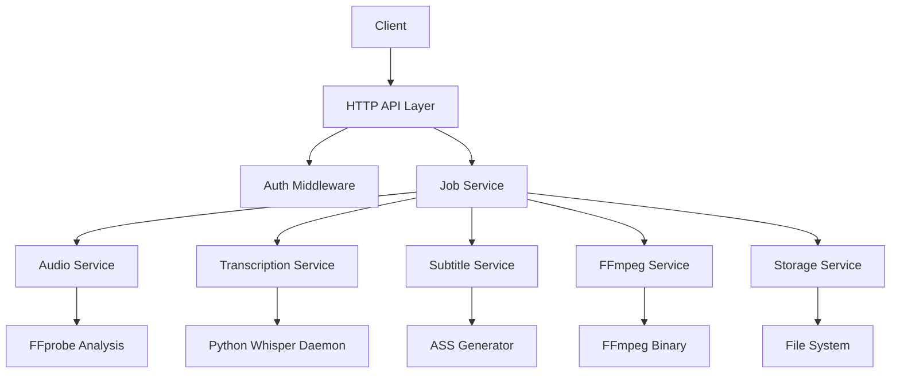

# VideoCraft - Advanced Video Generation Platform

## Overview

VideoCraft is a high-performance Go-based video generation platform that creates dynamic videos from JSON configurations. It specializes in automated video production with scene-based composition, progressive subtitles, and intelligent audio synchronization.

## Key Features

### 🎬 Scene-Based Video Composition
- **Multi-scene architecture**: Structure videos into distinct scenes with individual timing and elements
- **Flexible element support**: Audio tracks, image overlays, background videos, and subtitle integration
- **Precise timing control**: Automatic audio duration analysis for perfect scene synchronization

### 🎯 Progressive Subtitle System
- **Word-level timing**: Advanced Whisper AI integration for precise word-by-word subtitle timing
- **ASS format generation**: Rich subtitle styling with fonts, colors, positioning, and effects
- **Multiple display modes**: Progressive (word-by-word) and classic (full-line) subtitle styles
- **Real-time transcription**: Python Whisper daemon with 5-minute idle timeout for efficiency

### 🔧 Robust Architecture
- **Microservice design**: Clean separation of concerns with dedicated services
- **Async job processing**: Background video generation with progress tracking
- **RESTful API**: Comprehensive HTTP API with authentication and rate limiting
- **Container-ready**: Docker and Kubernetes deployment support

### ⚡ High Performance
- **Concurrent processing**: Parallel audio analysis and transcription
- **FFmpeg integration**: Optimized video encoding and filter complex generation
- **Resource management**: Intelligent cleanup and memory optimization
- **Scalable job queue**: Handle multiple video generation requests simultaneously

## Quick Start

### Prerequisites
- Go 1.24+ 
- FFmpeg
- Python 3.8+ (for Whisper daemon)
- Docker (optional)

### Installation

#### Option 1: Docker (Recommended)
```bash
git clone https://github.com/activadee/videocraft.git
cd videocraft
docker-compose up -d
```

#### Option 2: Local Development
```bash
git clone https://github.com/activadee/videocraft.git
cd videocraft

# Install dependencies
go mod download

# Install Python requirements for Whisper daemon
pip install -r scripts/requirements.txt

# Build and run
make build
./bin/videocraft-server
```

The server will start on `http://localhost:8080`

## API Usage

### Generate Video
```bash
curl -X POST http://localhost:8080/api/v1/videos \
  -H "Content-Type: application/json" \
  -H "Authorization: Bearer YOUR_API_KEY" \
  -d @config.json
```

### Check Job Status
```bash
curl http://localhost:8080/api/v1/jobs/{job_id}/status \
  -H "Authorization: Bearer YOUR_API_KEY"
```

### Download Video
```bash
curl http://localhost:8080/api/v1/videos/{video_id}/download \
  -H "Authorization: Bearer YOUR_API_KEY" \
  -o output.mp4
```

## Configuration Format

VideoCraft uses a comprehensive JSON configuration format:

```json
{
  "comment": "Example video configuration",
  "resolution": "custom",
  "width": 1920,
  "height": 1080,
  "quality": "high",
  "elements": [
    {
      "type": "video",
      "src": "https://example.com/background.mp4",
      "volume": 0.3,
      "z-index": -1
    },
    {
      "type": "subtitles",
      "language": "en",
      "settings": {
        "style": "progressive",
        "font-family": "Arial",
        "font-size": 48,
        "word-color": "#FFFFFF",
        "outline-color": "#000000",
        "position": "center-bottom"
      }
    }
  ],
  "scenes": [
    {
      "id": "intro",
      "elements": [
        {
          "type": "audio",
          "src": "https://example.com/intro.mp3"
        },
        {
          "type": "image",
          "src": "https://example.com/logo.png",
          "x": 100,
          "y": 50
        }
      ]
    }
  ]
}
```

## Architecture Overview


```mermaid
graph TB
    Client[Client] --> API[HTTP API Layer]
    API --> Auth[Auth Middleware]
    API --> JobSvc[Job Service]
    
    JobSvc --> AudioSvc[Audio Service]
    JobSvc --> TransSvc[Transcription Service]
    JobSvc --> SubSvc[Subtitle Service]
    JobSvc --> FFmpegSvc[FFmpeg Service]
    JobSvc --> StorageSvc[Storage Service]
    
    TransSvc --> Daemon[Python Whisper Daemon]
    SubSvc --> ASSGen[ASS Generator]
    FFmpegSvc --> FFmpeg[FFmpeg Binary]
    
    AudioSvc --> FFprobe[FFprobe Analysis]
    StorageSvc --> FileSystem[File System]
```

### Core Components

- **HTTP API Layer**: RESTful endpoints with Gin framework
- **Job Service**: Async job processing and queue management  
- **Audio Service**: Audio file analysis and duration calculation
- **Transcription Service**: Go-Python daemon communication for Whisper AI
- **Subtitle Service**: ASS subtitle generation with progressive timing
- **FFmpeg Service**: Video encoding and filter complex generation
- **Storage Service**: File management and cleanup

## Progressive Subtitles Deep Dive

VideoCraft's progressive subtitle system provides word-level timing accuracy:

### How It Works
1. **Audio Analysis**: Extract real audio file duration using FFprobe
2. **Scene Timing**: Calculate precise scene start/end times based on audio durations
3. **Transcription**: Python Whisper daemon generates word-level timestamps
4. **Timing Mapping**: Map Whisper relative timestamps to absolute video timeline
5. **ASS Generation**: Create styled subtitle file with word-by-word timing

### Key Innovation
Unlike simple concatenation approaches, VideoCraft uses **real audio file durations** instead of transcription speech durations for scene timing, ensuring continuous playback without gaps.

## Development

### Project Structure
```
videocraft/
├── cmd/                    # Entry points (server, CLI)
├── internal/
│   ├── api/               # HTTP handlers and middleware
│   ├── services/          # Business logic services  
│   ├── domain/            # Models and domain logic
│   └── config/            # Configuration management
├── pkg/                   # Shared packages
├── scripts/               # Python Whisper daemon
└── deployments/           # Docker and K8s configs
```

### Building
```bash
# Development build
make build

# Production build
make build-prod

# Run tests
make test

# Run linting
make lint
```

### Environment Variables
```bash
# Server configuration
PORT=8080
HOST=0.0.0.0
API_KEY=your-secret-key

# Storage
OUTPUT_DIR=./generated_videos
TEMP_DIR=./temp

# Whisper daemon
PYTHON_PATH=/usr/bin/python3
WHISPER_MODEL=base
WHISPER_DEVICE=cpu

# FFmpeg
FFMPEG_PATH=/usr/bin/ffmpeg
FFMPEG_TIMEOUT=600
```

## API Reference

### Authentication
All endpoints require Bearer token authentication:
```
Authorization: Bearer YOUR_API_KEY
```

### Endpoints

#### Video Generation
- `POST /api/v1/videos` - Create video generation job
- `GET /api/v1/jobs/{id}/status` - Check job status
- `POST /api/v1/jobs/{id}/cancel` - Cancel job

#### Video Management  
- `GET /api/v1/videos` - List generated videos
- `GET /api/v1/videos/{id}` - Get video info
- `GET /api/v1/videos/{id}/download` - Download video
- `DELETE /api/v1/videos/{id}` - Delete video

#### System
- `GET /api/v1/health` - Health check
- `GET /api/v1/metrics` - System metrics

## Deployment

### Docker Compose
```yaml
version: '3.8'
services:
  videocraft:
    build: .
    ports:
      - "8080:8080"
    environment:
      - API_KEY=your-secret-key
      - OUTPUT_DIR=/app/videos
    volumes:
      - ./videos:/app/videos
      - ./cache:/app/cache
```

### Kubernetes
See `deployments/k8s/` for complete Kubernetes manifests including:
- Deployment with resource limits
- Service and Ingress configuration  
- ConfigMap for environment variables
- PersistentVolumes for video storage

## Performance Considerations

### Resource Requirements
- **CPU**: 2+ cores recommended (FFmpeg encoding is CPU-intensive)
- **Memory**: 4GB+ (Whisper model loading requires significant RAM)
- **Storage**: SSD recommended for video I/O performance
- **Network**: High bandwidth for external audio/video downloads

### Optimization Tips
- Use appropriate Whisper model size (base/small for speed, large for accuracy)
- Configure FFmpeg threading based on available CPU cores
- Implement video storage cleanup policies
- Use Redis for job queue in production environments

## Troubleshooting

### Common Issues

**Whisper Daemon Not Starting**
```bash
# Check Python requirements
pip install -r scripts/requirements.txt

# Test Whisper installation
python -c "import whisper; print('OK')"
```

**FFmpeg Errors**
```bash
# Verify FFmpeg installation
ffmpeg -version

# Check audio file accessibility
ffprobe "your-audio-url"
```

**Memory Issues**
- Reduce Whisper model size
- Decrease concurrent job limits
- Implement file cleanup policies

## Contributing

1. Fork the repository
2. Create feature branch (`git checkout -b feature/amazing-feature`)
3. Commit changes (`git commit -m 'Add amazing feature'`)
4. Push to branch (`git push origin feature/amazing-feature`)
5. Open Pull Request

### Development Guidelines
- Follow Go best practices and idioms
- Add unit tests for new functionality
- Update documentation for API changes
- Use conventional commit messages

## License

This project is licensed under the MIT License - see the [LICENSE](LICENSE) file for details.

## Support

- **Documentation**: See individual package CLAUDE.md files for detailed technical docs
- **Issues**: Report bugs and feature requests via GitHub Issues
- **Contributing**: See CONTRIBUTING.md for development guidelines

---

Built with ❤️ using Go, FFmpeg, and Whisper AI