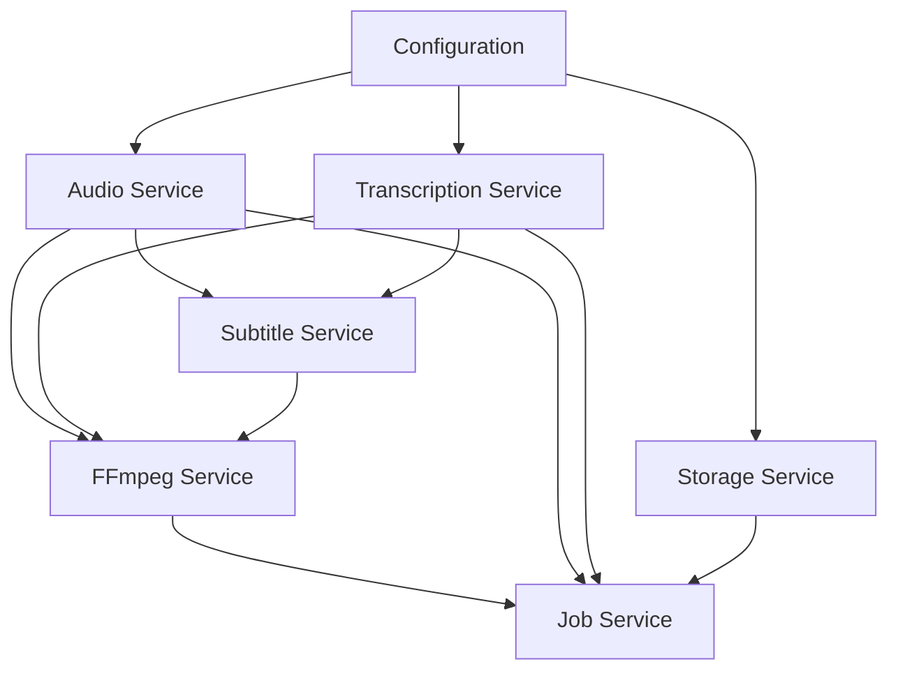

# CMD Package - Application Entry Points

## Overview

The `cmd` package contains the main entry points for the VideoCraft application. It follows the Go standard project layout with separate directories for different executables.

## Structure

```text
cmd/
├── server/         # HTTP API server
│   └── main.go
└── cli/           # Command-line interface (future)
```

## Server Entry Point (`cmd/server/main.go`)

### Purpose

The server entry point initializes and starts the HTTP API server that handles video generation requests. It sets up:

- Configuration loading
- Service dependency injection
- HTTP router and middleware
- Graceful shutdown handling

### Key Components

#### 1. Configuration Loading

```go
func main() {
    // Load configuration from file and environment variables
    cfg, err := config.Load()
    if err != nil {
        log.Fatal("Failed to load config:", err)
    }
}
```

Configuration sources (in order of precedence):
1. Environment variables (`VIDEOCRAFT_*`)
2. Configuration file (`config.yaml`)
3. Default values

#### 2. Service Initialization

```go
func initializeServices(cfg *config.Config, log logger.Logger) *services.Services {
    // Initialize all services with dependency injection
    audioSvc := services.NewAudioService(cfg, log)
    transcriptionSvc := services.NewTranscriptionService(cfg, log)
    subtitleSvc := services.NewSubtitleService(cfg, log, transcriptionSvc, audioSvc)
    ffmpegSvc := services.NewFFmpegService(cfg, log, transcriptionSvc, subtitleSvc, audioSvc)
    storageSvc := services.NewStorageService(cfg, log)
    jobSvc := services.NewJobService(cfg, log, ffmpegSvc, audioSvc, transcriptionSvc, storageSvc)

    return &services.Services{
        FFmpeg:        ffmpegSvc,
        Audio:         audioSvc,
        Transcription: transcriptionSvc,
        Subtitle:      subtitleSvc,
        Storage:       storageSvc,
        Job:           jobSvc,
    }
}
```

**Dependency Graph:**


#### 3. HTTP Server Setup

```go
func main() {
    // Setup router
    router := api.NewRouter(cfg, services, logger)

    // Start server
    srv := &http.Server{
        Addr:    cfg.Server.Address(),
        Handler: router,
    }

    // Start server in goroutine
    go func() {
        if err := srv.ListenAndServe(); err != nil && err != http.ErrServerClosed {
            logger.Fatal("Failed to start server:", err)
        }
    }()

    logger.Info("Server started on ", cfg.Server.Address())
}
```

#### 4. Graceful Shutdown

```go
func main() {
    // Wait for interrupt signal
    quit := make(chan os.Signal, 1)
    signal.Notify(quit, syscall.SIGINT, syscall.SIGTERM)
    <-quit

    logger.Info("Shutting down server...")

    // Graceful shutdown with timeout
    ctx, cancel := context.WithTimeout(context.Background(), 30*time.Second)
    defer cancel()

    // Shutdown services first (this will stop the daemon)
    if services != nil {
        services.Shutdown()
    }

    if err := srv.Shutdown(ctx); err != nil {
        logger.Fatal("Server forced to shutdown:", err)
    }

    logger.Info("Server exited")
}
```

**Shutdown Sequence:**
1. Receive interrupt signal (SIGINT/SIGTERM)
2. Stop accepting new requests
3. Shutdown services (Python Whisper daemon, etc.)
4. Wait for active requests to complete (30s timeout)
5. Clean exit

### Environment Variables

The server respects the following environment variables:

#### Server Configuration
```bash
VIDEOCRAFT_SERVER_PORT=8080
VIDEOCRAFT_SERVER_HOST=0.0.0.0
```

#### Authentication
```bash
VIDEOCRAFT_AUTH_API_KEY=your-secret-api-key
```

#### Python Integration
```bash
VIDEOCRAFT_PYTHON_PATH=/usr/bin/python3
VIDEOCRAFT_PYTHON_WHISPER_DAEMON_PATH=./scripts/whisper_daemon.py
VIDEOCRAFT_PYTHON_WHISPER_MODEL=base
VIDEOCRAFT_PYTHON_WHISPER_DEVICE=cpu
```

#### Storage
```bash
VIDEOCRAFT_STORAGE_OUTPUT_DIR=./generated_videos
VIDEOCRAFT_STORAGE_TEMP_DIR=./temp
VIDEOCRAFT_STORAGE_MAX_AGE=3600
```

#### FFmpeg
```bash
VIDEOCRAFT_FFMPEG_PATH=/usr/bin/ffmpeg
VIDEOCRAFT_FFMPEG_TIMEOUT=600
```

#### Logging
```bash
VIDEOCRAFT_LOG_LEVEL=info
VIDEOCRAFT_LOG_FORMAT=json
```

### Startup Validation

The server performs comprehensive startup validation:

```go
func validateSystemRequirements() error {
    // Check FFmpeg availability
    if !ffmpeg.IsAvailable() {
        return errors.New("FFmpeg not found in PATH")
    }
    
    // Check Python and Whisper
    if !python.ValidateWhisperInstallation() {
        return errors.New("Python Whisper not available")
    }
    
    // Check file system permissions
    if !storage.ValidatePermissions() {
        return errors.New("Insufficient file system permissions")
    }
    
    // Check disk space
    if !storage.ValidateDiskSpace() {
        return errors.New("Insufficient disk space")
    }
    
    return nil
}
```

### Command Line Usage

#### Basic Usage
```bash
# Using defaults (config.yaml + environment variables)
./videocraft-server

# Specify config file
./videocraft-server -config /path/to/config.yaml

# Override specific settings
VIDEOCRAFT_SERVER_PORT=9090 ./videocraft-server
```

#### Docker Usage
```bash
# Build Docker image
docker build -t videocraft:latest .

# Run with environment variables
docker run -d \
    -p 8080:8080 \
    -e VIDEOCRAFT_AUTH_API_KEY=your-key \
    -v $(pwd)/generated_videos:/app/generated_videos \
    videocraft:latest
```

#### Production Deployment
```bash
# Using systemd
sudo systemctl start videocraft
sudo systemctl enable videocraft

# Using Docker Compose
docker-compose up -d

# Using Kubernetes
kubectl apply -f deployments/k8s/
```

### Health Checks

The server provides several health check endpoints:

- `GET /health` - Basic health status
- `GET /health/detailed` - Detailed system information
- `GET /ready` - Kubernetes readiness probe
- `GET /live` - Kubernetes liveness probe

### Logging

Structured logging with configurable levels:

```go
// Startup logging
logger.Info("Starting VideoCraft server", map[string]interface{}{
    "version": version,
    "config": cfg.Summary(),
    "pid": os.Getpid(),
})

// Request logging (via middleware)
logger.Info("Request completed", map[string]interface{}{
    "method": r.Method,
    "path": r.URL.Path,
    "status": status,
    "duration": duration,
    "request_id": requestID,
})
```

## CLI Entry Point (`cmd/cli/` - Future)

### Planned Features

The CLI component (currently not implemented) will provide:

#### Video Generation
```bash
videocraft generate --config video.json --output result.mp4
```

#### Job Management
```bash
videocraft jobs list
videocraft jobs status <job-id>
videocraft jobs cancel <job-id>
```

#### System Operations
```bash
videocraft health
videocraft cleanup
videocraft daemon start|stop|status
```

#### Configuration
```bash
videocraft config validate
videocraft config show
videocraft config set key=value
```

### Implementation Plan

When implementing the CLI:

1. **Use Cobra framework** for command structure
2. **Share services** with server implementation
3. **Support offline mode** for local processing
4. **Provide progress bars** for long operations
5. **Enable batch processing** for multiple videos

## Development

### Building

```bash
# Build server
go build -o bin/videocraft-server ./cmd/server

# Build with version info
go build -ldflags "-X main.version=$(git describe --tags)" -o bin/videocraft-server ./cmd/server

# Cross-compilation
GOOS=linux GOARCH=amd64 go build -o bin/videocraft-server-linux ./cmd/server
```

### Testing

```bash
# Unit tests
go test ./cmd/...

# Integration tests with real server
go test -tags=integration ./cmd/...

# End-to-end tests
make test-e2e
```

### Debugging

```bash
# Run with debug logging
VIDEOCRAFT_LOG_LEVEL=debug go run ./cmd/server

# Run with profiling
go run -race ./cmd/server

# Memory profiling
go run ./cmd/server -memprofile=mem.prof
```

## Troubleshooting

### Common Issues

#### 1. Port Already in Use
```bash
# Find process using port
lsof -i :8080

# Change port
VIDEOCRAFT_SERVER_PORT=8081 ./videocraft-server
```

#### 2. Permission Denied
```bash
# Check file permissions
ls -la generated_videos/

# Fix permissions
chmod 755 generated_videos/
```

#### 3. Python/Whisper Not Found
```bash
# Check Python installation
which python3
python3 -c "import whisper; print('OK')"

# Specify Python path
VIDEOCRAFT_PYTHON_PATH=/usr/local/bin/python3 ./videocraft-server
```

#### 4. FFmpeg Not Found
```bash
# Install FFmpeg
# Ubuntu/Debian
sudo apt install ffmpeg

# macOS
brew install ffmpeg

# Or specify path
VIDEOCRAFT_FFMPEG_PATH=/usr/local/bin/ffmpeg ./videocraft-server
```

### Performance Tuning

#### Memory Usage
```bash
# Reduce Whisper model size
VIDEOCRAFT_PYTHON_WHISPER_MODEL=tiny ./videocraft-server

# Limit concurrent jobs
VIDEOCRAFT_JOB_MAX_CONCURRENT=1 ./videocraft-server
```

#### CPU Usage
```bash
# Limit FFmpeg threads
VIDEOCRAFT_FFMPEG_THREADS=2 ./videocraft-server

# Use faster Whisper device
VIDEOCRAFT_PYTHON_WHISPER_DEVICE=cuda ./videocraft-server
```

### Monitoring

#### Metrics Collection
```bash
# Enable metrics endpoint
curl http://localhost:8080/metrics

# Prometheus integration
# See deployments/k8s/monitoring.yaml
```

#### Log Analysis
```bash
# Follow logs
tail -f /var/log/videocraft/server.log

# Search for errors
grep "ERROR" /var/log/videocraft/server.log

# Performance analysis
grep "Request completed" /var/log/videocraft/server.log | jq '.duration'
```

This documentation covers the complete command-line interface and server setup for VideoCraft. For service-specific documentation, refer to the `internal/services/CLAUDE.md` file.