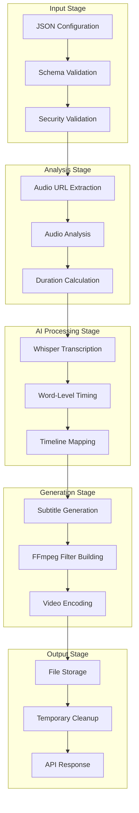
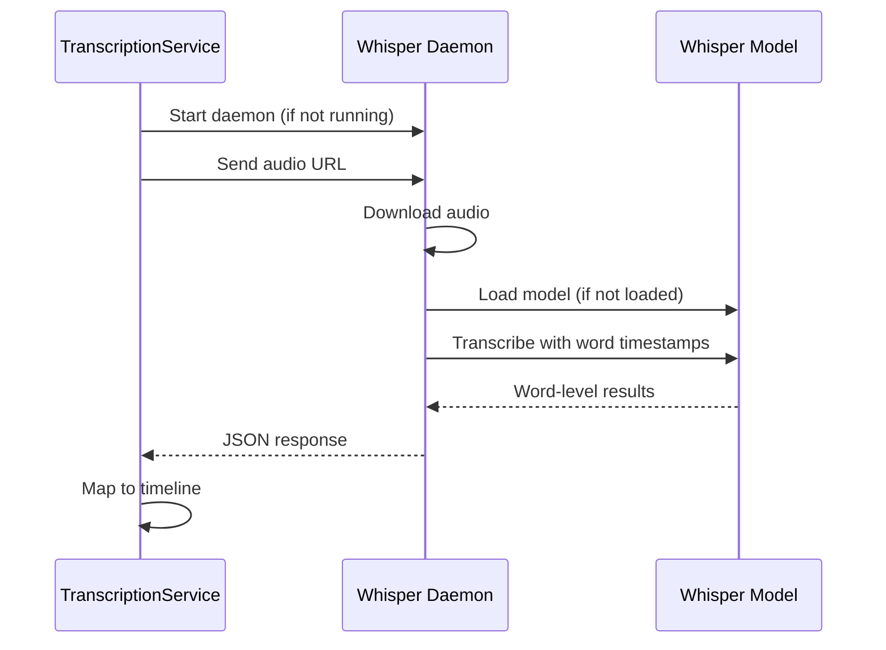

# <
 Data Flow & Processing

VideoCraft processes data through multiple stages, from initial configuration validation to final video output. This document details how information flows through the system and how different components interact.

## =Ë Processing Overview



## = Request Processing Flow

### 1. Configuration Processing
```go
type ConfigProcessor struct {
    validator *jsonschema.Validator
    sanitizer *URLSanitizer
    logger    logger.Logger
}

func (cp *ConfigProcessor) ProcessConfig(config *VideoConfig) (*ProcessedConfig, error) {
    // Schema validation
    if err := cp.validator.Validate(config); err != nil {
        return nil, fmt.Errorf("validation failed: %w", err)
    }
    
    // Security validation
    for _, scene := range config.Scenes {
        for _, element := range scene.Elements {
            if element.Type == "audio" || element.Type == "video" || element.Type == "image" {
                if err := cp.sanitizer.ValidateURL(element.Src); err != nil {
                    return nil, fmt.Errorf("URL validation failed: %w", err)
                }
            }
        }
    }
    
    return &ProcessedConfig{
        Scenes: config.Scenes,
        Elements: config.Elements,
        Quality: config.Quality,
        ProcessedAt: time.Now(),
    }, nil
}
```

### 2. Audio Analysis Pipeline
```go
type AudioAnalysisPipeline struct {
    ffprobe   *FFprobeService
    semaphore chan struct{} // Limit concurrent analysis
}

func (aap *AudioAnalysisPipeline) AnalyzeAudioFiles(urls []string) ([]*AudioInfo, error) {
    var wg sync.WaitGroup
    results := make([]*AudioInfo, len(urls))
    errors := make([]error, len(urls))
    
    for i, url := range urls {
        wg.Add(1)
        go func(index int, audioURL string) {
            defer wg.Done()
            
            // Acquire semaphore for concurrency control
            aap.semaphore <- struct{}{}
            defer func() { <-aap.semaphore }()
            
            info, err := aap.ffprobe.GetAudioInfo(audioURL)
            results[index] = info
            errors[index] = err
        }(i, url)
    }
    
    wg.Wait()
    
    // Check for errors
    for _, err := range errors {
        if err != nil {
            return nil, err
        }
    }
    
    return results, nil
}
```

### 3. Timing Calculation
```go
func CalculateSceneTiming(audioInfos []*AudioInfo) []TimingSegment {
    var segments []TimingSegment
    currentTime := 0.0
    
    for i, audioInfo := range audioInfos {
        segment := TimingSegment{
            SceneIndex: i,
            StartTime:  currentTime,
            EndTime:    currentTime + audioInfo.Duration,
            Duration:   audioInfo.Duration,
        }
        segments = append(segments, segment)
        currentTime += audioInfo.Duration // Use REAL duration, not speech duration
    }
    
    return segments
}
```

## > AI Processing Flow

### Whisper Daemon Communication


### Word-Level Timing Processing
```go
type WordTimingProcessor struct {
    sceneTimings []TimingSegment
}

func (wtp *WordTimingProcessor) ProcessWordTimings(transcriptionResults []TranscriptionResult) []SubtitleEvent {
    var events []SubtitleEvent
    
    for sceneIndex, result := range transcriptionResults {
        sceneStart := wtp.sceneTimings[sceneIndex].StartTime
        
        for _, word := range result.Words {
            // Convert relative timing to absolute video timeline
            absoluteStart := sceneStart + word.Start
            absoluteEnd := sceneStart + word.End
            
            event := SubtitleEvent{
                StartTime: time.Duration(absoluteStart * float64(time.Second)),
                EndTime:   time.Duration(absoluteEnd * float64(time.Second)),
                Text:      word.Word,
                SceneIndex: sceneIndex,
            }
            events = append(events, event)
        }
    }
    
    return events
}
```

## <¬ Video Generation Flow

### FFmpeg Command Building
```go
type FFmpegCommandBuilder struct {
    config *ProcessedConfig
    logger logger.Logger
}

func (fcb *FFmpegCommandBuilder) BuildCommand() (*FFmpegCommand, error) {
    cmd := []string{"ffmpeg", "-y"}
    
    // Add input files
    var inputIndex int
    inputMap := make(map[string]int)
    
    // Background video
    if fcb.config.BackgroundVideo != "" {
        cmd = append(cmd, "-i", fcb.config.BackgroundVideo)
        inputMap["background"] = inputIndex
        inputIndex++
    }
    
    // Audio files
    for i, scene := range fcb.config.Scenes {
        for _, element := range scene.Elements {
            if element.Type == "audio" {
                cmd = append(cmd, "-i", element.Src)
                inputMap[fmt.Sprintf("audio_%d", i)] = inputIndex
                inputIndex++
            }
        }
    }
    
    // Build filter complex
    filterComplex := fcb.buildFilterComplex(inputMap)
    cmd = append(cmd, "-filter_complex", filterComplex)
    
    // Output settings
    cmd = append(cmd, "-c:v", "libx264", "-preset", "medium", "-crf", "23")
    cmd = append(cmd, fcb.config.OutputPath)
    
    return &FFmpegCommand{
        Args: cmd,
        OutputPath: fcb.config.OutputPath,
    }, nil
}
```

### Filter Complex Generation
```go
func (fcb *FFmpegCommandBuilder) buildFilterComplex(inputMap map[string]int) string {
    var filters []string
    
    // Scale background video
    bgIndex := inputMap["background"]
    filters = append(filters, 
        fmt.Sprintf("[%d:v]scale=1920:1080:force_original_aspect_ratio=decrease,pad=1920:1080:-1:-1[bg]", bgIndex))
    
    // Audio mixing with timing
    var audioInputs []string
    for i, scene := range fcb.config.Scenes {
        timing := fcb.config.SceneTimings[i]
        audioIndex := inputMap[fmt.Sprintf("audio_%d", i)]
        
        // Apply timing delay
        delayMs := int(timing.StartTime * 1000)
        filters = append(filters,
            fmt.Sprintf("[%d:a]adelay=%d|%d[a%d]", audioIndex, delayMs, delayMs, i))
        audioInputs = append(audioInputs, fmt.Sprintf("[a%d]", i))
    }
    
    // Mix all audio tracks
    if len(audioInputs) > 1 {
        filters = append(filters,
            fmt.Sprintf("%samix=inputs=%d[audio]", strings.Join(audioInputs, ""), len(audioInputs)))
    } else if len(audioInputs) == 1 {
        filters = append(filters, fmt.Sprintf("%s[audio]", audioInputs[0]))
    }
    
    return strings.Join(filters, ";")
}
```

## =¾ Storage Flow

### File Management
```go
type StorageManager struct {
    outputDir string
    tempDir   string
    logger    logger.Logger
}

func (sm *StorageManager) ProcessVideoGeneration(job *Job) error {
    // Create temporary workspace
    workspaceDir := filepath.Join(sm.tempDir, job.ID)
    if err := os.MkdirAll(workspaceDir, 0755); err != nil {
        return fmt.Errorf("failed to create workspace: %w", err)
    }
    
    defer func() {
        // Cleanup temporary files
        if err := os.RemoveAll(workspaceDir); err != nil {
            sm.logger.WithError(err).Warn("Failed to cleanup temporary files")
        }
    }()
    
    // Generate temporary file paths
    subtitleFile := filepath.Join(workspaceDir, "subtitles.ass")
    tempVideoFile := filepath.Join(workspaceDir, "temp_video.mp4")
    
    // Process subtitle generation
    if err := sm.generateSubtitles(job, subtitleFile); err != nil {
        return fmt.Errorf("subtitle generation failed: %w", err)
    }
    
    // Process video generation
    if err := sm.generateVideo(job, subtitleFile, tempVideoFile); err != nil {
        return fmt.Errorf("video generation failed: %w", err)
    }
    
    // Move to final location
    finalPath := filepath.Join(sm.outputDir, fmt.Sprintf("%s.mp4", job.ID))
    if err := os.Rename(tempVideoFile, finalPath); err != nil {
        return fmt.Errorf("failed to move final video: %w", err)
    }
    
    job.ResultPath = finalPath
    return nil
}
```

## =Ê Performance Considerations

### Concurrent Processing
- **Audio Analysis**: Parallel processing with semaphore-controlled concurrency
- **Whisper Processing**: Single daemon with request queuing
- **File I/O**: Async file operations where possible
- **Memory Management**: Streaming processing for large files

### Resource Management
```go
type ResourceManager struct {
    maxConcurrentAudio int
    maxConcurrentJobs  int
    memoryLimit        int64
}

func (rm *ResourceManager) ShouldProcessJob() bool {
    currentMemory := rm.getCurrentMemoryUsage()
    activeJobs := rm.getActiveJobCount()
    
    return currentMemory < rm.memoryLimit && activeJobs < rm.maxConcurrentJobs
}
```

## =Ú Related Topics

### Architecture
- **[Architecture Overview](overview.md)** - High-level system architecture
- **[System Components](components.md)** - Detailed component documentation
- **[Service Interfaces](interfaces.md)** - Interface definitions

### Processing Details
- **[Video Generation](../video-generation/overview.md)** - Video generation workflow
- **[Progressive Subtitles](../subtitles/progressive-subtitles.md)** - Subtitle processing
- **[Audio Processing](../video-generation/timing-synchronization.md)** - Audio analysis

### Performance
- **[Performance Tuning](../configuration/performance-tuning.md)** - Optimization strategies
- **[Monitoring](../deployment/monitoring.md)** - Performance monitoring

---

**= Next Steps**: [System Components](components.md) | [Video Generation Workflow](../video-generation/overview.md) | [Performance Tuning](../configuration/performance-tuning.md)