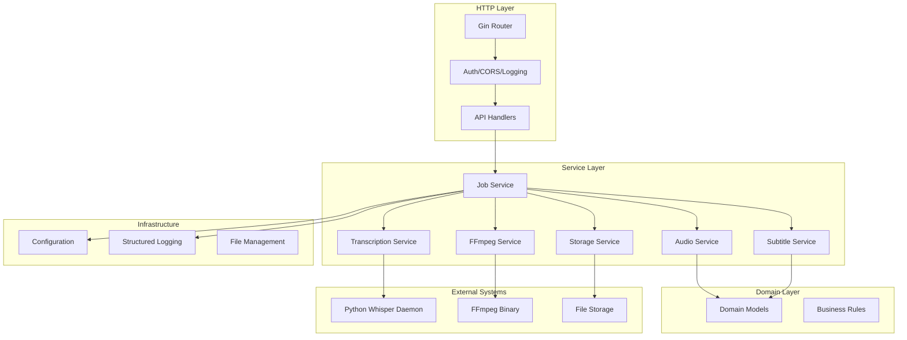

# Architecture Overview

VideoCraft follows a clean architecture pattern with clear separation of concerns.

## System Architecture

## Key Architectural Principles

1. **Dependency Injection**: Services are injected via constructors for testability
2. **Interface Segregation**: Clear interfaces define service contracts
3. **Single Responsibility**: Each service has a focused, well-defined purpose
4. **Error Handling**: Comprehensive error types and propagation
5. **Concurrent Processing**: Goroutines for parallel audio analysis and transcription

## Architecture Layers

### HTTP Layer
- **Responsibility**: Handle HTTP requests, middleware, and routing
- **Components**: Gin router, middleware stack, request handlers
- **Location**: `internal/api/`

### Service Layer  
- **Responsibility**: Business logic and orchestration
- **Components**: Job, Audio, Transcription, Subtitle, FFmpeg, Storage services
- **Location**: `internal/services/`

### Domain Layer
- **Responsibility**: Core business entities and rules
- **Components**: Models, validation, business rules
- **Location**: `internal/domain/`

### Infrastructure Layer
- **Responsibility**: External concerns (config, logging, filesystem)
- **Components**: Configuration management, structured logging, file operations
- **Location**: `internal/config/`, logging utilities

## Design Patterns

### Clean Architecture
- **Dependency Rule**: Dependencies point inward toward the domain
- **Interface Adaptation**: Outer layers implement interfaces defined by inner layers
- **Framework Independence**: Business logic is independent of frameworks

### Service-Oriented Design
- **Service Interfaces**: Clear contracts for each service
- **Dependency Injection**: Constructor-based injection for testability
- **Separation of Concerns**: Each service has a single responsibility

### Security-First Design
- **Defense in Depth**: Multiple security layers
- **Input Validation**: Comprehensive validation at all entry points
- **Error Handling**: Secure error responses without information disclosure

## Related Documentation

- [Core Components](components.md) - Detailed component documentation
- [Data Flow & Processing](data-flow.md) - Request processing workflow
- [Security Overview](../security/overview.md) - Security architecture
- [Service Layer](../services/overview.md) - Service implementation details