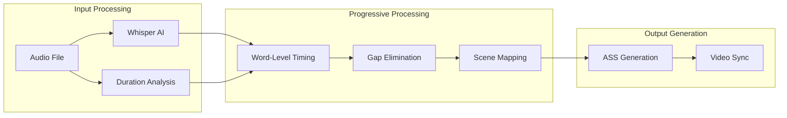

# Progressive Subtitles Architecture

VideoCraft's progressive subtitles system represents a breakthrough in video subtitle timing, eliminating traditional gaps between subtitle segments for seamless viewing experience.

## The Problem with Traditional Subtitles

Traditional subtitle systems suffer from timing gaps:
- **Empty Spaces**: Periods where no subtitles appear despite ongoing speech
- **Abrupt Transitions**: Jarring subtitle disappearances mid-sentence
- **Poor Synchronization**: Misalignment between audio and subtitle timing
- **Fixed Duration**: Inflexible timing that doesn't match natural speech patterns

## Progressive Subtitles Solution

### Core Innovation
Progressive subtitles solve timing gaps through:
1. **Zero-Gap Timing**: Continuous subtitle display without empty intervals
2. **Word-Level Precision**: Individual word timing based on AI transcription
3. **Real Duration Mapping**: Synchronization with actual audio duration
4. **Adaptive Flow**: Dynamic timing that follows natural speech patterns

### Technical Architecture



## Implementation Details

### Word-Level Timing Extraction
1. **Whisper Integration**: AI-powered transcription with timestamp data
2. **Confidence Scoring**: Quality assessment for timing accuracy
3. **Word Boundaries**: Precise start/end times for each word
4. **Speech Recognition**: Language-agnostic processing

### Gap Elimination Algorithm
```python
def eliminate_gaps(word_timings, scene_duration):
    # Calculate total speech time
    total_speech_time = sum(word.duration for word in word_timings)
    
    # Distribute gaps proportionally across words
    gap_ratio = scene_duration / total_speech_time
    
    # Apply progressive timing
    current_time = 0
    for word in word_timings:
        word.start_time = current_time
        word.end_time = current_time + (word.duration * gap_ratio)
        current_time = word.end_time
    
    return word_timings
```

### Scene Synchronization
- Maps progressive timing to video scenes
- Handles multi-scene subtitle continuity
- Synchronizes with background music and effects
- Maintains proper text flow across scene boundaries

## Advanced Features

### JSON SubtitleSettings Integration
Dynamic subtitle configuration for progressive timing:

```json
{
  "progressive_timing": {
    "enabled": true,
    "gap_elimination": true,
    "word_level_precision": true,
    "minimum_display_duration": 0.3
  }
}
```

### Styling and Animation
- Smooth fade transitions between words
- Progressive highlighting for active words
- Configurable animation speeds
- Advanced ASS styling support

### Multi-Language Support
- Language-specific timing adjustments
- RTL (Right-to-Left) language support
- Character-based vs. word-based timing
- Cultural subtitle preferences

## Performance Optimizations

### Concurrent Processing
- Parallel audio analysis and transcription
- Asynchronous subtitle generation
- Worker pools for large video processing
- Memory-efficient streaming processing

### Caching Strategies
- Whisper result caching
- Audio analysis caching
- Pre-computed timing templates
- Scene-based processing optimization

## Quality Assurance

### Timing Validation
- Minimum/maximum display duration enforcement
- Reading speed calculations
- Subtitle density analysis
- Timing drift detection

### Error Handling
- Graceful fallback to traditional timing
- Partial processing recovery
- Quality degradation alerts
- Comprehensive error logging

## Security Considerations

### Input Validation
- Audio file format validation
- Subtitle content sanitization
- Resource limit enforcement
- Path traversal prevention

### Resource Management
- Memory usage limits for large files
- Processing time constraints
- Concurrent request limits
- Cleanup of temporary files

## Testing and Validation

### Automated Testing
- Unit tests for timing algorithms
- Integration tests with Whisper
- Performance benchmarks
- Quality regression tests

### Quality Metrics
- Timing accuracy measurements
- User experience testing
- A/B testing with traditional subtitles
- Performance impact analysis

## Future Enhancements

### Planned Features
- Real-time progressive subtitles for live streams
- Machine learning timing optimization
- Advanced emotion-based timing
- Multi-speaker timing differentiation

### Research Areas
- Neural network timing prediction
- Eye-tracking subtitle optimization
- Accessibility improvements
- Cross-platform timing standards

## Related Documentation

- [Subtitle Service Implementation](../services/subtitle-service.md)
- [Transcription Service](../services/transcription-service.md)
- [Audio Service](../services/audio-service.md)
- [JSON SubtitleSettings](../subtitle-settings-json-examples.md)