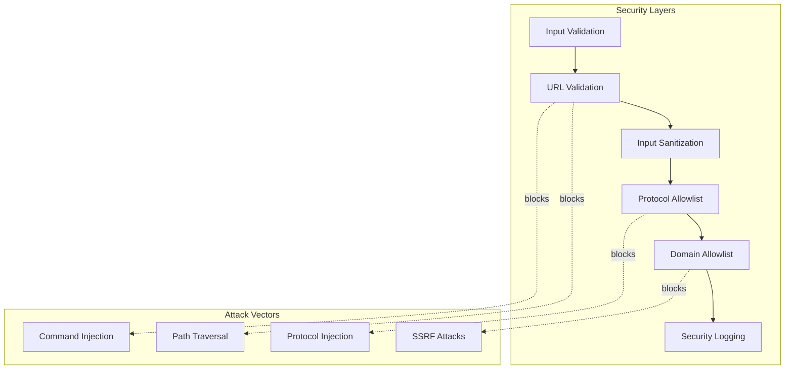

# 🔐 Security Architecture Overview

VideoCraft implements a comprehensive security-first architecture designed to protect against command injection, unauthorized access, and malicious input.

## 🏗️ Multi-Layered Security Architecture



## 🛡️ Core Security Components

### 1. Authentication & Authorization
- **API Key Authentication**: Bearer token-based authentication
- **Domain Allowlisting**: Strict CORS domain controls (NO wildcards)
- **CSRF Protection**: Token-based validation for state-changing requests
- **Rate Limiting**: User-based rate limiting with API key identification and IP fallback

### 2. Input Validation & Sanitization
- **URL Validation**: Multi-layer URL security validation
- **Command Injection Prevention**: FFmpeg parameter sanitization
- **Path Traversal Protection**: File system access controls
- **Protocol Allowlisting**: HTTP/HTTPS only, blocks dangerous schemes

### 3. Secure Error Handling
- **Information Disclosure Prevention**: 40+ security patterns detected
- **Stack Trace Protection**: Complete removal from client responses
- **Automated Threat Assessment**: HIGH/MEDIUM/LOW classification
- **Security Logging**: Structured logging for monitoring

### 4. Network Security
- **Zero Wildcard Policy**: Eliminates `AllowOrigins: ["*"]` vulnerability
- **Origin Validation**: Suspicious pattern detection and blocking
- **TLS Enforcement**: HTTPS-only in production environments
- **Internal Network Protection**: SSRF prevention controls

## 🔴 Critical Security Features (v1.1.0+)

### ⚠️ Breaking Security Changes
Starting with v1.1.0, VideoCraft implements **mandatory security enhancements**:

#### CORS Wildcard Removal
- **Before**: `AllowOrigins: ["*"]` (insecure)
- **After**: Strict domain allowlisting required
- **Required**: `VIDEOCRAFT_SECURITY_ALLOWED_DOMAINS` configuration

#### CSRF Protection
- **State-Change Protection**: POST/PUT/DELETE require CSRF tokens
- **Token Generation**: Get tokens from `/api/v1/csrf-token`
- **Header Requirement**: `X-CSRF-Token: your-token`

#### Enhanced Authentication
- **API Key Required**: No more optional authentication
- **Proper Format**: `Authorization: Bearer YOUR_API_KEY`
- **Auto-Generation**: Secure keys generated if not provided

## 🎯 Security Configuration

### Required Environment Variables
```bash
# CRITICAL: Domain allowlist - REQUIRED for cross-origin requests
VIDEOCRAFT_SECURITY_ALLOWED_DOMAINS="yourdomain.com,api.yourdomain.com"

# Authentication - API key (auto-generated if not set)
VIDEOCRAFT_SECURITY_API_KEY="your-secure-api-key"
VIDEOCRAFT_SECURITY_ENABLE_AUTH=true

# CSRF protection - REQUIRED for production
VIDEOCRAFT_SECURITY_ENABLE_CSRF=true
VIDEOCRAFT_SECURITY_CSRF_SECRET="your-secure-secret"

# Rate limiting
VIDEOCRAFT_SECURITY_RATE_LIMIT=100
```

### Development vs Production
```bash
# Development (minimal security)
VIDEOCRAFT_SECURITY_ALLOWED_DOMAINS="localhost:3000,127.0.0.1:3000"
VIDEOCRAFT_SECURITY_ENABLE_CSRF=false
VIDEOCRAFT_SECURITY_ENABLE_AUTH=false

# Production (maximum security)
VIDEOCRAFT_SECURITY_ALLOWED_DOMAINS="app.yourcompany.com,api.yourcompany.com"
VIDEOCRAFT_SECURITY_ENABLE_CSRF=true
VIDEOCRAFT_SECURITY_CSRF_SECRET="production-secure-secret"
VIDEOCRAFT_SECURITY_ENABLE_AUTH=true
VIDEOCRAFT_SECURITY_RATE_LIMIT=100
```

## 🚨 Security Threats Addressed

### Command Injection Prevention
- **FFmpeg Security**: All URLs validated before command construction
- **Input Sanitization**: Prohibited characters and path traversal detection
- **Parameter Isolation**: Secure command building with proper escaping

### Cross-Site Attack Prevention
- **CORS Protection**: Strict domain allowlisting, no wildcards
- **CSRF Protection**: Token validation for state-changing requests
- **Origin Validation**: Suspicious pattern detection and blocking

### Information Disclosure Prevention
- **Error Sanitization**: 40+ security patterns detected and cleaned
- **Stack Trace Protection**: Server-side logging only, sanitized client responses
- **Threat Assessment**: Automated HIGH/MEDIUM/LOW classification

### Network Security
- **SSRF Prevention**: URL allowlisting and internal IP blocking
- **Protocol Enforcement**: HTTP/HTTPS only, dangerous schemes blocked
- **Enhanced Rate Limiting**: User-based limits with health endpoint bypass and security logging

## 📊 Security Monitoring

### Security Event Types
- `CORS_ORIGIN_REJECTED`: Unauthorized origin blocked
- `CORS_SUSPICIOUS_ORIGIN`: Malicious pattern detected
- `CSRF_TOKEN_MISSING`: Missing CSRF token
- `CSRF_TOKEN_INVALID`: Invalid CSRF token
- `RATE_LIMIT_EXCEEDED`: User exceeded rate limit threshold
- `SECURITY_VIOLATION`: General security violations

### Structured Security Logging
```json
{
  "level": "WARN",
  "message": "CORS_SECURITY_VIOLATION: Origin not in allowlist",
  "fields": {
    "origin": "https://malicious.example.com",
    "allowed_domains": ["trusted.example.com"],
    "violation_type": "CORS_ORIGIN_REJECTED",
    "client_ip": "192.168.1.100",
    "threat_level": "MEDIUM",
    "timestamp": "2024-01-01T12:00:00Z"
  }
}
```

## 🔄 Migration & Upgrade Guide

### From v1.0.x to v1.1.0+
1. **Configure Domain Allowlist** (REQUIRED)
2. **Enable CSRF Protection** (Recommended)
3. **Update Client Applications** (Include CSRF tokens)
4. **Test Security Configuration** (Verify all endpoints work)

See: [Security Configuration Guide](../configuration/security-configuration.md)

## 📚 Related Topics

### Authentication & Access Control
- **[API Authentication](authentication.md)** - Detailed authentication setup
- **[CORS & CSRF Protection](cors-csrf.md)** - Cross-origin security
- **[Security Configuration](../configuration/security-configuration.md)** - Environment setup

### Input Security
- **[Input Validation](input-validation.md)** - URL and parameter validation
- **[Error Handling](error-handling.md)** - Secure error processing

### Monitoring & Analysis
- **[Security Analysis](security-analysis.md)** - Comprehensive risk assessment

### API Security
- **[API Security](../api/authentication.md)** - API-specific security measures
- **[Middleware Security](../api/middleware.md)** - Security middleware details

## 🚀 Quick Security Setup

1. **Set Domain Allowlist**: `export VIDEOCRAFT_SECURITY_ALLOWED_DOMAINS="yourdomain.com"`
2. **Get API Key**: Check logs for auto-generated key
3. **Test API Access**: `curl -H "Authorization: Bearer YOUR_KEY" http://localhost:3002/api/v1/health`
4. **Enable CSRF**: Set `VIDEOCRAFT_SECURITY_ENABLE_CSRF=true` for production

---

**🔗 Next Steps**: [Configure Authentication](authentication.md) | [Set up CORS/CSRF](cors-csrf.md) | [API Security](../api/authentication.md)