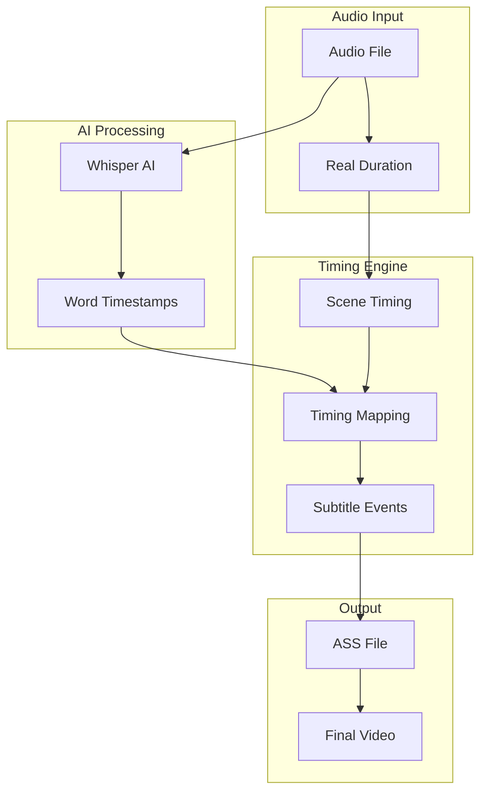

# 📝 Progressive Subtitles System

VideoCraft's progressive subtitle system provides word-level timing accuracy, creating dynamic subtitle effects where words appear character-by-character synchronized with speech.

## 🎯 What Are Progressive Subtitles?

### Traditional vs Progressive
- **Traditional Subtitles**: Full sentences appear at once
- **Progressive Subtitles**: Words appear character-by-character as spoken

### Visual Effect
```
Traditional: [Hello world] (appears instantly)
Progressive: [H][e][l][l][o] [w][o][r][l][d] (reveals over time)
```

### Use Cases
- **Karaoke-style videos**: Follow-along content
- **Educational content**: Enhanced focus and retention
- **Language learning**: Word-by-word pronunciation guidance
- **Accessibility**: Better timing for hearing impaired users

## 🏗️ Architecture Overview



## ⚡ The Timing Innovation

### The Problem with Traditional Approaches
Traditional subtitle systems use **transcription speech duration**, leading to gaps:

```
Audio File: [speech] [pause] [music] [speech] = 60 seconds
Whisper Duration: [speech] + [speech] = 35 seconds
Gap: 25 seconds of silence in video
```

### VideoCraft's Solution: Real Duration Timing
Uses **actual audio file duration** for continuous playback:

```
Audio File Duration: 60 seconds (includes pauses, music, effects)
Scene Timing: Full 60 seconds mapped to video timeline
Result: Perfect synchronization, no gaps
```

## 🔄 Processing Workflow

### 1. Audio Duration Analysis
```go
// Get REAL file duration using FFprobe
audioInfo := ffprobe.Analyze(audioURL)
realDuration := audioInfo.Duration // 60.0 seconds (full file)
speechDuration := whisperResult.Duration // 35.0 seconds (speech only)
```

### 2. Scene Timing Calculation
```go
func calculateSceneTimings(audioFiles []AudioFile) []TimingSegment {
    currentTime := 0.0
    var segments []TimingSegment
    
    for i, audio := range audioFiles {
        segment := TimingSegment{
            StartTime:  currentTime,
            EndTime:    currentTime + audio.RealDuration, // Full duration
            SceneIndex: i,
            AudioFile:  audio.URL,
        }
        segments = append(segments, segment)
        currentTime += audio.RealDuration // Continuous timeline
    }
    
    return segments
}
```

### 3. Word Timing Mapping
```go
func mapWordsToVideoTimeline(words []WordTimestamp, sceneStart float64) []SubtitleEvent {
    var events []SubtitleEvent
    
    for _, word := range words {
        // Map Whisper relative time to absolute video time
        absoluteStart := sceneStart + word.Start
        absoluteEnd := sceneStart + word.End
        
        event := SubtitleEvent{
            StartTime: time.Duration(absoluteStart * float64(time.Second)),
            EndTime:   time.Duration(absoluteEnd * float64(time.Second)),
            Text:      word.Word,
            Type:      "progressive",
        }
        events = append(events, event)
    }
    
    return events
}
```

### 4. Character-Level Timing
```go
func createCharacterRevealEvents(word WordTimestamp, wordStartTime time.Duration) []CharacterReveal {
    wordChars := []rune(word.Word)
    wordDuration := word.End - word.Start
    charDuration := wordDuration / float64(len(wordChars))
    
    var reveals []CharacterReveal
    for i, char := range wordChars {
        revealTime := wordStartTime + time.Duration(float64(i)*charDuration*float64(time.Second))
        reveals = append(reveals, CharacterReveal{
            Character: string(char),
            Timestamp: revealTime,
            Position:  i,
        })
    }
    
    return reveals
}
```

## 🎨 ASS Subtitle Generation

### Progressive Events Structure
Each word becomes a separate subtitle event with precise timing:

```ass
[Events]
Format: Layer, Start, End, Style, Name, MarginL, MarginR, MarginV, Effect, Text
Dialogue: 0,0:00:00.00,0:00:00.80,Default,,0,0,0,,Hello
Dialogue: 0,0:00:00.80,0:00:01.20,Default,,0,0,0,,{Hello }world
Dialogue: 0,0:00:01.20,0:00:01.80,Default,,0,0,0,,{Hello world }is
```

### Styling Configuration
```go
type ASSConfig struct {
    FontFamily   string // "Arial"
    FontSize     int    // 24
    Position     string // "center-bottom"
    WordColor    string // "#FFFFFF"
    OutlineColor string // "#000000"
    OutlineWidth int    // 2
    ShadowOffset int    // 1
}
```

### Advanced Effects
Progressive subtitles support advanced ASS effects:
- **Fade In/Out**: Smooth appearance/disappearance
- **Color Transitions**: Highlight current word
- **Scaling Effects**: Emphasis on important words
- **Position Animation**: Moving text effects

## 🔧 Configuration Options

### JSON Configuration (v1.1+)
```json
{
  "elements": [
    {
      "type": "subtitles",
      "settings": {
        "style": "progressive",
        "font-family": "Arial",
        "font-size": 24,
        "word-color": "#FFFFFF",
        "outline-color": "#000000",
        "outline-width": 2,
        "position": "center-bottom"
      }
    }
  ]
}
```

### Global Configuration
```yaml
subtitles:
  enabled: true
  style: "progressive"
  font_family: "Arial"
  font_size: 24
  position: "center-bottom"
  colors:
    word: "#FFFFFF"
    outline: "#000000"
```

### Style Comparison
| Setting | Progressive | Classic |
|---------|-------------|---------|
| `style` | `"progressive"` | `"classic"` |
| Timing | Word-by-word | Sentence-level |
| Processing | Higher CPU | Lower CPU |
| Use Case | Karaoke, education | General content |
| File Size | Larger | Smaller |

## 🎬 Examples

### Basic Progressive Subtitles
```json
{
  "scenes": [
    {
      "elements": [
        {
          "type": "audio",
          "src": "https://example.com/speech.mp3"
        }
      ]
    }
  ],
  "elements": [
    {
      "type": "subtitles",
      "settings": {
        "style": "progressive"
      }
    }
  ]
}
```

### Karaoke-Style Configuration
```json
{
  "elements": [
    {
      "type": "subtitles", 
      "settings": {
        "style": "progressive",
        "font-family": "Arial",
        "font-size": 36,
        "word-color": "#FFFF00",
        "outline-color": "#000000",
        "outline-width": 3,
        "position": "center-center"
      }
    }
  ]
}
```

### Educational Content Style
```json
{
  "elements": [
    {
      "type": "subtitles",
      "settings": {
        "style": "progressive",
        "font-family": "Georgia", 
        "font-size": 22,
        "word-color": "#2E2E2E",
        "outline-color": "#F0F0F0",
        "outline-width": 1,
        "position": "center-bottom"
      }
    }
  ]
}
```

## 🚀 Performance Considerations

### Processing Requirements
- **CPU Usage**: Higher than classic subtitles
- **Memory**: More subtitle events to process
- **Generation Time**: Additional character-level calculations
- **File Size**: Larger ASS files due to more events

### Optimization Strategies
```go
// Batch character processing
func optimizeCharacterEvents(words []WordTimestamp) []SubtitleEvent {
    // Group short words to reduce event count
    // Optimize timing calculations
    // Use efficient string operations
}

// Memory-efficient processing
func streamSubtitleGeneration(words []WordTimestamp) <-chan SubtitleEvent {
    // Stream events instead of loading all in memory
    // Process in chunks for large audio files
}
```

### When to Use Progressive vs Classic
- **Progressive**: Short content, educational, karaoke, accessibility
- **Classic**: Long content, performance-critical, traditional use

## 🔍 Debugging & Troubleshooting

### Common Issues

#### Timing Gaps
**Problem**: Gaps between subtitle words
**Solution**: Check audio duration vs transcription duration

```bash
# Debug timing
ffprobe -v quiet -print_format json -show_format audio.mp3
# Compare with Whisper transcription duration
```

#### Character Timing Too Fast/Slow
**Problem**: Characters appear too quickly or slowly
**Solution**: Adjust character duration calculation

```go
// Adjust character timing
charDuration := wordDuration / float64(len(wordChars)) * timingMultiplier
```

#### Missing Words
**Problem**: Some words don't appear in subtitles
**Solution**: Check Whisper confidence thresholds

```python
# Whisper configuration
result = model.transcribe(
    audio_path,
    word_timestamps=True,
    temperature=0,  # More deterministic
    best_of=1       # Single pass
)
```

### Validation
```bash
# Test progressive subtitle generation
curl -X POST http://localhost:3002/api/v1/videos \
  -H "Authorization: Bearer $API_KEY" \
  -d '{
    "scenes": [{"elements": [{"type": "audio", "src": "test.mp3"}]}],
    "elements": [{"type": "subtitles", "settings": {"style": "progressive"}}]
  }'

# Check job status for detailed error information
curl http://localhost:3002/api/v1/jobs/{job_id}/status \
  -H "Authorization: Bearer $API_KEY"
```

## 📚 Related Topics

### Subtitle System
- **[Subtitles Overview](overview.md)** - Subtitle system introduction
- **[JSON Settings](json-settings.md)** - Per-request customization (v1.1+)
- **[ASS Generation](ass-generation.md)** - Subtitle file format details

### AI Integration
- **[Whisper Integration](whisper-integration.md)** - Python-Go AI integration
- **[Audio Processing](../video-generation/timing-synchronization.md)** - Audio analysis

### Configuration
- **[Video Generation](../video-generation/configuration.md)** - Complete config format
- **[Environment Variables](../configuration/environment-variables.md)** - System configuration

### Technical Details
- **[Architecture Overview](../architecture/overview.md)** - System architecture
- **[Data Flow](../architecture/data-flow.md)** - Processing workflow

## 🎯 Best Practices

### Content Guidelines
1. **Audio Quality**: Clear speech for better AI transcription
2. **Length**: Progressive works best for 30-300 second segments
3. **Language**: English has best Whisper accuracy
4. **Pacing**: Natural speech rhythm for optimal timing

### Performance Guidelines
1. **Use Classic for Long Content**: >5 minutes consider classic style
2. **Monitor Resource Usage**: Progressive uses more CPU/memory
3. **Batch Processing**: Process multiple short videos vs one long video
4. **Cache Results**: Reuse transcription for similar content

### Design Guidelines
1. **Readable Fonts**: Arial, Helvetica work well
2. **High Contrast**: White text with black outline
3. **Appropriate Size**: 24-36px for most use cases
4. **Bottom Positioning**: Center-bottom for readability

---

**🔗 Next Steps**: [Configure JSON Settings](json-settings.md) | [Understand AI Integration](whisper-integration.md) | [Explore ASS Format](ass-generation.md)