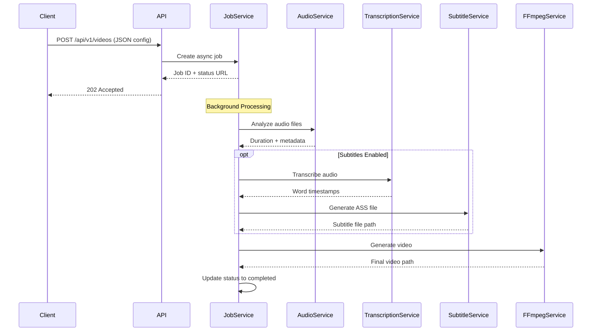

# 🎬 Video Generation Overview

VideoCraft's video generation system creates dynamic videos from JSON configurations using scene-based composition, progressive subtitles, and intelligent audio synchronization.

## 🎯 Core Concepts

### Scene-Based Architecture
Videos are composed of **scenes**, each containing multiple **elements** that define the content and timing:

```json
{
  "scenes": [
    {
      "id": "intro",
      "elements": [
        {"type": "audio", "src": "intro-audio.mp3"},
        {"type": "image", "src": "logo.png", "x": 100, "y": 50}
      ]
    },
    {
      "id": "content", 
      "elements": [
        {"type": "audio", "src": "main-content.mp3"},
        {"type": "video", "src": "background.mp4"}
      ]
    }
  ],
  "elements": [
    {"type": "subtitles", "settings": {"style": "progressive"}}
  ]
}
```

### Element Types
- **Audio**: Audio tracks that drive scene timing
- **Image**: Static image overlays with positioning
- **Video**: Background or overlay video content
- **Subtitles**: AI-generated progressive or classic subtitles

### Timing Intelligence
Unlike simple concatenation, VideoCraft uses **real audio file durations** for scene timing, ensuring continuous playback without gaps.

## 🔄 Video Generation Workflow



### Processing Steps

1. **Configuration Validation**: JSON schema and business rule validation
2. **Audio Analysis**: FFprobe duration analysis for each audio file
3. **Scene Timing Calculation**: Map real audio durations to video timeline
4. **Transcription** (if subtitles enabled): Word-level timing via Whisper AI
5. **Subtitle Generation**: ASS file creation with progressive timing
6. **FFmpeg Command Building**: Complex filter chain construction
7. **Video Encoding**: Final video assembly with progress monitoring
8. **Storage & Cleanup**: File management and temporary cleanup

## ⏱️ Timing & Synchronization System

### The Timing Challenge
Traditional systems use transcription speech duration, creating gaps between scenes. VideoCraft solves this with **real audio file duration** mapping.

### How It Works

#### 1. Audio Duration Analysis
```go
// Use FFprobe to get REAL file duration, not just speech duration
audioInfo := ffprobe.Analyze(audioURL)
duration := audioInfo.Duration // Full file duration
```

#### 2. Scene Timing Calculation  
```go
currentTime := 0.0
for i, audioFile := range sceneAudioFiles {
    scene := TimingSegment{
        StartTime: currentTime,
        EndTime:   currentTime + audioFile.Duration,
        SceneIndex: i,
    }
    currentTime += audioFile.Duration // Real duration, not speech
}
```

#### 3. Subtitle Timing Mapping
```go
// Map Whisper timestamps (relative to audio) to absolute video timeline
sceneStartTime := scene.StartTime
for _, word := range whisperWords {
    absoluteTime := sceneStartTime + word.Start
    // Create subtitle event at absolute time
}
```

### Benefits of Real Duration Timing
- **Continuous Playback**: No gaps between scenes
- **Perfect Synchronization**: Audio and video stay in sync
- **Flexible Content**: Supports pauses, music, and non-speech audio

## 🎨 Element Configuration

### Audio Elements
```json
{
  "type": "audio",
  "src": "https://example.com/audio.mp3",
  "volume": 0.8,
  "fade_in": 1.0,
  "fade_out": 1.0
}
```

### Image Elements
```json
{
  "type": "image", 
  "src": "https://example.com/logo.png",
  "x": 100,
  "y": 50,
  "width": 200,
  "height": 100,
  "z-index": 1
}
```

### Video Elements
```json
{
  "type": "video",
  "src": "https://example.com/background.mp4", 
  "volume": 0.3,
  "loop": true,
  "z-index": -1
}
```

### Subtitle Elements
```json
{
  "type": "subtitles",
  "language": "en",
  "settings": {
    "style": "progressive",
    "font-family": "Arial", 
    "font-size": 24,
    "word-color": "#FFFFFF",
    "outline-color": "#000000",
    "position": "center-bottom"
  }
}
```

## 📊 Job Management

### Async Processing
Video generation runs asynchronously to handle long processing times:

```bash
# 1. Submit job
POST /api/v1/videos
Response: {"job_id": "uuid", "status": "pending"}

# 2. Check status 
GET /api/v1/jobs/{job_id}/status
Response: {"status": "processing", "progress": 45}

# 3. Download result
GET /api/v1/videos/{video_id}/download
```

### Job Status Types
- **pending**: Job queued, not yet started
- **processing**: Video generation in progress
- **completed**: Video ready for download
- **failed**: Processing failed, check error message

### Progress Tracking
```json
{
  "job_id": "550e8400-e29b-41d4-a716-446655440000",
  "status": "processing", 
  "progress": 75,
  "current_step": "Generating video with FFmpeg",
  "estimated_time_remaining": "30s"
}
```

## 🔐 Security Considerations

### URL Validation
All external URLs undergo comprehensive security validation:
- **Protocol Allowlist**: HTTP/HTTPS only
- **Domain Allowlist**: Optional domain restrictions  
- **Command Injection Prevention**: Input sanitization
- **Path Traversal Protection**: File access controls

### Input Sanitization
```go
// Example: URL validation before processing
func validateURL(url string) error {
    // Check for dangerous characters
    if containsProhibitedChars(url) {
        return ErrDangerousURL
    }
    
    // Validate protocol
    if !isAllowedProtocol(url) {
        return ErrInvalidProtocol  
    }
    
    // Check domain allowlist
    if !isDomainAllowed(url) {
        return ErrDomainNotAllowed
    }
    
    return nil
}
```

## 🚀 Performance Optimization

### Concurrent Processing
- **Parallel Audio Analysis**: Multiple files analyzed simultaneously
- **Background Processing**: Non-blocking video generation
- **Resource Pooling**: Efficient FFmpeg and Whisper usage
- **Caching**: Model and analysis result caching

### Resource Management
- **Memory Efficiency**: Streaming processing for large files
- **Disk Cleanup**: Automatic temporary file removal
- **Process Limits**: Configurable concurrency controls
- **Timeout Handling**: Prevent hung operations

## 📋 Configuration Examples

### Basic Video
```json
{
  "scenes": [
    {
      "elements": [
        {
          "type": "audio",
          "src": "https://example.com/speech.mp3"
        }
      ]
    }
  ],
  "elements": [
    {
      "type": "subtitles",
      "settings": {"style": "progressive"}
    }
  ]
}
```

### Multi-Scene Video
```json
{
  "resolution": "1920x1080",
  "quality": "high",
  "scenes": [
    {
      "id": "intro",
      "elements": [
        {"type": "audio", "src": "intro.mp3"},
        {"type": "image", "src": "title.png", "x": 0, "y": 0}
      ]
    },
    {
      "id": "content",
      "elements": [
        {"type": "audio", "src": "content.mp3"},
        {"type": "video", "src": "background.mp4", "volume": 0.2}
      ]
    }
  ],
  "elements": [
    {"type": "subtitles", "settings": {"style": "progressive"}}
  ]
}
```

### Advanced Configuration
```json
{
  "width": 1920,
  "height": 1080, 
  "quality": "high",
  "scenes": [
    {
      "elements": [
        {
          "type": "audio",
          "src": "narration.mp3",
          "volume": 1.0,
          "fade_in": 0.5
        },
        {
          "type": "video", 
          "src": "background.mp4",
          "volume": 0.3,
          "loop": true,
          "z-index": -1
        },
        {
          "type": "image",
          "src": "logo.png",
          "x": 50,
          "y": 50, 
          "width": 200,
          "height": 100,
          "z-index": 2
        }
      ]
    }
  ],
  "elements": [
    {
      "type": "subtitles",
      "language": "en",
      "settings": {
        "style": "progressive",
        "font-family": "Arial",
        "font-size": 28,
        "word-color": "#FFFFFF",
        "outline-color": "#000000",
        "outline-width": 2,
        "position": "center-bottom"
      }
    }
  ]
}
```

## 📚 Related Topics

### Detailed Configuration
- **[Configuration Format](configuration.md)** - Complete JSON reference
- **[Scenes & Elements](scenes-elements.md)** - Detailed element documentation
- **[Timing & Synchronization](timing-synchronization.md)** - Advanced timing concepts

### Subtitle System
- **[Progressive Subtitles](../subtitles/progressive-subtitles.md)** - Word-level timing system
- **[JSON Settings](../subtitles/json-settings.md)** - Per-request subtitle customization
- **[Whisper Integration](../subtitles/whisper-integration.md)** - AI transcription

### Processing Details
- **[FFmpeg Integration](ffmpeg-integration.md)** - Video encoding details
- **[Audio Processing](timing-synchronization.md)** - Audio analysis and timing

### API Usage
- **[API Overview](../api/overview.md)** - API introduction
- **[API Endpoints](../api/endpoints.md)** - Complete endpoint reference
- **[Authentication](../api/authentication.md)** - API security

## 🚀 Quick Start

1. **[Set up API access](../api/authentication.md)** - Get authenticated
2. **[Create basic video](configuration.md#basic-example)** - Try a simple example
3. **[Add progressive subtitles](../subtitles/json-settings.md)** - Enable AI subtitles
4. **[Monitor progress](../api/endpoints.md#job-status)** - Track generation status

---

**🔗 Next Steps**: [Configuration Format](configuration.md) | [Progressive Subtitles](../subtitles/progressive-subtitles.md) | [API Reference](../api/endpoints.md)