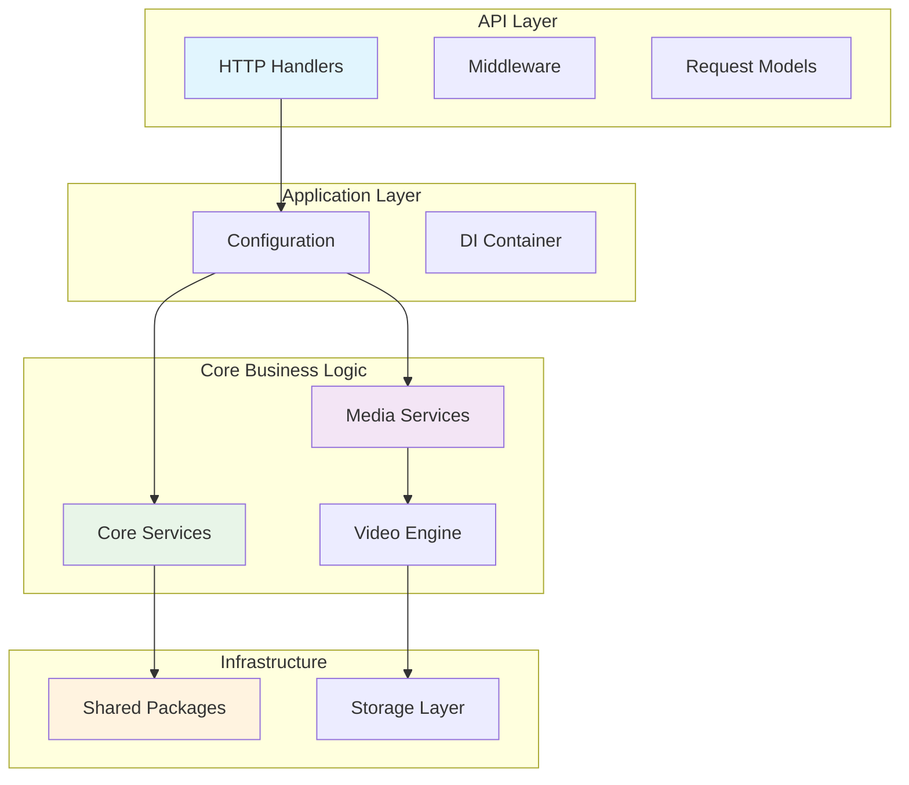
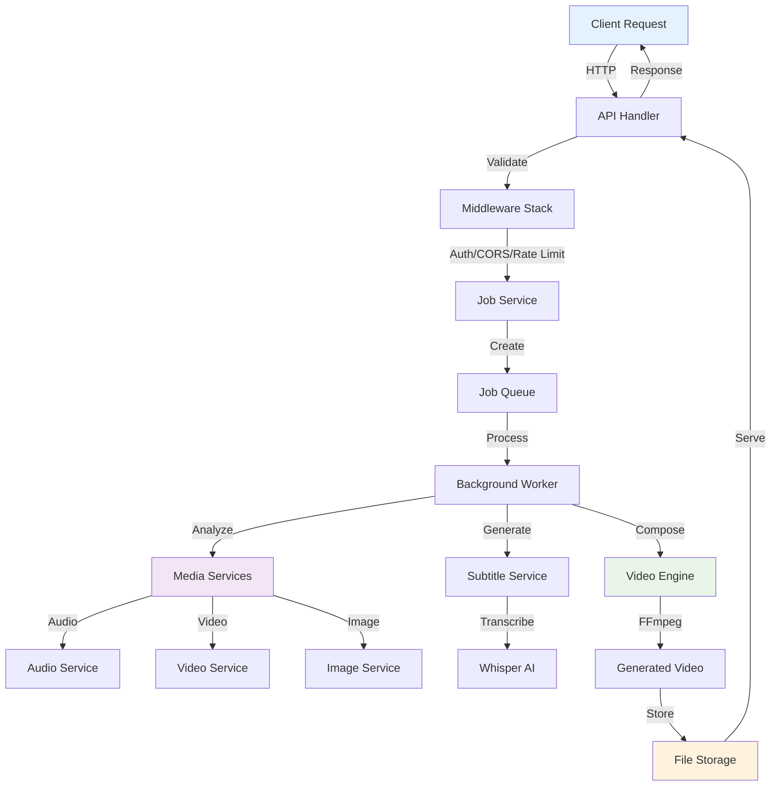

# VideoCraft Internal Architecture - Core Documentation

VideoCraft's internal architecture follows **Clean Architecture principles** with a security-first design approach. This directory contains all the core application logic organized into four distinct layers.

## 🏗️ Architecture Overview

## 📁 Package Structure

### 🌐 API Layer (`/api/`)
**Purpose**: External interface and HTTP handling
- **http/**: REST API implementation with handlers, middleware, and routing
- **models/**: Request/response data structures

### ⚙️ Application Layer (`/app/`)
**Purpose**: Configuration management and dependency injection
- **config.go**: Central configuration with secure defaults
- **container/**: Dependency injection container (planned)

### 🧠 Core Layer (`/core/`)
**Purpose**: Business logic and domain services
- **media/**: Media processing services (audio, video, image, subtitle)
- **services/**: Core business services (transcription, job management)
- **video/**: Video generation engine and composition

### 🔧 Infrastructure Layer (`/pkg/` & `/storage/`)
**Purpose**: Shared utilities and storage management
- **pkg/**: Reusable packages (errors, logging, security, validation)
- **storage/**: File storage with security controls

## 🔄 Data Flow Architecture

## 🛡️ Security Architecture

### Multi-Layer Security Approach
1. **Input Validation**: Comprehensive validation at API boundaries
2. **Command Injection Prevention**: Secure FFmpeg command construction
3. **Path Traversal Protection**: Safe file operations
4. **Error Sanitization**: Secure error responses
5. **Rate Limiting**: User-based and global limits
6. **CORS Configuration**: No wildcards, explicit allowlists

### Security Patterns
- **No Wildcard Origins**: All CORS origins explicitly configured
- **Path Sanitization**: All file paths validated against traversal attacks
- **Command Validation**: FFmpeg commands constructed safely
- **Error Filtering**: Sensitive information removed from client responses

## 🔌 Interface Design

### Service Interfaces
All services implement clean interfaces for:
- **Testability**: Easy mocking and unit testing
- **Pluggability**: Services can be swapped/extended
- **Separation of Concerns**: Clear boundaries between layers

### Dependency Injection
- **Constructor Injection**: Services receive dependencies at creation
- **Interface Dependencies**: Services depend on interfaces, not implementations
- **Configuration Driven**: Behavior controlled via configuration

## 📊 Performance Characteristics

### Asynchronous Processing
- **Job Queue**: Background processing for video generation
- **Worker Pool**: Configurable number of concurrent workers
- **Progress Tracking**: Real-time job progress updates

### Media Optimization
- **URL-First Analysis**: FFprobe analysis without file download
- **Progressive Subtitles**: Real-time word-by-word timing
- **Streaming Support**: Large file handling via streaming

## 🧪 Testing Strategy

### Test Organization
- **Unit Tests**: Individual package testing
- **Integration Tests**: Cross-service testing
- **Security Tests**: Vulnerability and attack simulation
- **End-to-End Tests**: Complete workflow validation

### Test Categories
- **Validation Tests**: Input validation edge cases
- **Security Tests**: Attack vector simulation
- **Performance Tests**: Load and stress testing
- **Compatibility Tests**: FFmpeg version compatibility

## 📈 Monitoring & Observability

### Structured Logging
- **slog Integration**: Structured logging throughout
- **Security Events**: Dedicated security event logging
- **Performance Metrics**: Request timing and resource usage

### Health Monitoring
- **Service Health**: Individual service health checks
- **Dependency Health**: External service monitoring
- **Resource Monitoring**: Memory and CPU tracking

## 🔄 Configuration Management

### Environment-Based Configuration
- **YAML Configuration**: Human-readable configuration files
- **Environment Variables**: Runtime configuration overrides
- **Secure Defaults**: Security-first default values

### Configuration Validation
- **Startup Validation**: Configuration validated at startup
- **Type Safety**: Strongly typed configuration structures
- **Documentation**: Comprehensive configuration documentation

---

**Navigation**: Explore individual package documentation for detailed implementation details and specific architectural patterns used in each layer.