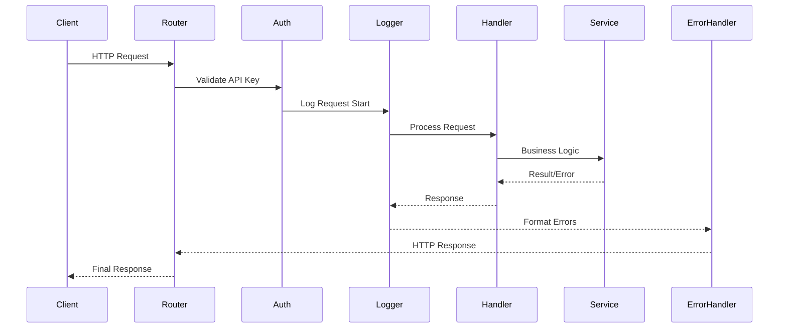

# VideoCraft API Layer - HTTP Interface Documentation

The API layer provides a secure, RESTful HTTP interface for VideoCraft's video generation capabilities. Built with security-first principles, it implements comprehensive protection against common web vulnerabilities.

## 🏗️ Package Overview

The `internal/api` package implements the HTTP API layer for VideoCraft, providing RESTful endpoints for video generation, job management, and system monitoring. It uses the Gin framework for high-performance HTTP handling with comprehensive middleware support.

## Architecture

```text
internal/api/
├── router.go           # Main router configuration
├── handlers/           # Request handlers
│   ├── video.go       # Video generation endpoints
│   ├── job.go         # Job management endpoints
│   └── health.go      # Health and metrics endpoints
└── middleware/         # HTTP middleware
    ├── auth.go        # Authentication
    ├── cors.go        # Secure CORS configuration
    ├── csrf.go        # CSRF protection
    ├── logger.go      # Request logging
    ├── error.go       # Error handling
    └── ratelimit.go   # Rate limiting
```

## Request Flow



## Router Configuration (`router.go`)

### Main Router Setup

```go
func NewRouter(cfg *config.Config, services *services.Services, logger logger.Logger) *gin.Engine {
    // Set Gin mode based on environment
    if !cfg.Debug {
        gin.SetMode(gin.ReleaseMode)
    }
    
    router := gin.New()
    
    // Global middleware
    router.Use(middleware.Logger(logger))
    router.Use(middleware.Recovery())
    router.Use(middleware.SecureCORS(cfg, logger))
    router.Use(middleware.CSRFProtection(cfg, logger))
    router.Use(middleware.RequestID())
    
    // API versioning
    v1 := router.Group("/api/v1")
    v1.Use(middleware.Auth(cfg.Auth.APIKey))
    
    // Register route groups
    registerVideoRoutes(v1, services, logger)
    registerJobRoutes(v1, services, logger)
    registerHealthRoutes(router, services, logger) // No auth for health
    
    return router
}
```

### Route Groups

#### Video Routes
```go
func registerVideoRoutes(rg *gin.RouterGroup, services *services.Services, logger logger.Logger) {
    handler := handlers.NewVideoHandler(services, logger)
    
    videos := rg.Group("/videos")
    {
        videos.POST("", handler.CreateVideo)           // POST /api/v1/videos
        videos.GET("", handler.ListVideos)             // GET /api/v1/videos
        videos.GET("/:id", handler.GetVideo)           // GET /api/v1/videos/:id
        videos.GET("/:id/download", handler.DownloadVideo) // GET /api/v1/videos/:id/download
        videos.DELETE("/:id", handler.DeleteVideo)     // DELETE /api/v1/videos/:id
    }
}
```

#### Job Routes
```go
func registerJobRoutes(rg *gin.RouterGroup, services *services.Services, logger logger.Logger) {
    handler := handlers.NewJobHandler(services, logger)
    
    jobs := rg.Group("/jobs")
    {
        jobs.GET("", handler.ListJobs)                 // GET /api/v1/jobs
        jobs.GET("/:id", handler.GetJob)               // GET /api/v1/jobs/:id
        jobs.GET("/:id/status", handler.GetJobStatus)  // GET /api/v1/jobs/:id/status
        jobs.POST("/:id/cancel", handler.CancelJob)    // POST /api/v1/jobs/:id/cancel
    }
}
```

#### Security Routes
```go
func registerSecurityRoutes(rg *gin.RouterGroup, cfg *config.Config, logger logger.Logger) {
    // CSRF token endpoint (no auth required for getting token)
    rg.GET("/csrf-token", middleware.CSRFTokenEndpoint(cfg, logger))
}
```

#### Health Routes (No Authentication)
```go
func registerHealthRoutes(router *gin.Engine, services *services.Services, logger logger.Logger) {
    handler := handlers.NewHealthHandler(services, logger)
    
    router.GET("/health", handler.BasicHealth)
    router.GET("/health/detailed", handler.DetailedHealth)
    router.GET("/metrics", handler.Metrics)
    router.GET("/ready", handler.ReadinessProbe)
    router.GET("/live", handler.LivenessProbe)
    router.GET("/ping", handler.Ping)
}
```

## Handlers

### Video Handler (`handlers/video.go`)

#### Create Video (Async)
```go
func (vh *VideoHandler) CreateVideo(c *gin.Context) {
    var config models.VideoConfigArray
    
    // Bind and validate JSON
    if err := c.ShouldBindJSON(&config); err != nil {
        vh.handleError(c, http.StatusBadRequest, "Invalid JSON", err)
        return
    }
    
    // Validate business rules
    if err := config.Validate(); err != nil {
        vh.handleError(c, http.StatusBadRequest, "Validation failed", err)
        return
    }
    
    // Create async job
    job, err := vh.services.Job.CreateJob(&config)
    if err != nil {
        vh.handleError(c, http.StatusInternalServerError, "Failed to create job", err)
        return
    }
    
    // Start background processing
    go func() {
        ctx := context.Background()
        if err := vh.services.Job.ProcessJob(ctx, job); err != nil {
            vh.logger.WithError(err).Error("Background job processing failed")
        }
    }()
    
    // Return job information
    c.JSON(http.StatusAccepted, gin.H{
        "success":    true,
        "job_id":     job.ID,
        "video_id":   job.VideoID,
        "status":     job.Status,
        "message":    "Video generation started",
        "status_url": fmt.Sprintf("/api/v1/jobs/%s/status", job.ID),
    })
}
```

#### Download Video
```go
func (vh *VideoHandler) DownloadVideo(c *gin.Context) {
    videoID := c.Param("id")
    
    // Get video file path
    filePath, err := vh.services.Storage.GetVideo(videoID)
    if err != nil {
        vh.handleError(c, http.StatusNotFound, "Video not found", err)
        return
    }
    
    // Check file exists
    if _, err := os.Stat(filePath); os.IsNotExist(err) {
        vh.handleError(c, http.StatusNotFound, "Video file not found", err)
        return
    }
    
    // Stream file with proper headers
    c.Header("Content-Type", "video/mp4")
    c.Header("Content-Disposition", fmt.Sprintf("attachment; filename=\"%s.mp4\"", videoID))
    c.File(filePath)
}
```

#### List Videos with Pagination
```go
func (vh *VideoHandler) ListVideos(c *gin.Context) {
    // Parse query parameters
    limit := parseInt(c.DefaultQuery("limit", "50"), 50)
    offset := parseInt(c.DefaultQuery("offset", "0"), 0)
    
    // Validate limits
    if limit > 100 {
        limit = 100
    }
    
    // Get videos from storage
    videos, err := vh.services.Storage.ListVideos()
    if err != nil {
        vh.handleError(c, http.StatusInternalServerError, "Failed to list videos", err)
        return
    }
    
    // Apply pagination
    total := len(videos)
    start := offset
    end := offset + limit
    
    if start > total {
        start = total
    }
    if end > total {
        end = total
    }
    
    paginatedVideos := videos[start:end]
    
    // Calculate disk usage
    diskUsage, _ := vh.services.Storage.GetDiskUsage()
    
    c.JSON(http.StatusOK, gin.H{
        "videos":     paginatedVideos,
        "pagination": gin.H{
            "total":  total,
            "limit":  limit,
            "offset": offset,
        },
        "disk_usage": diskUsage,
    })
}
```

### Job Handler (`handlers/job.go`)

#### Get Job Status
```go
func (jh *JobHandler) GetJobStatus(c *gin.Context) {
    jobID := c.Param("id")
    
    // Validate job ID format
    if !isValidUUID(jobID) {
        jh.handleError(c, http.StatusBadRequest, "Invalid job ID format", nil)
        return
    }
    
    // Get job from service
    job, err := jh.services.Job.GetJob(jobID)
    if err != nil {
        jh.handleError(c, http.StatusNotFound, "Job not found", err)
        return
    }
    
    // Build response with computed fields
    response := gin.H{
        "job_id":       job.ID,
        "video_id":     job.VideoID,
        "status":       job.Status,
        "progress":     job.Progress,
        "created_at":   job.CreatedAt,
        "updated_at":   job.UpdatedAt,
    }
    
    // Add conditional fields
    if job.CompletedAt != nil {
        response["completed_at"] = job.CompletedAt
        response["duration_seconds"] = job.CompletedAt.Sub(job.CreatedAt).Seconds()
    }
    
    if job.Error != "" {
        response["error"] = job.Error
    }
    
    if job.Status == models.JobStatusCompleted {
        response["download_url"] = fmt.Sprintf("/api/v1/videos/%s/download", job.VideoID)
    }
    
    c.JSON(http.StatusOK, response)
}
```

#### List Jobs with Filtering
```go
func (jh *JobHandler) ListJobs(c *gin.Context) {
    // Parse filters
    statusFilter := c.Query("status")
    limit := parseInt(c.DefaultQuery("limit", "50"), 50)
    
    // Validate status filter
    if statusFilter != "" && !isValidJobStatus(statusFilter) {
        jh.handleError(c, http.StatusBadRequest, "Invalid status filter", nil)
        return
    }
    
    // Get jobs from service
    jobs, err := jh.services.Job.ListJobs()
    if err != nil {
        jh.handleError(c, http.StatusInternalServerError, "Failed to list jobs", err)
        return
    }
    
    // Apply status filter
    if statusFilter != "" {
        jobs = filterJobsByStatus(jobs, models.JobStatus(statusFilter))
    }
    
    // Apply limit
    if limit < len(jobs) {
        jobs = jobs[:limit]
    }
    
    // Calculate statistics
    stats := calculateJobStatistics(jobs)
    
    c.JSON(http.StatusOK, gin.H{
        "jobs":        jobs,
        "total_count": len(jobs),
        "statistics":  stats,
    })
}
```

### Health Handler (`handlers/health.go`)

#### Detailed Health Check
```go
func (hh *HealthHandler) DetailedHealth(c *gin.Context) {
    status := "healthy"
    services := make(map[string]string)
    
    // Check each service
    services["storage"] = hh.checkStorageService()
    services["ffmpeg"] = hh.checkFFmpegService()
    services["transcription"] = hh.checkTranscriptionService()
    
    // Determine overall status
    for _, serviceStatus := range services {
        if serviceStatus != "healthy" {
            status = "degraded"
            break
        }
    }
    
    // Get system metrics
    systemMetrics := hh.getSystemMetrics()
    
    // Get job metrics
    jobMetrics := hh.getJobMetrics()
    
    c.JSON(http.StatusOK, gin.H{
        "status":    status,
        "timestamp": time.Now(),
        "services":  services,
        "system":    systemMetrics,
        "jobs":      jobMetrics,
    })
}

func (hh *HealthHandler) checkStorageService() string {
    if err := hh.services.Storage.HealthCheck(); err != nil {
        return "unhealthy: " + err.Error()
    }
    return "healthy"
}
```

## Middleware

### Security Middleware

#### Secure CORS (`middleware/cors.go`)

**Critical Security Features:**
- **Zero Wildcard Policy**: Eliminates `AllowOrigins: ["*"]` vulnerability
- **Strict Domain Allowlisting**: Only configured domains permitted
- **Origin Validation Caching**: Thread-safe performance optimization
- **Suspicious Pattern Detection**: Blocks malicious origins
- **Comprehensive Security Logging**: Structured audit trail

```go
func SecureCORS(cfg *config.Config, log logger.Logger) gin.HandlerFunc {
    // Strict domain allowlisting - NO WILDCARDS
    corsConfig := cors.Config{
        AllowOrigins: prepareAllowedOrigins(cfg.Security.AllowedDomains),
        AllowMethods: []string{"GET", "POST", "PUT", "DELETE", "OPTIONS"},
        AllowHeaders: []string{
            "Origin", "Content-Type", "Authorization", 
            "X-Requested-With", "X-CSRF-Token",
        },
        AllowCredentials: len(cfg.Security.AllowedDomains) == 1,
        AllowOriginFunc: func(origin string) bool {
            return validateOriginWithCache(origin, cfg.Security.AllowedDomains, cache, log)
        },
    }
    return cors.New(corsConfig)
}
```

**Configuration:**
```bash
# Required for production
export VIDEOCRAFT_SECURITY_ALLOWED_DOMAINS="yourdomain.com,api.yourdomain.com"
```

#### CSRF Protection (`middleware/csrf.go`)

**Key Security Features:**
- **Token-Based Validation**: Cryptographically secure tokens
- **State-Change Protection**: POST/PUT/DELETE require tokens
- **Enhanced Token Validation**: Format validation prevents injection
- **Safe Method Exemption**: GET/HEAD/OPTIONS bypass validation

```go
func CSRFProtection(cfg *config.Config, log logger.Logger) gin.HandlerFunc {
    return func(c *gin.Context) {
        // Skip CSRF for safe methods
        if isSafeMethod(c.Request.Method) {
            c.Next()
            return
        }

        // Validate CSRF token for state-changing requests
        token := c.GetHeader("X-CSRF-Token")
        if !isValidCSRFToken(token, cfg.Security.CSRFSecret) {
            log.WithFields(map[string]interface{}{
                "violation_type": "CSRF_TOKEN_INVALID",
                "threat_level":   "HIGH",
            }).Error("CSRF_SECURITY_VIOLATION")
            
            c.JSON(http.StatusForbidden, gin.H{
                "error": "Invalid CSRF token",
                "code":  "CSRF_TOKEN_INVALID",
            })
            c.Abort()
            return
        }
        c.Next()
    }
}
```

**Usage:**
```bash
# Get CSRF token
curl http://localhost:3002/api/v1/csrf-token

# Include token in requests
curl -X POST -H "X-CSRF-Token: your-token" \
     -H "Content-Type: application/json" \
     http://localhost:3002/api/v1/generate-video
```

For detailed security implementation, see: [`middleware/SECURITY.md`](middleware/SECURITY.md)

### Authentication (`middleware/auth.go`)

#### Bearer Token Authentication
```go
func Auth(apiKey string) gin.HandlerFunc {
    return func(c *gin.Context) {
        // Skip auth if no API key configured (development mode)
        if apiKey == "" {
            c.Next()
            return
        }
        
        // Get authorization header
        authHeader := c.GetHeader("Authorization")
        if authHeader == "" {
            c.JSON(http.StatusUnauthorized, gin.H{
                "error": "Authorization header required",
                "code":  "MISSING_AUTH_HEADER",
            })
            c.Abort()
            return
        }
        
        // Parse bearer token
        const bearerPrefix = "Bearer "
        if !strings.HasPrefix(authHeader, bearerPrefix) {
            c.JSON(http.StatusUnauthorized, gin.H{
                "error": "Invalid authorization format",
                "code":  "INVALID_AUTH_FORMAT",
            })
            c.Abort()
            return
        }
        
        token := strings.TrimPrefix(authHeader, bearerPrefix)
        
        // Validate token
        if token != apiKey {
            c.JSON(http.StatusUnauthorized, gin.H{
                "error": "Invalid API key",
                "code":  "INVALID_API_KEY",
            })
            c.Abort()
            return
        }
        
        // Token is valid, continue
        c.Next()
    }
}
```

### Request Logging (`middleware/logger.go`)

#### Structured Request Logging
```go
func Logger(logger logger.Logger) gin.HandlerFunc {
    return gin.LoggerWithFormatter(func(param gin.LogFormatterParams) string {
        // Create structured log entry
        fields := map[string]interface{}{
            "timestamp":   param.TimeStamp,
            "method":      param.Method,
            "path":        param.Path,
            "status":      param.StatusCode,
            "latency":     param.Latency,
            "client_ip":   param.ClientIP,
            "user_agent":  param.Request.UserAgent(),
            "request_id":  param.Request.Header.Get("X-Request-ID"),
        }
        
        // Add error info if present
        if param.ErrorMessage != "" {
            fields["error"] = param.ErrorMessage
        }
        
        // Log based on status code
        if param.StatusCode >= 500 {
            logger.WithFields(fields).Error("Request completed with server error")
        } else if param.StatusCode >= 400 {
            logger.WithFields(fields).Warn("Request completed with client error")
        } else {
            logger.WithFields(fields).Info("Request completed successfully")
        }
        
        return ""
    })
}
```

### Error Handling (`middleware/error.go`)

#### Centralized Error Handling
```go
func ErrorHandler() gin.HandlerFunc {
    return gin.CustomRecovery(func(c *gin.Context, recovered interface{}) {
        var err error
        
        switch x := recovered.(type) {
        case string:
            err = errors.New(x)
        case error:
            err = x
        default:
            err = errors.New("Unknown panic")
        }
        
        // Log the panic
        logger.WithError(err).Error("Panic recovered")
        
        // Return error response
        c.JSON(http.StatusInternalServerError, gin.H{
            "error":      "Internal server error",
            "code":       "INTERNAL_ERROR",
            "request_id": c.GetHeader("X-Request-ID"),
        })
        
        c.Abort()
    })
}

// Standardized error response helper
func HandleError(c *gin.Context, statusCode int, message string, err error) {
    response := gin.H{
        "error":      message,
        "request_id": c.GetHeader("X-Request-ID"),
        "timestamp":  time.Now(),
    }
    
    // Add error details in development mode
    if gin.Mode() == gin.DebugMode && err != nil {
        response["details"] = err.Error()
    }
    
    // Add appropriate error code
    switch statusCode {
    case http.StatusBadRequest:
        response["code"] = "BAD_REQUEST"
    case http.StatusUnauthorized:
        response["code"] = "UNAUTHORIZED"
    case http.StatusNotFound:
        response["code"] = "NOT_FOUND"
    case http.StatusInternalServerError:
        response["code"] = "INTERNAL_ERROR"
    default:
        response["code"] = "UNKNOWN_ERROR"
    }
    
    c.JSON(statusCode, response)
}
```

### Rate Limiting (`middleware/ratelimit.go`)

#### Token Bucket Rate Limiter
```go
type RateLimiter struct {
    limiters map[string]*rate.Limiter
    mu       sync.RWMutex
    rate     rate.Limit
    burst    int
}

func NewRateLimiter(requestsPerSecond int, burst int) *RateLimiter {
    return &RateLimiter{
        limiters: make(map[string]*rate.Limiter),
        rate:     rate.Limit(requestsPerSecond),
        burst:    burst,
    }
}

func (rl *RateLimiter) getLimiter(key string) *rate.Limiter {
    rl.mu.Lock()
    defer rl.mu.Unlock()
    
    limiter, exists := rl.limiters[key]
    if !exists {
        limiter = rate.NewLimiter(rl.rate, rl.burst)
        rl.limiters[key] = limiter
    }
    
    return limiter
}

func RateLimit(rl *RateLimiter) gin.HandlerFunc {
    return func(c *gin.Context) {
        // Use client IP as rate limit key
        key := c.ClientIP()
        
        limiter := rl.getLimiter(key)
        
        if !limiter.Allow() {
            c.JSON(http.StatusTooManyRequests, gin.H{
                "error": "Rate limit exceeded",
                "code":  "RATE_LIMIT_EXCEEDED",
                "retry_after": int(1 / float64(rl.rate)),
            })
            c.Abort()
            return
        }
        
        c.Next()
    }
}
```

## Request/Response Models

### Standard Response Format

#### Success Response
```go
type SuccessResponse struct {
    Success   bool        `json:"success"`
    Data      interface{} `json:"data,omitempty"`
    Message   string      `json:"message,omitempty"`
    RequestID string      `json:"request_id,omitempty"`
}
```

#### Error Response
```go
type ErrorResponse struct {
    Error     string      `json:"error"`
    Code      string      `json:"code"`
    Details   interface{} `json:"details,omitempty"`
    RequestID string      `json:"request_id"`
    Timestamp time.Time   `json:"timestamp"`
}
```

### API Response Examples

#### Video Creation Response
```json
{
    "success": true,
    "job_id": "550e8400-e29b-41d4-a716-446655440000",
    "video_id": "550e8400-e29b-41d4-a716-446655440001",
    "status": "pending",
    "message": "Video generation started",
    "status_url": "/api/v1/jobs/550e8400-e29b-41d4-a716-446655440000/status"
}
```

#### Job Status Response
```json
{
    "job_id": "550e8400-e29b-41d4-a716-446655440000",
    "video_id": "550e8400-e29b-41d4-a716-446655440001",
    "status": "processing",
    "progress": 75,
    "current_step": "Generating video with FFmpeg",
    "created_at": "2024-01-01T12:00:00Z",
    "updated_at": "2024-01-01T12:02:30Z",
    "duration_seconds": 150.5
}
```

#### Error Response
```json
{
    "error": "Invalid video configuration",
    "code": "BAD_REQUEST",
    "details": "Scene 'intro' is missing audio element",
    "request_id": "req_123456789",
    "timestamp": "2024-01-01T12:00:00Z"
}
```

## Testing

### Unit Testing

```go
func TestVideoHandler_CreateVideo(t *testing.T) {
    // Setup
    gin.SetMode(gin.TestMode)
    router := gin.New()
    
    mockServices := &services.Services{
        Job: &mocks.MockJobService{},
    }
    
    handler := handlers.NewVideoHandler(mockServices, logger.NewNoop())
    router.POST("/videos", handler.CreateVideo)
    
    // Test data
    config := models.VideoConfigArray{
        // Valid test configuration
    }
    
    jsonData, _ := json.Marshal(config)
    
    // Execute
    req, _ := http.NewRequest(http.MethodPost, "/videos", bytes.NewBuffer(jsonData))
    req.Header.Set("Content-Type", "application/json")
    
    w := httptest.NewRecorder()
    router.ServeHTTP(w, req)
    
    // Assert
    assert.Equal(t, http.StatusAccepted, w.Code)
    
    var response map[string]interface{}
    json.Unmarshal(w.Body.Bytes(), &response)
    assert.True(t, response["success"].(bool))
    assert.NotEmpty(t, response["job_id"])
}
```

### Integration Testing

```go
func TestAPI_EndToEnd(t *testing.T) {
    // Start test server
    server := setupTestServer()
    defer server.Close()
    
    // Create video
    createResp := createTestVideo(t, server.URL)
    jobID := createResp["job_id"].(string)
    
    // Poll job status
    var status string
    for i := 0; i < 30; i++ {
        statusResp := getJobStatus(t, server.URL, jobID)
        status = statusResp["status"].(string)
        
        if status == "completed" || status == "failed" {
            break
        }
        
        time.Sleep(1 * time.Second)
    }
    
    // Verify completion
    assert.Equal(t, "completed", status)
    
    // Download video
    videoID := createResp["video_id"].(string)
    videoData := downloadVideo(t, server.URL, videoID)
    assert.NotEmpty(t, videoData)
}
```

## Configuration

### API-Specific Configuration

```yaml
api:
  port: 8080
  host: "0.0.0.0"
  read_timeout: 30s
  write_timeout: 30s
  idle_timeout: 60s
  max_header_size: 1MB

auth:
  api_key: "${VIDEOCRAFT_AUTH_API_KEY}"
  require_auth: true

rate_limiting:
  enabled: true
  requests_per_second: 10
  burst_size: 20

security:
  allowed_domains:
    - "yourdomain.com"
    - "api.yourdomain.com"
  enable_csrf: true
  csrf_secret: "${VIDEOCRAFT_SECURITY_CSRF_SECRET}"
  enable_auth: true
  rate_limit: 100

cors:
  # SECURITY: NO WILDCARDS ALLOWED
  # Domain allowlisting configured via security.allowed_domains
```

## Security Considerations

### Critical Security Features
- **CORS Wildcard Elimination**: Complete removal of `AllowOrigins: ["*"]`
- **Strict Domain Allowlisting**: Only configured domains permitted
- **CSRF Protection**: Token-based validation for state-changing requests
- **Suspicious Pattern Detection**: Automatic blocking of malicious origins
- **Comprehensive Security Logging**: Structured audit trail with threat levels

### Input Validation
- JSON schema validation for all requests
- File path traversal prevention  
- URL validation for external resources
- Request size limits
- CSRF token format validation
- Origin pattern validation

### Authentication & Authorization
- Bearer token authentication
- API key rotation support
- Rate limiting per client IP
- Secure CORS configuration (NO WILDCARDS)
- CSRF token validation
- Origin-based access control

### Data Protection
- No sensitive data in logs
- Secure file handling
- Temporary file cleanup
- Error message sanitization
- Secure CSRF token generation
- Encrypted secrets management

## Performance Optimization

### Response Optimization
- JSON streaming for large responses
- File streaming for video downloads
- Response compression (gzip)
- Keep-alive connections

### Caching Strategy
- Job status caching (short-term)
- Video metadata caching
- Health check caching
- Static content caching

### Load Balancing
- Stateless design for horizontal scaling
- Health check endpoints for load balancers
- Graceful shutdown support
- Circuit breaker patterns

This documentation covers the complete HTTP API layer implementation. For business logic details, refer to `internal/services/CLAUDE.md`.