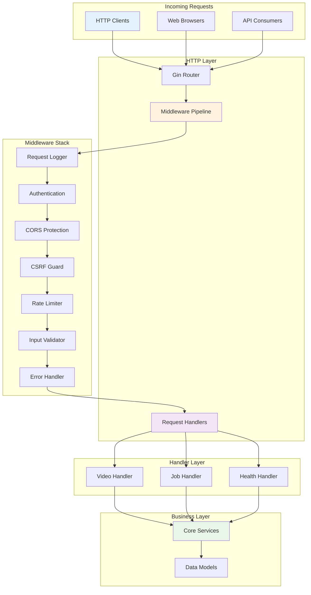
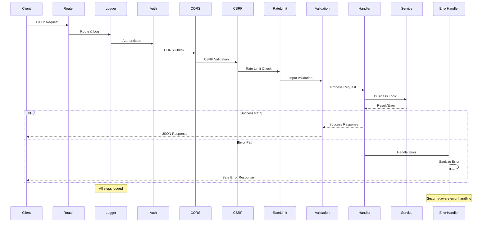
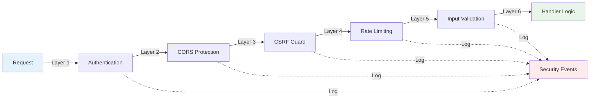
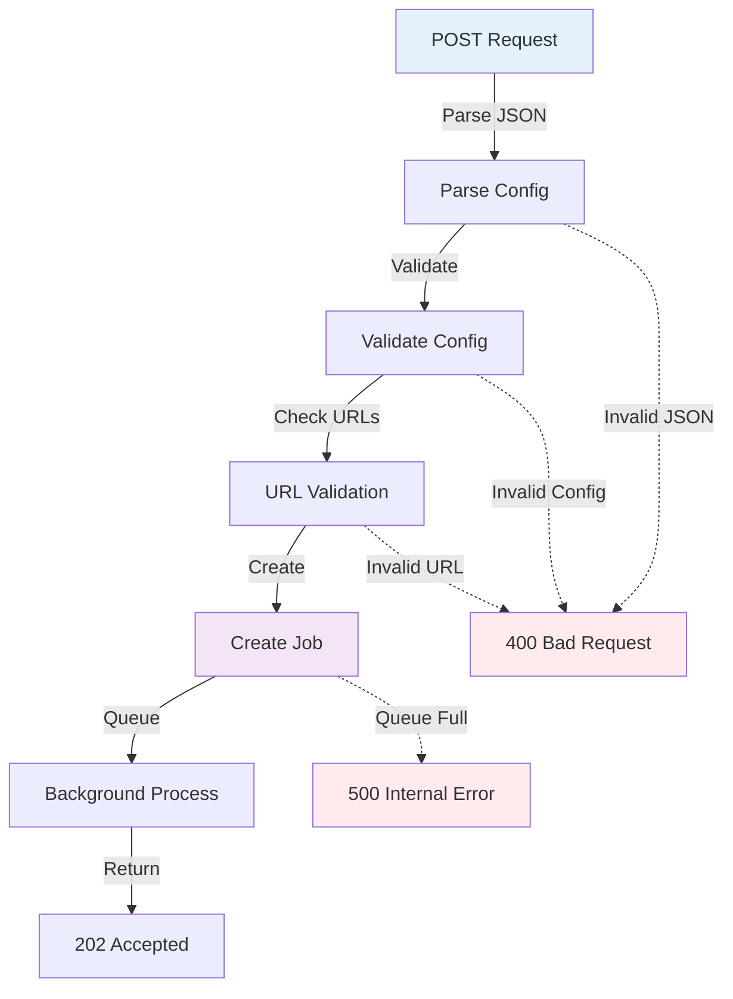
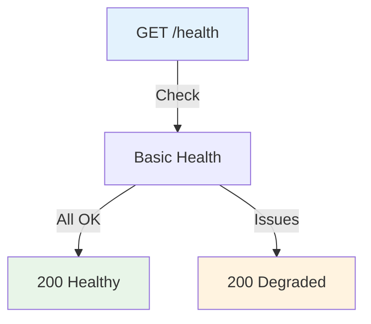
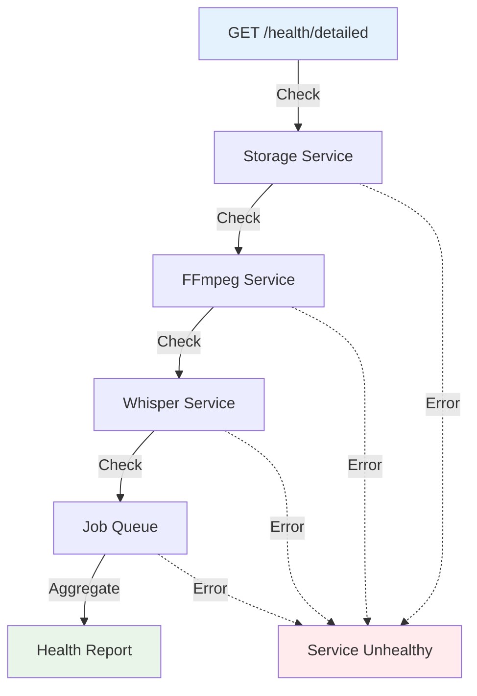
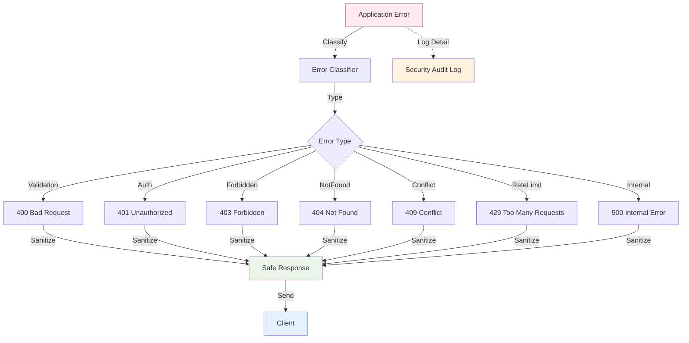

# VideoCraft HTTP Layer - Request Handling & Middleware

The HTTP layer implements the web server interface with security-first middleware and RESTful handlers. This layer acts as the gateway between external clients and VideoCraft's core business logic.

## 🏗️ Architecture Overview



## 📁 Directory Structure

```
internal/api/http/
├── handlers/           # Request handlers for different domains
│   ├── video.go       # Video generation & management
│   ├── job.go         # Job status & control
│   └── health.go      # System health & monitoring
├── middleware/         # Security & request processing middleware
│   ├── auth.go        # API key authentication
│   ├── cors.go        # CORS security configuration
│   ├── csrf.go        # CSRF attack prevention
│   ├── error.go       # Centralized error handling
│   ├── logger.go      # Structured request logging
│   ├── ratelimit.go   # Traffic control & abuse prevention
│   └── validation.go  # Input validation & sanitization
└── routes.go          # HTTP routing configuration
```

## 🔄 Request Processing Pipeline



## 🛡️ Security Architecture

### Multi-Layer Security Approach



### Security Features

1. **Zero Wildcard Policy**: No `*` origins allowed in CORS
2. **Token-Based CSRF**: Cryptographic token validation
3. **Comprehensive Logging**: Security event audit trail
4. **Input Sanitization**: All user input validated and cleaned
5. **Error Sanitization**: No sensitive data in error responses
6. **Rate Limiting**: Abuse prevention and DoS protection

## 🎯 Request Handlers

### Video Handler (`handlers/video.go`)

**Purpose**: Manages video generation requests and file serving

#### Key Features:
- **Asynchronous Processing**: Jobs queued for background processing
- **URL Validation**: Media URLs validated before processing
- **Streaming Downloads**: Large video files served efficiently
- **Progress Tracking**: Real-time job progress updates

#### Endpoints:

**POST /api/v1/videos** - Create Video Generation Job


**GET /api/v1/videos/{id}** - Download Generated Video
```mermaid
flowchart TD
    REQUEST[GET /videos/{id}] -->|Extract ID| ID_CHECK[Validate ID]
    ID_CHECK -->|Lookup| STORAGE[Check Storage]
    STORAGE -->|Verify| FILE_CHECK[File Exists?]
    FILE_CHECK -->|Yes| STREAM[Stream File]
    FILE_CHECK -->|No| NOT_FOUND[404 Not Found]
    
    ID_CHECK -.->|Invalid UUID| ERROR_400[400 Bad Request]
    STORAGE -.->|Not Found| NOT_FOUND
    
    style REQUEST fill:#e3f2fd
    style STREAM fill:#e8f5e8
    style NOT_FOUND fill:#ffebee
    style ERROR_400 fill:#ffebee
```

#### Data Flow:
```go
type VideoRequest struct {
    Projects []VideoProject `json:"projects" binding:"required"`
}

type VideoResponse struct {
    Success   bool   `json:"success"`
    JobID     string `json:"job_id"`
    VideoID   string `json:"video_id"`
    Status    string `json:"status"`
    StatusURL string `json:"status_url"`
}
```

### Job Handler (`handlers/job.go`)

**Purpose**: Provides job status monitoring and control capabilities

#### Key Features:
- **Real-time Status**: Live job progress and status updates
- **Job Control**: Start, stop, and cancel job operations
- **Filtering**: Filter jobs by status, date, or other criteria
- **Pagination**: Handle large job lists efficiently

#### Endpoints:

**GET /api/v1/jobs/{id}/status** - Get Job Status
```mermaid
flowchart TD
    REQUEST[GET /jobs/{id}/status] -->|Extract| ID_EXTRACT[Extract Job ID]
    ID_EXTRACT -->|Validate| ID_VALID[Validate UUID]
    ID_VALID -->|Lookup| JOB_LOOKUP[Find Job]
    JOB_LOOKUP -->|Found| STATUS[Return Status]
    JOB_LOOKUP -->|Not Found| NOT_FOUND[404 Not Found]
    
    ID_VALID -.->|Invalid| ERROR_400[400 Bad Request]
    
    style REQUEST fill:#e3f2fd
    style STATUS fill:#e8f5e8
    style NOT_FOUND fill:#ffebee
    style ERROR_400 fill:#ffebee
```

**DELETE /api/v1/jobs/{id}** - Cancel Job
```mermaid
flowchart TD
    REQUEST[DELETE /jobs/{id}] -->|Extract| ID_EXTRACT[Extract Job ID]
    ID_EXTRACT -->|Validate| ID_VALID[Validate UUID]
    ID_VALID -->|Lookup| JOB_LOOKUP[Find Job]
    JOB_LOOKUP -->|Check State| STATE_CHECK[Can Cancel?]
    STATE_CHECK -->|Yes| CANCEL[Cancel Job]
    STATE_CHECK -->|No| CONFLICT[409 Conflict]
    JOB_LOOKUP -->|Not Found| NOT_FOUND[404 Not Found]
    
    ID_VALID -.->|Invalid| ERROR_400[400 Bad Request]
    CANCEL -->|Success| OK[200 OK]
    
    style REQUEST fill:#e3f2fd
    style OK fill:#e8f5e8
    style CONFLICT fill:#fff3e0
    style NOT_FOUND fill:#ffebee
    style ERROR_400 fill:#ffebee
```

#### Data Flow:
```go
type JobStatusResponse struct {
    JobID       string     `json:"job_id"`
    VideoID     string     `json:"video_id,omitempty"`
    Status      JobStatus  `json:"status"`
    Progress    int        `json:"progress"`
    CreatedAt   time.Time  `json:"created_at"`
    UpdatedAt   time.Time  `json:"updated_at"`
    CompletedAt *time.Time `json:"completed_at,omitempty"`
    Error       string     `json:"error,omitempty"`
    DownloadURL string     `json:"download_url,omitempty"`
}
```

### Health Handler (`handlers/health.go`)

**Purpose**: System monitoring and health check endpoints

#### Key Features:
- **Service Health**: Individual service status monitoring
- **System Metrics**: Resource usage and performance data
- **Dependency Checks**: External service connectivity validation
- **Readiness Probes**: Kubernetes-compatible health endpoints

#### Endpoints:

**GET /health** - Basic Health Check


**GET /health/detailed** - Comprehensive Health Check


#### Data Flow:
```go
type HealthResponse struct {
    Status    string                 `json:"status"`
    Timestamp time.Time              `json:"timestamp"`
    Services  map[string]string      `json:"services"`
    System    SystemMetrics          `json:"system"`
    Jobs      JobMetrics             `json:"jobs"`
}

type SystemMetrics struct {
    Memory      MemoryUsage `json:"memory"`
    CPU         CPUUsage    `json:"cpu"`
    Disk        DiskUsage   `json:"disk"`
    Goroutines  int         `json:"goroutines"`
}
```

## 🔧 Middleware Implementation

### Authentication Middleware (`middleware/auth.go`)

**Purpose**: API key validation and request authorization

```go
func Auth(apiKey string) gin.HandlerFunc {
    return func(c *gin.Context) {
        // Skip in development mode
        if apiKey == "" {
            c.Next()
            return
        }
        
        // Extract and validate Bearer token
        authHeader := c.GetHeader("Authorization")
        if !strings.HasPrefix(authHeader, "Bearer ") {
            c.JSON(401, gin.H{"error": "Invalid auth format"})
            c.Abort()
            return
        }
        
        token := strings.TrimPrefix(authHeader, "Bearer ")
        if token != apiKey {
            c.JSON(401, gin.H{"error": "Invalid API key"})
            c.Abort()
            return
        }
        
        c.Next()
    }
}
```

### CORS Middleware (`middleware/cors.go`)

**Purpose**: Cross-Origin Resource Sharing with zero wildcard policy

```go
func SecureCORS(cfg *app.Config, log logger.Logger) gin.HandlerFunc {
    // CRITICAL: NO WILDCARDS - explicit domain allowlisting only
    corsConfig := cors.Config{
        AllowOrigins: cfg.Security.AllowedDomains, // No ["*"]
        AllowMethods: []string{"GET", "POST", "DELETE", "OPTIONS"},
        AllowHeaders: []string{
            "Origin", "Content-Type", "Authorization",
            "X-Requested-With", "X-CSRF-Token",
        },
        AllowCredentials: true,
        MaxAge: 3600,
    }
    
    return cors.New(corsConfig)
}
```

### CSRF Middleware (`middleware/csrf.go`)

**Purpose**: Cross-Site Request Forgery protection

```go
func CSRFProtection(cfg *app.Config, log logger.Logger) gin.HandlerFunc {
    return func(c *gin.Context) {
        // Skip for safe HTTP methods
        if c.Request.Method == "GET" || c.Request.Method == "HEAD" || c.Request.Method == "OPTIONS" {
            c.Next()
            return
        }
        
        // Validate CSRF token for state-changing requests
        token := c.GetHeader("X-CSRF-Token")
        if !isValidCSRFToken(token, cfg.Security.CSRFSecret) {
            log.WithFields(map[string]interface{}{
                "violation_type": "CSRF_TOKEN_INVALID",
                "threat_level":   "HIGH",
                "client_ip":      c.ClientIP(),
            }).Error("CSRF security violation detected")
            
            c.JSON(403, gin.H{"error": "Invalid CSRF token"})
            c.Abort()
            return
        }
        
        c.Next()
    }
}
```

### Rate Limiting Middleware (`middleware/ratelimit.go`)

**Purpose**: Traffic control and abuse prevention

```go
type RateLimiter struct {
    limiters map[string]*rate.Limiter
    mu       sync.RWMutex
    rate     rate.Limit
    burst    int
}

func RateLimit(limiter *RateLimiter) gin.HandlerFunc {
    return func(c *gin.Context) {
        // Use client IP as rate limit key
        key := c.ClientIP()
        
        clientLimiter := limiter.getLimiter(key)
        
        if !clientLimiter.Allow() {
            c.JSON(429, gin.H{
                "error": "Rate limit exceeded",
                "retry_after": int(1 / float64(limiter.rate)),
            })
            c.Abort()
            return
        }
        
        c.Next()
    }
}
```

### Request Logger Middleware (`middleware/logger.go`)

**Purpose**: Structured logging of all HTTP requests

```go
func Logger(log logger.Logger) gin.HandlerFunc {
    return gin.LoggerWithFormatter(func(param gin.LogFormatterParams) string {
        logFields := map[string]interface{}{
            "timestamp":  param.TimeStamp,
            "method":     param.Method,
            "path":       param.Path,
            "status":     param.StatusCode,
            "latency":    param.Latency,
            "client_ip":  param.ClientIP,
            "user_agent": param.Request.UserAgent(),
            "request_id": param.Request.Header.Get("X-Request-ID"),
        }
        
        if param.ErrorMessage != "" {
            logFields["error"] = param.ErrorMessage
        }
        
        // Log with appropriate level based on status
        if param.StatusCode >= 500 {
            log.WithFields(logFields).Error("Request completed with server error")
        } else if param.StatusCode >= 400 {
            log.WithFields(logFields).Warn("Request completed with client error")
        } else {
            log.WithFields(logFields).Info("Request completed successfully")
        }
        
        return ""
    })
}
```

## 📊 Error Handling Strategy

### Centralized Error Processing



### Error Response Format

```go
type ErrorResponse struct {
    Error     string      `json:"error"`
    Code      string      `json:"code"`
    RequestID string      `json:"request_id"`
    Timestamp time.Time   `json:"timestamp"`
    Details   interface{} `json:"details,omitempty"` // Only in debug mode
}
```

### Security-Aware Error Handling

```go
func HandleError(c *gin.Context, statusCode int, message string, err error) {
    // Always log the actual error for debugging
    logger.WithError(err).WithFields(map[string]interface{}{
        "status_code": statusCode,
        "path":        c.Request.URL.Path,
        "method":      c.Request.Method,
        "client_ip":   c.ClientIP(),
    }).Error("Request error occurred")
    
    response := ErrorResponse{
        Error:     message, // Safe message for client
        Code:      getErrorCode(statusCode),
        RequestID: c.GetHeader("X-Request-ID"),
        Timestamp: time.Now(),
    }
    
    // Only include error details in development mode
    if gin.Mode() == gin.DebugMode && err != nil {
        response.Details = err.Error()
    }
    
    c.JSON(statusCode, response)
}
```

## 📈 Performance Monitoring

### Request Metrics

```go
type RequestMetrics struct {
    TotalRequests    int64         `json:"total_requests"`
    RequestRate      float64       `json:"requests_per_second"`
    AverageLatency   time.Duration `json:"average_latency"`
    ErrorRate        float64       `json:"error_rate"`
    StatusCodes      map[int]int64 `json:"status_codes"`
}
```

### Real-time Monitoring

- **Response Times**: Track handler execution duration
- **Request Rates**: Monitor requests per second per endpoint
- **Error Rates**: Track failed request percentages
- **Resource Usage**: Monitor memory and CPU consumption
- **Security Events**: Track authentication failures and attacks

## 🔧 Configuration

### HTTP Server Configuration

```yaml
http:
  port: 8080
  host: "0.0.0.0"
  read_timeout: 30s
  write_timeout: 30s
  idle_timeout: 60s
  max_header_bytes: 1048576  # 1MB
  shutdown_timeout: 30s

security:
  allowed_domains:
    - "yourdomain.com"
    - "app.yourdomain.com"
  csrf_secret: "${VIDEOCRAFT_CSRF_SECRET}"
  api_key: "${VIDEOCRAFT_API_KEY}"

rate_limiting:
  requests_per_second: 10
  burst_size: 20
  window_size: "1m"
```

## 🧪 Testing Strategy

### Unit Testing
- **Handler Testing**: Mock services and test endpoint logic
- **Middleware Testing**: Security and validation middleware
- **Error Handling**: Error response format and sanitization

### Integration Testing
- **End-to-End Workflows**: Complete request-response cycles
- **Security Testing**: Attack simulation and protection validation
- **Performance Testing**: Load testing and benchmarking

### Security Testing
- **OWASP Compliance**: Standard web security vulnerability testing
- **Input Fuzzing**: Malformed input handling validation
- **Authentication Testing**: Auth bypass and token validation
- **CORS Testing**: Cross-origin policy enforcement

---

**Related Documentation:**
- [API Models & Validation](../models/CLAUDE.md)
- [Middleware Security Implementation](middleware/CLAUDE.md)
- [Core Services Integration](../../core/CLAUDE.md)