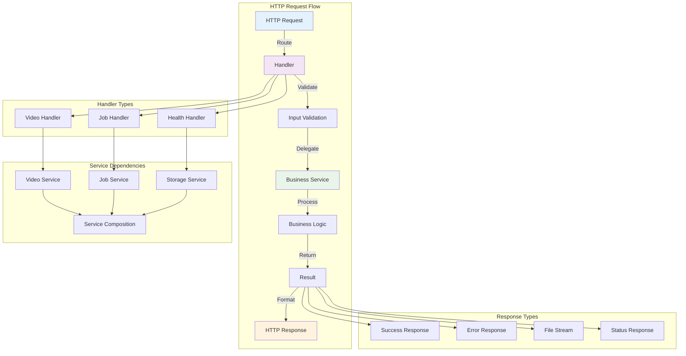
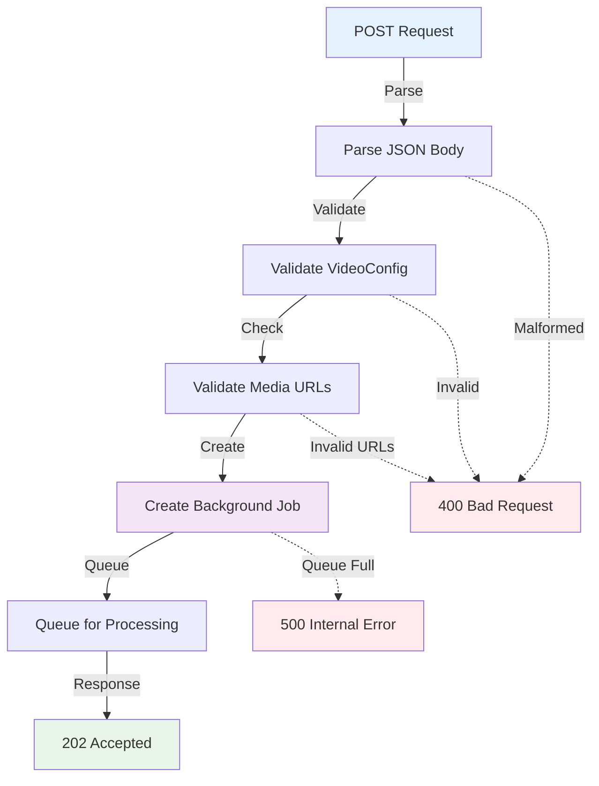
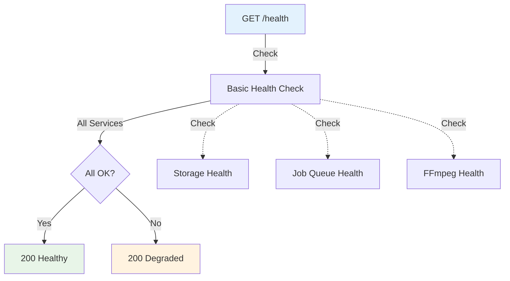

# VideoCraft HTTP Handlers - Request Processing Implementation

The handlers package implements the HTTP request processing logic for VideoCraft's RESTful API. Each handler is responsible for a specific domain area and follows consistent patterns for request validation, business logic delegation, and response formatting.

## 🎯 Handler Architecture



## 📁 Handler Structure

```
internal/api/http/handlers/
├── video.go    # Video generation and management
├── job.go      # Job status and control
└── health.go   # System health and monitoring
```

## 🎬 Video Handler (`video.go`)

**Purpose**: Handles video generation requests and file serving operations

### Key Responsibilities:
- **Video Generation**: Asynchronous video creation job initiation
- **File Serving**: Secure video file downloads with streaming
- **URL Validation**: Media URL validation before processing
- **Progress Tracking**: Job status and progress monitoring

### Implementation:

```go
type VideoHandler struct {
    services *composition.Services
    log      logger.Logger
}

func NewVideoHandler(services *composition.Services, log logger.Logger) *VideoHandler {
    return &VideoHandler{
        services: services,
        log:      log,
    }
}
```

### Endpoint: `POST /api/v1/videos` - Create Video

**Data Flow:**


**Implementation:**
```go
func (h *VideoHandler) CreateVideo(c *gin.Context) {
    h.log.Info("Generate video request received")
    
    // Parse request body
    var config models.VideoConfigArray
    if err := c.ShouldBindJSON(&config); err != nil {
        h.log.Errorf("Failed to parse video config: %v", err)
        c.JSON(http.StatusBadRequest, gin.H{
            "error":   "Invalid JSON format",
            "details": err.Error(),
        })
        return
    }
    
    // Validate configuration
    if len(config) == 0 {
        c.JSON(http.StatusBadRequest, gin.H{
            "error": "No video projects provided",
        })
        return
    }
    
    // Quick URL validation without downloading
    if err := h.validateMediaURLs(&config); err != nil {
        h.log.Errorf("Media URL validation failed: %v", err)
        c.JSON(http.StatusBadRequest, gin.H{
            "error":   "Invalid media URLs",
            "details": err.Error(),
        })
        return
    }
    
    // Create job for async processing
    job, err := h.services.Job.CreateJob(&config)
    if err != nil {
        h.log.Errorf("Failed to create job: %v", err)
        c.JSON(http.StatusInternalServerError, gin.H{
            "error": "Failed to create video generation job",
        })
        return
    }
    
    // Start background processing
    go func() {
        ctx := context.Background()
        if err := h.services.Job.ProcessJob(ctx, job); err != nil {
            h.log.Errorf("Background job processing failed: %v", err)
        }
    }()
    
    c.JSON(http.StatusAccepted, gin.H{
        "success":    true,
        "job_id":     job.ID,
        "video_id":   job.VideoID,
        "status":     job.Status,
        "message":    "Video generation started",
        "status_url": fmt.Sprintf("/api/v1/jobs/%s/status", job.ID),
    })
}
```

### Endpoint: `GET /api/v1/videos/{id}` - Download Video

**Data Flow:**
```mermaid
flowchart TD
    REQUEST[GET /videos/{id}] -->|Extract| ID[Extract Video ID]
    ID -->|Validate| UUID[Validate UUID Format]
    UUID -->|Lookup| STORAGE[Storage Lookup]
    STORAGE -->|Check| EXISTS{File Exists?}
    EXISTS -->|Yes| HEADERS[Set HTTP Headers]
    HEADERS -->|Stream| DOWNLOAD[Stream File]
    
    EXISTS -->|No| NOT_FOUND[404 Not Found]
    UUID -.->|Invalid| BAD_REQUEST[400 Bad Request]
    STORAGE -.->|Error| NOT_FOUND
    
    style REQUEST fill:#e3f2fd
    style DOWNLOAD fill:#e8f5e8
    style NOT_FOUND fill:#ffebee
    style BAD_REQUEST fill:#ffebee
```

**Implementation:**
```go
func (h *VideoHandler) GetVideo(c *gin.Context) {
    videoID := c.Param("id")
    h.log.Debugf("Download video request for ID: %s", videoID)
    
    // Validate video ID
    if videoID == "" {
        c.JSON(http.StatusBadRequest, gin.H{
            "error": "Video ID is required",
        })
        return
    }
    
    // Get video file path from storage
    filePath, err := h.services.Storage.GetVideo(videoID)
    if err != nil {
        h.log.Errorf("Failed to get video %s: %v", videoID, err)
        c.JSON(http.StatusNotFound, gin.H{
            "error":    "Video not found",
            "video_id": videoID,
        })
        return
    }
    
    // Check if file exists
    if _, err := os.Stat(filePath); os.IsNotExist(err) {
        h.log.Errorf("Video file not found on disk: %s", filePath)
        c.JSON(http.StatusNotFound, gin.H{
            "error":    "Video file not found",
            "video_id": videoID,
        })
        return
    }
    
    // Set appropriate headers for video download
    c.Header("Content-Type", "video/mp4")
    c.Header("Content-Disposition", fmt.Sprintf(`attachment; filename="video_%s.mp4"`, videoID))
    c.Header("Cache-Control", "no-cache")
    
    // Stream the file
    c.File(filePath)
    h.log.Infof("Video %s downloaded successfully", videoID)
}
```

### URL Validation Implementation:

```go
func (h *VideoHandler) validateMediaURLs(config *models.VideoConfigArray) error {
    for _, project := range *config {
        // Validate background video URLs
        for _, element := range project.Elements {
            if element.Type == "video" {
                if err := h.services.Video.ValidateVideo(element.Src); err != nil {
                    return fmt.Errorf("invalid background video URL '%s': %w", element.Src, err)
                }
            }
        }
        
        // Validate scene element URLs
        for _, scene := range project.Scenes {
            for _, element := range scene.Elements {
                switch element.Type {
                case "audio":
                    if element.Src == "" {
                        return fmt.Errorf("audio URL cannot be empty")
                    }
                    if err := h.validateURL(element.Src); err != nil {
                        return fmt.Errorf("invalid audio URL '%s': %w", element.Src, err)
                    }
                case "image":
                    if err := h.services.Image.ValidateImage(element.Src); err != nil {
                        return fmt.Errorf("invalid image URL '%s': %w", element.Src, err)
                    }
                }
            }
        }
    }
    
    return nil
}
```

## 📋 Job Handler (`job.go`)

**Purpose**: Provides job management and status monitoring capabilities

### Key Responsibilities:
- **Status Monitoring**: Real-time job status and progress tracking
- **Job Control**: Job cancellation and management operations
- **Job Listing**: Filtered job listing with pagination
- **Progress Updates**: Real-time progress information

### Implementation:

```go
type JobHandler struct {
    services *composition.Services
    log      logger.Logger
}
```

### Endpoint: `GET /api/v1/jobs/{id}/status` - Get Job Status

**Data Flow:**
```mermaid
flowchart TD
    REQUEST[GET /jobs/{id}/status] -->|Extract| ID[Extract Job ID]
    ID -->|Validate| UUID[Validate UUID]
    UUID -->|Lookup| JOB[Find Job]
    JOB -->|Found| STATUS[Build Status Response]
    STATUS -->|Return| RESPONSE[Status Response]
    
    JOB -->|Not Found| NOT_FOUND[404 Not Found]
    UUID -.->|Invalid| BAD_REQUEST[400 Bad Request]
    
    STATUS -.->|Add| DOWNLOAD_URL[Download URL if Complete]
    STATUS -.->|Add| DURATION[Execution Duration]
    STATUS -.->|Add| ERROR_MSG[Error Message if Failed]
    
    style REQUEST fill:#e3f2fd
    style RESPONSE fill:#e8f5e8
    style NOT_FOUND fill:#ffebee
    style BAD_REQUEST fill:#ffebee
```

**Implementation:**
```go
func (h *JobHandler) GetJobStatus(c *gin.Context) {
    jobID := c.Param("id")
    
    // Validate job ID format
    if !isValidUUID(jobID) {
        c.JSON(http.StatusBadRequest, gin.H{
            "error": "Invalid job ID format",
        })
        return
    }
    
    // Get job from service
    job, err := h.services.Job.GetJob(jobID)
    if err != nil {
        c.JSON(http.StatusNotFound, gin.H{
            "error": "Job not found",
        })
        return
    }
    
    // Build response with computed fields
    response := gin.H{
        "job_id":     job.ID,
        "video_id":   job.VideoID,
        "status":     job.Status,
        "progress":   job.Progress,
        "created_at": job.CreatedAt,
        "updated_at": job.UpdatedAt,
    }
    
    // Add conditional fields
    if job.CompletedAt != nil {
        response["completed_at"] = job.CompletedAt
        response["duration_seconds"] = job.CompletedAt.Sub(job.CreatedAt).Seconds()
    }
    
    if job.Error != "" {
        response["error"] = job.Error
    }
    
    if job.Status == models.JobStatusCompleted {
        response["download_url"] = fmt.Sprintf("/api/v1/videos/%s", job.VideoID)
    }
    
    c.JSON(http.StatusOK, response)
}
```

### Endpoint: `DELETE /api/v1/jobs/{id}` - Cancel Job

**Implementation:**
```go
func (h *JobHandler) CancelJob(c *gin.Context) {
    jobID := c.Param("id")
    
    if !isValidUUID(jobID) {
        c.JSON(http.StatusBadRequest, gin.H{
            "error": "Invalid job ID format",
        })
        return
    }
    
    err := h.services.Job.CancelJob(jobID)
    if err != nil {
        // Check error type for appropriate response
        if strings.Contains(err.Error(), "not found") {
            c.JSON(http.StatusNotFound, gin.H{
                "error": "Job not found",
            })
        } else if strings.Contains(err.Error(), "cannot cancel") {
            c.JSON(http.StatusConflict, gin.H{
                "error": "Job cannot be cancelled in its current state",
            })
        } else {
            c.JSON(http.StatusInternalServerError, gin.H{
                "error": "Failed to cancel job",
            })
        }
        return
    }
    
    c.JSON(http.StatusOK, gin.H{
        "success": true,
        "message": "Job cancelled successfully",
        "job_id":  jobID,
    })
}
```

## 🏥 Health Handler (`health.go`)

**Purpose**: System health monitoring and diagnostics

### Key Responsibilities:
- **Service Health**: Individual service health status
- **System Metrics**: Resource usage and performance metrics
- **Dependency Checks**: External service connectivity validation
- **Readiness Probes**: Kubernetes-compatible health endpoints

### Implementation:

```go
type HealthHandler struct {
    services *composition.Services
    log      logger.Logger
}
```

### Endpoint: `GET /health` - Basic Health Check

**Data Flow:**


**Implementation:**
```go
func (h *HealthHandler) BasicHealth(c *gin.Context) {
    status := "healthy"
    
    // Basic connectivity checks
    if err := h.checkBasicHealth(); err != nil {
        status = "degraded"
        h.log.Warnf("Health check failed: %v", err)
    }
    
    c.JSON(http.StatusOK, gin.H{
        "status":    status,
        "timestamp": time.Now(),
        "service":   "videocraft",
    })
}
```

### Endpoint: `GET /health/detailed` - Comprehensive Health

**Implementation:**
```go
func (h *HealthHandler) DetailedHealth(c *gin.Context) {
    status := "healthy"
    services := make(map[string]string)
    
    // Check each service
    services["storage"] = h.checkStorageService()
    services["ffmpeg"] = h.checkFFmpegService()
    services["transcription"] = h.checkTranscriptionService()
    services["job_queue"] = h.checkJobQueueService()
    
    // Determine overall status
    for _, serviceStatus := range services {
        if serviceStatus != "healthy" {
            status = "degraded"
            break
        }
    }
    
    // Get system metrics
    systemMetrics := h.getSystemMetrics()
    
    // Get job metrics
    jobMetrics := h.getJobMetrics()
    
    c.JSON(http.StatusOK, gin.H{
        "status":    status,
        "timestamp": time.Now(),
        "services":  services,
        "system":    systemMetrics,
        "jobs":      jobMetrics,
    })
}

func (h *HealthHandler) checkStorageService() string {
    if err := h.services.Storage.HealthCheck(); err != nil {
        return "unhealthy: " + err.Error()
    }
    return "healthy"
}

func (h *HealthHandler) getSystemMetrics() gin.H {
    var m runtime.MemStats
    runtime.ReadMemStats(&m)
    
    return gin.H{
        "memory": gin.H{
            "alloc":        m.Alloc,
            "total_alloc":  m.TotalAlloc,
            "sys":          m.Sys,
            "num_gc":       m.NumGC,
        },
        "goroutines": runtime.NumGoroutine(),
        "cpu_count":  runtime.NumCPU(),
    }
}
```

## 🛡️ Security Features

### Input Validation
- **UUID Validation**: All ID parameters validated for proper UUID format
- **JSON Schema Validation**: Request body structure validation
- **URL Security**: Media URL validation against malicious patterns
- **Size Limits**: Request body size restrictions

### Error Handling
- **Information Leakage Prevention**: Sanitized error messages
- **Consistent Error Format**: Standardized error response structure
- **Logging**: Detailed error logging for debugging while keeping client responses safe

### Rate Limiting Integration
- **Handler-Level Limits**: Per-endpoint rate limiting
- **Resource Protection**: Prevent abuse of expensive operations
- **Graceful Degradation**: Informative error responses

## 📊 Response Patterns

### Success Response Format:
```go
type SuccessResponse struct {
    Success bool        `json:"success"`
    Data    interface{} `json:"data,omitempty"`
    Message string      `json:"message,omitempty"`
}
```

### Error Response Format:
```go
type ErrorResponse struct {
    Error   string `json:"error"`
    Code    string `json:"code,omitempty"`
    Details string `json:"details,omitempty"`
}
```

### Status Response Format:
```go
type JobStatusResponse struct {
    JobID       string     `json:"job_id"`
    VideoID     string     `json:"video_id,omitempty"`
    Status      string     `json:"status"`
    Progress    int        `json:"progress"`
    CreatedAt   time.Time  `json:"created_at"`
    UpdatedAt   time.Time  `json:"updated_at"`
    CompletedAt *time.Time `json:"completed_at,omitempty"`
    Error       string     `json:"error,omitempty"`
    DownloadURL string     `json:"download_url,omitempty"`
}
```

## 🧪 Testing Strategy

### Unit Testing:
```go
func TestVideoHandler_CreateVideo(t *testing.T) {
    // Setup
    gin.SetMode(gin.TestMode)
    mockServices := &composition.Services{
        Job: &mocks.MockJobService{},
    }
    
    handler := NewVideoHandler(mockServices, logger.NewNoop())
    
    // Test valid request
    config := models.VideoConfigArray{
        // Valid test configuration
    }
    
    w := httptest.NewRecorder()
    c, _ := gin.CreateTestContext(w)
    
    jsonData, _ := json.Marshal(config)
    c.Request = httptest.NewRequest("POST", "/videos", bytes.NewBuffer(jsonData))
    c.Request.Header.Set("Content-Type", "application/json")
    
    handler.CreateVideo(c)
    
    assert.Equal(t, http.StatusAccepted, w.Code)
}
```

### Integration Testing:
- **End-to-End Workflows**: Complete request-response cycles
- **Service Integration**: Handler-service interaction testing
- **Error Scenarios**: Comprehensive error handling validation

---

**Related Documentation:**
- [HTTP Middleware](../middleware/CLAUDE.md)
- [Request Models](../../models/CLAUDE.md)
- [Service Composition](../../../core/video/composition/CLAUDE.md)