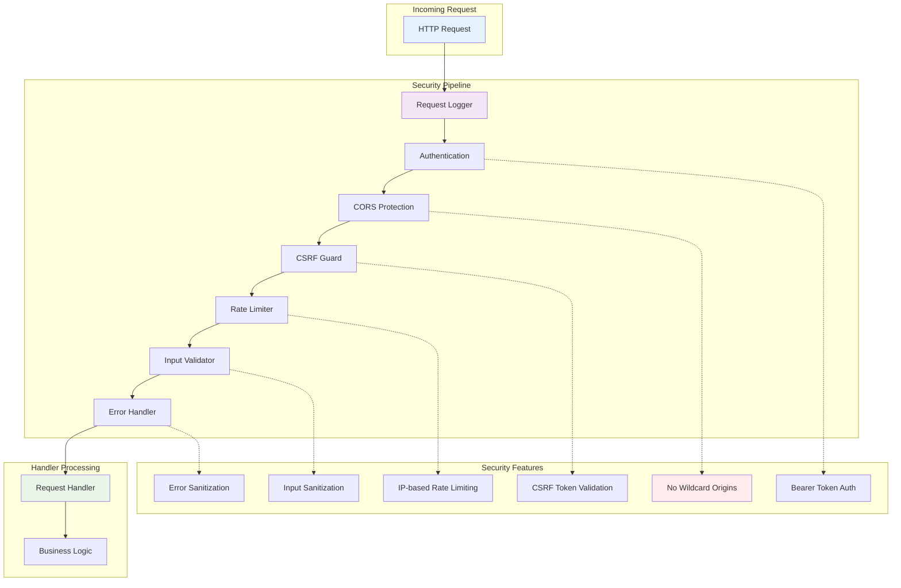
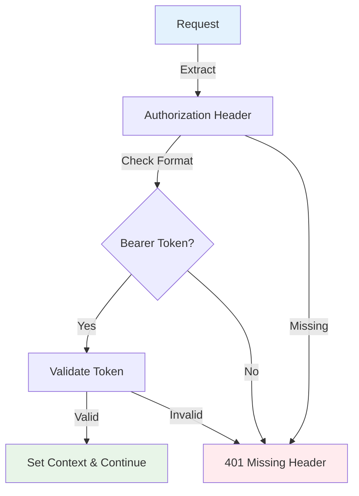
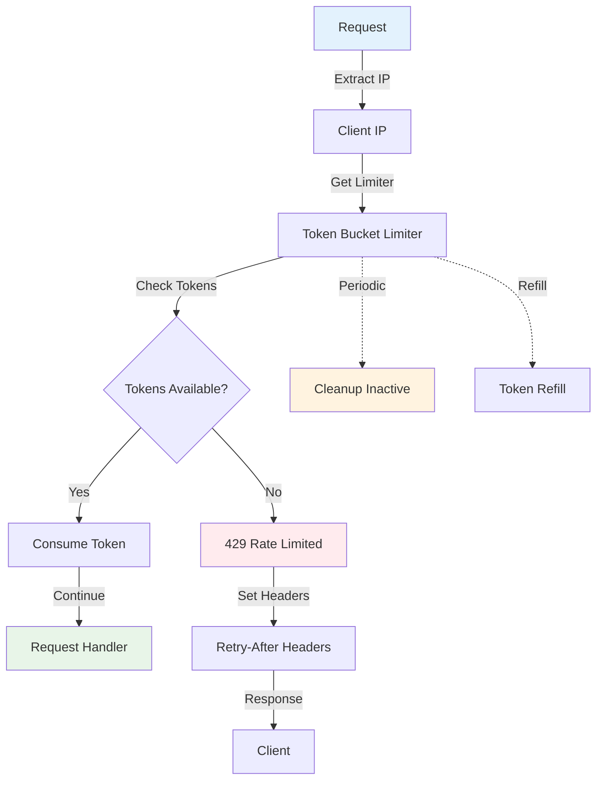

# VideoCraft HTTP Middleware - Security & Request Processing

The middleware package implements a comprehensive security-first request processing pipeline. Each middleware component addresses specific security concerns while maintaining high performance and observability.

## 🛡️ Security Architecture



## 📁 Middleware Components

### 🔐 Authentication Middleware (`auth.go`)

**Purpose**: Bearer token validation and API key authentication

#### Security Features:
- **Bearer Token Validation**: Secure API key verification
- **Development Mode Support**: Configurable auth bypass for development
- **Comprehensive Logging**: Authentication events logged for audit
- **Request Context**: Authenticated user info available to handlers

#### Implementation:

```go
func Auth(apiKey string) gin.HandlerFunc {
    return func(c *gin.Context) {
        // Development mode bypass
        if apiKey == "" {
            c.Next()
            return
        }
        
        // Extract authorization header
        authHeader := c.GetHeader("Authorization")
        if authHeader == "" {
            c.JSON(http.StatusUnauthorized, gin.H{
                "error": "Authorization header required",
                "code":  "MISSING_AUTH_HEADER",
            })
            c.Abort()
            return
        }
        
        // Validate Bearer token format
        const bearerPrefix = "Bearer "
        if !strings.HasPrefix(authHeader, bearerPrefix) {
            c.JSON(http.StatusUnauthorized, gin.H{
                "error": "Invalid authorization format",
                "code":  "INVALID_AUTH_FORMAT",
            })
            c.Abort()
            return
        }
        
        // Extract and validate token
        token := strings.TrimPrefix(authHeader, bearerPrefix)
        if token != apiKey {
            // Log authentication failure
            logger.WithFields(map[string]interface{}{
                "client_ip":      c.ClientIP(),
                "user_agent":     c.GetHeader("User-Agent"),
                "violation_type": "INVALID_API_KEY",
                "threat_level":   "HIGH",
            }).Warn("Authentication failure detected")
            
            c.JSON(http.StatusUnauthorized, gin.H{
                "error": "Invalid API key",
                "code":  "INVALID_API_KEY",
            })
            c.Abort()
            return
        }
        
        // Authentication successful
        c.Set("authenticated", true)
        c.Next()
    }
}
```

#### Data Flow:


### 🌐 CORS Middleware (`cors.go`)

**Purpose**: Cross-Origin Resource Sharing with zero wildcard policy

#### Critical Security Features:
- **Zero Wildcard Origins**: Complete elimination of `AllowOrigins: ["*"]`
- **Strict Domain Allowlisting**: Only explicitly configured domains permitted
- **Origin Validation Caching**: Performance optimization with security benefits
- **Suspicious Pattern Detection**: Automatic blocking of malicious origins
- **Comprehensive Security Logging**: Detailed audit trail with threat levels

#### Implementation:

```go
func SecureCORS(cfg *app.Config, log logger.Logger) gin.HandlerFunc {
    // Initialize origin validation cache
    validOrigins := make(map[string]bool)
    var cacheMutex sync.RWMutex
    
    // Prepare allowed origins (NO WILDCARDS)
    allowedOrigins := prepareAllowedOrigins(cfg.Security.AllowedDomains)
    
    corsConfig := cors.Config{
        AllowOrigins: allowedOrigins, // NEVER ["*"]
        AllowMethods: []string{
            "GET", "POST", "PUT", "DELETE", "OPTIONS",
        },
        AllowHeaders: []string{
            "Origin", "Content-Type", "Authorization",
            "X-Requested-With", "X-CSRF-Token", "X-Request-ID",
        },
        ExposeHeaders: []string{
            "X-Request-ID", "X-RateLimit-Remaining",
        },
        AllowCredentials: true,
        MaxAge:          3600,
        
        // Custom origin validation with caching and threat detection
        AllowOriginFunc: func(origin string) bool {
            return validateOriginWithCache(origin, cfg.Security.AllowedDomains, validOrigins, &cacheMutex, log)
        },
    }
    
    return cors.New(corsConfig)
}

func validateOriginWithCache(origin string, allowedDomains []string, cache map[string]bool, mutex *sync.RWMutex, log logger.Logger) bool {
    // Check cache first
    mutex.RLock()
    if result, exists := cache[origin]; exists {
        mutex.RUnlock()
        return result
    }
    mutex.RUnlock()
    
    // Validate origin
    isValid := isAllowedOrigin(origin, allowedDomains)
    
    // Detect suspicious patterns
    if !isValid && containsSuspiciousPatterns(origin) {
        log.WithFields(map[string]interface{}{
            "violation_type": "SUSPICIOUS_ORIGIN",
            "threat_level":   "HIGH",
            "origin":         origin,
            "patterns":       detectPatterns(origin),
        }).Error("CORS_SECURITY_VIOLATION")
    }
    
    // Update cache
    mutex.Lock()
    cache[origin] = isValid
    mutex.Unlock()
    
    return isValid
}
```

#### Security Patterns Detection:
```go
func containsSuspiciousPatterns(origin string) bool {
    suspiciousPatterns := []string{
        "localhost:",     // Development domains in production
        "127.0.0.1:",    // Local loopback
        "192.168.",      // Private network ranges
        "10.",           // Private network ranges
        "172.",          // Private network ranges
        ".onion",        // Tor domains
        "data:",         // Data URLs
        "javascript:",   // Script injection
        "file:",         // File protocol
    }
    
    origin = strings.ToLower(origin)
    for _, pattern := range suspiciousPatterns {
        if strings.Contains(origin, pattern) {
            return true
        }
    }
    return false
}
```

#### Configuration:
```yaml
security:
  allowed_domains:
    - "yourdomain.com"
    - "app.yourdomain.com"
    - "api.yourdomain.com"
  # NEVER use "*" - explicit domains only
```

### 🛡️ CSRF Middleware (`csrf.go`)

**Purpose**: Cross-Site Request Forgery protection for state-changing requests

#### Security Features:
- **Token-Based Validation**: Cryptographically secure CSRF tokens
- **State-Change Protection**: Only POST/PUT/DELETE require tokens
- **Enhanced Token Validation**: Format validation prevents injection attacks
- **Safe Method Exemption**: GET/HEAD/OPTIONS bypass validation
- **Origin Validation**: Additional layer of CSRF protection

#### Implementation:

```go
func CSRFProtection(cfg *app.Config, log logger.Logger) gin.HandlerFunc {
    return func(c *gin.Context) {
        // Skip CSRF validation for safe HTTP methods
        if isSafeMethod(c.Request.Method) {
            c.Next()
            return
        }
        
        // Extract CSRF token from header
        token := c.GetHeader("X-CSRF-Token")
        if token == "" {
            log.WithFields(map[string]interface{}{
                "violation_type": "CSRF_TOKEN_MISSING",
                "threat_level":   "HIGH",
                "client_ip":      c.ClientIP(),
                "user_agent":     c.GetHeader("User-Agent"),
                "path":           c.Request.URL.Path,
                "method":         c.Request.Method,
            }).Error("CSRF_SECURITY_VIOLATION")
            
            c.JSON(http.StatusForbidden, gin.H{
                "error": "CSRF token required",
                "code":  "CSRF_TOKEN_MISSING",
            })
            c.Abort()
            return
        }
        
        // Validate CSRF token format and signature
        if !isValidCSRFToken(token, cfg.Security.CSRFSecret) {
            log.WithFields(map[string]interface{}{
                "violation_type": "CSRF_TOKEN_INVALID",
                "threat_level":   "HIGH",
                "client_ip":      c.ClientIP(),
                "token_preview":  token[:min(8, len(token))], // Log first 8 chars only
            }).Error("CSRF_SECURITY_VIOLATION")
            
            c.JSON(http.StatusForbidden, gin.H{
                "error": "Invalid CSRF token",
                "code":  "CSRF_TOKEN_INVALID",
            })
            c.Abort()
            return
        }
        
        // Additional origin validation for CSRF protection
        if !validateCSRFOrigin(c, cfg.Security.AllowedDomains) {
            log.WithFields(map[string]interface{}{
                "violation_type": "CSRF_ORIGIN_MISMATCH",
                "threat_level":   "HIGH",
                "origin":         c.GetHeader("Origin"),
                "referer":        c.GetHeader("Referer"),
            }).Error("CSRF_SECURITY_VIOLATION")
            
            c.JSON(http.StatusForbidden, gin.H{
                "error": "Origin validation failed",
                "code":  "CSRF_ORIGIN_INVALID",
            })
            c.Abort()
            return
        }
        
        c.Next()
    }
}

func isSafeMethod(method string) bool {
    safeMethods := []string{"GET", "HEAD", "OPTIONS", "TRACE"}
    for _, safeMethod := range safeMethods {
        if method == safeMethod {
            return true
        }
    }
    return false
}
```

#### CSRF Token Management:
```go
// Generate cryptographically secure CSRF token
func generateCSRFToken(secret string) string {
    // Create token with timestamp and HMAC signature
    timestamp := time.Now().Unix()
    nonce := make([]byte, 16)
    rand.Read(nonce)
    
    data := fmt.Sprintf("%d:%x", timestamp, nonce)
    signature := hmac.New(sha256.New, []byte(secret))
    signature.Write([]byte(data))
    
    return base64.URLEncoding.EncodeToString([]byte(data + ":" + hex.EncodeToString(signature.Sum(nil))))
}

// Validate CSRF token signature and timestamp
func isValidCSRFToken(token, secret string) bool {
    decoded, err := base64.URLEncoding.DecodeString(token)
    if err != nil {
        return false
    }
    
    parts := strings.Split(string(decoded), ":")
    if len(parts) != 3 {
        return false
    }
    
    // Validate timestamp (prevent replay attacks)
    timestamp, err := strconv.ParseInt(parts[0], 10, 64)
    if err != nil || time.Since(time.Unix(timestamp, 0)) > 24*time.Hour {
        return false
    }
    
    // Validate HMAC signature
    data := parts[0] + ":" + parts[1]
    expectedSig := hmac.New(sha256.New, []byte(secret))
    expectedSig.Write([]byte(data))
    
    actualSig, err := hex.DecodeString(parts[2])
    if err != nil {
        return false
    }
    
    return hmac.Equal(expectedSig.Sum(nil), actualSig)
}
```

### 🚦 Rate Limiting Middleware (`ratelimit.go`)

**Purpose**: Traffic control and abuse prevention with IP-based limiting

#### Features:
- **Token Bucket Algorithm**: Smooth rate limiting with burst handling
- **IP-based Limiting**: Per-client rate limiting
- **Configurable Limits**: Adjustable rates and burst sizes
- **Graceful Degradation**: Informative error responses with retry information

#### Implementation:

```go
type RateLimiter struct {
    limiters map[string]*rate.Limiter
    mu       sync.RWMutex
    rate     rate.Limit
    burst    int
    cleanup  *time.Ticker
}

func NewRateLimiter(requestsPerSecond int, burst int) *RateLimiter {
    rl := &RateLimiter{
        limiters: make(map[string]*rate.Limiter),
        rate:     rate.Limit(requestsPerSecond),
        burst:    burst,
        cleanup:  time.NewTicker(1 * time.Minute),
    }
    
    // Cleanup inactive limiters periodically
    go rl.cleanupRoutine()
    
    return rl
}

func (rl *RateLimiter) getLimiter(key string) *rate.Limiter {
    rl.mu.Lock()
    defer rl.mu.Unlock()
    
    limiter, exists := rl.limiters[key]
    if !exists {
        limiter = rate.NewLimiter(rl.rate, rl.burst)
        rl.limiters[key] = limiter
    }
    
    return limiter
}

func RateLimit(rl *RateLimiter) gin.HandlerFunc {
    return func(c *gin.Context) {
        // Use client IP as rate limit key
        key := c.ClientIP()
        
        limiter := rl.getLimiter(key)
        
        if !limiter.Allow() {
            // Calculate retry after time
            retryAfter := int(1 / float64(rl.rate))
            
            // Set rate limit headers
            c.Header("X-RateLimit-Limit", fmt.Sprintf("%d", int(rl.rate)))
            c.Header("X-RateLimit-Remaining", "0")
            c.Header("X-RateLimit-Reset", fmt.Sprintf("%d", time.Now().Add(time.Duration(retryAfter)*time.Second).Unix()))
            
            c.JSON(http.StatusTooManyRequests, gin.H{
                "error":       "Rate limit exceeded",
                "code":        "RATE_LIMIT_EXCEEDED",
                "retry_after": retryAfter,
                "limit":       int(rl.rate),
            })
            c.Abort()
            return
        }
        
        // Set remaining requests header
        remaining := limiter.Tokens()
        c.Header("X-RateLimit-Remaining", fmt.Sprintf("%d", int(remaining)))
        
        c.Next()
    }
}
```

#### Rate Limiting Strategies:


### 🔍 Input Validation Middleware (`validation.go`)

**Purpose**: Request input validation and sanitization

#### Features:
- **JSON Schema Validation**: Structured data validation
- **URL Validation**: Media URL format and accessibility checks
- **Size Limits**: Request body size restrictions
- **Content-Type Validation**: Ensure proper media types
- **Path Sanitization**: Prevent path traversal attacks

#### Implementation:

```go
func InputValidation() gin.HandlerFunc {
    return func(c *gin.Context) {
        // Validate Content-Type for POST/PUT requests
        if c.Request.Method == "POST" || c.Request.Method == "PUT" {
            contentType := c.GetHeader("Content-Type")
            if !isValidContentType(contentType) {
                c.JSON(http.StatusBadRequest, gin.H{
                    "error": "Invalid Content-Type",
                    "code":  "INVALID_CONTENT_TYPE",
                })
                c.Abort()
                return
            }
        }
        
        // Check request body size
        if c.Request.ContentLength > maxRequestSize {
            c.JSON(http.StatusRequestEntityTooLarge, gin.H{
                "error": "Request too large",
                "code":  "REQUEST_TOO_LARGE",
                "max_size": maxRequestSize,
            })
            c.Abort()
            return
        }
        
        // Validate path parameters
        if err := validatePathParams(c); err != nil {
            c.JSON(http.StatusBadRequest, gin.H{
                "error": "Invalid path parameters",
                "code":  "INVALID_PATH_PARAMS",
                "details": err.Error(),
            })
            c.Abort()
            return
        }
        
        c.Next()
    }
}

func validatePathParams(c *gin.Context) error {
    // Validate UUID parameters
    for _, param := range []string{"id", "job_id", "video_id"} {
        if value := c.Param(param); value != "" {
            if !isValidUUID(value) {
                return fmt.Errorf("invalid UUID format for parameter '%s'", param)
            }
        }
    }
    
    // Validate and sanitize other parameters
    for key, values := range c.Request.URL.Query() {
        for _, value := range values {
            if containsMaliciousPatterns(value) {
                return fmt.Errorf("malicious pattern detected in parameter '%s'", key)
            }
        }
    }
    
    return nil
}
```

### 📝 Request Logger Middleware (`logger.go`)

**Purpose**: Comprehensive request logging with structured output

#### Features:
- **Structured Logging**: JSON-formatted log entries
- **Request Correlation**: Request ID tracking
- **Performance Metrics**: Response time and resource usage tracking
- **Security Event Logging**: Authentication and authorization events
- **Error Context**: Detailed error information for debugging

#### Implementation:

```go
func Logger(log logger.Logger) gin.HandlerFunc {
    return gin.LoggerWithFormatter(func(param gin.LogFormatterParams) string {
        // Build structured log entry
        logFields := map[string]interface{}{
            "timestamp":    param.TimeStamp,
            "method":       param.Method,
            "path":         param.Path,
            "status":       param.StatusCode,
            "latency_ms":   param.Latency.Milliseconds(),
            "client_ip":    param.ClientIP,
            "user_agent":   param.Request.UserAgent(),
            "request_id":   param.Request.Header.Get("X-Request-ID"),
            "content_type": param.Request.Header.Get("Content-Type"),
            "body_size":    param.BodySize,
        }
        
        // Add query parameters (sanitized)
        if queryParams := param.Request.URL.RawQuery; queryParams != "" {
            logFields["query_params"] = sanitizeQueryParams(queryParams)
        }
        
        // Add error information if present
        if param.ErrorMessage != "" {
            logFields["error"] = param.ErrorMessage
        }
        
        // Add authentication info if available
        if auth := param.Request.Header.Get("Authorization"); auth != "" {
            logFields["authenticated"] = strings.HasPrefix(auth, "Bearer ")
        }
        
        // Log with appropriate level based on status code
        switch {
        case param.StatusCode >= 500:
            log.WithFields(logFields).Error("Request completed with server error")
        case param.StatusCode >= 400:
            log.WithFields(logFields).Warn("Request completed with client error")
        case param.StatusCode >= 300:
            log.WithFields(logFields).Info("Request completed with redirect")
        default:
            log.WithFields(logFields).Info("Request completed successfully")
        }
        
        return "" // Return empty string since we're using structured logging
    })
}

func sanitizeQueryParams(params string) map[string]interface{} {
    sanitized := make(map[string]interface{})
    
    values, err := url.ParseQuery(params)
    if err != nil {
        return sanitized
    }
    
    sensitiveParams := []string{"api_key", "token", "password", "secret"}
    
    for key, valueList := range values {
        if isSensitiveParam(key, sensitiveParams) {
            sanitized[key] = "[REDACTED]"
        } else {
            sanitized[key] = valueList
        }
    }
    
    return sanitized
}
```

### ⚠️ Error Handler Middleware (`error.go`)

**Purpose**: Centralized error handling with security-aware responses

#### Features:
- **Panic Recovery**: Graceful handling of application panics
- **Error Sanitization**: Remove sensitive information from client responses
- **Structured Error Logging**: Detailed error information for debugging
- **Consistent Error Format**: Standardized error response structure

#### Implementation:

```go
func ErrorHandler(log logger.Logger) gin.HandlerFunc {
    return gin.CustomRecovery(func(c *gin.Context, recovered interface{}) {
        var err error
        
        // Convert panic to error
        switch x := recovered.(type) {
        case string:
            err = errors.New(x)
        case error:
            err = x
        default:
            err = fmt.Errorf("unknown panic: %v", x)
        }
        
        // Log the panic with full context
        log.WithFields(map[string]interface{}{
            "error":      err.Error(),
            "path":       c.Request.URL.Path,
            "method":     c.Request.Method,
            "client_ip":  c.ClientIP(),
            "user_agent": c.GetHeader("User-Agent"),
            "request_id": c.GetHeader("X-Request-ID"),
            "stack":      string(debug.Stack()),
        }).Error("Panic recovered in request handler")
        
        // Return sanitized error response
        HandleError(c, http.StatusInternalServerError, "Internal server error", err)
    })
}

func HandleError(c *gin.Context, statusCode int, message string, err error) {
    // Always log the actual error for debugging
    logger.WithError(err).WithFields(map[string]interface{}{
        "status_code": statusCode,
        "path":        c.Request.URL.Path,
        "method":      c.Request.Method,
        "client_ip":   c.ClientIP(),
        "request_id":  c.GetHeader("X-Request-ID"),
    }).Error("Request error occurred")
    
    // Build safe error response
    response := gin.H{
        "error":      message, // Safe message for client
        "code":       getErrorCode(statusCode),
        "request_id": c.GetHeader("X-Request-ID"),
        "timestamp":  time.Now(),
    }
    
    // Only include error details in development mode
    if gin.Mode() == gin.DebugMode && err != nil {
        response["details"] = err.Error()
    }
    
    // Add retry information for rate limiting
    if statusCode == http.StatusTooManyRequests {
        response["retry_after"] = 60 // seconds
    }
    
    c.JSON(statusCode, response)
}
```

## 🔧 Configuration

### Middleware Configuration

```yaml
middleware:
  auth:
    api_key: "${VIDEOCRAFT_API_KEY}"
    require_auth: true
  
  cors:
    # CRITICAL: NO WILDCARDS
    allowed_domains:
      - "yourdomain.com" 
      - "app.yourdomain.com"
    allow_credentials: true
    max_age: 3600
  
  csrf:
    secret: "${VIDEOCRAFT_CSRF_SECRET}"
    token_lifetime: "24h"
    require_origin_match: true
  
  rate_limiting:
    requests_per_second: 10
    burst_size: 20
    cleanup_interval: "1m"
  
  validation:
    max_request_size: 10485760  # 10MB
    allowed_content_types:
      - "application/json"
      - "multipart/form-data"
  
  logging:
    level: "info"
    format: "json"
    include_query_params: true
    sanitize_sensitive: true
```

## 📊 Security Monitoring

### Security Event Types

```go
type SecurityEvent struct {
    Type        string                 `json:"type"`
    ThreatLevel string                 `json:"threat_level"`
    ClientIP    string                 `json:"client_ip"`
    UserAgent   string                 `json:"user_agent"`
    Timestamp   time.Time              `json:"timestamp"`
    Details     map[string]interface{} `json:"details"`
}

const (
    // Threat levels
    ThreatLevelLow    = "LOW"
    ThreatLevelMedium = "MEDIUM"
    ThreatLevelHigh   = "HIGH"
    
    // Security event types
    EventTypeAuthFailure       = "AUTH_FAILURE"
    EventTypeCORSViolation    = "CORS_VIOLATION"
    EventTypeCSRFViolation    = "CSRF_VIOLATION"
    EventTypeRateLimitHit     = "RATE_LIMIT_HIT"
    EventTypeSuspiciousInput  = "SUSPICIOUS_INPUT"
    EventTypePathTraversal    = "PATH_TRAVERSAL"
)
```

### Monitoring Dashboard Metrics

- **Authentication Failures**: Failed API key validations
- **CORS Violations**: Blocked cross-origin requests  
- **CSRF Attempts**: Invalid token submissions
- **Rate Limit Hits**: Traffic control activations
- **Input Validation Failures**: Malicious input attempts
- **Error Rates**: Application error percentages

## 🧪 Testing Strategy

### Unit Testing
```go
func TestAuth_ValidToken(t *testing.T) {
    // Setup
    apiKey := "test-api-key"
    middleware := Auth(apiKey)
    
    // Create test context
    w := httptest.NewRecorder()
    c, _ := gin.CreateTestContext(w)
    c.Request = httptest.NewRequest("GET", "/", nil)
    c.Request.Header.Set("Authorization", "Bearer "+apiKey)
    
    // Execute
    middleware(c)
    
    // Assert
    assert.False(t, c.IsAborted())
    assert.True(t, c.GetBool("authenticated"))
}
```

### Security Testing
```go
func TestCORS_NoWildcardOrigins(t *testing.T) {
    cfg := &app.Config{
        Security: app.SecurityConfig{
            AllowedDomains: []string{"example.com"},
        },
    }
    
    middleware := SecureCORS(cfg, logger.NewNoop())
    
    // Test that wildcard origins are rejected
    w := httptest.NewRecorder()
    c, _ := gin.CreateTestContext(w)
    c.Request = httptest.NewRequest("OPTIONS", "/", nil)
    c.Request.Header.Set("Origin", "*")
    
    middleware(c)
    
    // Should be blocked
    assert.Equal(t, http.StatusForbidden, w.Code)
}
```

---

**Related Documentation:**
- [HTTP Handler Implementation](../handlers/CLAUDE.md)
- [API Security Configuration](../../../../docs/security/overview.md)
- [Request Models & Validation](../../models/CLAUDE.md)