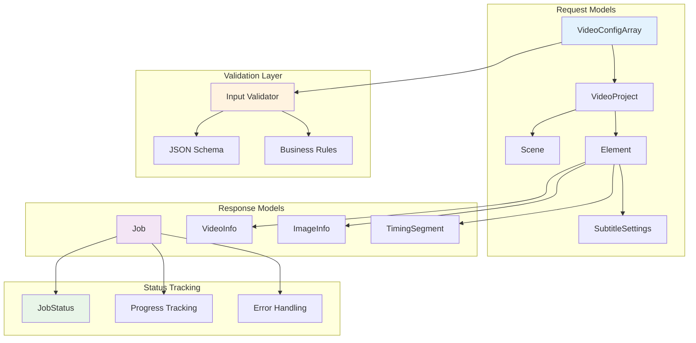
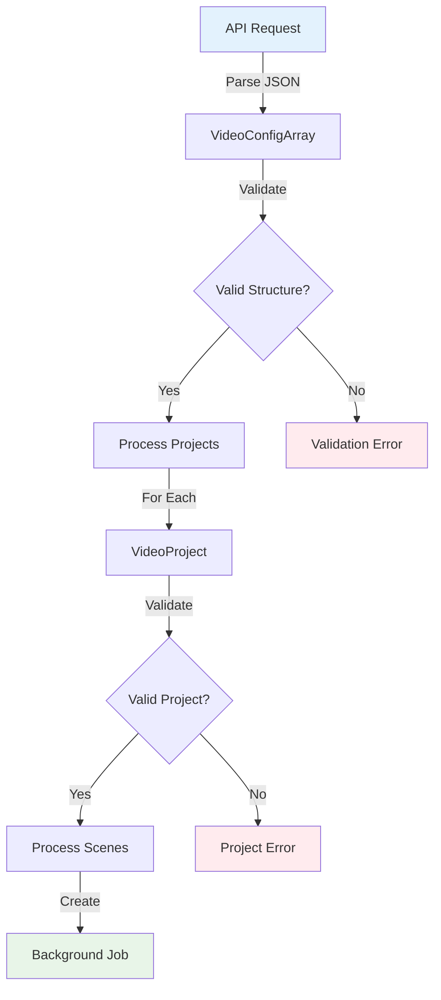
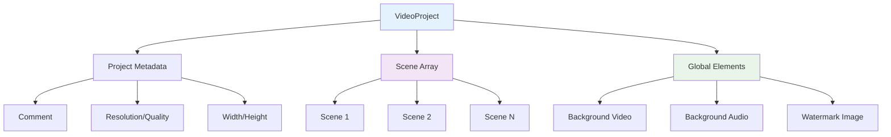
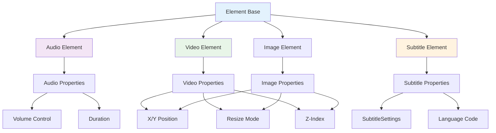
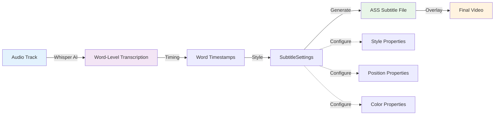
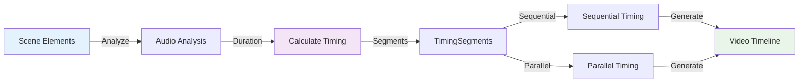

# VideoCraft API Models - Data Structures & Validation

The models package defines the core data structures used throughout VideoCraft's API layer. These models handle request/response serialization, validation, and provide type safety for the entire application.

## 🏗️ Model Architecture



## 📊 Core Data Models

### Video Configuration Array (`VideoConfigArray`)

**Purpose**: Root container for video generation requests supporting multiple projects

```go
type VideoConfigArray []VideoProject

func (vca VideoConfigArray) Validate() error {
    if len(vca) == 0 {
        return errors.New("at least one video project is required")
    }
    
    for i, project := range vca {
        if err := project.Validate(); err != nil {
            return fmt.Errorf("project %d: %w", i, err)
        }
    }
    
    return nil
}
```

#### Data Flow:


### Video Project (`VideoProject`)

**Purpose**: Individual video project configuration with scenes and global elements

```go
type VideoProject struct {
    Comment    string    `json:"comment,omitempty"`
    Resolution string    `json:"resolution,omitempty"`    // "1920x1080", "1280x720"
    Quality    string    `json:"quality,omitempty"`       // "high", "medium", "low"
    Width      int       `json:"width,omitempty"`         // Custom width
    Height     int       `json:"height,omitempty"`        // Custom height
    Scenes     []Scene   `json:"scenes,omitempty"`        // Scene-based content
    Elements   []Element `json:"elements,omitempty"`      // Global background elements
}

func (vp VideoProject) Validate() error {
    // Validate resolution settings
    if vp.Width < 0 || vp.Height < 0 {
        return errors.New("width and height must be non-negative")
    }
    
    if vp.Resolution != "" && !isValidResolution(vp.Resolution) {
        return errors.New("invalid resolution format")
    }
    
    // Validate scenes
    for i, scene := range vp.Scenes {
        if err := scene.Validate(); err != nil {
            return fmt.Errorf("scene %d (%s): %w", i, scene.ID, err)
        }
    }
    
    // Validate global elements
    for i, element := range vp.Elements {
        if err := element.Validate(); err != nil {
            return fmt.Errorf("global element %d: %w", i, err)
        }
    }
    
    return nil
}
```

#### Project Structure:


### Scene (`Scene`)

**Purpose**: Individual scene within a video project containing timed elements

```go
type Scene struct {
    ID              string    `json:"id" binding:"required"`
    BackgroundColor string    `json:"background-color,omitempty"`
    Elements        []Element `json:"elements,omitempty"`
}

func (s Scene) Validate() error {
    if s.ID == "" {
        return errors.New("scene ID is required")
    }
    
    // Validate ID format (alphanumeric with dashes/underscores)
    if !isValidSceneID(s.ID) {
        return errors.New("scene ID contains invalid characters")
    }
    
    // Validate background color format if provided
    if s.BackgroundColor != "" && !isValidColor(s.BackgroundColor) {
        return errors.New("invalid background color format")
    }
    
    // Validate scene elements
    for i, element := range s.Elements {
        if err := element.Validate(); err != nil {
            return fmt.Errorf("element %d: %w", i, err)
        }
    }
    
    return nil
}
```

### Element (`Element`)

**Purpose**: Individual media element (audio, video, image, subtitle) with positioning and timing

```go
type Element struct {
    Type string `json:"type" binding:"required"`        // "audio", "video", "image", "subtitles"
    Src  string `json:"src,omitempty"`                  // URL or file path
    ID   string `json:"id,omitempty"`                   // Unique identifier
    
    // Positioning
    X int `json:"x,omitempty"`                          // X coordinate
    Y int `json:"y,omitempty"`                          // Y coordinate
    
    // Visual properties
    ZIndex   int     `json:"z-index,omitempty"`         // Layer order
    Volume   float64 `json:"volume,omitempty"`          // Audio volume (0.0-1.0)
    Resize   string  `json:"resize,omitempty"`          // "fit", "fill", "stretch"
    Duration float64 `json:"duration,omitempty"`        // Duration in seconds
    
    // Subtitle-specific properties
    Settings SubtitleSettings `json:"settings,omitempty"`
    Language string           `json:"language,omitempty"`  // Language code for subtitles
}

func (e Element) Validate() error {
    if e.Type == "" {
        return errors.New("element type is required")
    }
    
    // Validate element type
    validTypes := []string{"video", "audio", "image", "subtitles"}
    if !contains(validTypes, e.Type) {
        return fmt.Errorf("unsupported element type: %s", e.Type)
    }
    
    // Type-specific validation
    switch e.Type {
    case "video", "audio", "image":
        if e.Src == "" {
            return fmt.Errorf("src is required for %s elements", e.Type)
        }
        if err := validateMediaURL(e.Src); err != nil {
            return fmt.Errorf("invalid src URL: %w", err)
        }
    case "subtitles":
        // Subtitles don't require src (generated from audio)
        if e.Language != "" && !isValidLanguageCode(e.Language) {
            return errors.New("invalid language code")
        }
    }
    
    // Validate numeric properties
    if e.Duration < 0 {
        return errors.New("duration cannot be negative")
    }
    
    if e.Volume < 0 || e.Volume > 1 {
        return errors.New("volume must be between 0.0 and 1.0")
    }
    
    // Validate resize mode
    if e.Resize != "" {
        validResize := []string{"fit", "fill", "stretch", "crop"}
        if !contains(validResize, e.Resize) {
            return fmt.Errorf("invalid resize mode: %s", e.Resize)
        }
    }
    
    return nil
}
```

#### Element Type Hierarchy:


### Subtitle Settings (`SubtitleSettings`)

**Purpose**: Comprehensive subtitle styling and positioning configuration

```go
type SubtitleSettings struct {
    Style        string `json:"style,omitempty"`         // "word-by-word", "line-by-line"
    FontFamily   string `json:"font-family,omitempty"`   // Font name
    FontSize     int    `json:"font-size,omitempty"`     // Font size in pixels
    WordColor    string `json:"word-color,omitempty"`    // Active word color
    LineColor    string `json:"line-color,omitempty"`    // Text line color
    ShadowColor  string `json:"shadow-color,omitempty"`  // Text shadow color
    ShadowOffset int    `json:"shadow-offset,omitempty"` // Shadow offset in pixels
    BoxColor     string `json:"box-color,omitempty"`     // Background box color
    Position     string `json:"position,omitempty"`      // "bottom", "top", "center"
    OutlineColor string `json:"outline-color,omitempty"` // Text outline color
    OutlineWidth int    `json:"outline-width,omitempty"` // Outline width in pixels
}
```

#### Progressive Subtitle Innovation:


## 🔄 Job Management Models

### Job (`Job`)

**Purpose**: Represents an asynchronous video generation job with status tracking

```go
type Job struct {
    ID          string           `json:"id"`                        // UUID
    Status      JobStatus        `json:"status"`                    // Current status
    Config      VideoConfigArray `json:"config"`                    // Original request
    VideoID     string           `json:"video_id,omitempty"`        // Generated video ID
    Error       string           `json:"error,omitempty"`           // Error message
    Progress    int              `json:"progress"`                  // Progress percentage (0-100)
    CreatedAt   time.Time        `json:"created_at"`                // Creation timestamp
    UpdatedAt   time.Time        `json:"updated_at"`                // Last update timestamp
    CompletedAt *time.Time       `json:"completed_at,omitempty"`    // Completion timestamp
}

type JobStatus string

const (
    JobStatusPending    JobStatus = "pending"     // Queued for processing
    JobStatusProcessing JobStatus = "processing"  // Currently being processed
    JobStatusCompleted  JobStatus = "completed"   // Successfully completed
    JobStatusFailed     JobStatus = "failed"      // Failed with error
    JobStatusCancelled  JobStatus = "cancelled"   // Cancelled by user
)
```

#### Job Lifecycle:
```mermaid
stateDiagram-v2
    [*] --> Pending : Create Job
    Pending --> Processing : Worker Picks Up
    Processing --> Completed : Success
    Processing --> Failed : Error
    Pending --> Cancelled : User Cancel
    Processing --> Cancelled : User Cancel
    
    Completed --> [*]
    Failed --> [*]
    Cancelled --> [*]
    
    note right of Processing : Progress: 0-100%
    note right of Failed : Error message logged
```

### Media Information Models

#### Video Info (`VideoInfo`)

```go
type VideoInfo struct {
    ID        string  `json:"id"`                    // Unique identifier
    Filename  string  `json:"filename"`              // Original filename
    Size      int64   `json:"size"`                  // File size in bytes
    CreatedAt string  `json:"created_at"`            // Creation timestamp
    URL       string  `json:"url,omitempty"`         // Source URL
    Width     int     `json:"width"`                 // Video width in pixels
    Height    int     `json:"height"`                // Video height in pixels
    Duration  float64 `json:"duration"`              // Duration in seconds
    Format    string  `json:"format"`                // Video format (mp4, avi, etc.)
    Codec     string  `json:"codec,omitempty"`       // Video codec
}

// GetDuration implements the MediaInfo interface for job service
func (vi *VideoInfo) GetDuration() float64 {
    return vi.Duration
}
```

#### Image Info (`ImageInfo`)

```go
type ImageInfo struct {
    ID            string `json:"id,omitempty"`            // Unique identifier
    Filename      string `json:"filename,omitempty"`      // Original filename
    URL           string `json:"url,omitempty"`           // Source URL
    Width         int    `json:"width"`                   // Image width in pixels
    Height        int    `json:"height"`                  // Image height in pixels
    Format        string `json:"format"`                  // Image format (jpg, png, etc.)
    Size          int64  `json:"size"`                    // File size in bytes
    Path          string `json:"path,omitempty"`          // Local file path
    ProcessedPath string `json:"processed_path,omitempty"` // Processed file path
}
```

### Timing Segment (`TimingSegment`)

**Purpose**: Represents a timing segment for video generation with audio synchronization

```go
type TimingSegment struct {
    StartTime  float64 `json:"start_time"`           // Start time in seconds
    EndTime    float64 `json:"end_time"`             // End time in seconds
    AudioFile  string  `json:"audio_file"`           // Audio file URL
    Text       string  `json:"text,omitempty"`       // Display text
    Transcript string  `json:"transcript,omitempty"` // Transcribed text
}
```

#### Timing Calculation:


## 🔍 Validation Framework

### Input Validation

```go
func validateMediaURL(url string) error {
    // Basic URL format validation
    if url == "" {
        return errors.New("URL cannot be empty")
    }
    
    // Parse URL
    parsedURL, err := neturl.Parse(url)
    if err != nil {
        return fmt.Errorf("invalid URL format: %w", err)
    }
    
    // Validate scheme
    if parsedURL.Scheme != "http" && parsedURL.Scheme != "https" {
        return errors.New("only HTTP and HTTPS protocols are allowed")
    }
    
    // Validate host
    if parsedURL.Host == "" {
        return errors.New("URL must have a valid host")
    }
    
    // Check for suspicious patterns
    if containsSuspiciousPatterns(url) {
        return errors.New("URL contains suspicious patterns")
    }
    
    return nil
}

func isValidResolution(resolution string) bool {
    validResolutions := []string{
        "1920x1080", "1280x720", "1366x768", "1600x900",
        "1024x768", "800x600", "640x480",
    }
    
    return contains(validResolutions, resolution)
}

func isValidColor(color string) bool {
    // Support hex colors (#RRGGBB, #RGB)
    if strings.HasPrefix(color, "#") {
        hex := color[1:]
        if len(hex) == 3 || len(hex) == 6 {
            _, err := strconv.ParseUint(hex, 16, 32)
            return err == nil
        }
    }
    
    // Support named colors
    namedColors := []string{
        "red", "green", "blue", "yellow", "orange", "purple",
        "black", "white", "gray", "transparent",
    }
    
    return contains(namedColors, strings.ToLower(color))
}
```

### Business Rules Validation

```go
func (vca VideoConfigArray) ValidateBusinessRules() error {
    // Check total duration limits
    totalDuration := 0.0
    for _, project := range vca {
        for _, scene := range project.Scenes {
            for _, element := range scene.Elements {
                if element.Type == "audio" {
                    totalDuration += element.Duration
                }
            }
        }
    }
    
    if totalDuration > maxVideoDuration {
        return fmt.Errorf("total video duration %.2fs exceeds maximum allowed %.2fs", 
            totalDuration, maxVideoDuration)
    }
    
    // Check resource limits
    elementCount := 0
    for _, project := range vca {
        elementCount += len(project.Elements)
        for _, scene := range project.Scenes {
            elementCount += len(scene.Elements)
        }
    }
    
    if elementCount > maxElementsPerVideo {
        return fmt.Errorf("total element count %d exceeds maximum allowed %d", 
            elementCount, maxElementsPerVideo)
    }
    
    return nil
}
```

## 📊 Serialization & Deserialization

### JSON Handling

```go
// Custom JSON marshaling for sensitive fields
func (j Job) MarshalJSON() ([]byte, error) {
    type Alias Job
    return json.Marshal(&struct {
        *Alias
        Config VideoConfigArray `json:"config,omitempty"` // Omit large config in list views
    }{
        Alias: (*Alias)(&j),
        Config: j.Config,
    })
}

// Custom JSON unmarshaling with validation
func (e *Element) UnmarshalJSON(data []byte) error {
    type Alias Element
    aux := &struct {
        *Alias
    }{
        Alias: (*Alias)(e),
    }
    
    if err := json.Unmarshal(data, &aux); err != nil {
        return err
    }
    
    // Post-unmarshal validation
    return e.Validate()
}
```

### Type Safety

```go
// Interface for media duration retrieval
type MediaInfo interface {
    GetDuration() float64
}

// Ensure all media types implement the interface
var _ MediaInfo = (*VideoInfo)(nil)
var _ MediaInfo = (*audio.AudioInfo)(nil)

// Type-safe element processing
func processElement(element Element) (MediaInfo, error) {
    switch element.Type {
    case "video":
        return analyzeVideo(element.Src)
    case "audio":
        return analyzeAudio(element.Src)
    case "image":
        return analyzeImage(element.Src)
    default:
        return nil, fmt.Errorf("unsupported element type: %s", element.Type)
    }
}
```

## 🔧 Configuration

### Model Configuration

```yaml
validation:
  max_video_duration: 600      # 10 minutes
  max_elements_per_video: 100
  max_scenes_per_project: 50
  max_projects_per_request: 10
  
  url_validation:
    allowed_schemes: ["http", "https"]
    max_url_length: 2048
    timeout: 30s
    
  media_validation:
    max_file_size: 104857600    # 100MB
    allowed_video_formats: ["mp4", "avi", "mov", "webm"]
    allowed_audio_formats: ["mp3", "wav", "aac", "ogg"]
    allowed_image_formats: ["jpg", "jpeg", "png", "webp"]
    
  subtitle_validation:
    max_font_size: 72
    min_font_size: 8
    max_outline_width: 10
```

## 🧪 Testing

### Model Testing

```go
func TestVideoProject_Validate(t *testing.T) {
    tests := []struct {
        name    string
        project VideoProject
        wantErr bool
    }{
        {
            name: "valid project",
            project: VideoProject{
                Resolution: "1920x1080",
                Scenes: []Scene{
                    {
                        ID: "scene1",
                        Elements: []Element{
                            {
                                Type: "audio",
                                Src:  "https://example.com/audio.mp3",
                                Duration: 10.0,
                            },
                        },
                    },
                },
            },
            wantErr: false,
        },
        {
            name: "invalid resolution",
            project: VideoProject{
                Resolution: "invalid",
            },
            wantErr: true,
        },
    }
    
    for _, tt := range tests {
        t.Run(tt.name, func(t *testing.T) {
            err := tt.project.Validate()
            if (err != nil) != tt.wantErr {
                t.Errorf("VideoProject.Validate() error = %v, wantErr %v", err, tt.wantErr)
            }
        })
    }
}
```

### Validation Testing

```go
func TestElement_Validate_SecurityCases(t *testing.T) {
    tests := []struct {
        name    string
        element Element
        wantErr bool
    }{
        {
            name: "suspicious URL blocked",
            element: Element{
                Type: "audio",
                Src:  "javascript:alert('xss')",
            },
            wantErr: true,
        },
        {
            name: "file protocol blocked",
            element: Element{
                Type: "image",
                Src:  "file:///etc/passwd",
            },
            wantErr: true,
        },
    }
    
    for _, tt := range tests {
        t.Run(tt.name, func(t *testing.T) {
            err := tt.element.Validate()
            if (err != nil) != tt.wantErr {
                t.Errorf("Element.Validate() error = %v, wantErr %v", err, tt.wantErr)
            }
        })
    }
}
```

---

**Related Documentation:**
- [HTTP Handler Implementation](../http/handlers/CLAUDE.md)
- [Input Validation Middleware](../http/middleware/CLAUDE.md)
- [Core Business Logic Models](../../core/CLAUDE.md)