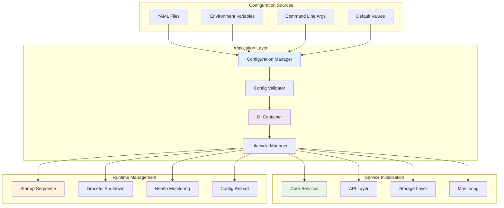
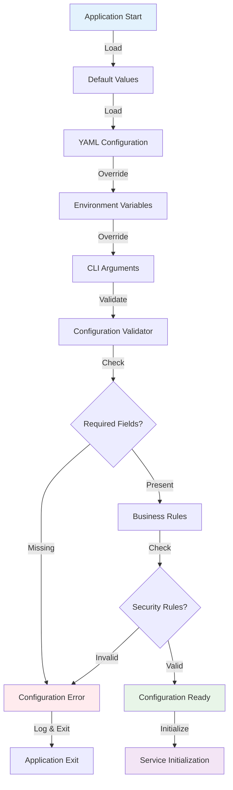

# VideoCraft Application Layer - Configuration & Dependency Management

The application layer provides centralized configuration management and dependency injection infrastructure. This layer bridges the gap between external configuration sources and internal business logic.

## 🏗️ Architecture Overview



## 📁 Package Structure

```
internal/app/
├── config.go          # Configuration management and validation
├── container/          # Dependency injection container (planned)
└── lifecycle.go        # Application lifecycle management (planned)
```

## ⚙️ Configuration Management (`config.go`)

### Configuration Structure

```go
type Config struct {
    // Application settings
    App        AppConfig        `yaml:"app"`
    
    // HTTP server configuration
    HTTP       HTTPConfig       `yaml:"http"`
    
    // Security configuration
    Security   SecurityConfig   `yaml:"security"`
    
    // Authentication settings
    Auth       AuthConfig       `yaml:"auth"`
    
    // Job processing configuration
    Job        JobConfig        `yaml:"job"`
    
    // Storage configuration
    Storage    StorageConfig    `yaml:"storage"`
    
    // FFmpeg configuration
    FFmpeg     FFmpegConfig     `yaml:"ffmpeg"`
    
    // Whisper AI configuration
    Whisper    WhisperConfig    `yaml:"whisper"`
    
    // Logging configuration
    Logging    LoggingConfig    `yaml:"logging"`
    
    // Development settings
    Debug      bool             `yaml:"debug"`
}
```

### Application Configuration

```go
type AppConfig struct {
    Name        string `yaml:"name" default:"videocraft"`
    Version     string `yaml:"version" default:"0.0.1"`
    Environment string `yaml:"environment" default:"development"`
    DataDir     string `yaml:"data_dir" default:"./data"`
    TempDir     string `yaml:"temp_dir" default:"./temp"`
}
```

### HTTP Server Configuration

```go
type HTTPConfig struct {
    Host               string        `yaml:"host" default:"0.0.0.0"`
    Port               int           `yaml:"port" default:"8080"`
    ReadTimeout        time.Duration `yaml:"read_timeout" default:"30s"`
    WriteTimeout       time.Duration `yaml:"write_timeout" default:"30s"`
    IdleTimeout        time.Duration `yaml:"idle_timeout" default:"60s"`
    MaxHeaderBytes     int           `yaml:"max_header_bytes" default:"1048576"`
    ShutdownTimeout    time.Duration `yaml:"shutdown_timeout" default:"30s"`
    EnableCompression  bool          `yaml:"enable_compression" default:"true"`
    EnableKeepAlive    bool          `yaml:"enable_keep_alive" default:"true"`
}
```

### Security Configuration

```go
type SecurityConfig struct {
    // CORS configuration - ZERO WILDCARD POLICY
    AllowedDomains   []string      `yaml:"allowed_domains" required:"true"`
    
    // CSRF protection
    CSRFSecret       string        `yaml:"csrf_secret" required:"true"`
    CSRFTokenLength  int           `yaml:"csrf_token_length" default:"32"`
    
    // Rate limiting
    RateLimit        int           `yaml:"rate_limit" default:"100"`
    RateLimitWindow  time.Duration `yaml:"rate_limit_window" default:"1m"`
    
    // Request validation
    MaxRequestSize   int64         `yaml:"max_request_size" default:"10485760"`
    RequestTimeout   time.Duration `yaml:"request_timeout" default:"30s"`
    
    // Input validation
    EnableValidation bool          `yaml:"enable_validation" default:"true"`
    StrictMode       bool          `yaml:"strict_mode" default:"true"`
}
```

### Job Processing Configuration

```go
type JobConfig struct {
    Workers        int           `yaml:"workers" default:"2"`
    QueueSize      int           `yaml:"queue_size" default:"100"`
    ProcessTimeout time.Duration `yaml:"process_timeout" default:"30m"`
    RetryAttempts  int           `yaml:"retry_attempts" default:"3"`
    RetryDelay     time.Duration `yaml:"retry_delay" default:"5s"`
    
    // Resource limits
    MaxConcurrent  int           `yaml:"max_concurrent" default:"5"`
    MemoryLimit    int64         `yaml:"memory_limit" default:"2147483648"` // 2GB
    CPULimit       float64       `yaml:"cpu_limit" default:"1.0"`
}
```

### Storage Configuration

```go
type StorageConfig struct {
    Type           string `yaml:"type" default:"filesystem"`
    BasePath       string `yaml:"base_path" default:"./generated_videos"`
    TempDir        string `yaml:"temp_dir" default:"./temp"`
    MaxFileSize    int64  `yaml:"max_file_size" default:"104857600"` // 100MB
    CleanupEnabled bool   `yaml:"cleanup_enabled" default:"true"`
    CleanupAge     time.Duration `yaml:"cleanup_age" default:"168h"` // 7 days
    
    // Disk space management
    MinFreeSpace   int64  `yaml:"min_free_space" default:"1073741824"` // 1GB
    MaxDiskUsage   int64  `yaml:"max_disk_usage" default:"10737418240"` // 10GB
}
```

### FFmpeg Configuration

```go
type FFmpegConfig struct {
    BinaryPath     string   `yaml:"binary_path" default:"ffmpeg"`
    ProbePath      string   `yaml:"probe_path" default:"ffprobe"`
    Threads        int      `yaml:"threads" default:"0"` // Auto-detect
    HardwareAccel  string   `yaml:"hardware_accel" default:""`
    
    // Security settings
    AllowedCodecs  []string `yaml:"allowed_codecs" default:"[\"libx264\",\"aac\",\"libmp3lame\"]"`
    AllowedFormats []string `yaml:"allowed_formats" default:"[\"mp4\",\"avi\",\"mov\"]"`
    
    // Performance settings
    Preset         string   `yaml:"preset" default:"medium"`
    CRF            int      `yaml:"crf" default:"23"`
    MaxBitrate     string   `yaml:"max_bitrate" default:"5M"`
}
```

### Whisper AI Configuration

```go
type WhisperConfig struct {
    PythonPath     string        `yaml:"python_path" default:"python3"`
    ScriptPath     string        `yaml:"script_path" default:"./scripts/whisper_daemon.py"`
    Model          string        `yaml:"model" default:"base"`
    Language       string        `yaml:"language" default:"auto"`
    
    // Daemon settings
    StartupTimeout time.Duration `yaml:"startup_timeout" default:"30s"`
    ProcessTimeout time.Duration `yaml:"process_timeout" default:"300s"`
    MaxRetries     int           `yaml:"max_retries" default:"3"`
    
    // Resource limits
    MemoryLimit    int64         `yaml:"memory_limit" default:"1073741824"` // 1GB
    CPULimit       float64       `yaml:"cpu_limit" default:"2.0"`
}
```

## 🔧 Configuration Loading & Validation

### Configuration Loading Pipeline



### Configuration Loader

```go
func LoadConfig(configPath string) (*Config, error) {
    // Start with default values
    config := &Config{}
    setDefaults(config)
    
    // Load from YAML file if provided
    if configPath != "" {
        if err := loadFromYAML(config, configPath); err != nil {
            return nil, fmt.Errorf("failed to load YAML config: %w", err)
        }
    }
    
    // Override with environment variables
    if err := loadFromEnv(config); err != nil {
        return nil, fmt.Errorf("failed to load environment config: %w", err)
    }
    
    // Validate configuration
    if err := config.Validate(); err != nil {
        return nil, fmt.Errorf("configuration validation failed: %w", err)
    }
    
    return config, nil
}

func setDefaults(config *Config) {
    // Use reflection to set struct tag defaults
    v := reflect.ValueOf(config).Elem()
    setStructDefaults(v)
}

func loadFromYAML(config *Config, path string) error {
    data, err := os.ReadFile(path)
    if err != nil {
        return err
    }
    
    return yaml.Unmarshal(data, config)
}

func loadFromEnv(config *Config) error {
    // Use reflection to map environment variables to struct fields
    v := reflect.ValueOf(config).Elem()
    return mapEnvToStruct(v, "VIDEOCRAFT")
}
```

### Configuration Validation

```go
func (c *Config) Validate() error {
    var errors []string
    
    // Validate required fields
    if len(c.Security.AllowedDomains) == 0 {
        errors = append(errors, "security.allowed_domains is required (no wildcards allowed)")
    }
    
    if c.Security.CSRFSecret == "" {
        errors = append(errors, "security.csrf_secret is required")
    }
    
    if c.Auth.APIKey == "" && c.App.Environment == "production" {
        errors = append(errors, "auth.api_key is required in production")
    }
    
    // Validate security settings
    if err := c.validateSecurityConfig(); err != nil {
        errors = append(errors, fmt.Sprintf("security validation failed: %v", err))
    }
    
    // Validate business rules
    if err := c.validateBusinessRules(); err != nil {
        errors = append(errors, fmt.Sprintf("business rule validation failed: %v", err))
    }
    
    // Validate resource limits
    if err := c.validateResourceLimits(); err != nil {
        errors = append(errors, fmt.Sprintf("resource limit validation failed: %v", err))
    }
    
    if len(errors) > 0 {
        return fmt.Errorf("configuration validation errors:\n- %s", strings.Join(errors, "\n- "))
    }
    
    return nil
}

func (c *Config) validateSecurityConfig() error {
    // Validate CORS domains (NO WILDCARDS)
    for _, domain := range c.Security.AllowedDomains {
        if domain == "*" {
            return errors.New("wildcard origins (*) are not allowed for security reasons")
        }
        
        if !isValidDomain(domain) {
            return fmt.Errorf("invalid domain format: %s", domain)
        }
    }
    
    // Validate CSRF secret strength
    if len(c.Security.CSRFSecret) < 32 {
        return errors.New("csrf_secret must be at least 32 characters long")
    }
    
    // Validate rate limiting
    if c.Security.RateLimit <= 0 {
        return errors.New("rate_limit must be positive")
    }
    
    return nil
}
```

## 🔄 Environment Variable Mapping

### Environment Variable Configuration

```bash
# Application settings
export VIDEOCRAFT_APP_NAME="videocraft"
export VIDEOCRAFT_APP_ENVIRONMENT="production"
export VIDEOCRAFT_DEBUG="false"

# HTTP server
export VIDEOCRAFT_HTTP_HOST="0.0.0.0"
export VIDEOCRAFT_HTTP_PORT="8080"

# Security (CRITICAL)
export VIDEOCRAFT_SECURITY_ALLOWED_DOMAINS="yourdomain.com,api.yourdomain.com"
export VIDEOCRAFT_SECURITY_CSRF_SECRET="your-secure-32-char-secret-here"

# Authentication
export VIDEOCRAFT_AUTH_API_KEY="your-secure-api-key-here"

# Job processing
export VIDEOCRAFT_JOB_WORKERS="4"
export VIDEOCRAFT_JOB_QUEUE_SIZE="200"

# Storage
export VIDEOCRAFT_STORAGE_BASE_PATH="/var/lib/videocraft/videos"
export VIDEOCRAFT_STORAGE_TEMP_DIR="/tmp/videocraft"

# FFmpeg
export VIDEOCRAFT_FFMPEG_BINARY_PATH="/usr/bin/ffmpeg"
export VIDEOCRAFT_FFMPEG_PROBE_PATH="/usr/bin/ffprobe"

# Whisper AI
export VIDEOCRAFT_WHISPER_MODEL="small"
export VIDEOCRAFT_WHISPER_LANGUAGE="en"
```

### Environment Variable Mapping

```go
func mapEnvToStruct(v reflect.Value, prefix string) error {
    t := v.Type()
    
    for i := 0; i < v.NumField(); i++ {
        field := v.Field(i)
        fieldType := t.Field(i)
        
        // Build environment variable name
        envName := buildEnvName(prefix, fieldType.Name)
        
        // Get environment value
        envValue := os.Getenv(envName)
        if envValue == "" {
            continue
        }
        
        // Set field value based on type
        if err := setFieldFromEnv(field, envValue); err != nil {
            return fmt.Errorf("failed to set field %s from env %s: %w", 
                fieldType.Name, envName, err)
        }
    }
    
    return nil
}

func buildEnvName(prefix, fieldName string) string {
    // Convert CamelCase to UPPER_SNAKE_CASE
    var result strings.Builder
    result.WriteString(prefix)
    result.WriteString("_")
    
    for i, r := range fieldName {
        if i > 0 && unicode.IsUpper(r) {
            result.WriteString("_")
        }
        result.WriteRune(unicode.ToUpper(r))
    }
    
    return result.String()
}
```

## 🏗️ Dependency Injection Container (Planned)

### Container Interface

```go
// Future implementation in container/ package
type Container interface {
    // Service registration
    Register(name string, factory ServiceFactory) error
    RegisterSingleton(name string, factory ServiceFactory) error
    
    // Service resolution
    Resolve(name string) (interface{}, error)
    MustResolve(name string) interface{}
    
    // Lifecycle management
    Initialize() error
    Shutdown() error
    
    // Health checking
    HealthCheck() error
}

type ServiceFactory func(c Container) (interface{}, error)

// Service registration example
func (c *container) RegisterServices(cfg *Config) error {
    // Register logger
    c.RegisterSingleton("logger", func(c Container) (interface{}, error) {
        return logger.New(cfg.Logging), nil
    })
    
    // Register storage service
    c.RegisterSingleton("storage", func(c Container) (interface{}, error) {
        return filesystem.NewService(cfg.Storage, c.MustResolve("logger").(logger.Logger)), nil
    })
    
    // Register video service with dependencies
    c.RegisterSingleton("video", func(c Container) (interface{}, error) {
        return video.NewService(
            cfg.FFmpeg,
            c.MustResolve("logger").(logger.Logger),
        ), nil
    })
    
    return nil
}
```

## 📊 Configuration Monitoring

### Configuration Health Checks

```go
func (c *Config) HealthCheck() error {
    checks := []func() error{
        c.checkStoragePaths,
        c.checkFFmpegBinaries,
        c.checkSecuritySettings,
        c.checkResourceLimits,
    }
    
    var errors []string
    for _, check := range checks {
        if err := check(); err != nil {
            errors = append(errors, err.Error())
        }
    }
    
    if len(errors) > 0 {
        return fmt.Errorf("configuration health check failed:\n- %s", 
            strings.Join(errors, "\n- "))
    }
    
    return nil
}

func (c *Config) checkStoragePaths() error {
    paths := []string{
        c.Storage.BasePath,
        c.Storage.TempDir,
        c.App.DataDir,
    }
    
    for _, path := range paths {
        if err := ensureDirectoryExists(path); err != nil {
            return fmt.Errorf("storage path check failed for %s: %w", path, err)
        }
    }
    
    return nil
}

func (c *Config) checkFFmpegBinaries() error {
    binaries := map[string]string{
        "ffmpeg":  c.FFmpeg.BinaryPath,
        "ffprobe": c.FFmpeg.ProbePath,
    }
    
    for name, path := range binaries {
        if _, err := exec.LookPath(path); err != nil {
            return fmt.Errorf("%s binary not found at %s: %w", name, path, err)
        }
    }
    
    return nil
}
```

### Configuration Metrics

```go
type ConfigMetrics struct {
    LoadTime       time.Duration `json:"load_time"`
    ValidationTime time.Duration `json:"validation_time"`
    ReloadCount    int64         `json:"reload_count"`
    LastReload     time.Time     `json:"last_reload"`
    ErrorCount     int64         `json:"error_count"`
    HealthStatus   string        `json:"health_status"`
}

func (c *Config) GetMetrics() ConfigMetrics {
    return ConfigMetrics{
        LoadTime:       c.metrics.loadTime,
        ValidationTime: c.metrics.validationTime,
        ReloadCount:    atomic.LoadInt64(&c.metrics.reloadCount),
        LastReload:     c.metrics.lastReload,
        ErrorCount:     atomic.LoadInt64(&c.metrics.errorCount),
        HealthStatus:   c.getHealthStatus(),
    }
}
```

## 🔧 Configuration Examples

### Development Configuration

```yaml
# config/development.yaml
app:
  name: "videocraft"
  environment: "development"
  data_dir: "./data"

http:
  host: "localhost"
  port: 8080

security:
  allowed_domains:
    - "localhost:3000"
    - "127.0.0.1:3000"
  csrf_secret: "dev-csrf-secret-32-chars-long"
  rate_limit: 1000

auth:
  api_key: ""  # Disabled in development

job:
  workers: 2
  queue_size: 50

debug: true
```

### Production Configuration

```yaml
# config/production.yaml
app:
  name: "videocraft"
  environment: "production"
  data_dir: "/var/lib/videocraft"

http:
  host: "0.0.0.0"
  port: 8080
  read_timeout: "30s"
  write_timeout: "30s"

security:
  # CRITICAL: NO WILDCARDS
  allowed_domains:
    - "yourdomain.com"
    - "app.yourdomain.com"
  csrf_secret: "${VIDEOCRAFT_CSRF_SECRET}"
  rate_limit: 100
  strict_mode: true

auth:
  api_key: "${VIDEOCRAFT_API_KEY}"

job:
  workers: 4
  queue_size: 200
  process_timeout: "30m"

storage:
  base_path: "/var/lib/videocraft/videos"
  temp_dir: "/tmp/videocraft"
  cleanup_enabled: true

debug: false
```

## 🧪 Testing

### Configuration Testing

```go
func TestConfig_Validate_Security(t *testing.T) {
    tests := []struct {
        name    string
        config  SecurityConfig
        wantErr bool
    }{
        {
            name: "valid security config",
            config: SecurityConfig{
                AllowedDomains: []string{"example.com"},
                CSRFSecret:     "secure-32-character-secret-here",
                RateLimit:      100,
            },
            wantErr: false,
        },
        {
            name: "wildcard domain rejected",
            config: SecurityConfig{
                AllowedDomains: []string{"*"},
                CSRFSecret:     "secure-32-character-secret-here",
            },
            wantErr: true,
        },
        {
            name: "weak CSRF secret rejected",
            config: SecurityConfig{
                AllowedDomains: []string{"example.com"},
                CSRFSecret:     "weak",
            },
            wantErr: true,
        },
    }
    
    for _, tt := range tests {
        t.Run(tt.name, func(t *testing.T) {
            config := &Config{Security: tt.config}
            err := config.validateSecurityConfig()
            if (err != nil) != tt.wantErr {
                t.Errorf("validateSecurityConfig() error = %v, wantErr %v", err, tt.wantErr)
            }
        })
    }
}
```

### Environment Variable Testing

```go
func TestLoadFromEnv(t *testing.T) {
    // Set test environment variables
    os.Setenv("VIDEOCRAFT_HTTP_PORT", "9000")
    os.Setenv("VIDEOCRAFT_SECURITY_RATE_LIMIT", "500")
    defer os.Clearenv()
    
    config := &Config{}
    setDefaults(config)
    
    err := loadFromEnv(config)
    require.NoError(t, err)
    
    assert.Equal(t, 9000, config.HTTP.Port)
    assert.Equal(t, 500, config.Security.RateLimit)
}
```

---

**Related Documentation:**
- [Service Composition](../core/video/composition/CLAUDE.md)
- [Security Configuration](../../docs/security/overview.md)
- [Deployment Configuration](../../docs/deployment/docker.md)