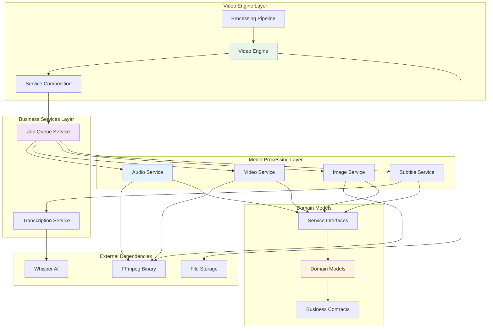
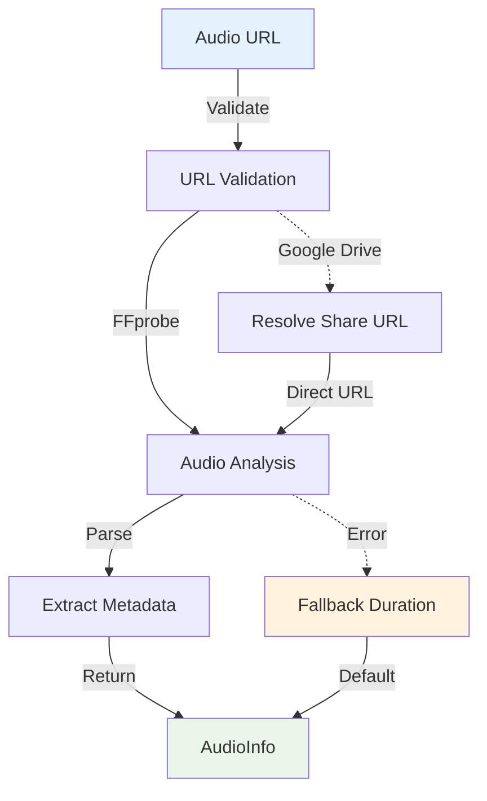
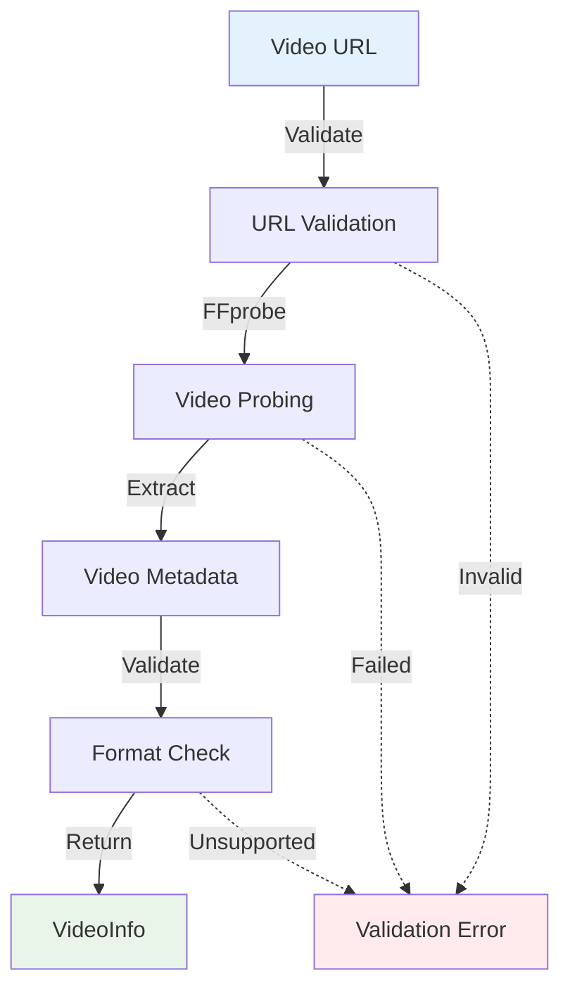
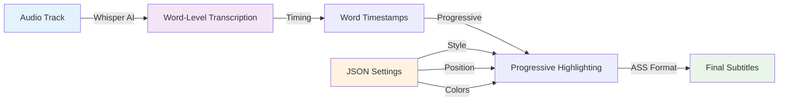
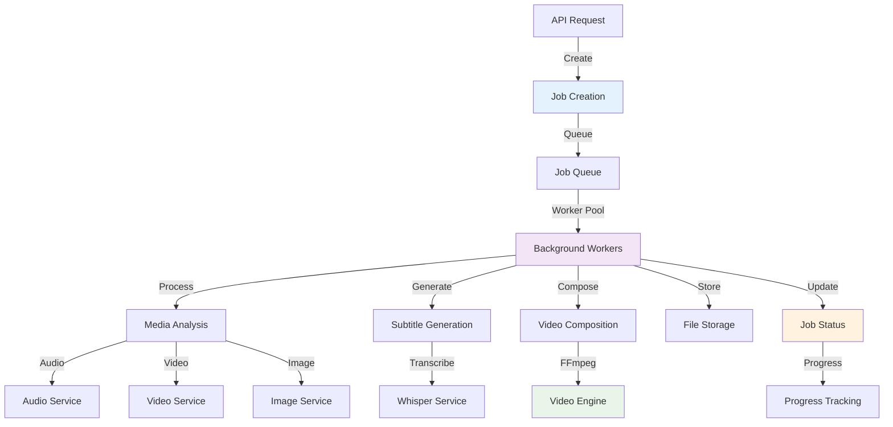
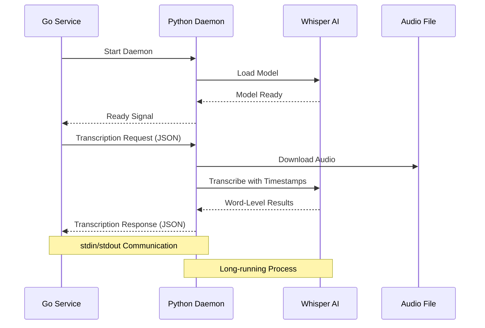

# VideoCraft Core Layer - Business Logic & Domain Services

The core layer contains VideoCraft's essential business logic, implementing Clean Architecture principles with a focus on domain-driven design. This layer is independent of external frameworks and provides the foundational capabilities for video generation.

## 🏗️ Core Architecture



## 📁 Core Package Structure

```
internal/core/
├── media/                  # Media processing services
│   ├── audio/             # Audio analysis and processing
│   │   └── analyzer.go    # FFprobe-based audio analysis
│   ├── image/             # Image processing and validation
│   │   └── service.go     # Image service implementation
│   ├── subtitle/          # Subtitle generation services
│   │   ├── ass.go        # ASS subtitle format generation
│   │   └── generator.go  # Subtitle service with JSON settings
│   └── video/             # Video processing and analysis
│       └── service.go     # Video service implementation
├── services/               # Core business services
│   ├── job/               # Job management services
│   │   └── queue/         # Asynchronous job processing
│   │       └── queue.go   # Job queue implementation
│   └── transcription/     # AI transcription services
│       └── whisper.go     # Whisper AI integration
└── video/                 # Video generation engine
    ├── composition/       # Service composition and DI
    │   └── composer.go    # Service container and lifecycle
    ├── engine/            # Video generation engine
    │   ├── command.go     # FFmpeg command construction
    │   └── security.go    # Command injection protection
    ├── models/            # Domain models (planned)
    ├── pipeline/          # Processing pipeline (planned)
    └── processing/        # Video processing logic (planned)
```

## 🎯 Core Principles

### 1. **Clean Architecture Compliance**
- **Independence**: Core logic independent of external frameworks
- **Testability**: All services mockable through interfaces
- **Separation of Concerns**: Clear boundaries between responsibilities
- **Dependency Inversion**: High-level modules don't depend on low-level modules

### 2. **Security-First Design**
- **Input Validation**: All external inputs validated at service boundaries
- **Command Injection Prevention**: Secure FFmpeg command construction
- **Resource Management**: Controlled resource allocation and cleanup
- **Error Handling**: Secure error propagation without information leakage

### 3. **Performance Optimization**
- **Asynchronous Processing**: Non-blocking job execution
- **Resource Pooling**: Efficient worker pool management
- **URL-First Analysis**: Media analysis without file downloads
- **Progressive Generation**: Real-time progress tracking

## 🎬 Media Processing Services

### Audio Service (`media/audio/`)

**Purpose**: Audio file analysis and processing with FFprobe integration

#### Key Features:
- **URL-First Analysis**: Analyze audio directly from URLs
- **Duration Extraction**: Precise audio duration calculation
- **Format Detection**: Comprehensive audio format support
- **Google Drive Integration**: Handle Google Drive share URLs
- **Metadata Extraction**: Bitrate, sample rate, channel information

#### Data Flow:


#### Implementation:
```go
type AudioInfo struct {
    URL      string  `json:"url"`
    Duration float64 `json:"duration"`
    Format   string  `json:"format"`
    Bitrate  int     `json:"bitrate"`
    Size     int64   `json:"size"`
}

func (s *service) AnalyzeAudio(ctx context.Context, url string) (*AudioInfo, error) {
    // Use FFprobe directly with URL - no download needed
    audioInfo, err := s.getAudioInfoFromURL(ctx, url)
    if err != nil {
        return nil, errors.InternalError(fmt.Errorf("failed to get audio info from URL: %w", err))
    }
    
    return audioInfo, nil
}
```

### Video Service (`media/video/`)

**Purpose**: Video file analysis and validation with comprehensive metadata extraction

#### Key Features:
- **Metadata Extraction**: Width, height, duration, codec information
- **Format Validation**: Support for multiple video formats
- **URL-based Analysis**: Direct analysis without downloading
- **Security Validation**: URL safety and format compliance
- **Performance Optimization**: Efficient metadata extraction

#### Data Flow:


### Image Service (`media/image/`)

**Purpose**: Image processing, validation, and format handling

#### Key Features:
- **Format Support**: JPEG, PNG, WebP, GIF format handling
- **Validation**: URL and format validation
- **Security Checks**: Image content validation
- **Resize Support**: Dynamic image resizing capabilities
- **Optimization**: Efficient image processing

### Subtitle Service (`media/subtitle/`)

**Purpose**: Progressive subtitle generation with AI-powered transcription

#### Progressive Subtitles Innovation:
VideoCraft's most innovative feature - solving traditional subtitle timing gaps:



#### Key Features:
- **Word-by-Word Timing**: Real-time word highlighting
- **JSON Settings v0.0.1+**: Per-request subtitle customization
- **Multiple Formats**: ASS, SRT subtitle generation
- **AI Integration**: Whisper AI for accurate transcription
- **Progressive Display**: Dynamic word-by-word appearance

## ⚙️ Business Services

### Job Queue Service (`services/job/queue/`)

**Purpose**: Asynchronous job processing with worker pool management

#### Architecture:


#### Key Features:
- **Asynchronous Processing**: Non-blocking job execution
- **Worker Pool**: Configurable concurrent workers
- **Progress Tracking**: Real-time job progress updates
- **Error Handling**: Comprehensive error recovery
- **Media Service Integration**: Uses specialized media services for analysis

#### Job Processing Pipeline:
```go
func (js *service) ProcessJob(ctx context.Context, job *models.Job) error {
    // Step 1: Analyze media URLs using media services
    if err := js.analyzeMediaWithServices(ctx, &job.Config); err != nil {
        return fmt.Errorf("media analysis failed: %w", err)
    }
    
    // Step 2: Generate subtitles if needed
    var subtitleFilePath string
    for _, project := range job.Config {
        if js.needsSubtitles(project) {
            subtitleResult, err := js.subtitle.GenerateSubtitles(ctx, project)
            if err != nil {
                return fmt.Errorf("subtitle generation failed: %w", err)
            }
            subtitleFilePath = subtitleResult.FilePath
            break
        }
    }
    
    // Step 3: Generate video with FFmpeg
    videoPath, err := js.ffmpeg.GenerateVideo(ctx, &job.Config, progressChan)
    if err != nil {
        return fmt.Errorf("video generation failed: %w", err)
    }
    
    // Step 4: Store generated video
    videoID, err := js.storage.StoreVideo(videoPath)
    if err != nil {
        return fmt.Errorf("video storage failed: %w", err)
    }
    
    return nil
}
```

### Transcription Service (`services/transcription/`)

**Purpose**: AI-powered audio transcription with Whisper integration

#### Python-Go Integration:


#### Key Features:
- **Daemon Architecture**: Long-running Python process for efficiency
- **Word-Level Timestamps**: Precise timing for progressive subtitles
- **Model Management**: Configurable Whisper model selection
- **Error Recovery**: Automatic daemon restart on failures
- **Resource Management**: Memory and CPU limit enforcement

## 🎥 Video Engine

### Service Composition (`video/composition/`)

**Purpose**: Dependency injection and service lifecycle management

#### Service Container:
```go
type Services struct {
    FFmpeg        FFmpegService
    Audio         AudioService
    Video         VideoService
    Image         ImageService
    Transcription TranscriptionService
    Subtitle      SubtitleService
    Storage       StorageService
    Job           JobService
}

func NewServices(cfg *app.Config, log logger.Logger) *Services {
    // Initialize core services without dependencies first
    audioService := audio.NewService(cfg, log)
    videoService := video.NewService(cfg, log)
    imageService := image.NewService(cfg, log)
    transcriptionService := transcription.NewService(cfg, log)
    ffmpegService := engine.NewService(cfg, log)
    storageService := storageServices.NewService(cfg, log)
    
    // Initialize services with dependencies
    subtitleService := subtitle.NewService(cfg, log, transcriptionService, audioService)
    
    // Initialize job service with all dependencies including media services
    jobService := queue.NewService(cfg, log, ffmpegService, subtitleService, storageService, 
        audioService, videoService, imageService)
    
    return &Services{
        FFmpeg:        ffmpegService,
        Audio:         audioService,
        Video:         videoService,
        Image:         imageService,
        Transcription: transcriptionService,
        Subtitle:      subtitleService,
        Storage:       storageService,
        Job:           jobService,
    }
}
```

### Video Engine (`video/engine/`)

**Purpose**: FFmpeg command construction with security controls

#### Security Features:
- **Command Injection Prevention**: Secure parameter validation
- **Path Traversal Protection**: Safe file path handling
- **Resource Limits**: CPU and memory constraints
- **Input Validation**: Comprehensive media format validation

#### Secure Command Construction:
```go
func (s *service) buildFFmpegCommand(config *models.VideoConfigArray) ([]string, error) {
    var args []string
    
    // Validate all inputs before building command
    for _, project := range *config {
        for _, scene := range project.Scenes {
            for _, element := range scene.Elements {
                if err := validateMediaElement(element); err != nil {
                    return nil, fmt.Errorf("invalid element: %w", err)
                }
            }
        }
    }
    
    // Build command with validated parameters
    args = append(args, "-y") // Overwrite output
    args = append(args, buildInputArgs(config)...)
    args = append(args, buildFilterArgs(config)...)
    args = append(args, buildOutputArgs(config)...)
    
    return args, nil
}
```

## 📊 Performance Characteristics

### Asynchronous Processing
- **Job Queue**: Background processing for video generation
- **Worker Pool**: Configurable concurrent workers (default: 2)
- **Progress Tracking**: Real-time job progress updates
- **Resource Management**: Memory and CPU limit enforcement

### Media Optimization
- **URL-First Analysis**: FFprobe analysis without file download
- **Progressive Subtitles**: Real-time word-by-word timing
- **Streaming Support**: Large file handling via streaming
- **Efficient Transcoding**: Optimized FFmpeg parameters

### Resource Management
- **Worker Limits**: Prevent resource exhaustion
- **Timeout Controls**: Prevent hung processes
- **Memory Monitoring**: Track resource usage
- **Cleanup Automation**: Automatic temporary file cleanup

## 🔍 Interface Design

### Service Interfaces
All core services implement clean interfaces for:

```go
// Media service interfaces for URL analysis
type AudioService interface {
    AnalyzeAudio(ctx context.Context, url string) (*audio.AudioInfo, error)
    CalculateSceneTiming(elements []models.Element) ([]models.TimingSegment, error)
    DownloadAudio(ctx context.Context, url string) (string, error)
}

type VideoService interface {
    AnalyzeVideo(ctx context.Context, videoURL string) (*models.VideoInfo, error)
    ValidateVideo(videoURL string) error
    GetVideoMetadataFromURL(ctx context.Context, videoURL string) (*models.VideoInfo, error)
}

type ImageService interface {
    ValidateImage(imageURL string) error
    ProcessImage(ctx context.Context, imageURL string) (*models.ImageInfo, error)
    ResizeImage(ctx context.Context, imagePath string, width, height int) (string, error)
}
```

### Dependency Injection
- **Constructor Injection**: Services receive dependencies at creation
- **Interface Dependencies**: Services depend on interfaces, not implementations
- **Configuration Driven**: Behavior controlled via configuration
- **Lifecycle Management**: Proper service startup and shutdown

## 🧪 Testing Strategy

### Unit Testing
- **Service Isolation**: Test individual services in isolation
- **Mock Dependencies**: Use interfaces for easy mocking
- **Business Logic Focus**: Test core business rules
- **Error Scenarios**: Comprehensive error handling testing

### Integration Testing
- **Service Integration**: Test service interactions
- **External Dependencies**: Test FFmpeg and Whisper integration
- **End-to-End Workflows**: Complete video generation testing
- **Performance Testing**: Load and stress testing

### Security Testing
- **Input Validation**: Test malicious input handling
- **Command Injection**: Test FFmpeg command security
- **Resource Limits**: Test resource exhaustion scenarios
- **Path Traversal**: Test file system security

## 🔧 Configuration

### Core Service Configuration
```yaml
# Job processing
job:
  workers: 2
  queue_size: 100
  process_timeout: "30m"
  
# Media services
media:
  audio:
    max_duration: 600  # 10 minutes
    supported_formats: ["mp3", "wav", "aac"]
  video:
    max_duration: 600
    supported_formats: ["mp4", "avi", "mov"]
  image:
    max_size: 10485760  # 10MB
    supported_formats: ["jpg", "png", "webp"]

# FFmpeg engine
ffmpeg:
  binary_path: "ffmpeg"
  probe_path: "ffprobe"
  threads: 0  # Auto-detect
  preset: "medium"

# Whisper transcription
whisper:
  model: "base"
  language: "auto"
  startup_timeout: "30s"
```

---

**Related Documentation:**
- [Media Services](media/CLAUDE.md)
- [Job Queue Service](services/job/CLAUDE.md)
- [Video Engine](video/CLAUDE.md)
- [Service Composition](video/composition/CLAUDE.md)