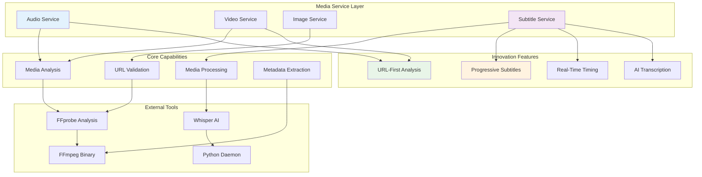
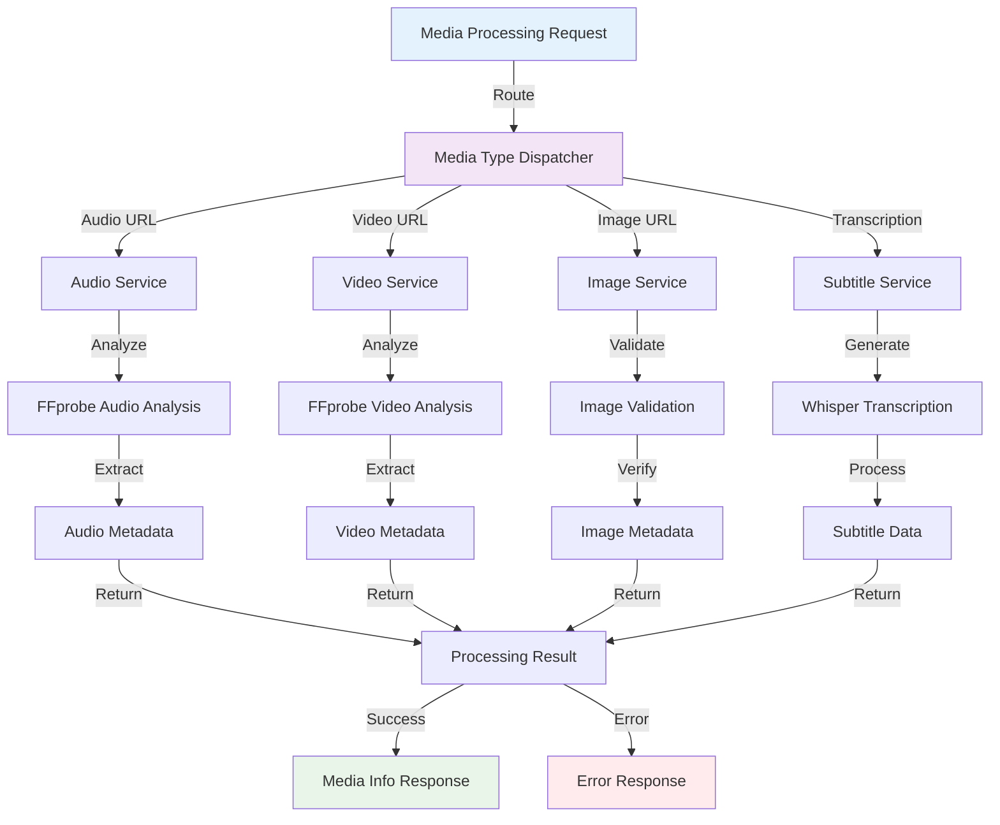
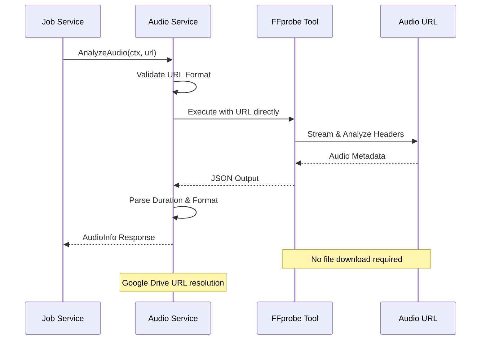
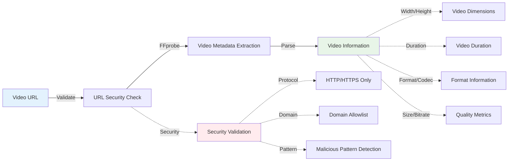
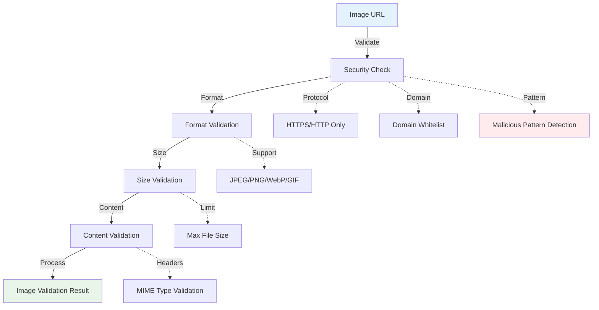
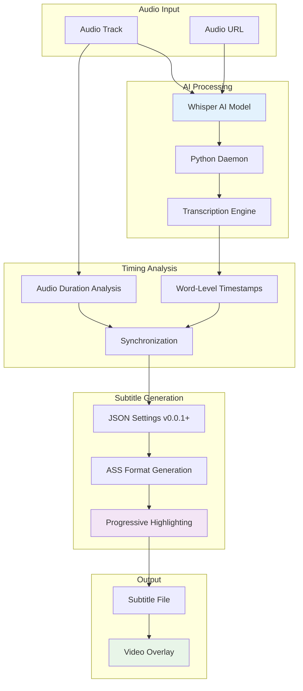

# VideoCraft Media Processing Layer - Comprehensive Media Services

The media processing layer provides specialized services for analyzing, validating, and processing different media types. This layer implements VideoCraft's innovative approach to media handling with URL-first analysis and progressive subtitle generation.

## 🎬 Media Architecture



## 📁 Media Package Structure

```
internal/core/media/
├── audio/                  # Audio analysis and processing
│   └── analyzer.go        # FFprobe-based audio analysis with URL support
├── video/                 # Video processing and validation
│   └── service.go         # Video metadata extraction and validation
├── image/                 # Image processing and validation
│   └── service.go         # Image format validation and processing
└── subtitle/              # Progressive subtitle generation
    ├── generator.go       # Main subtitle service with JSON settings
    └── ass.go            # ASS subtitle format generation
```

## 🔄 Media Processing Pipeline



## 🎵 Audio Service Innovation

### URL-First Audio Analysis
Revolutionary approach to audio processing - analyze without downloading:



### Key Features:
- **Direct URL Analysis**: FFprobe works directly with URLs
- **Google Drive Integration**: Automatic share URL resolution
- **Duration Precision**: Exact audio duration extraction
- **Format Detection**: Comprehensive audio format support
- **Error Resilience**: Fallback mechanisms for analysis failures

### Google Drive URL Resolution:
```go
func (s *service) resolveGoogleDriveURL(url string) string {
    if !strings.Contains(url, "drive.google.com") {
        return url
    }
    
    // Extract file ID from various Google Drive URL formats
    patterns := []string{"/file/d/", "id=", "/d/"}
    
    var fileID string
    for _, pattern := range patterns {
        if idx := strings.Index(url, pattern); idx != -1 {
            start := idx + len(pattern)
            end := start
            for end < len(url) && url[end] != '/' && url[end] != '&' && url[end] != '?' {
                end++
            }
            fileID = url[start:end]
            break
        }
    }
    
    if fileID != "" {
        return fmt.Sprintf("https://drive.google.com/uc?export=download&id=%s", fileID)
    }
    
    return url
}
```

## 🎥 Video Service Implementation

### Comprehensive Video Analysis
Advanced video metadata extraction and validation:



### Video Service Interface:
```go
type Service interface {
    AnalyzeVideo(ctx context.Context, videoURL string) (*models.VideoInfo, error)
    ValidateVideo(videoURL string) error
    GetVideoMetadataFromURL(ctx context.Context, videoURL string) (*models.VideoInfo, error)
}

func (s *service) AnalyzeVideo(ctx context.Context, videoURL string) (*models.VideoInfo, error) {
    s.log.Debugf("Analyzing video URL with FFprobe: %s", videoURL)
    
    videoInfo, err := s.GetVideoMetadataFromURL(ctx, videoURL)
    if err != nil {
        return nil, errors.ProcessingFailed(fmt.Errorf("failed to get video metadata from URL: %w", err))
    }
    
    videoInfo.URL = videoURL
    return videoInfo, nil
}
```

## 🖼️ Image Service Capabilities

### Secure Image Processing
Image validation and processing with security controls:



### Image Service Implementation:
```go
func (s *service) ValidateImage(imageURL string) error {
    s.log.Debugf("Validating image URL: %s", imageURL)
    
    // Basic URL validation
    if err := s.validateURL(imageURL); err != nil {
        return fmt.Errorf("invalid image URL: %w", err)
    }
    
    // Check image accessibility and format
    if err := s.checkImageAccessibility(imageURL); err != nil {
        return fmt.Errorf("image accessibility check failed: %w", err)
    }
    
    return nil
}
```

## 📝 Progressive Subtitle Innovation

### AI-Powered Word-Level Timing
VideoCraft's most innovative feature - progressive subtitles with real-time highlighting:



### JSON Settings v0.0.1+ Innovation
Per-request subtitle customization with comprehensive styling:

```go
type SubtitleSettings struct {
    Style        string `json:"style,omitempty"`         // "word-by-word", "line-by-line"
    FontFamily   string `json:"font-family,omitempty"`   // Font name
    FontSize     int    `json:"font-size,omitempty"`     // Font size in pixels
    WordColor    string `json:"word-color,omitempty"`    // Active word color
    LineColor    string `json:"line-color,omitempty"`    // Text line color
    ShadowColor  string `json:"shadow-color,omitempty"`  // Text shadow color
    ShadowOffset int    `json:"shadow-offset,omitempty"` // Shadow offset in pixels
    BoxColor     string `json:"box-color,omitempty"`     // Background box color
    Position     string `json:"position,omitempty"`      // "bottom", "top", "center"
    OutlineColor string `json:"outline-color,omitempty"` // Text outline color
    OutlineWidth int    `json:"outline-width,omitempty"` // Outline width in pixels
}
```

### Progressive Subtitle Implementation:
```go
func (s *service) GenerateSubtitles(ctx context.Context, project models.VideoProject) (*SubtitleResult, error) {
    s.log.Info("Starting subtitle generation for project")
    
    // Extract audio elements for transcription
    audioElements := s.extractAudioElements(project)
    if len(audioElements) == 0 {
        return nil, errors.InvalidInput("no audio elements found for subtitle generation")
    }
    
    // Generate transcriptions for each audio element
    var allTranscriptions []TranscriptionResult
    for _, element := range audioElements {
        transcription, err := s.transcription.TranscribeAudio(ctx, element.Src, element.Language)
        if err != nil {
            return nil, fmt.Errorf("transcription failed for audio %s: %w", element.Src, err)
        }
        allTranscriptions = append(allTranscriptions, *transcription)
    }
    
    // Generate ASS subtitle file with progressive highlighting
    assContent, err := s.generateASSSubtitles(allTranscriptions, project.GetSubtitleSettings())
    if err != nil {
        return nil, fmt.Errorf("ASS generation failed: %w", err)
    }
    
    // Save subtitle file
    subtitlePath, err := s.saveSubtitleFile(assContent)
    if err != nil {
        return nil, fmt.Errorf("failed to save subtitle file: %w", err)
    }
    
    return &SubtitleResult{
        FilePath:   subtitlePath,
        EventCount: len(allTranscriptions),
        Format:     "ass",
    }, nil
}
```

## 🔄 Service Integration

### Media Service Interfaces
Unified interface design for consistent service interaction:

```go
// Common interface for media duration retrieval
type MediaInfo interface {
    GetDuration() float64
}

// Audio service interface
type AudioService interface {
    AnalyzeAudio(ctx context.Context, url string) (*AudioInfo, error)
    CalculateSceneTiming(elements []models.Element) ([]models.TimingSegment, error)
    DownloadAudio(ctx context.Context, url string) (string, error)
}

// Video service interface
type VideoService interface {
    AnalyzeVideo(ctx context.Context, videoURL string) (*models.VideoInfo, error)
    ValidateVideo(videoURL string) error
    GetVideoMetadataFromURL(ctx context.Context, videoURL string) (*models.VideoInfo, error)
}

// Image service interface
type ImageService interface {
    ValidateImage(imageURL string) error
    ProcessImage(ctx context.Context, imageURL string) (*models.ImageInfo, error)
    ResizeImage(ctx context.Context, imagePath string, width, height int) (string, error)
}

// Subtitle service interface
type SubtitleService interface {
    ValidateJSONSubtitleSettings(project models.VideoProject) error
    GenerateSubtitles(ctx context.Context, project models.VideoProject) (*SubtitleResult, error)
    CleanupTempFiles(filePath string) error
}
```

### Job Service Integration
How media services integrate with the job processing pipeline:

```go
func (js *service) analyzeMediaWithServices(ctx context.Context, config *models.VideoConfigArray) error {
    for projectIdx := range *config {
        project := &(*config)[projectIdx]
        
        // Analyze scene elements
        for sceneIdx := range project.Scenes {
            for elementIdx := range project.Scenes[sceneIdx].Elements {
                element := &project.Scenes[sceneIdx].Elements[elementIdx]
                
                switch element.Type {
                case "audio":
                    audioInfo, err := js.audio.AnalyzeAudio(ctx, element.Src)
                    if err != nil {
                        element.Duration = 10.0 // Fallback
                    } else {
                        element.Duration = audioInfo.GetDuration()
                    }
                    
                case "image":
                    if err := js.image.ValidateImage(element.Src); err != nil {
                        return fmt.Errorf("invalid image URL '%s': %w", element.Src, err)
                    }
                }
            }
        }
        
        // Analyze background elements
        for elementIdx := range project.Elements {
            element := &project.Elements[elementIdx]
            switch element.Type {
            case "video":
                videoInfo, err := js.video.AnalyzeVideo(ctx, element.Src)
                if err != nil {
                    element.Duration = 30.0 // Fallback
                } else {
                    element.Duration = videoInfo.GetDuration()
                }
            }
        }
    }
    
    return nil
}
```

## 🛡️ Security Features

### URL Security Validation
Comprehensive security checks for all media URLs:

```go
func validateMediaURL(url string) error {
    // Basic URL format validation
    parsedURL, err := neturl.Parse(url)
    if err != nil {
        return fmt.Errorf("invalid URL format: %w", err)
    }
    
    // Validate scheme
    if parsedURL.Scheme != "http" && parsedURL.Scheme != "https" {
        return errors.New("only HTTP and HTTPS protocols are allowed")
    }
    
    // Check for suspicious patterns
    suspiciousPatterns := []string{
        "javascript:", "data:", "file:", "ftp:",
        "localhost", "127.0.0.1", "192.168.", "10.", "172.",
    }
    
    urlLower := strings.ToLower(url)
    for _, pattern := range suspiciousPatterns {
        if strings.Contains(urlLower, pattern) {
            return fmt.Errorf("URL contains suspicious pattern: %s", pattern)
        }
    }
    
    return nil
}
```

### Resource Management
Controlled resource usage and cleanup:

```go
func (s *service) processWithTimeout(ctx context.Context, operation func() error) error {
    // Create timeout context
    timeoutCtx, cancel := context.WithTimeout(ctx, 30*time.Second)
    defer cancel()
    
    // Process with timeout
    done := make(chan error, 1)
    go func() {
        done <- operation()
    }()
    
    select {
    case err := <-done:
        return err
    case <-timeoutCtx.Done():
        return errors.New("operation timed out")
    }
}
```

## 📊 Performance Characteristics

### URL-First Analysis Benefits:
- **No Downloads**: Significant bandwidth and storage savings
- **Faster Processing**: Immediate metadata extraction
- **Scalability**: Reduced disk I/O and storage requirements
- **Efficiency**: Direct streaming analysis

### Progressive Subtitle Performance:
- **Real-Time Processing**: Word-by-word timing generation
- **Memory Efficiency**: Streaming transcription processing
- **AI Optimization**: Persistent Whisper daemon for efficiency
- **Caching**: Transcription result caching for repeated requests

## 🔧 Configuration

### Media Service Configuration:
```yaml
media:
  audio:
    max_duration: 600        # 10 minutes
    supported_formats: ["mp3", "wav", "aac", "ogg"]
    analysis_timeout: "30s"
    fallback_duration: 10.0
    
  video:
    max_duration: 600        # 10 minutes  
    supported_formats: ["mp4", "avi", "mov", "webm"]
    analysis_timeout: "30s"
    fallback_duration: 30.0
    
  image:
    max_size: 10485760       # 10MB
    supported_formats: ["jpg", "jpeg", "png", "webp", "gif"]
    validation_timeout: "10s"
    
  subtitle:
    whisper_model: "base"
    default_language: "auto"
    generation_timeout: "300s"
    cleanup_enabled: true

ffmpeg:
  binary_path: "ffmpeg"
  probe_path: "ffprobe"
  threads: 0               # Auto-detect
```

## 🧪 Testing Strategy

### Unit Testing:
- **Service Isolation**: Test each media service independently
- **Mock Dependencies**: Use interfaces for FFmpeg/Whisper mocking
- **URL Validation**: Comprehensive URL security testing
- **Error Scenarios**: Test all failure modes

### Integration Testing:
- **FFmpeg Integration**: Test actual FFprobe execution
- **Whisper Integration**: Test AI transcription pipeline
- **End-to-End Media Processing**: Complete media analysis workflows
- **Performance Testing**: Load testing with various media types

### Security Testing:
- **Malicious URL Testing**: Test protection against malicious URLs
- **Input Fuzzing**: Test with malformed media files
- **Resource Exhaustion**: Test resource limit enforcement
- **Protocol Security**: Test protocol restriction enforcement

---

**Related Documentation:**
- [Audio Service](audio/CLAUDE.md)
- [Video Service](video/CLAUDE.md)
- [Image Service](image/CLAUDE.md)
- [Subtitle Service](subtitle/CLAUDE.md)
- [Core Services Integration](../services/CLAUDE.md)