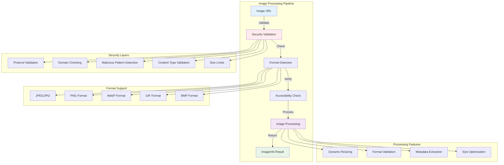
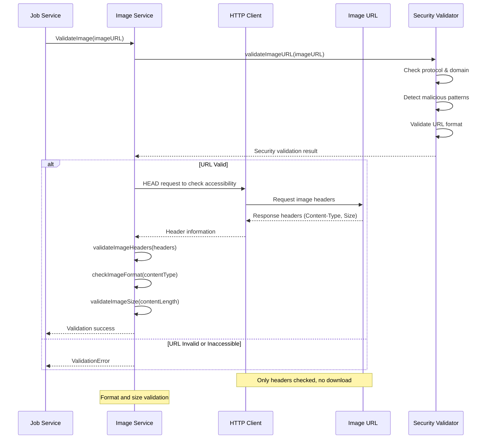

# VideoCraft Image Service - Secure Image Processing & Validation

The image service provides comprehensive image validation, processing, and format handling with security-first design. It ensures safe image processing while supporting multiple formats and dynamic resizing capabilities.

## 🖼️ Image Service Architecture



## 🔄 Image Validation Workflow

### Comprehensive Image Processing



## 📊 Image Information Structure

```go
type ImageInfo struct {
    ID            string `json:"id,omitempty"`            // Unique identifier
    Filename      string `json:"filename,omitempty"`      // Original filename
    URL           string `json:"url,omitempty"`           // Source URL
    Width         int    `json:"width"`                   // Image width in pixels
    Height        int    `json:"height"`                  // Image height in pixels
    Format        string `json:"format"`                  // Image format (jpg, png, etc.)
    Size          int64  `json:"size"`                    // File size in bytes
    Path          string `json:"path,omitempty"`          // Local file path
    ProcessedPath string `json:"processed_path,omitempty"` // Processed file path
}
```

## 🛠️ Service Implementation

### Image Service Interface

```go
type Service interface {
    // Core image validation - security-first approach
    ValidateImage(imageURL string) error
    
    // Comprehensive image processing with metadata
    ProcessImage(ctx context.Context, imageURL string) (*models.ImageInfo, error)
    
    // Dynamic image resizing capabilities
    ResizeImage(ctx context.Context, imagePath string, width, height int) (string, error)
}

type service struct {
    cfg *app.Config
    log logger.Logger
}

func NewService(cfg *app.Config, log logger.Logger) Service {
    return &service{
        cfg: cfg,
        log: log,
    }
}
```

### Core Validation Implementation

```go
func (s *service) ValidateImage(imageURL string) error {
    s.log.Debugf("Validating image URL: %s", imageURL)
    
    // Basic URL validation with security checks
    if err := s.validateImageURL(imageURL); err != nil {
        return fmt.Errorf("invalid image URL: %w", err)
    }
    
    // Check image accessibility and format
    if err := s.checkImageAccessibility(imageURL); err != nil {
        return fmt.Errorf("image accessibility check failed: %w", err)
    }
    
    s.log.Debugf("Image URL validation successful: %s", imageURL)
    return nil
}

func (s *service) validateImageURL(imageURL string) error {
    if imageURL == "" {
        return errors.New("image URL cannot be empty")
    }
    
    // Parse URL
    parsedURL, err := url.Parse(imageURL)
    if err != nil {
        return fmt.Errorf("invalid URL format: %w", err)
    }
    
    // Validate protocol
    if parsedURL.Scheme != "http" && parsedURL.Scheme != "https" {
        return fmt.Errorf("unsupported protocol '%s', only HTTP and HTTPS are allowed", parsedURL.Scheme)
    }
    
    // Validate host
    if parsedURL.Host == "" {
        return errors.New("URL must have a valid host")
    }
    
    // Check URL length
    if len(imageURL) > 2048 {
        return errors.New("URL too long (max 2048 characters)")
    }
    
    // Security pattern detection
    if err := s.detectMaliciousPatterns(imageURL); err != nil {
        return fmt.Errorf("security validation failed: %w", err)
    }
    
    return nil
}
```

## 🔒 Security Validation

### Advanced Security Checks

```go
func (s *service) detectMaliciousPatterns(imageURL string) error {
    // Comprehensive list of suspicious patterns
    maliciousPatterns := []string{
        "javascript:",     // Script injection attempts
        "data:",          // Data URLs (potential security risk)
        "file:",          // Local file system access
        "ftp:",           // FTP protocol
        "localhost",      // Local development servers
        "127.0.0.1",     // Loopback addresses
        "192.168.",      // Private network ranges
        "10.",           // Private network ranges
        "172.",          // Private network ranges
        ".onion",        // Tor hidden services
        "admin",         // Admin panels
        "internal",      // Internal services
        "../",           // Path traversal attempts
        "..%2f",         // Encoded path traversal
        "%2e%2e%2f",     // Double encoded traversal
    }
    
    urlLower := strings.ToLower(imageURL)
    for _, pattern := range maliciousPatterns {
        if strings.Contains(urlLower, pattern) {
            s.log.Warnf("Malicious pattern detected in image URL: %s (pattern: %s)", imageURL, pattern)
            return fmt.Errorf("URL contains suspicious pattern: %s", pattern)
        }
    }
    
    return nil
}

func (s *service) checkImageAccessibility(imageURL string) error {
    // Create HTTP client with timeout
    client := &http.Client{
        Timeout: 10 * time.Second,
        Transport: &http.Transport{
            TLSClientConfig: &tls.Config{
                InsecureSkipVerify: false, // Always verify TLS certificates
            },
        },
    }
    
    // Send HEAD request to check accessibility without downloading
    req, err := http.NewRequest("HEAD", imageURL, nil)
    if err != nil {
        return fmt.Errorf("failed to create HTTP request: %w", err)
    }
    
    // Set user agent to identify our service
    req.Header.Set("User-Agent", "VideoCraft/1.0 Image Validator")
    
    resp, err := client.Do(req)
    if err != nil {
        return fmt.Errorf("HTTP request failed: %w", err)
    }
    defer resp.Body.Close()
    
    // Check HTTP status
    if resp.StatusCode < 200 || resp.StatusCode >= 300 {
        return fmt.Errorf("HTTP error: %d %s", resp.StatusCode, resp.Status)
    }
    
    // Validate content type
    contentType := resp.Header.Get("Content-Type")
    if err := s.validateImageContentType(contentType); err != nil {
        return fmt.Errorf("invalid content type: %w", err)
    }
    
    // Check content length
    contentLengthStr := resp.Header.Get("Content-Length")
    if contentLengthStr != "" {
        contentLength, err := strconv.ParseInt(contentLengthStr, 10, 64)
        if err == nil {
            if err := s.validateImageSize(contentLength); err != nil {
                return fmt.Errorf("invalid content size: %w", err)
            }
        }
    }
    
    return nil
}
```

## 🎨 Image Processing & Metadata

### Comprehensive Image Processing

```go
func (s *service) ProcessImage(ctx context.Context, imageURL string) (*models.ImageInfo, error) {
    s.log.Debugf("Processing image: %s", imageURL)
    
    // Validate image first
    if err := s.ValidateImage(imageURL); err != nil {
        return nil, fmt.Errorf("image validation failed: %w", err)
    }
    
    // Download image for processing
    imagePath, err := s.downloadImage(ctx, imageURL)
    if err != nil {
        return nil, fmt.Errorf("image download failed: %w", err)
    }
    
    // Extract image metadata
    metadata, err := s.extractImageMetadata(imagePath)
    if err != nil {
        // Cleanup downloaded file on error
        os.Remove(imagePath)
        return nil, fmt.Errorf("metadata extraction failed: %w", err)
    }
    
    // Build ImageInfo result
    imageInfo := &models.ImageInfo{
        ID:       generateImageID(),
        Filename: extractFilename(imageURL),
        URL:      imageURL,
        Width:    metadata.Width,
        Height:   metadata.Height,
        Format:   metadata.Format,
        Size:     metadata.Size,
        Path:     imagePath,
    }
    
    s.log.Debugf("Image processed: %dx%d, format=%s, size=%d bytes", 
        imageInfo.Width, imageInfo.Height, imageInfo.Format, imageInfo.Size)
    
    return imageInfo, nil
}

func (s *service) downloadImage(ctx context.Context, imageURL string) (string, error) {
    // Create HTTP client with context and timeout
    client := &http.Client{
        Timeout: 2 * time.Minute,
    }
    
    req, err := http.NewRequestWithContext(ctx, "GET", imageURL, nil)
    if err != nil {
        return "", err
    }
    
    resp, err := client.Do(req)
    if err != nil {
        return "", err
    }
    defer resp.Body.Close()
    
    if resp.StatusCode != http.StatusOK {
        return "", fmt.Errorf("HTTP error: %d", resp.StatusCode)
    }
    
    // Determine file extension from content type or URL
    ext := s.determineImageExtension(resp.Header.Get("Content-Type"), imageURL)
    
    // Create temporary file
    tempFile := filepath.Join(s.cfg.Storage.TempDir, 
        fmt.Sprintf("image_%s%s", uuid.New().String()[:8], ext))
    
    // Ensure temp directory exists
    if err := os.MkdirAll(s.cfg.Storage.TempDir, 0755); err != nil {
        return "", fmt.Errorf("failed to create temp directory: %w", err)
    }
    
    // Create output file
    out, err := os.Create(tempFile)
    if err != nil {
        return "", err
    }
    defer out.Close()
    
    // Copy with size limit to prevent abuse
    limitedReader := io.LimitReader(resp.Body, s.cfg.MaxImageSize)
    _, err = io.Copy(out, limitedReader)
    if err != nil {
        os.Remove(tempFile)
        return "", err
    }
    
    return tempFile, nil
}
```

## 🔍 Format Detection & Validation

### Smart Format Recognition

```go
func (s *service) validateImageContentType(contentType string) error {
    if contentType == "" {
        return errors.New("missing Content-Type header")
    }
    
    // List of supported image MIME types
    supportedTypes := []string{
        "image/jpeg",
        "image/jpg",
        "image/png",
        "image/webp",
        "image/gif",
        "image/bmp",
        "image/tiff",
    }
    
    contentTypeLower := strings.ToLower(contentType)
    for _, supportedType := range supportedTypes {
        if strings.Contains(contentTypeLower, supportedType) {
            return nil
        }
    }
    
    return fmt.Errorf("unsupported image type: %s", contentType)
}

func (s *service) determineImageExtension(contentType, imageURL string) string {
    // Map content types to extensions
    contentTypeMap := map[string]string{
        "image/jpeg": ".jpg",
        "image/jpg":  ".jpg",
        "image/png":  ".png",
        "image/webp": ".webp",
        "image/gif":  ".gif",
        "image/bmp":  ".bmp",
        "image/tiff": ".tiff",
    }
    
    // Try to get extension from content type
    contentTypeLower := strings.ToLower(contentType)
    for mimeType, ext := range contentTypeMap {
        if strings.Contains(contentTypeLower, mimeType) {
            return ext
        }
    }
    
    // Fallback to URL extension
    if ext := filepath.Ext(imageURL); ext != "" {
        return strings.ToLower(ext)
    }
    
    // Default fallback
    return ".jpg"
}

func (s *service) validateImageSize(size int64) error {
    maxSize := int64(10 * 1024 * 1024) // 10MB default
    if s.cfg.MaxImageSize > 0 {
        maxSize = s.cfg.MaxImageSize
    }
    
    if size > maxSize {
        return fmt.Errorf("image size %d bytes exceeds maximum allowed %d bytes", size, maxSize)
    }
    
    if size < 100 { // Minimum 100 bytes
        return fmt.Errorf("image size %d bytes too small (minimum 100 bytes)", size)
    }
    
    return nil
}
```

## 🖼️ Image Resizing & Optimization

### Dynamic Image Resizing

```go
func (s *service) ResizeImage(ctx context.Context, imagePath string, width, height int) (string, error) {
    s.log.Debugf("Resizing image %s to %dx%d", imagePath, width, height)
    
    // Validate input parameters
    if width <= 0 || height <= 0 {
        return "", errors.New("width and height must be positive")
    }
    
    if width > 4096 || height > 4096 {
        return "", errors.New("maximum resize dimensions are 4096x4096")
    }
    
    // Check if source file exists
    if _, err := os.Stat(imagePath); os.IsNotExist(err) {
        return "", fmt.Errorf("source image does not exist: %s", imagePath)
    }
    
    // Generate output path
    ext := filepath.Ext(imagePath)
    outputPath := filepath.Join(s.cfg.Storage.TempDir,
        fmt.Sprintf("resized_%s_%dx%d%s", 
            uuid.New().String()[:8], width, height, ext))
    
    // Use FFmpeg for image resizing (supports many formats)
    cmd := exec.CommandContext(ctx, "ffmpeg",
        "-i", imagePath,
        "-vf", fmt.Sprintf("scale=%d:%d", width, height),
        "-y", // Overwrite output file
        outputPath)
    
    if err := cmd.Run(); err != nil {
        return "", fmt.Errorf("ffmpeg resize failed: %w", err)
    }
    
    s.log.Debugf("Image resized successfully: %s", outputPath)
    return outputPath, nil
}

func (s *service) extractImageMetadata(imagePath string) (*ImageMetadata, error) {
    // Use FFprobe to extract image metadata
    cmd := exec.Command("ffprobe",
        "-v", "quiet",
        "-print_format", "json",
        "-show_format",
        "-show_streams",
        imagePath)
    
    output, err := cmd.Output()
    if err != nil {
        return nil, fmt.Errorf("ffprobe failed: %w", err)
    }
    
    // Parse FFprobe output
    var probe FFProbeOutput
    if err := json.Unmarshal(output, &probe); err != nil {
        return nil, fmt.Errorf("failed to parse ffprobe output: %w", err)
    }
    
    // Extract image dimensions from first video stream
    for _, stream := range probe.Streams {
        if stream.CodecType == "video" {
            format := s.normalizeImageFormat(stream.CodecName)
            size := int64(0)
            if probe.Format.Size != "" {
                size, _ = strconv.ParseInt(probe.Format.Size, 10, 64)
            }
            
            return &ImageMetadata{
                Width:  stream.Width,
                Height: stream.Height,
                Format: format,
                Size:   size,
            }, nil
        }
    }
    
    return nil, errors.New("no image stream found in file")
}

type ImageMetadata struct {
    Width  int
    Height int
    Format string
    Size   int64
}
```

## 🧹 File Management & Cleanup

### Safe File Operations

```go
func (s *service) CleanupImageFile(imagePath string) error {
    if imagePath == "" {
        return nil
    }
    
    // Safety check - only cleanup files in temp directory
    if !strings.HasPrefix(imagePath, s.cfg.Storage.TempDir) {
        return fmt.Errorf("refusing to cleanup file outside temp directory: %s", imagePath)
    }
    
    if err := os.Remove(imagePath); err != nil && !os.IsNotExist(err) {
        return fmt.Errorf("failed to cleanup image file %s: %w", imagePath, err)
    }
    
    s.log.Debugf("Cleaned up image file: %s", imagePath)
    return nil
}

func (s *service) normalizeImageFormat(codecName string) string {
    formatMap := map[string]string{
        "mjpeg":     "jpg",
        "jpeg":      "jpg",
        "png":       "png",
        "webp":      "webp",
        "gif":       "gif",
        "bmp":       "bmp",
        "tiff":      "tiff",
    }
    
    normalized, exists := formatMap[strings.ToLower(codecName)]
    if exists {
        return normalized
    }
    
    return codecName
}

func generateImageID() string {
    return uuid.New().String()
}

func extractFilename(imageURL string) string {
    parsedURL, err := url.Parse(imageURL)
    if err != nil {
        return "image"
    }
    
    filename := filepath.Base(parsedURL.Path)
    if filename == "" || filename == "." {
        return "image"
    }
    
    return filename
}
```

## 🔧 Configuration

### Image Service Configuration

```yaml
image:
  # Size limits
  max_file_size: 10485760     # 10MB maximum
  min_file_size: 100          # 100 bytes minimum
  max_width: 4096             # 4K maximum width
  max_height: 4096            # 4K maximum height
  
  # Format support
  supported_formats:
    - "jpg"
    - "jpeg"
    - "png"
    - "webp"
    - "gif"
    - "bmp"
    - "tiff"
  
  # Processing settings
  download_timeout: "2m"
  processing_timeout: "30s"
  resize_quality: 85          # JPEG quality for resizing
  
  # Security settings
  max_url_length: 2048
  allowed_protocols: ["http", "https"]
  validate_certificates: true
  
  # File management
  temp_cleanup: true
  temp_retention: "1h"
  
ffmpeg:
  binary_path: "ffmpeg"
  probe_path: "ffprobe"
```

## 🛡️ Error Handling

### Comprehensive Error Recovery

```go
func (s *service) ValidateImageWithRetry(imageURL string) error {
    maxRetries := 3
    baseDelay := 1 * time.Second
    
    for attempt := 0; attempt < maxRetries; attempt++ {
        err := s.ValidateImage(imageURL)
        if err == nil {
            return nil
        }
        
        // Check if error is retryable
        if !isRetryableError(err) {
            return err
        }
        
        if attempt < maxRetries-1 {
            delay := time.Duration(attempt+1) * baseDelay
            s.log.Warnf("Image validation failed (attempt %d/%d), retrying in %v: %v", 
                attempt+1, maxRetries, delay, err)
            time.Sleep(delay)
        }
    }
    
    return fmt.Errorf("image validation failed after %d attempts", maxRetries)
}

func isRetryableError(err error) bool {
    retryablePatterns := []string{
        "timeout",
        "connection refused",
        "temporary failure",
        "network unreachable",
    }
    
    errStr := strings.ToLower(err.Error())
    for _, pattern := range retryablePatterns {
        if strings.Contains(errStr, pattern) {
            return true
        }
    }
    
    return false
}
```

## 🧪 Testing Strategy

### Unit Tests

```go
func TestImageService_ValidateImage(t *testing.T) {
    tests := []struct {
        name     string
        imageURL string
        wantErr  bool
    }{
        {
            name:     "valid JPEG image",
            imageURL: "https://example.com/image.jpg",
            wantErr:  false,
        },
        {
            name:     "valid PNG image",
            imageURL: "https://example.com/image.png",
            wantErr:  false,
        },
        {
            name:     "malicious javascript URL",
            imageURL: "javascript:alert('xss')",
            wantErr:  true,
        },
        {
            name:     "local file access attempt",
            imageURL: "file:///etc/passwd",
            wantErr:  true,
        },
        {
            name:     "private network access",
            imageURL: "http://192.168.1.1/admin.jpg",
            wantErr:  true,
        },
    }
    
    for _, tt := range tests {
        t.Run(tt.name, func(t *testing.T) {
            service := NewService(cfg, logger.NewNoop())
            err := service.ValidateImage(tt.imageURL)
            
            if tt.wantErr {
                assert.Error(t, err)
            } else {
                assert.NoError(t, err)
            }
        })
    }
}
```

### Security Tests

```go
func TestImageService_SecurityPatterns(t *testing.T) {
    maliciousPatterns := []string{
        "javascript:",
        "data:",
        "file:",
        "localhost",
        "127.0.0.1",
        "192.168.",
        "../",
        "..%2f",
        "%2e%2e%2f",
    }
    
    service := NewService(cfg, logger.NewNoop())
    
    for _, pattern := range maliciousPatterns {
        testURL := fmt.Sprintf("https://example.com/%s/image.jpg", pattern)
        t.Run(pattern, func(t *testing.T) {
            err := service.ValidateImage(testURL)
            assert.Error(t, err, "Should reject URL with pattern: %s", pattern)
        })
    }
}
```

---

**Related Documentation:**
- [Media Processing Layer](../CLAUDE.md)
- [Audio Service](../audio/CLAUDE.md)
- [Video Service](../video/CLAUDE.md)
- [Job Queue Integration](../../services/job/queue/CLAUDE.md)