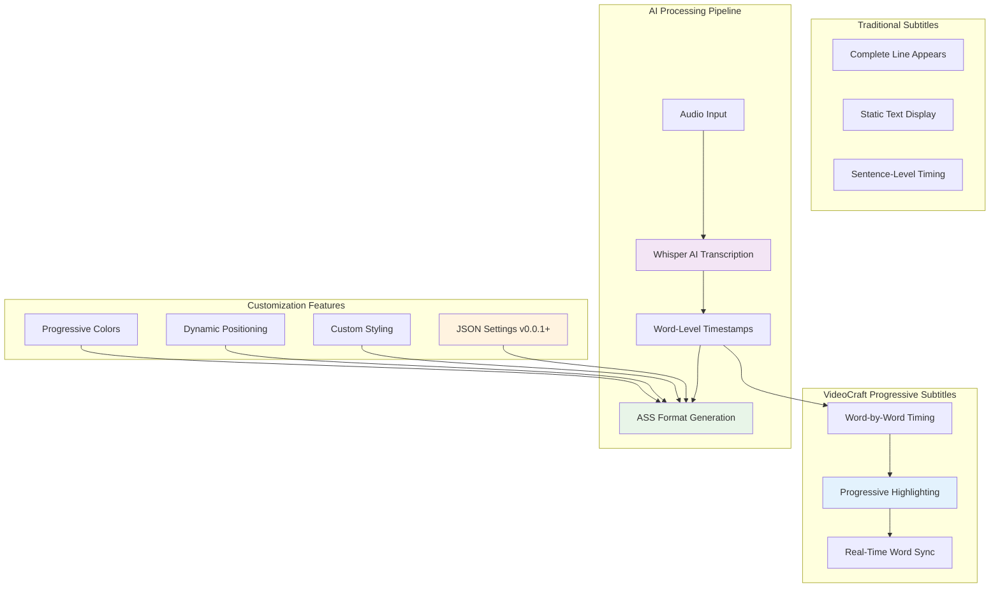
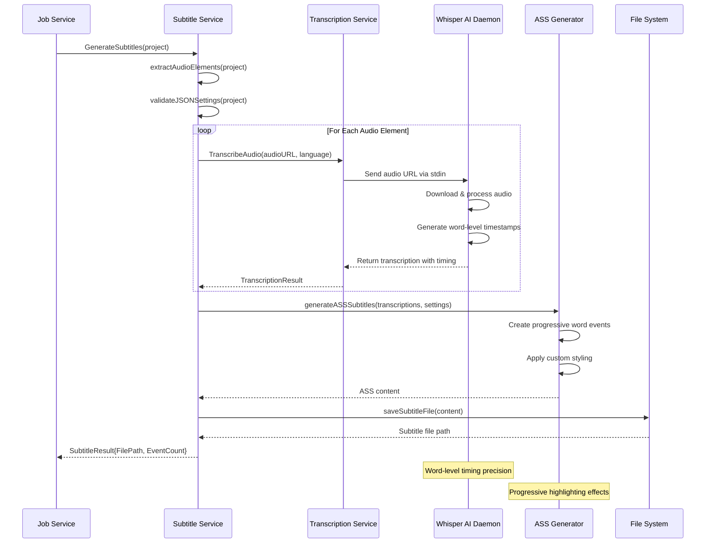

# VideoCraft Subtitle Service - Progressive AI-Powered Subtitles

The subtitle service implements VideoCraft's most innovative feature: progressive subtitles with word-by-word highlighting powered by Whisper AI transcription. This service represents a breakthrough in subtitle timing accuracy and user experience.

## 🎯 Progressive Subtitle Innovation

### The Problem Solved
Traditional subtitles appear as complete lines, making it difficult to follow along with speech. VideoCraft's progressive subtitles highlight each word as it's spoken, creating an engaging reading experience.



## 🔄 Subtitle Generation Pipeline

### Complete Processing Workflow



## 📝 JSON Settings v0.0.1+ Innovation

### Comprehensive Subtitle Customization

```go
type SubtitleSettings struct {
    // Display style
    Style        string `json:"style,omitempty"`         // "word-by-word", "line-by-line"
    
    // Typography
    FontFamily   string `json:"font-family,omitempty"`   // Font name
    FontSize     int    `json:"font-size,omitempty"`     // Font size in pixels
    
    // Progressive colors
    WordColor    string `json:"word-color,omitempty"`    // Active word color (highlighted)
    LineColor    string `json:"line-color,omitempty"`    // Inactive text color
    
    // Visual effects
    ShadowColor  string `json:"shadow-color,omitempty"`  // Text shadow color
    ShadowOffset int    `json:"shadow-offset,omitempty"` // Shadow offset in pixels
    BoxColor     string `json:"box-color,omitempty"`     // Background box color
    
    // Positioning
    Position     string `json:"position,omitempty"`      // "bottom", "top", "center"
    
    // Text outline
    OutlineColor string `json:"outline-color,omitempty"` // Text outline color
    OutlineWidth int    `json:"outline-width,omitempty"` // Outline width in pixels
}
```

### JSON Settings Usage Example:

```json
{
  "projects": [{
    "scenes": [{
      "elements": [{
        "type": "subtitles",
        "language": "en",
        "settings": {
          "style": "word-by-word",
          "font-family": "Arial",
          "font-size": 24,
          "word-color": "#FFD700",
          "line-color": "#FFFFFF",
          "shadow-color": "#000000",
          "shadow-offset": 2,
          "position": "bottom",
          "outline-color": "#000000",
          "outline-width": 1
        }
      }]
    }]
  }]
}
```

## 🛠️ Service Implementation

### Subtitle Service Interface

```go
type Service interface {
    // Validate JSON subtitle settings for a project
    ValidateJSONSubtitleSettings(project models.VideoProject) error
    
    // Generate progressive subtitles with AI transcription
    GenerateSubtitles(ctx context.Context, project models.VideoProject) (*SubtitleResult, error)
    
    // Cleanup temporary subtitle files
    CleanupTempFiles(filePath string) error
}

type SubtitleResult struct {
    FilePath   string `json:"file_path"`   // Path to generated subtitle file
    EventCount int    `json:"event_count"` // Number of subtitle events
    Format     string `json:"format"`      // Subtitle format (ass, srt)
    Duration   float64 `json:"duration"`   // Total subtitle duration
}

type service struct {
    cfg           *app.Config
    log           logger.Logger
    transcription transcription.Service
    audio         audio.Service
}
```

### Main Generation Function

```go
func (s *service) GenerateSubtitles(ctx context.Context, project models.VideoProject) (*SubtitleResult, error) {
    s.log.Info("Starting subtitle generation for project")
    
    // Extract audio elements that need transcription
    audioElements := s.extractAudioElements(project)
    if len(audioElements) == 0 {
        return nil, errors.InvalidInput("no audio elements found for subtitle generation")
    }
    
    // Validate JSON subtitle settings
    if err := s.ValidateJSONSubtitleSettings(project); err != nil {
        return nil, fmt.Errorf("subtitle settings validation failed: %w", err)
    }
    
    // Generate transcriptions for each audio element
    var allTranscriptions []TranscriptionResult
    totalDuration := 0.0
    
    for i, element := range audioElements {
        s.log.Debugf("Transcribing audio element %d: %s", i+1, element.Src)
        
        transcription, err := s.transcription.TranscribeAudio(ctx, element.Src, element.Language)
        if err != nil {
            return nil, fmt.Errorf("transcription failed for audio %s: %w", element.Src, err)
        }
        
        // Adjust timestamps for sequential audio elements
        adjustedTranscription := s.adjustTimestamps(*transcription, totalDuration)
        allTranscriptions = append(allTranscriptions, adjustedTranscription)
        
        totalDuration += transcription.Duration
    }
    
    // Get subtitle settings from project
    settings := s.extractSubtitleSettings(project)
    
    // Generate ASS subtitle file with progressive highlighting
    assContent, err := s.generateASSSubtitles(allTranscriptions, settings)
    if err != nil {
        return nil, fmt.Errorf("ASS generation failed: %w", err)
    }
    
    // Save subtitle file to temporary location
    subtitlePath, err := s.saveSubtitleFile(assContent)
    if err != nil {
        return nil, fmt.Errorf("failed to save subtitle file: %w", err)
    }
    
    // Count total events for metrics
    eventCount := 0
    for _, transcription := range allTranscriptions {
        eventCount += len(transcription.Words)
    }
    
    s.log.Infof("Subtitles generated successfully: %s (%d events, %.2fs duration)", 
        subtitlePath, eventCount, totalDuration)
    
    return &SubtitleResult{
        FilePath:   subtitlePath,
        EventCount: eventCount,
        Format:     "ass",
        Duration:   totalDuration,
    }, nil
}
```

### Audio Element Extraction

```go
func (s *service) extractAudioElements(project models.VideoProject) []models.Element {
    var audioElements []models.Element
    
    // Check project-level elements
    for _, element := range project.Elements {
        if element.Type == "audio" {
            audioElements = append(audioElements, element)
        }
    }
    
    // Check scene-level elements
    for _, scene := range project.Scenes {
        for _, element := range scene.Elements {
            if element.Type == "audio" {
                audioElements = append(audioElements, element)
            }
        }
    }
    
    return audioElements
}
```

## 🎨 ASS Subtitle Generation

### Progressive Highlighting Implementation

```go
func (s *service) generateASSSubtitles(transcriptions []TranscriptionResult, settings SubtitleSettings) (string, error) {
    // ASS file header with styling
    var ass strings.Builder
    
    // Write ASS header
    ass.WriteString("[Script Info]\n")
    ass.WriteString("Title: VideoCraft Progressive Subtitles\n")
    ass.WriteString("ScriptType: v4.00+\n")
    ass.WriteString("\n")
    
    // Write styles section with custom settings
    ass.WriteString("[V4+ Styles]\n")
    ass.WriteString("Format: Name, Fontname, Fontsize, PrimaryColour, SecondaryColour, OutlineColour, BackColour, Bold, Italic, Underline, StrikeOut, ScaleX, ScaleY, Spacing, Angle, BorderStyle, Outline, Shadow, Alignment, MarginL, MarginR, MarginV, Encoding\n")
    
    // Generate style based on JSON settings
    style := s.generateStyleFromSettings(settings)
    ass.WriteString(fmt.Sprintf("Style: %s\n", style))
    ass.WriteString("\n")
    
    // Write events section
    ass.WriteString("[Events]\n")
    ass.WriteString("Format: Layer, Start, End, Style, Name, MarginL, MarginR, MarginV, Effect, Text\n")
    
    // Generate progressive subtitle events
    for _, transcription := range transcriptions {
        events := s.generateProgressiveEvents(transcription, settings)
        for _, event := range events {
            ass.WriteString(fmt.Sprintf("Dialogue: %s\n", event))
        }
    }
    
    return ass.String(), nil
}

func (s *service) generateStyleFromSettings(settings SubtitleSettings) string {
    // Default values
    fontName := "Arial"
    fontSize := 20
    primaryColor := "&H00FFFFFF"  // White
    secondaryColor := "&H00000000" // Black
    outlineColor := "&H00000000"  // Black
    outlineWidth := 1
    shadowOffset := 2
    
    // Apply custom settings
    if settings.FontFamily != "" {
        fontName = settings.FontFamily
    }
    if settings.FontSize > 0 {
        fontSize = settings.FontSize
    }
    if settings.LineColor != "" {
        primaryColor = s.convertColorToASS(settings.LineColor)
    }
    if settings.OutlineColor != "" {
        outlineColor = s.convertColorToASS(settings.OutlineColor)
    }
    if settings.OutlineWidth > 0 {
        outlineWidth = settings.OutlineWidth
    }
    if settings.ShadowOffset > 0 {
        shadowOffset = settings.ShadowOffset
    }
    
    // Determine alignment based on position
    alignment := 2 // Bottom center
    if settings.Position == "top" {
        alignment = 8 // Top center
    } else if settings.Position == "center" {
        alignment = 5 // Center
    }
    
    return fmt.Sprintf("Default,%s,%d,%s,%s,%s,&H00000000,0,0,0,0,100,100,0,0,1,%d,%d,%d,10,10,10,1",
        fontName, fontSize, primaryColor, secondaryColor, outlineColor, outlineWidth, shadowOffset, alignment)
}
```

### Progressive Event Generation

```go
func (s *service) generateProgressiveEvents(transcription TranscriptionResult, settings SubtitleSettings) []string {
    var events []string
    
    if settings.Style == "word-by-word" || settings.Style == "" {
        events = s.generateWordByWordEvents(transcription, settings)
    } else {
        events = s.generateLineByLineEvents(transcription, settings)
    }
    
    return events
}

func (s *service) generateWordByWordEvents(transcription TranscriptionResult, settings SubtitleSettings) []string {
    var events []string
    
    // Group words into lines for better readability
    lines := s.groupWordsIntoLines(transcription.Words, 8) // Max 8 words per line
    
    for _, line := range lines {
        if len(line) == 0 {
            continue
        }
        
        startTime := line[0].Start
        endTime := line[len(line)-1].End
        
        // Generate progressive highlighting for this line
        progressiveText := s.generateProgressiveText(line, settings)
        
        event := fmt.Sprintf("0,%s,%s,Default,,%d,%d,%d,,%s",
            s.formatTime(startTime),
            s.formatTime(endTime),
            0, 0, 0, // Margins
            progressiveText)
        
        events = append(events, event)
    }
    
    return events
}

func (s *service) generateProgressiveText(words []TranscriptionWord, settings SubtitleSettings) string {
    var result strings.Builder
    
    activeColor := "&H00FFD700" // Gold
    inactiveColor := "&H00FFFFFF" // White
    
    if settings.WordColor != "" {
        activeColor = s.convertColorToASS(settings.WordColor)
    }
    if settings.LineColor != "" {
        inactiveColor = s.convertColorToASS(settings.LineColor)
    }
    
    for i, word := range words {
        if i > 0 {
            result.WriteString(" ")
        }
        
        // Create progressive highlighting effect
        // Word appears in inactive color, then highlights when spoken
        result.WriteString(fmt.Sprintf("{\\t(%s,%s,\\c%s)}%s{\\t(%s,%s,\\c%s)}",
            s.formatTimeMS(word.Start),    // Start of highlight
            s.formatTimeMS(word.Start+50), // Quick highlight transition (50ms)
            activeColor,                   // Highlight color
            word.Text,                     // Word text
            s.formatTimeMS(word.End-50),   // Start fade back
            s.formatTimeMS(word.End),      // End fade back
            inactiveColor,                 // Back to inactive color
        ))
    }
    
    return result.String()
}
```

## 🔍 JSON Settings Validation

### Comprehensive Settings Validation

```go
func (s *service) ValidateJSONSubtitleSettings(project models.VideoProject) error {
    // Check if project has subtitle elements
    hasSubtitles := false
    var settings *models.SubtitleSettings
    
    // Check scene elements for subtitles
    for _, scene := range project.Scenes {
        for _, element := range scene.Elements {
            if element.Type == "subtitles" {
                hasSubtitles = true
                if element.Settings != (models.SubtitleSettings{}) {
                    settings = &element.Settings
                }
                break
            }
        }
        if hasSubtitles {
            break
        }
    }
    
    if !hasSubtitles {
        return nil // No subtitles to validate
    }
    
    if settings == nil {
        return nil // No custom settings to validate
    }
    
    // Validate style
    if settings.Style != "" {
        validStyles := []string{"word-by-word", "line-by-line"}
        if !contains(validStyles, settings.Style) {
            return fmt.Errorf("invalid subtitle style '%s', must be one of: %v", settings.Style, validStyles)
        }
    }
    
    // Validate font size
    if settings.FontSize < 0 || settings.FontSize > 100 {
        return fmt.Errorf("font size %d out of range (0-100)", settings.FontSize)
    }
    
    // Validate colors
    colorFields := map[string]string{
        "word-color":    settings.WordColor,
        "line-color":    settings.LineColor,
        "shadow-color":  settings.ShadowColor,
        "box-color":     settings.BoxColor,
        "outline-color": settings.OutlineColor,
    }
    
    for field, color := range colorFields {
        if color != "" && !s.isValidColor(color) {
            return fmt.Errorf("invalid %s '%s', must be hex color (#RRGGBB) or named color", field, color)
        }
    }
    
    // Validate position
    if settings.Position != "" {
        validPositions := []string{"top", "center", "bottom"}
        if !contains(validPositions, settings.Position) {
            return fmt.Errorf("invalid position '%s', must be one of: %v", settings.Position, validPositions)
        }
    }
    
    // Validate numeric ranges
    if settings.ShadowOffset < 0 || settings.ShadowOffset > 10 {
        return fmt.Errorf("shadow offset %d out of range (0-10)", settings.ShadowOffset)
    }
    
    if settings.OutlineWidth < 0 || settings.OutlineWidth > 5 {
        return fmt.Errorf("outline width %d out of range (0-5)", settings.OutlineWidth)
    }
    
    return nil
}
```

## 🧹 File Management

### Temporary File Handling

```go
func (s *service) saveSubtitleFile(content string) (string, error) {
    // Create temporary filename
    filename := fmt.Sprintf("subtitles_%s.ass", 
        uuid.New().String()[:8])
    filePath := filepath.Join(s.cfg.Storage.TempDir, filename)
    
    // Ensure temp directory exists
    if err := os.MkdirAll(s.cfg.Storage.TempDir, 0755); err != nil {
        return "", fmt.Errorf("failed to create temp directory: %w", err)
    }
    
    // Write subtitle content to file
    if err := os.WriteFile(filePath, []byte(content), 0644); err != nil {
        return "", fmt.Errorf("failed to write subtitle file: %w", err)
    }
    
    s.log.Debugf("Subtitle file saved: %s", filePath)
    return filePath, nil
}

func (s *service) CleanupTempFiles(filePath string) error {
    if filePath == "" {
        return nil
    }
    
    // Safety check - only cleanup files in temp directory
    if !strings.HasPrefix(filePath, s.cfg.Storage.TempDir) {
        return fmt.Errorf("refusing to cleanup file outside temp directory: %s", filePath)
    }
    
    if err := os.Remove(filePath); err != nil && !os.IsNotExist(err) {
        return fmt.Errorf("failed to cleanup subtitle file %s: %w", filePath, err)
    }
    
    s.log.Debugf("Cleaned up subtitle file: %s", filePath)
    return nil
}
```

## 🎯 Performance Optimizations

### Efficient Word Grouping

```go
func (s *service) groupWordsIntoLines(words []TranscriptionWord, maxWordsPerLine int) [][]TranscriptionWord {
    var lines [][]TranscriptionWord
    var currentLine []TranscriptionWord
    
    for _, word := range words {
        currentLine = append(currentLine, word)
        
        // Check if we should start a new line
        if len(currentLine) >= maxWordsPerLine {
            lines = append(lines, currentLine)
            currentLine = nil
        }
    }
    
    // Add remaining words as final line
    if len(currentLine) > 0 {
        lines = append(lines, currentLine)
    }
    
    return lines
}
```

## 🔧 Configuration

### Subtitle Service Configuration:
```yaml
subtitle:
  # AI transcription settings
  whisper_model: "base"           # Whisper model size
  default_language: "auto"        # Auto-detect language
  transcription_timeout: "300s"   # 5 minutes max
  
  # Generation settings
  max_words_per_line: 8           # Words per subtitle line
  min_word_duration: 0.1          # Minimum word duration (seconds)
  highlight_transition: 50        # Highlight transition time (ms)
  
  # File management
  temp_cleanup: true              # Auto-cleanup temp files
  temp_retention: "1h"            # Keep temp files for 1 hour
  
  # Style defaults
  default_font_family: "Arial"
  default_font_size: 20
  default_position: "bottom"
  default_word_color: "#FFD700"   # Gold
  default_line_color: "#FFFFFF"   # White
```

## 🧪 Testing Strategy

### Unit Tests:
```go
func TestSubtitleService_GenerateProgressiveSubtitles(t *testing.T) {
    // Mock transcription service
    mockTranscription := &mocks.MockTranscriptionService{
        TranscribeAudioFunc: func(ctx context.Context, audioURL, language string) (*TranscriptionResult, error) {
            return &TranscriptionResult{
                Text: "Hello world this is a test",
                Words: []TranscriptionWord{
                    {Text: "Hello", Start: 0.0, End: 0.5},
                    {Text: "world", Start: 0.6, End: 1.0},
                    {Text: "this", Start: 1.1, End: 1.4},
                    {Text: "is", Start: 1.5, End: 1.7},
                    {Text: "a", Start: 1.8, End: 1.9},
                    {Text: "test", Start: 2.0, End: 2.5},
                },
                Duration: 2.5,
            }, nil
        },
    }
    
    service := NewService(cfg, logger.NewNoop(), mockTranscription, nil)
    
    project := models.VideoProject{
        Scenes: []models.Scene{{
            Elements: []models.Element{{
                Type: "audio",
                Src:  "https://example.com/audio.mp3",
            }, {
                Type: "subtitles",
                Settings: models.SubtitleSettings{
                    Style:     "word-by-word",
                    WordColor: "#FFD700",
                    LineColor: "#FFFFFF",
                },
            }},
        }},
    }
    
    result, err := service.GenerateSubtitles(context.Background(), project)
    
    assert.NoError(t, err)
    assert.NotEmpty(t, result.FilePath)
    assert.Equal(t, 6, result.EventCount) // 6 words
    assert.Equal(t, "ass", result.Format)
    assert.Equal(t, 2.5, result.Duration)
}
```

---

**Related Documentation:**
- [Transcription Service](../../services/transcription/CLAUDE.md)
- [Media Processing Layer](../CLAUDE.md)
- [Audio Service](../audio/CLAUDE.md)
- [Job Queue Integration](../../services/job/queue/CLAUDE.md)