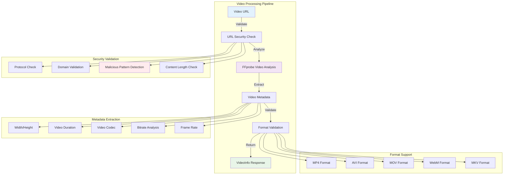
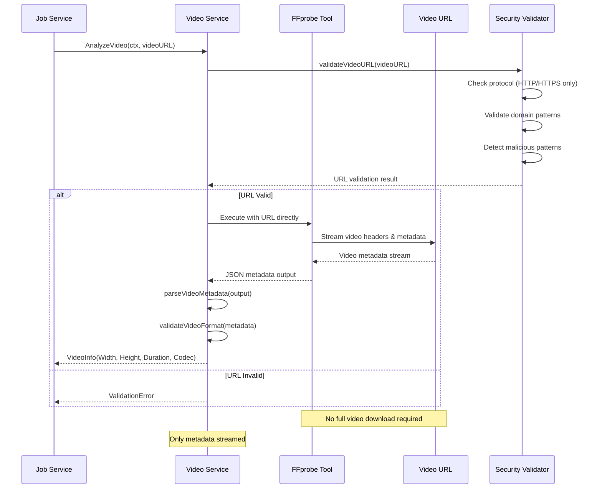
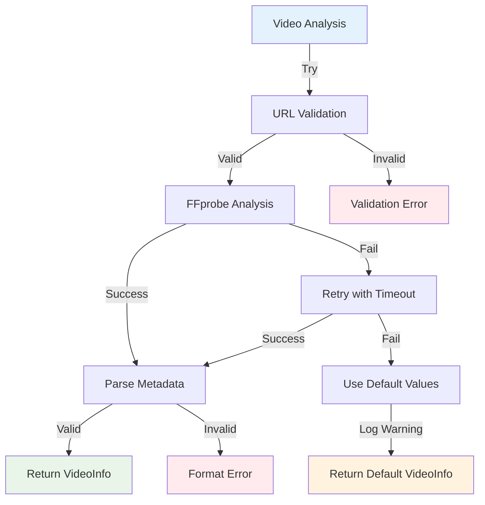

# VideoCraft Video Service - Advanced Video Analysis & Validation

The video service provides comprehensive video file analysis, validation, and metadata extraction using FFprobe technology. It implements URL-first analysis for efficient video processing without requiring file downloads.

## 🎥 Video Service Architecture



## 🔄 Video Analysis Workflow

### URL-First Video Processing



## 📊 Video Information Structure

```go
type VideoInfo struct {
    ID        string  `json:"id"`                    // Unique identifier
    Filename  string  `json:"filename"`              // Original filename
    Size      int64   `json:"size"`                  // File size in bytes
    CreatedAt string  `json:"created_at"`            // Creation timestamp
    URL       string  `json:"url,omitempty"`         // Source URL
    Width     int     `json:"width"`                 // Video width in pixels
    Height    int     `json:"height"`                // Video height in pixels
    Duration  float64 `json:"duration"`              // Duration in seconds
    Format    string  `json:"format"`                // Video format (mp4, avi, etc.)
    Codec     string  `json:"codec,omitempty"`       // Video codec (h264, hevc, etc.)
}

// GetDuration implements MediaInfo interface for job service
func (vi *VideoInfo) GetDuration() float64 {
    return vi.Duration
}
```

## 🛠️ Service Implementation

### Video Service Interface

```go
type Service interface {
    // Core video analysis - URL-first approach
    AnalyzeVideo(ctx context.Context, videoURL string) (*models.VideoInfo, error)
    
    // Quick URL validation without full analysis
    ValidateVideo(videoURL string) error
    
    // Comprehensive metadata extraction
    GetVideoMetadataFromURL(ctx context.Context, videoURL string) (*models.VideoInfo, error)
}

type service struct {
    cfg *app.Config
    log logger.Logger
}

func NewService(cfg *app.Config, log logger.Logger) Service {
    return &service{
        cfg: cfg,
        log: log,
    }
}
```

### Core Analysis Implementation

```go
func (s *service) AnalyzeVideo(ctx context.Context, videoURL string) (*models.VideoInfo, error) {
    s.log.Debugf("Analyzing video URL with FFprobe: %s", videoURL)
    
    // Get comprehensive video metadata from URL
    videoInfo, err := s.GetVideoMetadataFromURL(ctx, videoURL)
    if err != nil {
        return nil, errors.ProcessingFailed(fmt.Errorf("failed to get video metadata from URL: %w", err))
    }
    
    // Set the source URL
    videoInfo.URL = videoURL
    
    s.log.Debugf("Video analysis complete: %dx%d, duration=%.2fs, format=%s", 
        videoInfo.Width, videoInfo.Height, videoInfo.Duration, videoInfo.Format)
    
    return videoInfo, nil
}

func (s *service) GetVideoMetadataFromURL(ctx context.Context, videoURL string) (*models.VideoInfo, error) {
    s.log.Debugf("Extracting video metadata from URL: %s", videoURL)
    
    // Validate URL before processing
    if err := s.ValidateVideo(videoURL); err != nil {
        return nil, fmt.Errorf("video URL validation failed: %w", err)
    }
    
    // Use FFprobe to extract metadata directly from URL
    cmd := exec.CommandContext(ctx, "ffprobe",
        "-v", "quiet",
        "-print_format", "json",
        "-show_format",
        "-show_streams",
        videoURL)
    
    output, err := cmd.Output()
    if err != nil {
        return nil, fmt.Errorf("ffprobe failed for video URL %s: %w", videoURL, err)
    }
    
    // Parse the FFprobe output
    return s.parseVideoMetadata(string(output), videoURL)
}
```

## 🔒 Security Validation

### Comprehensive URL Security

```go
func (s *service) ValidateVideo(videoURL string) error {
    s.log.Debugf("Validating video URL: %s", videoURL)
    
    // Basic URL format validation
    if err := s.validateVideoURL(videoURL); err != nil {
        return fmt.Errorf("invalid video URL format: %w", err)
    }
    
    // Security pattern detection
    if err := s.detectMaliciousPatterns(videoURL); err != nil {
        return fmt.Errorf("security validation failed: %w", err)
    }
    
    // Protocol validation
    if err := s.validateProtocol(videoURL); err != nil {
        return fmt.Errorf("invalid protocol: %w", err)
    }
    
    return nil
}

func (s *service) validateVideoURL(videoURL string) error {
    if videoURL == "" {
        return errors.New("video URL cannot be empty")
    }
    
    // Parse URL
    parsedURL, err := url.Parse(videoURL)
    if err != nil {
        return fmt.Errorf("invalid URL format: %w", err)
    }
    
    // Validate host
    if parsedURL.Host == "" {
        return errors.New("URL must have a valid host")
    }
    
    // Check URL length
    if len(videoURL) > 2048 {
        return errors.New("URL too long (max 2048 characters)")
    }
    
    return nil
}

func (s *service) validateProtocol(videoURL string) error {
    parsedURL, err := url.Parse(videoURL)
    if err != nil {
        return err
    }
    
    // Only allow HTTP and HTTPS
    if parsedURL.Scheme != "http" && parsedURL.Scheme != "https" {
        return fmt.Errorf("unsupported protocol '%s', only HTTP and HTTPS are allowed", parsedURL.Scheme)
    }
    
    return nil
}

func (s *service) detectMaliciousPatterns(videoURL string) error {
    // List of suspicious patterns
    maliciousPatterns := []string{
        "javascript:",     // Script injection
        "data:",          // Data URLs
        "file:",          // Local file access
        "ftp:",           // FTP protocol
        "localhost",      // Local development
        "127.0.0.1",     // Loopback
        "192.168.",      // Private network
        "10.",           // Private network
        "172.",          // Private network
        ".onion",        // Tor domains
    }
    
    urlLower := strings.ToLower(videoURL)
    for _, pattern := range maliciousPatterns {
        if strings.Contains(urlLower, pattern) {
            s.log.Warnf("Malicious pattern detected in video URL: %s (pattern: %s)", videoURL, pattern)
            return fmt.Errorf("URL contains suspicious pattern: %s", pattern)
        }
    }
    
    return nil
}
```

## 📈 Metadata Parsing

### Advanced FFprobe Output Processing

```go
func (s *service) parseVideoMetadata(jsonOutput, videoURL string) (*models.VideoInfo, error) {
    var probe FFProbeOutput
    if err := json.Unmarshal([]byte(jsonOutput), &probe); err != nil {
        return nil, fmt.Errorf("failed to parse ffprobe output: %w", err)
    }
    
    // Extract format information
    duration, err := strconv.ParseFloat(probe.Format.Duration, 64)
    if err != nil {
        return nil, fmt.Errorf("failed to parse video duration: %w", err)
    }
    
    size, _ := strconv.ParseInt(probe.Format.Size, 10, 64)
    
    // Find video stream for dimensions and codec
    var width, height int
    var codec string
    var frameRate float64
    
    for _, stream := range probe.Streams {
        if stream.CodecType == "video" {
            width = stream.Width
            height = stream.Height
            codec = stream.CodecName
            
            // Parse frame rate
            if stream.RFrameRate != "" {
                frameRate = s.parseFrameRate(stream.RFrameRate)
            }
            break
        }
    }
    
    // Validate video dimensions
    if width <= 0 || height <= 0 {
        return nil, errors.New("invalid video dimensions")
    }
    
    // Determine format from filename or format info
    format := s.determineVideoFormat(probe.Format.FormatName, videoURL)
    
    videoInfo := &models.VideoInfo{
        ID:        generateVideoID(),
        Filename:  extractFilename(videoURL),
        Size:      size,
        CreatedAt: time.Now().Format(time.RFC3339),
        URL:       videoURL,
        Width:     width,
        Height:    height,
        Duration:  duration,
        Format:    format,
        Codec:     codec,
    }
    
    // Validate the extracted information
    if err := s.validateVideoInfo(videoInfo); err != nil {
        return nil, fmt.Errorf("video validation failed: %w", err)
    }
    
    return videoInfo, nil
}

// FFprobe output structures for video
type FFProbeOutput struct {
    Streams []VideoStream `json:"streams"`
    Format  VideoFormat   `json:"format"`
}

type VideoStream struct {
    Index      int    `json:"index"`
    CodecName  string `json:"codec_name"`
    CodecType  string `json:"codec_type"`
    Width      int    `json:"width"`
    Height     int    `json:"height"`
    RFrameRate string `json:"r_frame_rate"`
    PixFmt     string `json:"pix_fmt"`
    BitRate    string `json:"bit_rate"`
}

type VideoFormat struct {
    Filename   string `json:"filename"`
    Duration   string `json:"duration"`
    Size       string `json:"size"`
    BitRate    string `json:"bit_rate"`
    FormatName string `json:"format_name"`
}
```

## 🎯 Format Detection & Validation

### Smart Format Recognition

```go
func (s *service) determineVideoFormat(formatName, videoURL string) string {
    // Check format name from FFprobe
    formatMap := map[string]string{
        "mov,mp4,m4a,3gp,3g2,mj2": "mp4",
        "avi":                      "avi",
        "matroska,webm":           "webm",
        "asf":                     "wmv",
        "flv":                     "flv",
    }
    
    for probe, format := range formatMap {
        if strings.Contains(strings.ToLower(formatName), probe) {
            return format
        }
    }
    
    // Fallback to file extension
    ext := strings.ToLower(filepath.Ext(videoURL))
    switch ext {
    case ".mp4":
        return "mp4"
    case ".avi":
        return "avi"
    case ".mov":
        return "mov"
    case ".webm":
        return "webm"
    case ".mkv":
        return "mkv"
    default:
        return "unknown"
    }
}

func (s *service) validateVideoInfo(info *models.VideoInfo) error {
    // Validate dimensions
    if info.Width < 1 || info.Width > 7680 { // Max 8K width
        return fmt.Errorf("invalid video width: %d", info.Width)
    }
    
    if info.Height < 1 || info.Height > 4320 { // Max 8K height
        return fmt.Errorf("invalid video height: %d", info.Height)
    }
    
    // Validate duration
    if info.Duration < 0 {
        return errors.New("video duration cannot be negative")
    }
    
    if info.Duration > 3600 { // Max 1 hour
        return fmt.Errorf("video duration %.2f seconds exceeds maximum allowed (3600s)", info.Duration)
    }
    
    // Validate format
    supportedFormats := []string{"mp4", "avi", "mov", "webm", "mkv"}
    if !contains(supportedFormats, info.Format) {
        return fmt.Errorf("unsupported video format: %s", info.Format)
    }
    
    return nil
}
```

## 🚀 Performance Optimizations

### Efficient Metadata Extraction

```go
func (s *service) parseFrameRate(frameRateStr string) float64 {
    // Parse frame rate string like "30/1" or "29.97"
    if strings.Contains(frameRateStr, "/") {
        parts := strings.Split(frameRateStr, "/")
        if len(parts) == 2 {
            num, err1 := strconv.ParseFloat(parts[0], 64)
            den, err2 := strconv.ParseFloat(parts[1], 64)
            if err1 == nil && err2 == nil && den != 0 {
                return num / den
            }
        }
    } else {
        frameRate, err := strconv.ParseFloat(frameRateStr, 64)
        if err == nil {
            return frameRate
        }
    }
    
    return 0.0 // Unknown frame rate
}

func generateVideoID() string {
    return uuid.New().String()
}

func extractFilename(videoURL string) string {
    parsedURL, err := url.Parse(videoURL)
    if err != nil {
        return "unknown"
    }
    
    filename := filepath.Base(parsedURL.Path)
    if filename == "" || filename == "." {
        return "video"
    }
    
    return filename
}
```

## 🔄 Integration with Job Service

### Job Service Integration

```go
// Example of how video service integrates with job processing
func (js *jobService) analyzeVideoElements(ctx context.Context, project *models.VideoProject) error {
    for elementIdx := range project.Elements {
        element := &project.Elements[elementIdx]
        
        if element.Type == "video" {
            js.log.Debugf("Analyzing background video URL: %s", element.Src)
            
            videoInfo, err := js.video.AnalyzeVideo(ctx, element.Src)
            if err != nil {
                js.log.Warnf("Failed to analyze video '%s': %v, using default duration", element.Src, err)
                element.Duration = 30.0 // Fallback duration
            } else {
                element.Duration = videoInfo.GetDuration()
                js.log.Debugf("Video duration: %.2fs", element.Duration)
            }
        }
    }
    
    return nil
}
```

## 🛡️ Error Handling & Resilience

### Robust Error Recovery



### Error Handling Implementation

```go
func (s *service) AnalyzeVideoWithFallback(ctx context.Context, videoURL string) (*models.VideoInfo, error) {
    // Primary analysis attempt
    videoInfo, err := s.AnalyzeVideo(ctx, videoURL)
    if err != nil {
        s.log.Warnf("Primary video analysis failed for '%s': %v, using fallback", videoURL, err)
        
        // Return fallback VideoInfo for non-critical errors
        if !isCriticalError(err) {
            return &models.VideoInfo{
                URL:      videoURL,
                Width:    1920,  // Default HD width
                Height:   1080,  // Default HD height
                Duration: 30.0,  // Default 30 seconds
                Format:   "mp4", // Default format
                Codec:    "h264", // Default codec
            }, nil
        }
        
        return nil, err
    }
    
    return videoInfo, nil
}

func isCriticalError(err error) bool {
    criticalPatterns := []string{
        "malicious pattern",
        "unsupported protocol",
        "invalid URL format",
    }
    
    errStr := strings.ToLower(err.Error())
    for _, pattern := range criticalPatterns {
        if strings.Contains(errStr, pattern) {
            return true
        }
    }
    
    return false
}
```

## 🔧 Configuration

### Video Service Configuration

```yaml
video:
  # Analysis settings
  analysis_timeout: "30s"
  max_duration: 3600          # 1 hour maximum
  min_duration: 0.1           # 100ms minimum
  
  # Format support
  supported_formats:
    - "mp4"
    - "avi"
    - "mov"
    - "webm"
    - "mkv"
    - "flv"
  
  # Quality limits
  max_width: 7680             # 8K maximum
  max_height: 4320            # 8K maximum
  min_width: 1                # Minimum dimension
  min_height: 1               # Minimum dimension
  
  # URL validation
  max_url_length: 2048
  allowed_protocols: ["http", "https"]
  
  # Fallback settings
  fallback_width: 1920        # Default HD width
  fallback_height: 1080       # Default HD height
  fallback_duration: 30.0     # Default duration
  enable_fallback: true

ffmpeg:
  probe_path: "ffprobe"
  timeout: "30s"
  max_probe_size: "50M"       # Limit metadata reading
```

## 🧪 Testing Strategy

### Unit Tests

```go
func TestVideoService_AnalyzeVideo(t *testing.T) {
    tests := []struct {
        name     string
        videoURL string
        expected *models.VideoInfo
        wantErr  bool
    }{
        {
            name:     "valid mp4 video",
            videoURL: "https://example.com/video.mp4",
            expected: &models.VideoInfo{
                Width:    1920,
                Height:   1080,
                Duration: 120.5,
                Format:   "mp4",
                Codec:    "h264",
            },
            wantErr: false,
        },
        {
            name:     "malicious URL",
            videoURL: "javascript:alert('xss')",
            wantErr:  true,
        },
        {
            name:     "unsupported protocol",
            videoURL: "ftp://example.com/video.mp4",
            wantErr:  true,
        },
    }
    
    for _, tt := range tests {
        t.Run(tt.name, func(t *testing.T) {
            service := NewService(cfg, logger.NewNoop())
            result, err := service.AnalyzeVideo(context.Background(), tt.videoURL)
            
            if tt.wantErr {
                assert.Error(t, err)
                return
            }
            
            assert.NoError(t, err)
            assert.Equal(t, tt.expected.Width, result.Width)
            assert.Equal(t, tt.expected.Height, result.Height)
            assert.Equal(t, tt.expected.Format, result.Format)
        })
    }
}
```

### Security Tests

```go
func TestVideoService_SecurityValidation(t *testing.T) {
    maliciousURLs := []string{
        "javascript:alert('xss')",
        "data:text/html,<script>alert('xss')</script>",
        "file:///etc/passwd",
        "ftp://malicious.com/video.mp4",
        "http://localhost:8080/admin",
        "https://192.168.1.1/internal",
    }
    
    service := NewService(cfg, logger.NewNoop())
    
    for _, maliciousURL := range maliciousURLs {
        t.Run(maliciousURL, func(t *testing.T) {
            err := service.ValidateVideo(maliciousURL)
            assert.Error(t, err, "Should reject malicious URL: %s", maliciousURL)
        })
    }
}
```

---

**Related Documentation:**
- [Media Processing Layer](../CLAUDE.md)
- [Audio Service](../audio/CLAUDE.md)
- [Image Service](../image/CLAUDE.md)
- [Job Queue Integration](../../services/job/queue/CLAUDE.md)