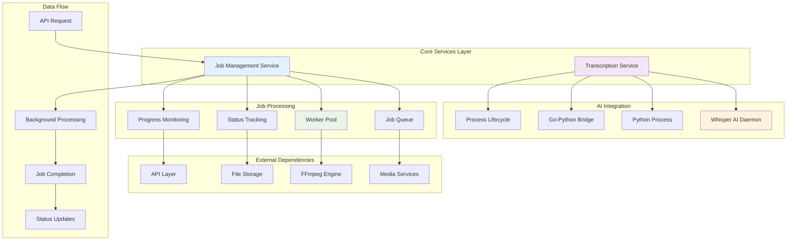
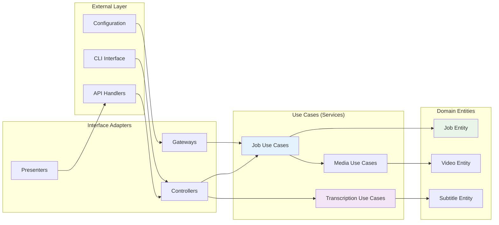
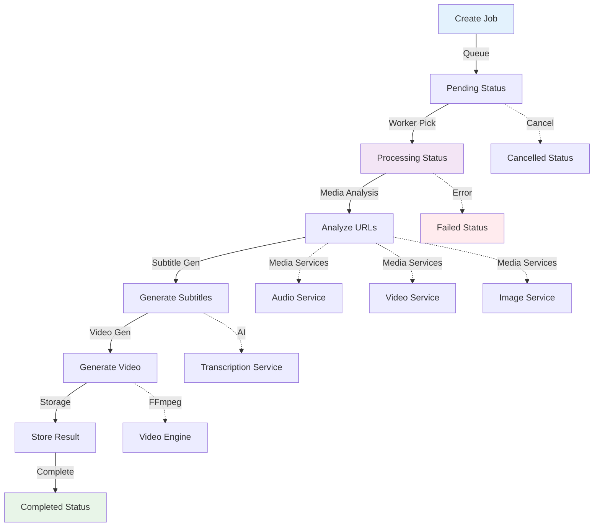
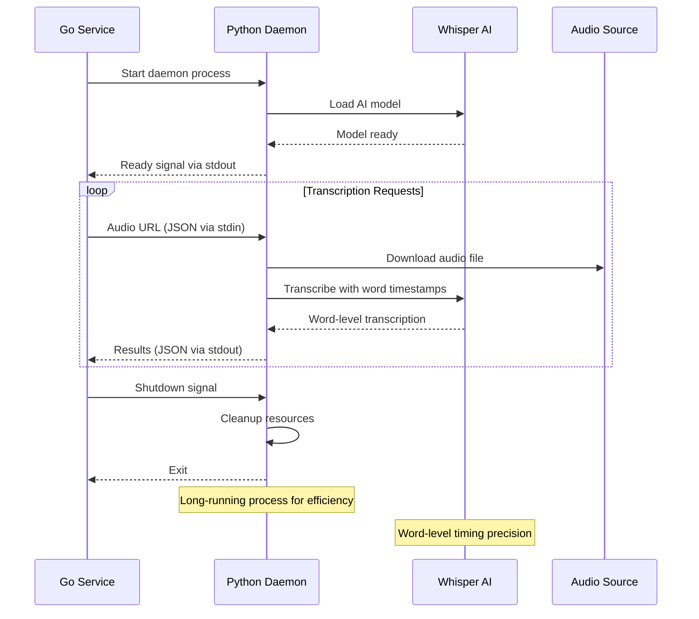
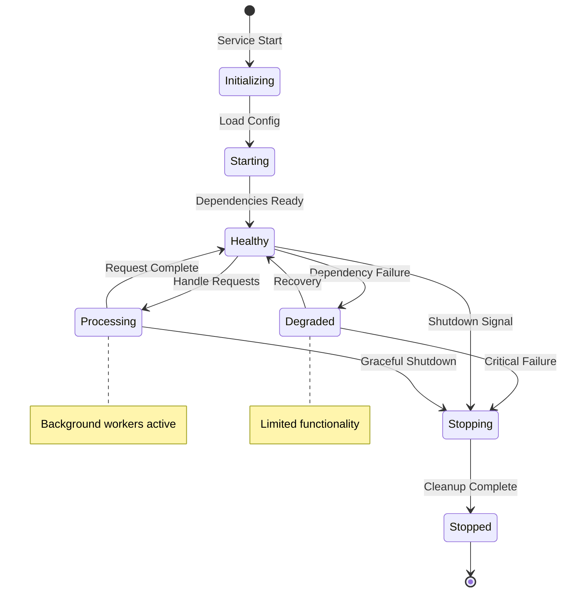

# VideoCraft Core Services - Business Logic & Processing Engine

The core services layer implements VideoCraft's essential business logic and processing capabilities. This layer orchestrates complex workflows including job management, AI transcription, and asynchronous video processing while maintaining clean separation of concerns.

## 🏗️ Services Architecture



## 📁 Services Package Structure

```
internal/core/services/
├── job/                    # Job management and processing
│   ├── models/            # Job-specific models and types
│   ├── queue/             # Asynchronous job queue implementation
│   │   └── queue.go      # Job queue service with worker pool
│   └── status/            # Job status tracking and management
└── transcription/         # AI-powered transcription service
    └── whisper.go         # Whisper AI integration with Python daemon
```

## 🔄 Service Integration Patterns

### Clean Architecture Implementation



## 🎯 Job Management Service

### Asynchronous Job Processing Architecture

The job service implements a sophisticated asynchronous processing system with the following key components:

#### Job Queue System
- **Worker Pool**: Configurable number of concurrent workers
- **Job Prioritization**: Priority-based job scheduling
- **Progress Tracking**: Real-time progress updates
- **Error Handling**: Comprehensive error recovery and retry logic
- **Resource Management**: Memory and CPU limit enforcement

#### Job Processing Pipeline


### Key Features:
- **Media Service Integration**: Uses specialized media services for URL analysis
- **Progressive Subtitle Generation**: AI-powered word-level timing
- **Resource Optimization**: URL-first analysis without downloads
- **Fault Tolerance**: Automatic retry and fallback mechanisms
- **Scalability**: Horizontal scaling support with stateless design

## 🤖 Transcription Service

### AI-Powered Whisper Integration

The transcription service implements a revolutionary Python-Go integration for efficient AI transcription:

#### Python Daemon Architecture


### Innovation Features:
- **Word-Level Timestamps**: Precise timing for progressive subtitles
- **Language Auto-Detection**: Automatic language identification
- **Model Flexibility**: Support for different Whisper model sizes
- **Resource Efficiency**: Persistent daemon for multiple requests
- **Error Recovery**: Automatic daemon restart on failures

#### Communication Protocol
```go
// Transcription request structure
type TranscriptionRequest struct {
    AudioURL string `json:"audio_url"`
    Language string `json:"language,omitempty"`
    Model    string `json:"model,omitempty"`
}

// Transcription response structure
type TranscriptionResult struct {
    Text     string              `json:"text"`
    Language string              `json:"language"`
    Duration float64             `json:"duration"`
    Words    []TranscriptionWord `json:"words"`
}

type TranscriptionWord struct {
    Text  string  `json:"text"`
    Start float64 `json:"start"`
    End   float64 `json:"end"`
}
```

## 📊 Service Interfaces & Contracts

### Unified Service Interfaces

```go
// Job Service Interface
type JobService interface {
    // Job lifecycle management
    CreateJob(config *models.VideoConfigArray) (*models.Job, error)
    GetJob(jobID string) (*models.Job, error)
    ListJobs() ([]*models.Job, error)
    ProcessJob(ctx context.Context, job *models.Job) error
    CancelJob(jobID string) error
    
    // Status and progress tracking
    UpdateJobStatus(id string, status models.JobStatus, errorMsg string) error
    UpdateJobProgress(id string, progress int) error
    
    // Service lifecycle
    Start() error
    Stop() error
}

// Transcription Service Interface
type TranscriptionService interface {
    // Core transcription capabilities
    TranscribeAudio(ctx context.Context, audioURL, language string) (*TranscriptionResult, error)
    
    // Service lifecycle management
    Start() error
    Stop() error
    Shutdown() error
    
    // Health and status
    IsHealthy() bool
    GetStatus() ServiceStatus
}
```

### Service Dependencies
Services follow dependency inversion principle with clear interfaces:

```go
// Job service dependencies
type JobServiceDependencies struct {
    FFmpeg        FFmpegService        // Video generation engine
    Subtitle      SubtitleService      // Progressive subtitle generation
    Storage       StorageService       // File storage management
    Audio         AudioService         // Audio analysis and processing
    Video         VideoService         // Video analysis and validation
    Image         ImageService         // Image processing and validation
    Logger        logger.Logger        // Structured logging
    Config        *app.Config         // Configuration management
}

// Transcription service dependencies
type TranscriptionServiceDependencies struct {
    Config        *app.Config         // Whisper configuration
    Logger        logger.Logger       // Process logging
    ProcessManager ProcessManager      // Python process management
}
```

## 🔄 Service Lifecycle Management

### Graceful Service Management



### Service Initialization
```go
func (s *Services) Initialize() error {
    // Initialize services in dependency order
    services := []struct {
        name string
        init func() error
    }{
        {"transcription", s.Transcription.Start},
        {"job_queue", s.Job.Start},
    }
    
    for _, service := range services {
        if err := service.init(); err != nil {
            return fmt.Errorf("failed to initialize %s service: %w", service.name, err)
        }
        s.log.Infof("%s service initialized successfully", service.name)
    }
    
    return nil
}

func (s *Services) Shutdown() {
    s.log.Info("Initiating graceful service shutdown")
    
    // Shutdown in reverse dependency order
    if s.Job != nil {
        if err := s.Job.Stop(); err != nil {
            s.log.Errorf("Error stopping job service: %v", err)
        }
    }
    
    if s.Transcription != nil {
        s.Transcription.Shutdown()
    }
    
    s.log.Info("Service shutdown complete")
}
```

## 📈 Performance Characteristics

### Asynchronous Processing Benefits
- **Non-blocking Operations**: API responses immediately with job ID
- **Scalable Workers**: Configurable worker pool for concurrent processing
- **Resource Efficiency**: URL-first analysis reduces bandwidth and storage
- **Progress Tracking**: Real-time progress updates for long-running jobs

### AI Integration Efficiency
- **Persistent Daemon**: Avoid model loading overhead for each request
- **Streaming Communication**: JSON-based stdin/stdout communication
- **Resource Management**: Controlled memory and CPU usage
- **Process Isolation**: Python process isolation for stability

### Performance Metrics
```go
type ServiceMetrics struct {
    // Job processing metrics
    JobsProcessed     int64         `json:"jobs_processed"`
    AverageJobTime    time.Duration `json:"average_job_time"`
    ActiveWorkers     int           `json:"active_workers"`
    QueueSize         int           `json:"queue_size"`
    
    // Transcription metrics
    TranscriptionsComplete int64         `json:"transcriptions_complete"`
    AverageTranscriptTime  time.Duration `json:"average_transcript_time"`
    DaemonRestarts         int64         `json:"daemon_restarts"`
    
    // Resource usage
    MemoryUsage       int64         `json:"memory_usage_bytes"`
    CPUUsage          float64       `json:"cpu_usage_percent"`
    DiskUsage         int64         `json:"disk_usage_bytes"`
}
```

## 🛡️ Error Handling & Resilience

### Comprehensive Error Recovery

```go
type ServiceError struct {
    Service   string    `json:"service"`
    Operation string    `json:"operation"`
    Message   string    `json:"message"`
    Code      string    `json:"code"`
    Timestamp time.Time `json:"timestamp"`
    Retryable bool      `json:"retryable"`
}

func (s *service) handleError(operation string, err error) *ServiceError {
    serviceErr := &ServiceError{
        Service:   s.serviceName,
        Operation: operation,
        Message:   err.Error(),
        Code:      determineErrorCode(err),
        Timestamp: time.Now(),
        Retryable: isRetryableError(err),
    }
    
    // Log error with appropriate level
    if serviceErr.Retryable {
        s.log.Warnf("Retryable error in %s.%s: %v", serviceErr.Service, serviceErr.Operation, err)
    } else {
        s.log.Errorf("Critical error in %s.%s: %v", serviceErr.Service, serviceErr.Operation, err)
    }
    
    return serviceErr
}
```

### Retry Mechanisms
```go
func (s *service) executeWithRetry(operation func() error, maxRetries int) error {
    var lastErr error
    
    for attempt := 0; attempt <= maxRetries; attempt++ {
        err := operation()
        if err == nil {
            return nil
        }
        
        lastErr = err
        if !isRetryableError(err) {
            break
        }
        
        if attempt < maxRetries {
            backoff := time.Duration(math.Pow(2, float64(attempt))) * time.Second
            s.log.Warnf("Operation failed (attempt %d/%d), retrying in %v: %v", 
                attempt+1, maxRetries+1, backoff, err)
            time.Sleep(backoff)
        }
    }
    
    return fmt.Errorf("operation failed after %d attempts: %w", maxRetries+1, lastErr)
}
```

## 🔧 Configuration

### Services Configuration
```yaml
services:
  job:
    workers: 2
    queue_size: 100
    process_timeout: "30m"
    retry_attempts: 3
    retry_delay: "5s"
    
    # Resource limits
    max_concurrent: 5
    memory_limit: "2GB"
    cpu_limit: 1.0
    
  transcription:
    whisper:
      model: "base"              # base, small, medium, large
      language: "auto"           # auto-detect or specific language
      python_path: "python3"
      script_path: "./scripts/whisper_daemon.py"
      
    daemon:
      startup_timeout: "30s"
      process_timeout: "300s"    # 5 minutes per transcription
      max_restarts: 5
      restart_delay: "10s"
      
    resources:
      memory_limit: "1GB"
      cpu_limit: 2.0
      temp_cleanup: true

logging:
  level: "info"
  format: "json"
  service_metrics: true
  performance_tracking: true
```

## 🧪 Testing Strategy

### Service Testing Patterns

```go
func TestJobService_ProcessJobWithMediaServices(t *testing.T) {
    // Setup mock services
    mockAudio := &mocks.MockAudioService{
        AnalyzeAudioFunc: func(ctx context.Context, url string) (*audio.AudioInfo, error) {
            return &audio.AudioInfo{Duration: 30.0}, nil
        },
    }
    
    mockVideo := &mocks.MockVideoService{
        AnalyzeVideoFunc: func(ctx context.Context, url string) (*models.VideoInfo, error) {
            return &models.VideoInfo{Duration: 60.0}, nil
        },
    }
    
    // Create job service with mocked dependencies
    jobService := NewJobService(cfg, logger.NewNoop(), 
        mockFFmpeg, mockSubtitle, mockStorage, 
        mockAudio, mockVideo, mockImage)
    
    // Test job processing
    job := &models.Job{
        ID: "test-job-123",
        Config: models.VideoConfigArray{
            {
                Scenes: []models.Scene{{
                    Elements: []models.Element{{
                        Type: "audio",
                        Src:  "https://example.com/audio.mp3",
                    }},
                }},
            },
        },
    }
    
    err := jobService.ProcessJob(context.Background(), job)
    assert.NoError(t, err)
}
```

### Integration Testing
- **End-to-End Workflows**: Complete job processing from creation to completion
- **Service Communication**: Inter-service communication and data flow
- **Error Scenarios**: Failure handling and recovery testing
- **Performance Testing**: Load testing with multiple concurrent jobs

---

**Related Documentation:**
- [Job Queue Service](job/queue/CLAUDE.md)
- [Transcription Service](transcription/CLAUDE.md)
- [Media Services Integration](../media/CLAUDE.md)
- [Video Engine](../video/CLAUDE.md)