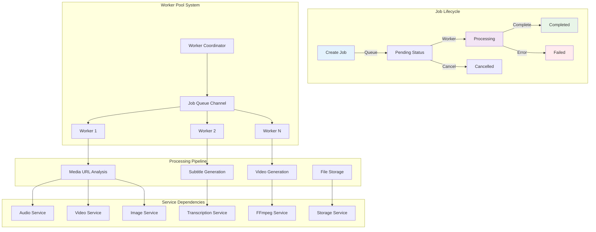
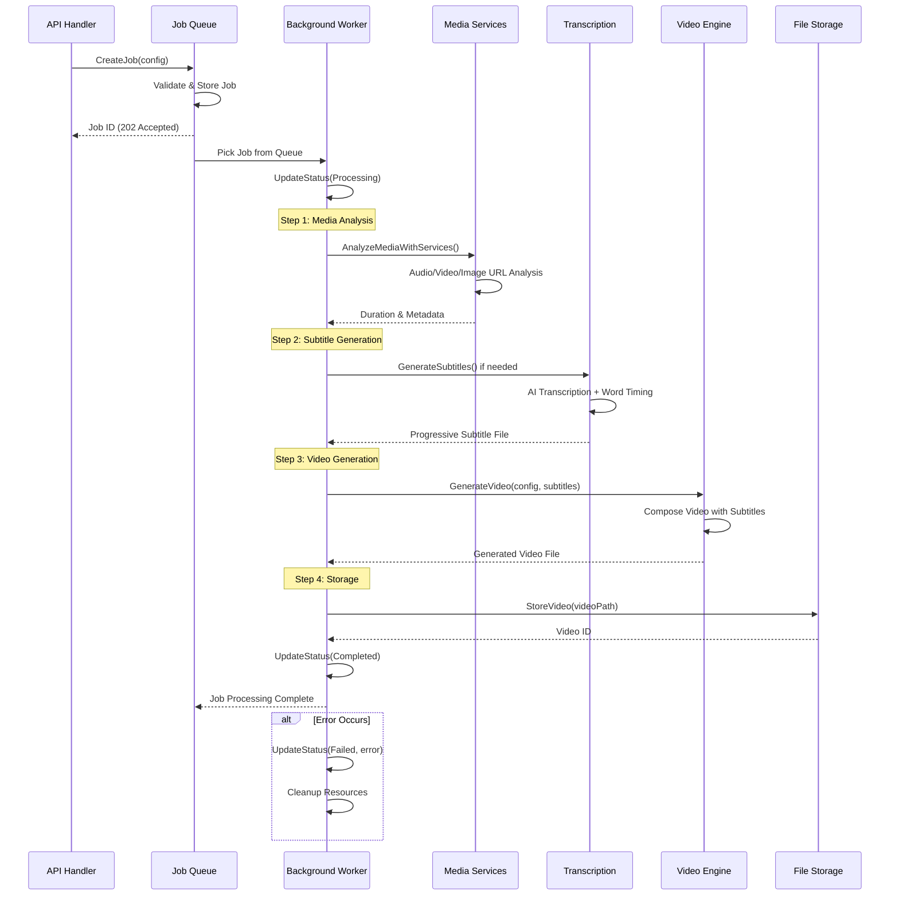

# VideoCraft Job Queue Service - Asynchronous Video Processing Engine

The job queue service is the heart of VideoCraft's asynchronous processing system. It orchestrates complex video generation workflows using a worker pool architecture, integrating media services, AI transcription, and FFmpeg video generation.

## 🔄 Job Queue Architecture



## 🎯 Service Implementation

### Job Queue Service Structure

```go
type Service interface {
    // Job lifecycle management
    CreateJob(config *models.VideoConfigArray) (*models.Job, error)
    GetJob(jobID string) (*models.Job, error)
    ListJobs() ([]*models.Job, error)
    ProcessJob(ctx context.Context, job *models.Job) error
    CancelJob(jobID string) error
    
    // Status and progress tracking
    UpdateJobStatus(id string, status models.JobStatus, errorMsg string) error
    UpdateJobProgress(id string, progress int) error
    
    // Worker pool management
    Start() error
    Stop() error
}

type service struct {
    cfg *app.Config
    log logger.Logger
    
    // Job storage and synchronization
    jobs     map[string]*models.Job
    mu       sync.RWMutex
    jobQueue chan *models.Job
    workers  int
    
    // Service dependencies - Core services
    ffmpeg   FFmpegService
    subtitle SubtitleService
    storage  StorageService
    
    // Service dependencies - Media services
    audio AudioService
    video VideoService
    image ImageService
}
```

### Job Creation and Validation

```go
func (js *service) CreateJob(config *models.VideoConfigArray) (*models.Job, error) {
    js.log.Debug("Creating new job")
    
    // Validate configuration structure
    if err := config.Validate(); err != nil {
        return nil, errors.InvalidInput(err.Error())
    }
    
    // Validate JSON subtitle settings for each project
    for _, project := range *config {
        if err := js.subtitle.ValidateJSONSubtitleSettings(project); err != nil {
            return nil, errors.InvalidInput(fmt.Sprintf("subtitle validation failed: %v", err))
        }
    }
    
    // Create job with unique ID
    job := &models.Job{
        ID:        uuid.New().String(),
        Status:    models.JobStatusPending,
        Config:    *config,
        Progress:  0,
        CreatedAt: time.Now(),
        UpdatedAt: time.Now(),
    }
    
    // Store job in memory map
    js.mu.Lock()
    js.jobs[job.ID] = job
    js.mu.Unlock()
    
    // Queue job for background processing
    select {
    case js.jobQueue <- job:
        js.log.Infof("Job created and queued: %s", job.ID)
    default:
        // Queue is full - return error
        js.mu.Lock()
        delete(js.jobs, job.ID)
        js.mu.Unlock()
        return nil, errors.InternalError(fmt.Errorf("job queue is full"))
    }
    
    return job, nil
}
```

## 🔄 Job Processing Pipeline

### Complete Video Generation Workflow



### Media Analysis with Services

```go
func (js *service) analyzeMediaWithServices(ctx context.Context, config *models.VideoConfigArray) error {
    js.log.Info("Starting media URL analysis with media services")
    
    for projectIdx := range *config {
        project := &(*config)[projectIdx] // Get pointer to modify original
        
        // Analyze scene elements for duration and validation
        for sceneIdx := range project.Scenes {
            for elementIdx := range project.Scenes[sceneIdx].Elements {
                element := &project.Scenes[sceneIdx].Elements[elementIdx]
                
                switch element.Type {
                case "audio":
                    js.log.Debugf("Analyzing audio URL: %s", element.Src)
                    audioInfo, err := js.audio.AnalyzeAudio(ctx, element.Src)
                    if err != nil {
                        js.log.Warnf("Failed to analyze audio '%s': %v, using default duration", element.Src, err)
                        element.Duration = 10.0 // Fallback duration
                    } else {
                        element.Duration = audioInfo.GetDuration()
                        js.log.Debugf("Audio duration: %.2fs", element.Duration)
                    }
                    
                case "image":
                    js.log.Debugf("Validating image URL: %s", element.Src)
                    if err := js.image.ValidateImage(element.Src); err != nil {
                        js.log.Errorf("Failed to validate image '%s': %v", element.Src, err)
                        return fmt.Errorf("invalid image URL '%s': %w", element.Src, err)
                    }
                    js.log.Debugf("Image URL validated successfully")
                }
            }
        }
        
        // Analyze background elements (video, image, etc.)
        for elementIdx := range project.Elements {
            element := &project.Elements[elementIdx]
            switch element.Type {
            case "video":
                js.log.Debugf("Analyzing background video URL: %s", element.Src)
                videoInfo, err := js.video.AnalyzeVideo(ctx, element.Src)
                if err != nil {
                    js.log.Warnf("Failed to analyze video '%s': %v, using default duration", element.Src, err)
                    element.Duration = 30.0 // Fallback duration
                } else {
                    element.Duration = videoInfo.GetDuration()
                    js.log.Debugf("Video duration: %.2fs", element.Duration)
                }
                
            case "image":
                js.log.Debugf("Validating background image URL: %s", element.Src)
                if err := js.image.ValidateImage(element.Src); err != nil {
                    js.log.Errorf("Failed to validate background image '%s': %v", element.Src, err)
                    return fmt.Errorf("invalid background image URL '%s': %w", element.Src, err)
                }
                js.log.Debugf("Background image URL validated successfully")
            }
        }
    }
    
    js.log.Info("Media URL analysis completed")
    return nil
}
```

## 🎬 Complete Job Processing Implementation

### Main Processing Function

```go
func (js *service) ProcessJob(ctx context.Context, job *models.Job) error {
    js.log.Infof("Processing job: %s", job.ID)
    
    // Update status to processing
    if err := js.UpdateJobStatus(job.ID, models.JobStatusProcessing, ""); err != nil {
        return err
    }
    
    // Create progress channel for real-time updates
    progressChan := make(chan int, 10)
    go func() {
        for progress := range progressChan {
            if err := js.UpdateJobProgress(job.ID, progress); err != nil {
                js.log.Errorf("Failed to update job progress: %v", err)
            }
        }
    }()
    
    // Step 1: Analyze media URLs to get durations using media services
    js.log.Info("Analyzing media URLs for metadata")
    if err := js.analyzeMediaWithServices(ctx, &job.Config); err != nil {
        js.log.Errorf("Media analysis failed: %v", err)
        if updateErr := js.UpdateJobStatus(job.ID, models.JobStatusFailed, fmt.Sprintf("media analysis failed: %v", err)); updateErr != nil {
            js.log.Errorf("Failed to update job status: %v", updateErr)
        }
        return err
    }
    
    // Step 2: Generate subtitles if needed
    var subtitleFilePath string
    for _, project := range job.Config {
        if js.needsSubtitles(project) {
            js.log.Info("Generating subtitles for project")
            subtitleResult, err := js.subtitle.GenerateSubtitles(ctx, project)
            if err != nil {
                js.log.Errorf("Failed to generate subtitles: %v", err)
                if updateErr := js.UpdateJobStatus(job.ID, models.JobStatusFailed, fmt.Sprintf("subtitle generation failed: %v", err)); updateErr != nil {
                    js.log.Errorf("Failed to update job status: %v", updateErr)
                }
                return err
            }
            subtitleFilePath = subtitleResult.FilePath
            js.log.Infof("Subtitles generated: %s (%d events)", subtitleFilePath, subtitleResult.EventCount)
            break // Only generate subtitles for the first project that needs them
        }
    }
    
    // Step 3: Process the video generation
    var videoPath string
    var err error
    if subtitleFilePath != "" {
        videoPath, err = js.ffmpeg.GenerateVideoWithSubtitles(ctx, &job.Config, subtitleFilePath, progressChan)
    } else {
        videoPath, err = js.ffmpeg.GenerateVideo(ctx, &job.Config, progressChan)
    }
    // Note: progressChan is closed by the FFmpeg service
    
    if err != nil {
        if updateErr := js.UpdateJobStatus(job.ID, models.JobStatusFailed, err.Error()); updateErr != nil {
            js.log.Errorf("Failed to update job status to failed: %v", updateErr)
        }
        return err
    }
    
    // Step 4: Store the generated video
    videoID, err := js.storage.StoreVideo(videoPath)
    if err != nil {
        if updateErr := js.UpdateJobStatus(job.ID, models.JobStatusFailed, err.Error()); updateErr != nil {
            js.log.Errorf("Failed to update job status to failed: %v", updateErr)
        }
        return err
    }
    
    // Update job with video ID and completion status
    js.mu.Lock()
    if jobPtr, exists := js.jobs[job.ID]; exists {
        jobPtr.VideoID = videoID
        jobPtr.Progress = 100
    }
    js.mu.Unlock()
    
    if err := js.UpdateJobStatus(job.ID, models.JobStatusCompleted, ""); err != nil {
        return err
    }
    
    // Cleanup subtitle files if any were generated
    if subtitleFilePath != "" {
        if err := js.subtitle.CleanupTempFiles(subtitleFilePath); err != nil {
            js.log.Warnf("Failed to cleanup subtitle file %s: %v", subtitleFilePath, err)
        }
    }
    
    js.log.Infof("Job completed successfully: %s, video ID: %s", job.ID, videoID)
    return nil
}
```

### Subtitle Detection Logic

```go
func (js *service) needsSubtitles(project models.VideoProject) bool {
    // Check if there are any subtitle elements in the project
    for _, element := range project.Elements {
        if element.Type == "subtitles" {
            return true
        }
    }
    
    // Check if there are any subtitle elements in scenes
    for _, scene := range project.Scenes {
        for _, element := range scene.Elements {
            if element.Type == "subtitles" {
                return true
            }
        }
    }
    
    return false
}
```

## 👥 Worker Pool Implementation

### Worker Management System

```go
func (js *service) Start() error {
    js.log.Info("Starting job service")
    js.startWorkers()
    return nil
}

func (js *service) startWorkers() {
    for i := 0; i < js.workers; i++ {
        go js.worker(i)
    }
    js.log.Infof("Started %d job workers", js.workers)
}

func (js *service) worker(id int) {
    js.log.Debugf("Job worker %d started", id)
    
    for job := range js.jobQueue {
        // Check if job was cancelled before processing
        js.mu.RLock()
        currentJob, exists := js.jobs[job.ID]
        if !exists || currentJob.Status == models.JobStatusCancelled {
            js.mu.RUnlock()
            js.log.Debugf("Skipping cancelled job: %s", job.ID)
            continue
        }
        js.mu.RUnlock()
        
        // Process the job with timeout
        ctx, cancel := context.WithTimeout(context.Background(), 30*time.Minute)
        
        workerLog := js.log.WithFields(map[string]interface{}{
            "worker": id,
            "job_id": job.ID,
        })
        
        workerLog.Info("Worker processing job")
        
        if err := js.ProcessJob(ctx, job); err != nil {
            workerLog.Errorf("Job processing failed: %v", err)
        } else {
            workerLog.Info("Job processing completed")
        }
        
        cancel()
    }
    
    js.log.Debugf("Job worker %d stopped", id)
}

func (js *service) Stop() error {
    js.log.Info("Stopping job service")
    close(js.jobQueue)
    return nil
}
```

## 📊 Job Status Management

### Thread-Safe Status Updates

```go
func (js *service) UpdateJobStatus(id string, status models.JobStatus, errorMsg string) error {
    js.mu.Lock()
    defer js.mu.Unlock()
    
    job, exists := js.jobs[id]
    if !exists {
        return errors.JobNotFound(id)
    }
    
    job.Status = status
    job.UpdatedAt = time.Now()
    
    if errorMsg != "" {
        job.Error = errorMsg
    }
    
    if status == models.JobStatusCompleted || status == models.JobStatusFailed {
        now := time.Now()
        job.CompletedAt = &now
    }
    
    return nil
}

func (js *service) UpdateJobProgress(id string, progress int) error {
    js.mu.Lock()
    defer js.mu.Unlock()
    
    job, exists := js.jobs[id]
    if !exists {
        return errors.JobNotFound(id)
    }
    
    job.Progress = progress
    job.UpdatedAt = time.Now()
    
    return nil
}

func (js *service) GetJob(id string) (*models.Job, error) {
    js.mu.RLock()
    job, exists := js.jobs[id]
    js.mu.RUnlock()
    
    if !exists {
        return nil, errors.JobNotFound(id)
    }
    
    // Return a copy to prevent external modifications
    jobCopy := *job
    return &jobCopy, nil
}
```

### Job Cancellation

```go
func (js *service) CancelJob(id string) error {
    js.mu.Lock()
    job, exists := js.jobs[id]
    if !exists {
        js.mu.Unlock()
        return errors.JobNotFound(id)
    }
    
    if job.Status == models.JobStatusCompleted || job.Status == models.JobStatusFailed {
        js.mu.Unlock()
        return errors.InvalidInput("cannot cancel completed or failed job")
    }
    
    job.Status = models.JobStatusCancelled
    job.UpdatedAt = time.Now()
    js.mu.Unlock()
    
    js.log.Infof("Job cancelled: %s", id)
    return nil
}
```

## 🔧 Configuration

### Job Queue Configuration

```yaml
job:
  # Worker pool settings
  workers: 2                    # Number of concurrent workers
  queue_size: 100               # Maximum queued jobs
  
  # Processing timeouts
  process_timeout: "30m"        # Maximum job processing time
  retry_attempts: 3             # Number of retry attempts
  retry_delay: "5s"             # Delay between retries
  
  # Resource limits
  max_concurrent: 5             # Maximum concurrent jobs per worker
  memory_limit: 2147483648      # 2GB memory limit per worker
  cpu_limit: 1.0                # CPU limit per worker
  
  # Progress tracking
  progress_update_interval: "5s" # Progress update frequency
  status_retention: "24h"        # How long to keep completed jobs
  
  # Cleanup settings
  temp_cleanup: true            # Auto-cleanup temporary files
  cleanup_interval: "1h"        # Cleanup check interval
```

## 📈 Performance Monitoring

### Job Metrics Collection

```go
type JobMetrics struct {
    // Queue metrics
    QueueSize         int           `json:"queue_size"`
    ActiveWorkers     int           `json:"active_workers"`
    ProcessingJobs    int           `json:"processing_jobs"`
    
    // Performance metrics
    JobsCompleted     int64         `json:"jobs_completed"`
    JobsFailed        int64         `json:"jobs_failed"`
    AverageJobTime    time.Duration `json:"average_job_time"`
    
    // Resource usage
    MemoryUsage       int64         `json:"memory_usage_bytes"`
    CPUUsage          float64       `json:"cpu_usage_percent"`
    
    // Error rates
    ErrorRate         float64       `json:"error_rate_percent"`
    RetryRate         float64       `json:"retry_rate_percent"`
}

func (js *service) GetMetrics() JobMetrics {
    js.mu.RLock()
    defer js.mu.RUnlock()
    
    metrics := JobMetrics{
        QueueSize:      len(js.jobQueue),
        ActiveWorkers:  js.workers,
        ProcessingJobs: js.countJobsByStatus(models.JobStatusProcessing),
    }
    
    // Calculate performance metrics
    metrics.JobsCompleted = js.countJobsByStatus(models.JobStatusCompleted)
    metrics.JobsFailed = js.countJobsByStatus(models.JobStatusFailed)
    metrics.AverageJobTime = js.calculateAverageJobTime()
    
    return metrics
}
```

## 🧪 Testing Strategy

### Job Queue Testing

```go
func TestJobQueue_ProcessJobWithMediaServices(t *testing.T) {
    // Setup mock services
    mockAudio := &mocks.MockAudioService{
        AnalyzeAudioFunc: func(ctx context.Context, url string) (*audio.AudioInfo, error) {
            return &audio.AudioInfo{
                URL:      url,
                Duration: 30.0,
                Format:   "mp3",
                Bitrate:  128,
            }, nil
        },
    }
    
    mockVideo := &mocks.MockVideoService{
        AnalyzeVideoFunc: func(ctx context.Context, url string) (*models.VideoInfo, error) {
            return &models.VideoInfo{
                URL:      url,
                Duration: 60.0,
                Width:    1920,
                Height:   1080,
                Format:   "mp4",
            }, nil
        },
    }
    
    mockImage := &mocks.MockImageService{
        ValidateImageFunc: func(url string) error {
            return nil // All images valid for test
        },
    }
    
    // Create job service with mocked dependencies
    jobService := NewService(cfg, logger.NewNoop(),
        mockFFmpeg, mockSubtitle, mockStorage,
        mockAudio, mockVideo, mockImage)
    
    // Test configuration
    config := models.VideoConfigArray{
        {
            Scenes: []models.Scene{{
                ID: "scene1",
                Elements: []models.Element{
                    {
                        Type: "audio",
                        Src:  "https://example.com/audio.mp3",
                    },
                    {
                        Type: "image",
                        Src:  "https://example.com/image.jpg",
                    },
                },
            }},
            Elements: []models.Element{
                {
                    Type: "video",
                    Src:  "https://example.com/background.mp4",
                },
            },
        },
    }
    
    // Create and process job
    job, err := jobService.CreateJob(&config)
    require.NoError(t, err)
    
    err = jobService.ProcessJob(context.Background(), job)
    assert.NoError(t, err)
    
    // Verify job completion
    completedJob, err := jobService.GetJob(job.ID)
    require.NoError(t, err)
    assert.Equal(t, models.JobStatusCompleted, completedJob.Status)
    assert.Equal(t, 100, completedJob.Progress)
    assert.NotEmpty(t, completedJob.VideoID)
}
```

### Performance Testing

```go
func TestJobQueue_ConcurrentProcessing(t *testing.T) {
    jobService := setupTestJobService(t)
    
    // Start job service
    err := jobService.Start()
    require.NoError(t, err)
    defer jobService.Stop()
    
    // Create multiple jobs concurrently
    numJobs := 10
    jobs := make([]*models.Job, numJobs)
    
    for i := 0; i < numJobs; i++ {
        config := createTestConfig(i)
        job, err := jobService.CreateJob(config)
        require.NoError(t, err)
        jobs[i] = job
    }
    
    // Wait for all jobs to complete
    timeout := time.After(5 * time.Minute)
    completed := 0
    
    for completed < numJobs {
        select {
        case <-timeout:
            t.Fatal("Jobs did not complete within timeout")
        case <-time.After(1 * time.Second):
            // Check job status
            for i, job := range jobs {
                currentJob, err := jobService.GetJob(job.ID)
                require.NoError(t, err)
                
                if currentJob.Status == models.JobStatusCompleted {
                    completed++
                }
            }
        }
    }
    
    assert.Equal(t, numJobs, completed)
}
```

---

**Related Documentation:**
- [Core Services Overview](../CLAUDE.md)
- [Transcription Service](../transcription/CLAUDE.md)
- [Media Services Integration](../../media/CLAUDE.md)
- [Video Engine](../../video/engine/CLAUDE.md)