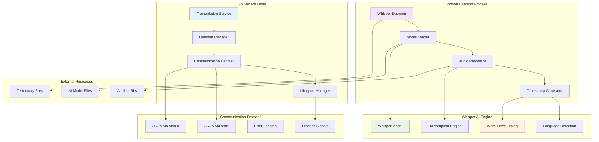
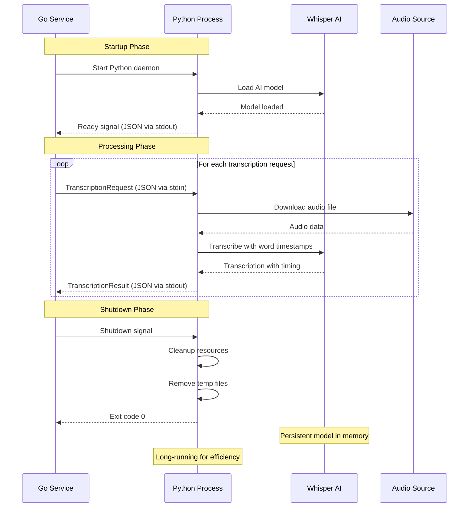

# VideoCraft Transcription Service - AI-Powered Python-Go Integration

The transcription service implements a revolutionary Python-Go integration for efficient Whisper AI transcription. It uses a persistent daemon architecture to provide word-level timestamps for VideoCraft's progressive subtitle innovation.

## 🤖 AI Integration Architecture



## 🔄 Python-Go Communication Protocol

### Daemon Communication Flow



## 📊 Data Structures & Protocol

### Communication Protocol

```go
// Transcription request sent to Python daemon
type TranscriptionRequest struct {
    AudioURL string `json:"audio_url"`           // URL of audio to transcribe
    Language string `json:"language,omitempty"`  // Language code or "auto"
    Model    string `json:"model,omitempty"`     // Whisper model size
}

// Transcription result received from Python daemon
type TranscriptionResult struct {
    Text     string              `json:"text"`               // Full transcribed text
    Language string              `json:"language"`           // Detected/specified language
    Duration float64             `json:"duration"`           // Audio duration in seconds
    Words    []TranscriptionWord `json:"words"`              // Word-level timestamps
    Error    string              `json:"error,omitempty"`    // Error message if failed
}

// Individual word with precise timing
type TranscriptionWord struct {
    Text  string  `json:"text"`   // Word text
    Start float64 `json:"start"`  // Start time in seconds
    End   float64 `json:"end"`    // End time in seconds
}

// Daemon status messages
type DaemonStatus struct {
    Status  string `json:"status"`   // "ready", "processing", "error"
    Message string `json:"message"`  // Status message
    Model   string `json:"model"`    // Currently loaded model
}
```

## 🛠️ Service Implementation

### Transcription Service Interface

```go
type Service interface {
    // Core transcription functionality
    TranscribeAudio(ctx context.Context, audioURL, language string) (*TranscriptionResult, error)
    
    // Service lifecycle management
    Start() error
    Stop() error
    Shutdown() error
    
    // Health and status monitoring
    IsHealthy() bool
    GetStatus() ServiceStatus
}

type service struct {
    cfg         *app.Config
    log         logger.Logger
    
    // Python daemon management
    daemonCmd   *exec.Cmd
    daemonStdin io.WriteCloser
    daemonStdout io.ReadCloser
    
    // Communication channels
    requestChan  chan transcriptionRequest
    responseChan chan TranscriptionResult
    
    // Lifecycle management
    ctx        context.Context
    cancel     context.CancelFunc
    isRunning  atomic.Bool
    restartCount atomic.Int64
}

type transcriptionRequest struct {
    request TranscriptionRequest
    respChan chan TranscriptionResult
}
```

### Service Initialization

```go
func NewService(cfg *app.Config, log logger.Logger) Service {
    return &service{
        cfg:          cfg,
        log:          log,
        requestChan:  make(chan transcriptionRequest, 10),
        responseChan: make(chan TranscriptionResult, 10),
    }
}

func (s *service) Start() error {
    s.log.Info("Starting transcription service")
    
    s.ctx, s.cancel = context.WithCancel(context.Background())
    
    // Start Python daemon
    if err := s.startDaemon(); err != nil {
        return fmt.Errorf("failed to start Whisper daemon: %w", err)
    }
    
    // Start communication handlers
    go s.handleRequests()
    go s.handleResponses()
    go s.monitorDaemon()
    
    s.isRunning.Store(true)
    s.log.Info("Transcription service started successfully")
    
    return nil
}
```

### Python Daemon Management

```go
func (s *service) startDaemon() error {
    pythonPath := s.cfg.Whisper.PythonPath
    scriptPath := s.cfg.Whisper.ScriptPath
    
    s.log.Infof("Starting Whisper daemon: %s %s", pythonPath, scriptPath)
    
    // Create command with context for cancellation
    s.daemonCmd = exec.CommandContext(s.ctx, pythonPath, scriptPath,
        "--model", s.cfg.Whisper.Model,
        "--language", s.cfg.Whisper.Language)
    
    // Setup pipes for communication
    stdin, err := s.daemonCmd.StdinPipe()
    if err != nil {
        return fmt.Errorf("failed to create stdin pipe: %w", err)
    }
    s.daemonStdin = stdin
    
    stdout, err := s.daemonCmd.StdoutPipe()
    if err != nil {
        return fmt.Errorf("failed to create stdout pipe: %w", err)
    }
    s.daemonStdout = stdout
    
    // Start the Python process
    if err := s.daemonCmd.Start(); err != nil {
        return fmt.Errorf("failed to start Python daemon: %w", err)
    }
    
    // Wait for ready signal with timeout
    if err := s.waitForReady(); err != nil {
        s.daemonCmd.Process.Kill()
        return fmt.Errorf("daemon startup failed: %w", err)
    }
    
    s.log.Info("Whisper daemon started and ready")
    return nil
}

func (s *service) waitForReady() error {
    timeout := time.After(s.cfg.Whisper.StartupTimeout)
    decoder := json.NewDecoder(s.daemonStdout)
    
    for {
        select {
        case <-timeout:
            return errors.New("daemon startup timeout")
        case <-s.ctx.Done():
            return s.ctx.Err()
        default:
            var status DaemonStatus
            if err := decoder.Decode(&status); err != nil {
                if err == io.EOF {
                    return errors.New("daemon process terminated unexpectedly")
                }
                continue // Skip malformed messages
            }
            
            if status.Status == "ready" {
                s.log.Infof("Daemon ready with model: %s", status.Model)
                return nil
            } else if status.Status == "error" {
                return fmt.Errorf("daemon startup error: %s", status.Message)
            }
        }
    }
}
```

## 🎯 Transcription Processing

### Main Transcription Function

```go
func (s *service) TranscribeAudio(ctx context.Context, audioURL, language string) (*TranscriptionResult, error) {
    if !s.isRunning.Load() {
        return nil, errors.New("transcription service is not running")
    }
    
    s.log.Debugf("Transcribing audio: %s (language: %s)", audioURL, language)
    
    // Create transcription request
    request := TranscriptionRequest{
        AudioURL: audioURL,
        Language: language,
        Model:    s.cfg.Whisper.Model,
    }
    
    // Create response channel for this request
    respChan := make(chan TranscriptionResult, 1)
    
    // Send request to daemon
    select {
    case s.requestChan <- transcriptionRequest{
        request:  request,
        respChan: respChan,
    }:
    case <-ctx.Done():
        return nil, ctx.Err()
    case <-time.After(5 * time.Second):
        return nil, errors.New("request queue full, service overloaded")
    }
    
    // Wait for response with timeout
    select {
    case result := <-respChan:
        if result.Error != "" {
            return nil, fmt.Errorf("transcription failed: %s", result.Error)
        }
        
        s.log.Debugf("Transcription completed: %.2fs duration, %d words, language: %s",
            result.Duration, len(result.Words), result.Language)
        
        return &result, nil
        
    case <-ctx.Done():
        return nil, ctx.Err()
        
    case <-time.After(s.cfg.Whisper.ProcessTimeout):
        return nil, errors.New("transcription timeout")
    }
}
```

### Request/Response Handling

```go
func (s *service) handleRequests() {
    encoder := json.NewEncoder(s.daemonStdin)
    
    for {
        select {
        case req := <-s.requestChan:
            // Send request to Python daemon via stdin
            if err := encoder.Encode(req.request); err != nil {
                s.log.Errorf("Failed to send request to daemon: %v", err)
                
                // Send error response
                req.respChan <- TranscriptionResult{
                    Error: fmt.Sprintf("communication error: %v", err),
                }
                continue
            }
            
            // Store response channel for when result comes back
            s.pendingRequests[req.request.AudioURL] = req.respChan
            
        case <-s.ctx.Done():
            s.log.Info("Request handler shutting down")
            return
        }
    }
}

func (s *service) handleResponses() {
    decoder := json.NewDecoder(s.daemonStdout)
    
    for {
        select {
        case <-s.ctx.Done():
            s.log.Info("Response handler shutting down")
            return
            
        default:
            var result TranscriptionResult
            if err := decoder.Decode(&result); err != nil {
                if err == io.EOF {
                    s.log.Warn("Daemon stdout closed, attempting restart")
                    s.restartDaemon()
                    return
                }
                s.log.Errorf("Failed to decode response: %v", err)
                continue
            }
            
            // Find and notify the waiting request
            if respChan, exists := s.pendingRequests[result.AudioURL]; exists {
                delete(s.pendingRequests, result.AudioURL)
                
                select {
                case respChan <- result:
                case <-time.After(1 * time.Second):
                    s.log.Warn("Response channel blocked, dropping result")
                }
            } else {
                s.log.Warn("Received response for unknown request")
            }
        }
    }
}
```

## 🔄 Daemon Lifecycle Management

### Daemon Monitoring & Recovery

```go
func (s *service) monitorDaemon() {
    ticker := time.NewTicker(30 * time.Second)
    defer ticker.Stop()
    
    for {
        select {
        case <-ticker.C:
            // Check if daemon is still running
            if s.daemonCmd != nil && s.daemonCmd.Process != nil {
                // Send health check ping
                if err := s.pingDaemon(); err != nil {
                    s.log.Warnf("Daemon health check failed: %v", err)
                    s.restartDaemon()
                }
            }
            
        case <-s.ctx.Done():
            s.log.Info("Daemon monitor shutting down")
            return
        }
    }
}

func (s *service) restartDaemon() {
    s.log.Warn("Restarting Whisper daemon")
    
    // Kill existing process if running
    if s.daemonCmd != nil && s.daemonCmd.Process != nil {
        s.daemonCmd.Process.Kill()
        s.daemonCmd.Wait()
    }
    
    // Close existing pipes
    if s.daemonStdin != nil {
        s.daemonStdin.Close()
    }
    if s.daemonStdout != nil {
        s.daemonStdout.Close()
    }
    
    // Track restart count
    restarts := s.restartCount.Add(1)
    if restarts > s.cfg.Whisper.MaxRestarts {
        s.log.Errorf("Max daemon restarts exceeded (%d), stopping service", restarts)
        s.cancel()
        return
    }
    
    // Wait before restart
    time.Sleep(s.cfg.Whisper.RestartDelay)
    
    // Start new daemon
    if err := s.startDaemon(); err != nil {
        s.log.Errorf("Failed to restart daemon: %v", err)
        time.Sleep(10 * time.Second)
        go s.restartDaemon() // Retry
        return
    }
    
    s.log.Info("Daemon restarted successfully")
}

func (s *service) pingDaemon() error {
    // Send a simple ping request to check daemon health
    pingRequest := TranscriptionRequest{
        AudioURL: "ping",
    }
    
    encoder := json.NewEncoder(s.daemonStdin)
    if err := encoder.Encode(pingRequest); err != nil {
        return fmt.Errorf("ping send failed: %w", err)
    }
    
    // Wait for pong response with timeout
    timeout := time.After(5 * time.Second)
    decoder := json.NewDecoder(s.daemonStdout)
    
    select {
    case <-timeout:
        return errors.New("ping timeout")
    default:
        var response DaemonStatus
        if err := decoder.Decode(&response); err != nil {
            return fmt.Errorf("ping response decode failed: %w", err)
        }
        
        if response.Status != "pong" {
            return fmt.Errorf("unexpected ping response: %s", response.Status)
        }
    }
    
    return nil
}
```

## 🔧 Python Daemon Script

### Whisper Daemon Implementation

```python
#!/usr/bin/env python3
"""
VideoCraft Whisper Daemon
Provides persistent Whisper AI transcription with word-level timestamps
"""

import sys
import json
import tempfile
import os
import signal
import logging
from pathlib import Path
import whisper
import requests
from urllib.parse import urlparse

class WhisperDaemon:
    def __init__(self, model_size="base", language="auto"):
        self.model_size = model_size
        self.language = language
        self.model = None
        self.temp_dir = tempfile.mkdtemp(prefix="videocraft_whisper_")
        
        # Setup logging
        logging.basicConfig(level=logging.INFO, format='%(asctime)s - %(levelname)s - %(message)s')
        self.logger = logging.getLogger(__name__)
        
        # Setup signal handlers for graceful shutdown
        signal.signal(signal.SIGTERM, self.shutdown_handler)
        signal.signal(signal.SIGINT, self.shutdown_handler)
    
    def load_model(self):
        """Load Whisper model into memory"""
        try:
            self.logger.info(f"Loading Whisper model: {self.model_size}")
            self.model = whisper.load_model(self.model_size)
            self.logger.info("Model loaded successfully")
            return True
        except Exception as e:
            self.logger.error(f"Failed to load model: {e}")
            return False
    
    def send_status(self, status, message="", model=None):
        """Send status message to Go service"""
        status_msg = {
            "status": status,
            "message": message,
            "model": model or self.model_size
        }
        print(json.dumps(status_msg), flush=True)
    
    def download_audio(self, audio_url):
        """Download audio file from URL"""
        try:
            response = requests.get(audio_url, timeout=60)
            response.raise_for_status()
            
            # Determine file extension
            parsed_url = urlparse(audio_url)
            ext = Path(parsed_url.path).suffix or '.mp3'
            
            # Save to temporary file
            temp_file = os.path.join(self.temp_dir, f"audio_{os.getpid()}{ext}")
            with open(temp_file, 'wb') as f:
                f.write(response.content)
            
            return temp_file
        except Exception as e:
            raise Exception(f"Audio download failed: {e}")
    
    def transcribe_audio(self, audio_path, language=None):
        """Transcribe audio with word-level timestamps"""
        try:
            # Use specified language or auto-detect
            lang = language if language and language != "auto" else None
            
            # Transcribe with word timestamps
            result = self.model.transcribe(
                audio_path,
                language=lang,
                word_timestamps=True,
                verbose=False
            )
            
            # Extract word-level timestamps
            words = []
            if 'segments' in result:
                for segment in result['segments']:
                    if 'words' in segment:
                        for word in segment['words']:
                            words.append({
                                'text': word['word'].strip(),
                                'start': float(word['start']),
                                'end': float(word['end'])
                            })
            
            return {
                'text': result['text'].strip(),
                'language': result.get('language', 'unknown'),
                'duration': float(result.get('duration', 0)),
                'words': words
            }
            
        except Exception as e:
            raise Exception(f"Transcription failed: {e}")
    
    def process_request(self, request):
        """Process transcription request"""
        try:
            audio_url = request.get('audio_url')
            language = request.get('language', self.language)
            
            # Handle ping requests
            if audio_url == "ping":
                return {"status": "pong"}
            
            # Download audio
            audio_path = self.download_audio(audio_url)
            
            try:
                # Transcribe audio
                result = self.transcribe_audio(audio_path, language)
                result['audio_url'] = audio_url  # Add URL for response matching
                return result
                
            finally:
                # Cleanup downloaded file
                try:
                    os.remove(audio_path)
                except:
                    pass
                    
        except Exception as e:
            return {
                'error': str(e),
                'audio_url': request.get('audio_url', '')
            }
    
    def run(self):
        """Main daemon loop"""
        # Load model
        if not self.load_model():
            self.send_status("error", "Failed to load Whisper model")
            sys.exit(1)
        
        # Send ready signal
        self.send_status("ready", "Whisper daemon ready for transcription")
        
        # Process requests
        try:
            for line in sys.stdin:
                try:
                    request = json.loads(line.strip())
                    result = self.process_request(request)
                    print(json.dumps(result), flush=True)
                    
                except json.JSONDecodeError:
                    self.logger.error("Invalid JSON request")
                    continue
                except Exception as e:
                    self.logger.error(f"Request processing error: {e}")
                    error_response = {
                        'error': str(e),
                        'audio_url': request.get('audio_url', '') if 'request' in locals() else ''
                    }
                    print(json.dumps(error_response), flush=True)
                    
        except KeyboardInterrupt:
            pass
        finally:
            self.cleanup()
    
    def cleanup(self):
        """Cleanup resources"""
        try:
            # Remove temporary directory
            import shutil
            shutil.rmtree(self.temp_dir, ignore_errors=True)
            self.logger.info("Cleanup completed")
        except Exception as e:
            self.logger.error(f"Cleanup error: {e}")
    
    def shutdown_handler(self, signum, frame):
        """Handle shutdown signals"""
        self.logger.info("Received shutdown signal, cleaning up...")
        self.cleanup()
        sys.exit(0)

if __name__ == "__main__":
    import argparse
    
    parser = argparse.ArgumentParser(description="VideoCraft Whisper Daemon")
    parser.add_argument("--model", default="base", help="Whisper model size")
    parser.add_argument("--language", default="auto", help="Default language")
    
    args = parser.parse_args()
    
    daemon = WhisperDaemon(args.model, args.language)
    daemon.run()
```

## 📊 Service Health & Monitoring

### Health Check Implementation

```go
func (s *service) IsHealthy() bool {
    if !s.isRunning.Load() {
        return false
    }
    
    if s.daemonCmd == nil || s.daemonCmd.Process == nil {
        return false
    }
    
    // Check if process is still running
    if err := s.daemonCmd.Process.Signal(syscall.Signal(0)); err != nil {
        return false
    }
    
    return true
}

func (s *service) GetStatus() ServiceStatus {
    return ServiceStatus{
        Running:      s.isRunning.Load(),
        Healthy:      s.IsHealthy(),
        RestartCount: s.restartCount.Load(),
        Model:        s.cfg.Whisper.Model,
        Language:     s.cfg.Whisper.Language,
    }
}

type ServiceStatus struct {
    Running      bool   `json:"running"`
    Healthy      bool   `json:"healthy"`
    RestartCount int64  `json:"restart_count"`
    Model        string `json:"model"`
    Language     string `json:"language"`
}
```

## 🔧 Configuration

### Transcription Service Configuration

```yaml
whisper:
  # Model configuration
  model: "base"                    # Whisper model: tiny, base, small, medium, large
  language: "auto"                 # Language code or "auto" for detection
  
  # Python daemon settings
  python_path: "python3"           # Path to Python interpreter
  script_path: "./scripts/whisper_daemon.py"  # Path to daemon script
  
  # Timeouts and limits
  startup_timeout: "30s"           # Daemon startup timeout
  process_timeout: "300s"          # Per-transcription timeout (5 minutes)
  
  # Restart and recovery
  max_restarts: 5                  # Maximum daemon restarts
  restart_delay: "10s"             # Delay between restarts
  
  # Resource limits
  memory_limit: 1073741824         # 1GB memory limit
  cpu_limit: 2.0                   # CPU limit (cores)
  
  # Temporary file management
  temp_cleanup: true               # Auto-cleanup temp files
  temp_retention: "1h"             # Keep temp files for 1 hour
```

## 🧪 Testing Strategy

### Unit Testing

```go
func TestTranscriptionService_WordLevelTiming(t *testing.T) {
    // Setup test service
    cfg := &app.Config{
        Whisper: app.WhisperConfig{
            Model:    "tiny",  // Use smallest model for testing
            Language: "en",
        },
    }
    
    service := NewService(cfg, logger.NewNoop())
    err := service.Start()
    require.NoError(t, err)
    defer service.Shutdown()
    
    // Test transcription
    result, err := service.TranscribeAudio(
        context.Background(),
        "https://example.com/test-audio.mp3",
        "en",
    )
    
    require.NoError(t, err)
    assert.NotEmpty(t, result.Text)
    assert.Greater(t, len(result.Words), 0)
    assert.Equal(t, "en", result.Language)
    
    // Verify word timing precision
    for _, word := range result.Words {
        assert.Greater(t, word.End, word.Start)
        assert.NotEmpty(t, word.Text)
    }
}
```

### Integration Testing

```go
func TestTranscriptionService_DaemonRestart(t *testing.T) {
    service := setupTestTranscriptionService(t)
    
    // Initial transcription
    result1, err := service.TranscribeAudio(context.Background(), testAudioURL, "en")
    require.NoError(t, err)
    
    // Kill daemon process
    if service.(*service).daemonCmd.Process != nil {
        service.(*service).daemonCmd.Process.Kill()
    }
    
    // Wait for restart
    time.Sleep(2 * time.Second)
    
    // Transcription should work after restart
    result2, err := service.TranscribeAudio(context.Background(), testAudioURL, "en")
    require.NoError(t, err)
    assert.NotEmpty(t, result2.Text)
}
```

---

**Related Documentation:**
- [Subtitle Service Integration](../../media/subtitle/CLAUDE.md)
- [Job Queue Service](../job/queue/CLAUDE.md)
- [Core Services Overview](../CLAUDE.md)
- [Python Daemon Scripts](../../../../scripts/CLAUDE.md)