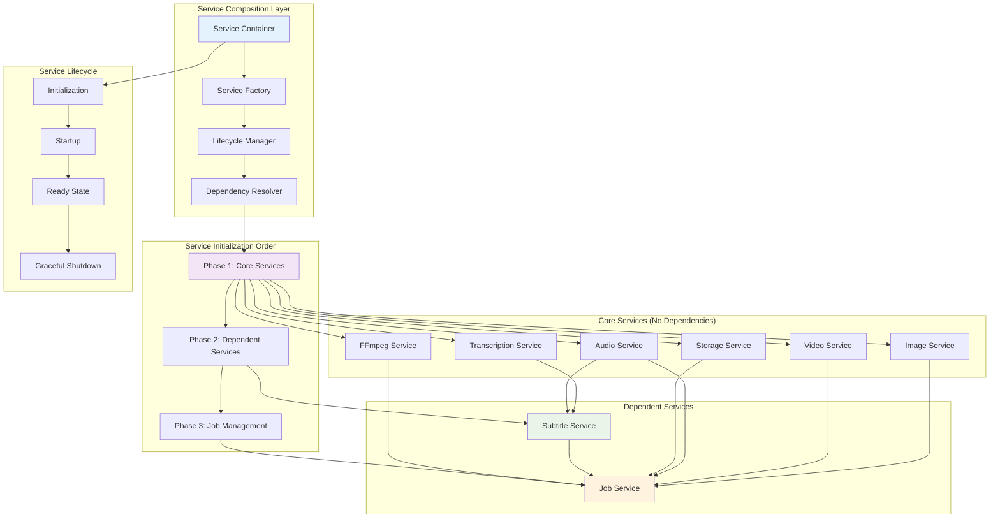
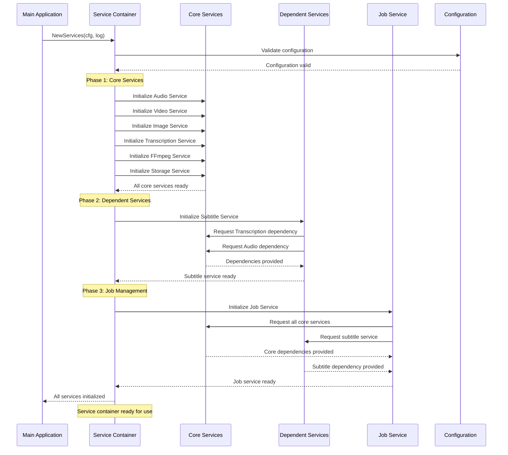
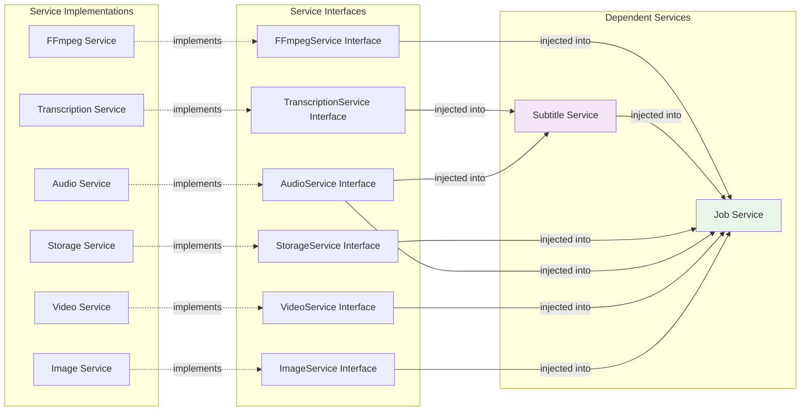

# VideoCraft Service Composition - Dependency Injection & Lifecycle Management

The service composition layer implements sophisticated dependency injection and service lifecycle management for VideoCraft's complex service ecosystem. This layer ensures proper service initialization order, dependency resolution, and graceful shutdown procedures.

## 🏗️ Service Composition Architecture



## 🎯 Service Container Implementation

### Comprehensive Service Container

The service container manages all VideoCraft services with proper dependency injection and lifecycle management:

```go
type Services struct {
    FFmpeg        FFmpegService        // Video generation engine
    Audio         AudioService         // Audio analysis and processing
    Video         VideoService         // Video analysis and validation
    Image         ImageService         // Image processing and validation
    Transcription TranscriptionService // AI-powered transcription
    Subtitle      SubtitleService      // Progressive subtitle generation
    Storage       StorageService       // File storage management
    Job           JobService           // Asynchronous job processing
}

// Service interface aliases for clean type definitions
type FFmpegService = engine.Service
type AudioService = audio.Service
type VideoService = video.Service
type ImageService = image.Service
type TranscriptionService = transcription.Service
type SubtitleService = subtitle.Service
type StorageService = storageServices.Service
type JobService = queue.Service
```

### Advanced Service Factory

```go
func NewServices(cfg *app.Config, log logger.Logger) *Services {
    log.Info("Initializing VideoCraft service container")
    
    // Phase 1: Initialize core services without dependencies
    log.Debug("Phase 1: Initializing core services")
    audioService := audio.NewService(cfg, log)
    videoService := video.NewService(cfg, log)
    imageService := image.NewService(cfg, log)
    transcriptionService := transcription.NewService(cfg, log)
    ffmpegService := engine.NewService(cfg, log)
    storageService := storageServices.NewService(cfg, log)
    
    log.Debug("Phase 1 completed: Core services initialized")
    
    // Phase 2: Initialize services with dependencies
    log.Debug("Phase 2: Initializing dependent services")
    subtitleService := subtitle.NewService(cfg, log, transcriptionService, audioService)
    
    log.Debug("Phase 2 completed: Subtitle service initialized with dependencies")
    
    // Phase 3: Initialize job service with all dependencies
    log.Debug("Phase 3: Initializing job management service")
    jobService := queue.NewService(cfg, log, ffmpegService, subtitleService, storageService, 
        audioService, videoService, imageService)
    
    log.Debug("Phase 3 completed: Job service initialized with all dependencies")
    
    services := &Services{
        FFmpeg:        ffmpegService,
        Audio:         audioService,
        Video:         videoService,
        Image:         imageService,
        Transcription: transcriptionService,
        Subtitle:      subtitleService,
        Storage:       storageService,
        Job:           jobService,
    }
    
    log.Info("Service container initialization completed successfully")
    return services
}
```

## 🔄 Service Lifecycle Management

### Initialization Flow



### Graceful Shutdown Implementation

```go
func (s *Services) Shutdown() {
    log := logger.GetGlobal()
    log.Info("Initiating graceful service shutdown")
    
    // Shutdown services in reverse dependency order
    
    // Step 1: Stop job processing to prevent new work
    if s.Job != nil {
        log.Debug("Shutting down job service")
        if err := s.Job.Stop(); err != nil {
            log.Errorf("Error stopping job service: %v", err)
        } else {
            log.Debug("Job service shutdown completed")
        }
    }
    
    // Step 2: Shutdown AI services that may have external processes
    if s.Transcription != nil {
        log.Debug("Shutting down transcription service")
        s.Transcription.Shutdown()
        log.Debug("Transcription service shutdown completed")
    }
    
    // Step 3: Cleanup subtitle service resources
    if s.Subtitle != nil {
        log.Debug("Subtitle service cleanup (if needed)")
        // Subtitle service cleanup would go here if needed
    }
    
    // Step 4: Core services cleanup
    log.Debug("Core services cleanup")
    // Core services are stateless and don't require explicit shutdown
    
    log.Info("Service shutdown sequence completed")
}
```

## 🔗 Dependency Injection Patterns

### Interface-Based Dependency Injection



### Constructor Injection Pattern

```go
// Subtitle service constructor with dependency injection
func NewSubtitleService(
    cfg *app.Config,
    log logger.Logger,
    transcription TranscriptionService,
    audio AudioService,
) SubtitleService {
    return &subtitleService{
        cfg:           cfg,
        log:           log,
        transcription: transcription,
        audio:         audio,
    }
}

// Job service constructor with comprehensive dependency injection
func NewJobService(
    cfg *app.Config,
    log logger.Logger,
    ffmpeg FFmpegService,
    subtitle SubtitleService,
    storage StorageService,
    audio AudioService,
    video VideoService,
    image ImageService,
) JobService {
    return &jobService{
        cfg:      cfg,
        log:      log,
        ffmpeg:   ffmpeg,
        subtitle: subtitle,
        storage:  storage,
        audio:    audio,
        video:    video,
        image:    image,
        jobs:     make(map[string]*models.Job),
        jobQueue: make(chan *models.Job, cfg.Job.QueueSize),
        workers:  cfg.Job.Workers,
    }
}
```

## 🏭 Service Factory Patterns

### Modular Service Creation

```go
// Service creation helpers for better organization
func createCoreServices(cfg *app.Config, log logger.Logger) *coreServices {
    return &coreServices{
        Audio:         audio.NewService(cfg, log),
        Video:         video.NewService(cfg, log),
        Image:         image.NewService(cfg, log),
        Transcription: transcription.NewService(cfg, log),
        FFmpeg:        engine.NewService(cfg, log),
        Storage:       storageServices.NewService(cfg, log),
    }
}

func createDependentServices(core *coreServices, cfg *app.Config, log logger.Logger) *dependentServices {
    return &dependentServices{
        Subtitle: subtitle.NewService(cfg, log, core.Transcription, core.Audio),
    }
}

func createJobService(core *coreServices, dependent *dependentServices, cfg *app.Config, log logger.Logger) JobService {
    return queue.NewService(cfg, log, 
        core.FFmpeg, dependent.Subtitle, core.Storage,
        core.Audio, core.Video, core.Image)
}

type coreServices struct {
    Audio         AudioService
    Video         VideoService
    Image         ImageService
    Transcription TranscriptionService
    FFmpeg        FFmpegService
    Storage       StorageService
}

type dependentServices struct {
    Subtitle SubtitleService
}
```

### Configuration-Driven Service Creation

```go
func NewServicesWithOptions(cfg *app.Config, log logger.Logger, opts ServiceOptions) *Services {
    log.Info("Initializing services with custom options")
    
    // Apply service options
    if opts.MockTranscription {
        log.Debug("Using mock transcription service for testing")
        return createServicesWithMocks(cfg, log, opts)
    }
    
    if opts.EnableMetrics {
        log.Debug("Enabling service metrics collection")
        return createServicesWithMetrics(cfg, log, opts)
    }
    
    // Default service creation
    return NewServices(cfg, log)
}

type ServiceOptions struct {
    MockTranscription bool
    EnableMetrics     bool
    CustomStorage     StorageService
    CustomLogger      logger.Logger
}

func createServicesWithMocks(cfg *app.Config, log logger.Logger, opts ServiceOptions) *Services {
    // Create services with test mocks
    audioService := audio.NewService(cfg, log)
    videoService := video.NewService(cfg, log)
    imageService := image.NewService(cfg, log)
    
    // Use mock transcription service
    transcriptionService := &mockTranscriptionService{}
    
    ffmpegService := engine.NewService(cfg, log)
    storageService := opts.CustomStorage
    if storageService == nil {
        storageService = storageServices.NewService(cfg, log)
    }
    
    // Continue with dependent services...
    subtitleService := subtitle.NewService(cfg, log, transcriptionService, audioService)
    jobService := queue.NewService(cfg, log, ffmpegService, subtitleService, storageService,
        audioService, videoService, imageService)
    
    return &Services{
        FFmpeg:        ffmpegService,
        Audio:         audioService,
        Video:         videoService,
        Image:         imageService,
        Transcription: transcriptionService,
        Subtitle:      subtitleService,
        Storage:       storageService,
        Job:           jobService,
    }
}
```

## 📊 Service Health & Monitoring

### Service Health Checks

```go
type ServiceHealth struct {
    ServiceName string            `json:"service_name"`
    Status      HealthStatus      `json:"status"`
    LastCheck   time.Time         `json:"last_check"`
    Details     map[string]string `json:"details"`
    Dependencies []string         `json:"dependencies"`
}

type HealthStatus string

const (
    HealthStatusHealthy   HealthStatus = "healthy"
    HealthStatusUnhealthy HealthStatus = "unhealthy"
    HealthStatusDegraded  HealthStatus = "degraded"
    HealthStatusUnknown   HealthStatus = "unknown"
)

func (s *Services) HealthCheck() map[string]ServiceHealth {
    healthResults := make(map[string]ServiceHealth)
    
    // Check transcription service health
    transcriptionHealth := ServiceHealth{
        ServiceName:  "transcription",
        LastCheck:    time.Now(),
        Dependencies: []string{},
    }
    
    if s.Transcription.IsHealthy() {
        transcriptionHealth.Status = HealthStatusHealthy
        transcriptionHealth.Details = map[string]string{
            "daemon_status": "running",
            "model_loaded":  "true",
        }
    } else {
        transcriptionHealth.Status = HealthStatusUnhealthy
        transcriptionHealth.Details = map[string]string{
            "daemon_status": "stopped",
            "model_loaded":  "false",
        }
    }
    
    healthResults["transcription"] = transcriptionHealth
    
    // Check storage service health
    storageHealth := ServiceHealth{
        ServiceName:  "storage",
        LastCheck:    time.Now(),
        Dependencies: []string{},
    }
    
    if err := s.Storage.HealthCheck(); err != nil {
        storageHealth.Status = HealthStatusUnhealthy
        storageHealth.Details = map[string]string{
            "error": err.Error(),
        }
    } else {
        storageHealth.Status = HealthStatusHealthy
        storageHealth.Details = map[string]string{
            "disk_space": "sufficient",
            "writable":   "true",
        }
    }
    
    healthResults["storage"] = storageHealth
    
    // Check job service health
    jobHealth := ServiceHealth{
        ServiceName:  "job",
        LastCheck:    time.Now(),
        Dependencies: []string{"transcription", "storage", "ffmpeg", "subtitle"},
    }
    
    jobStatus := s.Job.GetStatus()
    if jobStatus.Running && jobStatus.Healthy {
        jobHealth.Status = HealthStatusHealthy
        jobHealth.Details = map[string]string{
            "workers_active": "true",
            "queue_size":     fmt.Sprintf("%d", len(s.Job.ListJobs())),
        }
    } else {
        jobHealth.Status = HealthStatusUnhealthy
        jobHealth.Details = map[string]string{
            "workers_active": "false",
            "error":          "service not running",
        }
    }
    
    healthResults["job"] = jobHealth
    
    return healthResults
}
```

### Service Metrics Collection

```go
type ServiceMetrics struct {
    ServiceName     string            `json:"service_name"`
    StartTime       time.Time         `json:"start_time"`
    Uptime          time.Duration     `json:"uptime"`
    RequestCount    int64             `json:"request_count"`
    ErrorCount      int64             `json:"error_count"`
    AverageLatency  time.Duration     `json:"average_latency"`
    MemoryUsage     int64             `json:"memory_usage_bytes"`
    CustomMetrics   map[string]interface{} `json:"custom_metrics"`
}

func (s *Services) GetMetrics() map[string]ServiceMetrics {
    metrics := make(map[string]ServiceMetrics)
    
    // Job service metrics
    if jobMetrics := s.Job.GetMetrics(); jobMetrics != nil {
        metrics["job"] = ServiceMetrics{
            ServiceName:  "job",
            StartTime:    time.Now().Add(-time.Hour), // Placeholder
            Uptime:       time.Hour,                  // Placeholder
            RequestCount: jobMetrics.JobsCompleted,
            ErrorCount:   jobMetrics.JobsFailed,
            CustomMetrics: map[string]interface{}{
                "active_workers":   jobMetrics.ActiveWorkers,
                "queue_size":       jobMetrics.QueueSize,
                "processing_jobs":  jobMetrics.ProcessingJobs,
            },
        }
    }
    
    // Transcription service metrics
    if transcriptionStatus := s.Transcription.GetStatus(); transcriptionStatus != nil {
        metrics["transcription"] = ServiceMetrics{
            ServiceName: "transcription",
            StartTime:   time.Now().Add(-time.Hour), // Placeholder
            Uptime:      time.Hour,                  // Placeholder
            CustomMetrics: map[string]interface{}{
                "restart_count": transcriptionStatus.RestartCount,
                "model":         transcriptionStatus.Model,
                "language":      transcriptionStatus.Language,
                "healthy":       transcriptionStatus.Healthy,
            },
        }
    }
    
    // Storage service metrics
    if storageStats := s.Storage.GetStorageStats(); storageStats != nil {
        metrics["storage"] = ServiceMetrics{
            ServiceName: "storage",
            StartTime:   time.Now().Add(-time.Hour), // Placeholder
            Uptime:      time.Hour,                  // Placeholder
            CustomMetrics: map[string]interface{}{
                "video_count":    storageStats.VideoCount,
                "total_size":     storageStats.TotalSize,
                "disk_usage":     storageStats.DiskUsage.UsagePercent,
                "health_status":  storageStats.HealthStatus,
            },
        }
    }
    
    return metrics
}
```

## 🔧 Configuration Integration

### Service Configuration Management

```go
type ServiceConfiguration struct {
    Core struct {
        Audio struct {
            MaxDuration      int      `yaml:"max_duration"`
            SupportedFormats []string `yaml:"supported_formats"`
            AnalysisTimeout  string   `yaml:"analysis_timeout"`
        } `yaml:"audio"`
        
        Video struct {
            MaxDuration      int      `yaml:"max_duration"`
            SupportedFormats []string `yaml:"supported_formats"`
            AnalysisTimeout  string   `yaml:"analysis_timeout"`
        } `yaml:"video"`
        
        Image struct {
            MaxSize          int64    `yaml:"max_size"`
            SupportedFormats []string `yaml:"supported_formats"`
            ValidationTimeout string  `yaml:"validation_timeout"`
        } `yaml:"image"`
    } `yaml:"core"`
    
    Processing struct {
        Job struct {
            Workers          int    `yaml:"workers"`
            QueueSize        int    `yaml:"queue_size"`
            ProcessTimeout   string `yaml:"process_timeout"`
            RetryAttempts    int    `yaml:"retry_attempts"`
        } `yaml:"job"`
        
        Transcription struct {
            Model           string `yaml:"model"`
            Language        string `yaml:"language"`
            StartupTimeout  string `yaml:"startup_timeout"`
            ProcessTimeout  string `yaml:"process_timeout"`
            MaxRestarts     int    `yaml:"max_restarts"`
        } `yaml:"transcription"`
    } `yaml:"processing"`
    
    Infrastructure struct {
        Storage struct {
            Type         string `yaml:"type"`
            BasePath     string `yaml:"base_path"`
            TempDir      string `yaml:"temp_dir"`
            MaxFileSize  int64  `yaml:"max_file_size"`
            CleanupAge   string `yaml:"cleanup_age"`
        } `yaml:"storage"`
        
        FFmpeg struct {
            BinaryPath string `yaml:"binary_path"`
            ProbePath  string `yaml:"probe_path"`
            Timeout    string `yaml:"timeout"`
            Threads    int    `yaml:"threads"`
        } `yaml:"ffmpeg"`
    } `yaml:"infrastructure"`
}

func NewServicesFromConfig(configPath string, log logger.Logger) (*Services, error) {
    // Load configuration
    cfg, err := app.LoadConfigFromFile(configPath)
    if err != nil {
        return nil, fmt.Errorf("failed to load configuration: %w", err)
    }
    
    // Validate configuration
    if err := validateServiceConfiguration(cfg); err != nil {
        return nil, fmt.Errorf("configuration validation failed: %w", err)
    }
    
    // Create services with validated configuration
    return NewServices(cfg, log), nil
}

func validateServiceConfiguration(cfg *app.Config) error {
    var errors []string
    
    // Validate job configuration
    if cfg.Job.Workers <= 0 {
        errors = append(errors, "job.workers must be greater than 0")
    }
    
    if cfg.Job.QueueSize <= 0 {
        errors = append(errors, "job.queue_size must be greater than 0")
    }
    
    // Validate transcription configuration
    validModels := []string{"tiny", "base", "small", "medium", "large"}
    modelValid := false
    for _, validModel := range validModels {
        if cfg.Whisper.Model == validModel {
            modelValid = true
            break
        }
    }
    if !modelValid {
        errors = append(errors, fmt.Sprintf("whisper.model must be one of: %v", validModels))
    }
    
    // Validate storage configuration
    if cfg.Storage.BasePath == "" {
        errors = append(errors, "storage.base_path cannot be empty")
    }
    
    if cfg.Storage.TempDir == "" {
        errors = append(errors, "storage.temp_dir cannot be empty")
    }
    
    if len(errors) > 0 {
        return fmt.Errorf("configuration validation errors: %s", strings.Join(errors, "; "))
    }
    
    return nil
}
```

## 🧪 Testing Service Composition

### Service Container Testing

```go
func TestServiceComposition_InitializationOrder(t *testing.T) {
    cfg := &app.Config{
        Job: app.JobConfig{
            Workers:   2,
            QueueSize: 10,
        },
        Whisper: app.WhisperConfig{
            Model:    "base",
            Language: "en",
        },
        Storage: app.StorageConfig{
            BasePath: "/tmp/test",
            TempDir:  "/tmp/test/temp",
        },
    }
    
    log := logger.NewNoop()
    
    // Test service initialization
    services := NewServices(cfg, log)
    
    // Verify all services are initialized
    assert.NotNil(t, services.Audio)
    assert.NotNil(t, services.Video)
    assert.NotNil(t, services.Image)
    assert.NotNil(t, services.Transcription)
    assert.NotNil(t, services.FFmpeg)
    assert.NotNil(t, services.Storage)
    assert.NotNil(t, services.Subtitle)
    assert.NotNil(t, services.Job)
    
    // Test graceful shutdown
    services.Shutdown()
}

func TestServiceComposition_DependencyInjection(t *testing.T) {
    cfg := createTestConfig()
    log := logger.NewNoop()
    
    // Create services
    services := NewServices(cfg, log)
    
    // Verify that dependent services have their dependencies
    // Note: This would require exposing dependencies or using reflection
    // In practice, this is tested through integration tests
    
    // Test that job service can process jobs (integration test)
    config := &models.VideoConfigArray{{
        Scenes: []models.Scene{{
            Elements: []models.Element{{
                Type: "audio",
                Src:  "https://example.com/test.mp3",
            }},
        }},
    }}
    
    job, err := services.Job.CreateJob(config)
    assert.NoError(t, err)
    assert.NotNil(t, job)
    
    services.Shutdown()
}

func TestServiceComposition_HealthChecks(t *testing.T) {
    cfg := createTestConfig()
    log := logger.NewNoop()
    
    services := NewServices(cfg, log)
    defer services.Shutdown()
    
    // Get health status
    healthResults := services.HealthCheck()
    
    // Verify health check results
    assert.Contains(t, healthResults, "transcription")
    assert.Contains(t, healthResults, "storage")
    assert.Contains(t, healthResults, "job")
    
    // Check individual service health
    for serviceName, health := range healthResults {
        assert.NotEmpty(t, health.ServiceName)
        assert.NotEmpty(t, health.Status)
        assert.NotZero(t, health.LastCheck)
        t.Logf("Service %s status: %s", serviceName, health.Status)
    }
}
```

---

**Related Documentation:**
- [Video Engine](../engine/CLAUDE.md)
- [Core Services](../../services/CLAUDE.md)
- [Media Services](../../media/CLAUDE.md)
- [Job Queue Service](../../services/job/queue/CLAUDE.md)