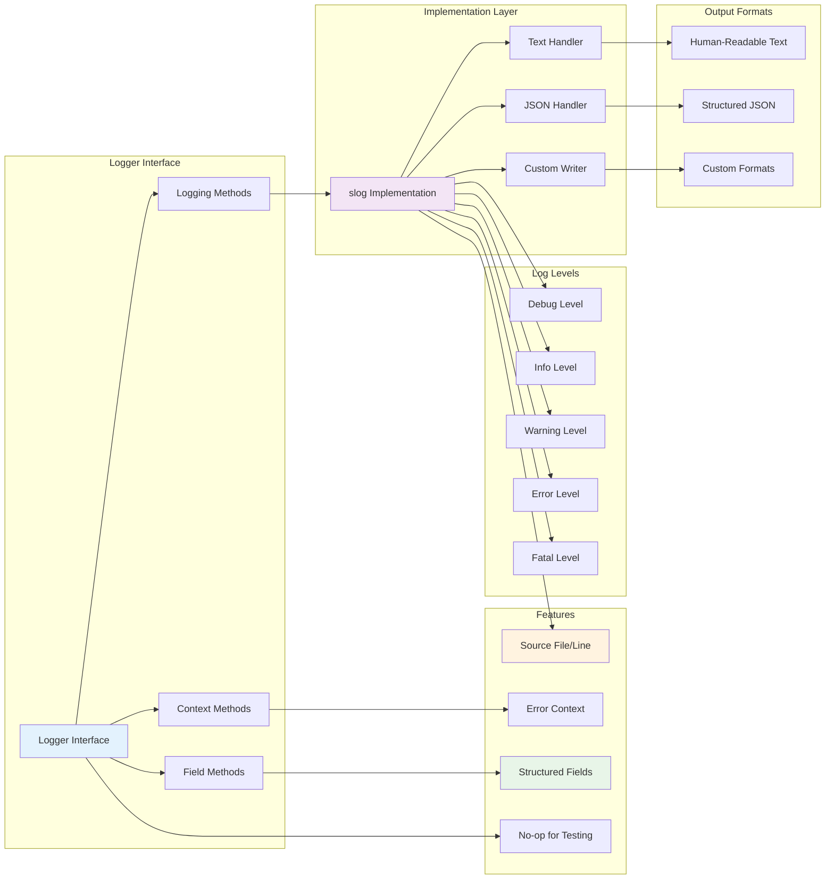

# VideoCraft Shared Packages - Core Infrastructure & Utilities

The shared packages layer provides essential infrastructure components used throughout VideoCraft. This layer implements logging, error handling, and common utilities with a focus on security, performance, and maintainability.

## 📦 Package Architecture

```mermaid
graph TB
    subgraph "Shared Package Layer"
        LOGGER[Logger Package]
        ERRORS[Errors Package]
        UTILS[Utilities Package]
    end
    
    subgraph "Logger Components"
        SLOG[Structured Logging]
        CONTEXT[Context Support]
        FORMATS[Output Formats]
        LEVELS[Log Levels]
    end
    
    subgraph "Error Components"
        DOMAIN_ERRORS[Domain Errors]
        SECURITY[Security Filtering]
        CLIENT_SAFE[Client-Safe Messages]
        STRUCTURED[Structured Errors]
    end
    
    subgraph "Cross-Cutting Concerns"
        OBSERVABILITY[Observability]
        SECURITY_AUDIT[Security Auditing]
        PERFORMANCE[Performance Monitoring]
        COMPLIANCE[Compliance Logging]
    end
    
    subgraph "Integration Points"
        API_LAYER[API Layer]
        CORE_SERVICES[Core Services]
        BUSINESS_LOGIC[Business Logic]
        INFRASTRUCTURE[Infrastructure]
    end
    
    LOGGER --> SLOG
    LOGGER --> CONTEXT
    LOGGER --> FORMATS
    LOGGER --> LEVELS
    
    ERRORS --> DOMAIN_ERRORS
    ERRORS --> SECURITY
    ERRORS --> CLIENT_SAFE
    ERRORS --> STRUCTURED
    
    LOGGER --> OBSERVABILITY
    ERRORS --> SECURITY_AUDIT
    LOGGER --> PERFORMANCE
    ERRORS --> COMPLIANCE
    
    OBSERVABILITY --> API_LAYER
    SECURITY_AUDIT --> CORE_SERVICES
    PERFORMANCE --> BUSINESS_LOGIC
    COMPLIANCE --> INFRASTRUCTURE
    
    style LOGGER fill:#e3f2fd
    style ERRORS fill:#ffebee
    style SECURITY fill:#fff3e0
    style OBSERVABILITY fill:#f3e5f5
```



## 📁 Package Structure

```
internal/pkg/
├── logger/               # Structured logging with slog
│   └── logger.go        # Logger interface and implementations
└── errors/              # Domain errors and security filtering
    └── errors.go        # Error types and security handling
```

## 📝 Logger Package - Structured Logging Excellence

### Advanced Logging Architecture



### Comprehensive Logger Interface

```go
type Logger interface {
    // Standard logging methods
    Debug(args ...interface{})
    Info(args ...interface{})
    Warn(args ...interface{})
    Error(args ...interface{})
    Fatal(args ...interface{})

    // Formatted logging methods
    Debugf(format string, args ...interface{})
    Infof(format string, args ...interface{})
    Warnf(format string, args ...interface{})
    Errorf(format string, args ...interface{})
    Fatalf(format string, args ...interface{})

    // Structured logging methods
    WithField(key string, value interface{}) Logger
    WithFields(fields map[string]interface{}) Logger
    WithError(err error) Logger
}

type logger struct {
    slog *slog.Logger
}
```

### Advanced Logger Creation

```go
func New(level string) Logger {
    // Parse log level with fallback
    var logLevel slog.Level
    switch level {
    case "debug":
        logLevel = slog.LevelDebug
    case "info":
        logLevel = slog.LevelInfo
    case "warn":
        logLevel = slog.LevelWarn
    case "error":
        logLevel = slog.LevelError
    default:
        logLevel = slog.LevelInfo // Safe default
    }

    // Create handler options with source information
    opts := &slog.HandlerOptions{
        Level:     logLevel,
        AddSource: true, // Add source file and line number for debugging
    }

    // Create human-readable text handler
    handler := slog.NewTextHandler(os.Stdout, opts)
    return &logger{slog: slog.New(handler)}
}

func NewJSON(level string) Logger {
    var logLevel slog.Level
    switch level {
    case "debug":
        logLevel = slog.LevelDebug
    case "info":
        logLevel = slog.LevelInfo
    case "warn":
        logLevel = slog.LevelWarn
    case "error":
        logLevel = slog.LevelError
    default:
        logLevel = slog.LevelInfo
    }

    opts := &slog.HandlerOptions{
        Level:     logLevel,
        AddSource: true,
    }

    // Create structured JSON handler for production
    handler := slog.NewJSONHandler(os.Stdout, opts)
    return &logger{slog: slog.New(handler)}
}

func NewWithWriter(level string, writer io.Writer, format string) Logger {
    var logLevel slog.Level
    switch level {
    case "debug":
        logLevel = slog.LevelDebug
    case "info":
        logLevel = slog.LevelInfo
    case "warn":
        logLevel = slog.LevelWarn
    case "error":
        logLevel = slog.LevelError
    default:
        logLevel = slog.LevelInfo
    }

    opts := &slog.HandlerOptions{
        Level:     logLevel,
        AddSource: true,
    }

    var handler slog.Handler
    if format == "json" {
        handler = slog.NewJSONHandler(writer, opts)
    } else {
        handler = slog.NewTextHandler(writer, opts)
    }

    return &logger{slog: slog.New(handler)}
}
```

### Structured Logging Implementation

```go
func (l *logger) WithField(key string, value interface{}) Logger {
    return &logger{slog: l.slog.With(key, value)}
}

func (l *logger) WithFields(fields map[string]interface{}) Logger {
    args := make([]interface{}, 0, len(fields)*2)
    for k, v := range fields {
        args = append(args, k, v)
    }
    return &logger{slog: l.slog.With(args...)}
}

func (l *logger) WithError(err error) Logger {
    return l.WithField("error", err.Error())
}

func (l *logger) Debug(args ...interface{}) {
    l.slog.Debug(formatArgs(args...))
}

func (l *logger) Info(args ...interface{}) {
    l.slog.Info(formatArgs(args...))
}

func (l *logger) Warn(args ...interface{}) {
    l.slog.Warn(formatArgs(args...))
}

func (l *logger) Error(args ...interface{}) {
    l.slog.Error(formatArgs(args...))
}

func (l *logger) Fatal(args ...interface{}) {
    l.slog.Error(formatArgs(args...))
    os.Exit(1)
}

func formatArgs(args ...interface{}) string {
    if len(args) == 0 {
        return ""
    }
    if len(args) == 1 {
        return fmt.Sprint(args[0])
    }
    return fmt.Sprintln(args...)
}
```

### Context-Aware Logging

```go
// Context-aware logging methods for advanced use cases
func (l *logger) DebugContext(ctx context.Context, msg string, args ...interface{}) {
    l.slog.DebugContext(ctx, msg, args...)
}

func (l *logger) InfoContext(ctx context.Context, msg string, args ...interface{}) {
    l.slog.InfoContext(ctx, msg, args...)
}

func (l *logger) WarnContext(ctx context.Context, msg string, args ...interface{}) {
    l.slog.WarnContext(ctx, msg, args...)
}

func (l *logger) ErrorContext(ctx context.Context, msg string, args ...interface{}) {
    l.slog.ErrorContext(ctx, msg, args...)
}
```

### No-op Logger for Testing

```go
// noopLogger implements Logger interface but does nothing
type noopLogger struct{}

func (nl *noopLogger) Debug(args ...interface{})                       {}
func (nl *noopLogger) Info(args ...interface{})                        {}
func (nl *noopLogger) Warn(args ...interface{})                        {}
func (nl *noopLogger) Error(args ...interface{})                       {}
func (nl *noopLogger) Fatal(args ...interface{})                       {}
func (nl *noopLogger) Debugf(format string, args ...interface{})       {}
func (nl *noopLogger) Infof(format string, args ...interface{})        {}
func (nl *noopLogger) Warnf(format string, args ...interface{})        {}
func (nl *noopLogger) Errorf(format string, args ...interface{})       {}
func (nl *noopLogger) Fatalf(format string, args ...interface{})       {}
func (nl *noopLogger) WithField(key string, value interface{}) Logger  { return nl }
func (nl *noopLogger) WithFields(fields map[string]interface{}) Logger { return nl }
func (nl *noopLogger) WithError(err error) Logger                      { return nl }

func NewNoop() Logger {
    return &noopLogger{}
}
```

## ❌ Errors Package - Security-First Error Handling

### Comprehensive Error Architecture

```mermaid
graph TB
    subgraph "Error Type System"
        DOMAIN_ERROR[VideoProcessingError]
        ERROR_CODES[Standardized Codes]
        ERROR_DETAILS[Structured Details]
        ERROR_CONTEXT[Contextual Information]
    end
    
    subgraph "Security Features"
        SENSITIVE_DETECTION[Sensitive Data Detection]
        CLIENT_SANITIZATION[Client-Safe Messages]
        SERVER_LOGGING[Detailed Server Logs]
        SECURITY_AUDIT[Security Event Logging]
    end
    
    subgraph "Error Categories"
        VALIDATION[Input Validation Errors]
        PROCESSING[Processing Errors]
        EXTERNAL[External Service Errors]
        INFRASTRUCTURE[Infrastructure Errors]
    end
    
    subgraph "Security Patterns"
        FILE_PATHS[Sensitive File Paths]
        URL_SCHEMES[Dangerous URL Schemes]
        NETWORK_TARGETS[Internal Network Targets]
        KEYWORDS[Sensitive Keywords]
    end
    
    subgraph "Output Formats"
        CLIENT_RESPONSE[Client-Safe Response]
        SERVER_LOGS[Detailed Server Logs]
        SECURITY_ALERTS[Security Alert Format]
        AUDIT_LOGS[Audit Log Format]
    end
    
    DOMAIN_ERROR --> ERROR_CODES
    DOMAIN_ERROR --> ERROR_DETAILS
    DOMAIN_ERROR --> ERROR_CONTEXT
    
    DOMAIN_ERROR --> SENSITIVE_DETECTION
    SENSITIVE_DETECTION --> CLIENT_SANITIZATION
    SENSITIVE_DETECTION --> SERVER_LOGGING
    SENSITIVE_DETECTION --> SECURITY_AUDIT
    
    ERROR_CODES --> VALIDATION
    ERROR_CODES --> PROCESSING
    ERROR_CODES --> EXTERNAL
    ERROR_CODES --> INFRASTRUCTURE
    
    SENSITIVE_DETECTION --> FILE_PATHS
    SENSITIVE_DETECTION --> URL_SCHEMES
    SENSITIVE_DETECTION --> NETWORK_TARGETS
    SENSITIVE_DETECTION --> KEYWORDS
    
    CLIENT_SANITIZATION --> CLIENT_RESPONSE
    SERVER_LOGGING --> SERVER_LOGS
    SECURITY_AUDIT --> SECURITY_ALERTS
    SECURITY_AUDIT --> AUDIT_LOGS
    
    style DOMAIN_ERROR fill:#e3f2fd
    style SENSITIVE_DETECTION fill:#ffebee
    style CLIENT_SANITIZATION fill:#e8f5e8
    style SECURITY_AUDIT fill:#fff3e0
```



### Domain Error Type System

```go
type VideoProcessingError struct {
    Code    string                 `json:"code"`
    Message string                 `json:"message"`
    Details map[string]interface{} `json:"details,omitempty"`
}

func (e VideoProcessingError) Error() string {
    return e.Message
}

func NewVideoProcessingError(code, message string, details map[string]interface{}) *VideoProcessingError {
    return &VideoProcessingError{
        Code:    code,
        Message: message,
        Details: details,
    }
}

// Standardized error codes for consistent error handling
const (
    ErrCodeInvalidInput        = "INVALID_INPUT"
    ErrCodeFileNotFound        = "FILE_NOT_FOUND"
    ErrCodeFFmpegFailed        = "FFMPEG_FAILED"
    ErrCodeTranscriptionFailed = "TRANSCRIPTION_FAILED"
    ErrCodeJobNotFound         = "JOB_NOT_FOUND"
    ErrCodeStorageFailed       = "STORAGE_FAILED"
    ErrCodeDownloadFailed      = "DOWNLOAD_FAILED"
    ErrCodeTimeout             = "TIMEOUT"
    ErrCodeInternalError       = "INTERNAL_ERROR"
)
```

### Comprehensive Error Constructors

```go
func InvalidInput(message string) *VideoProcessingError {
    return NewVideoProcessingError(ErrCodeInvalidInput, message, nil)
}

func FileNotFound(filename string) *VideoProcessingError {
    return NewVideoProcessingError(ErrCodeFileNotFound,
        fmt.Sprintf("File not found: %s", filename),
        map[string]interface{}{"filename": filename})
}

func FFmpegFailed(err error) *VideoProcessingError {
    return NewVideoProcessingError(ErrCodeFFmpegFailed,
        fmt.Sprintf("FFmpeg execution failed: %v", err),
        map[string]interface{}{"original_error": err.Error()})
}

func TranscriptionFailed(err error) *VideoProcessingError {
    return NewVideoProcessingError(ErrCodeTranscriptionFailed,
        fmt.Sprintf("Audio transcription failed: %v", err),
        map[string]interface{}{"original_error": err.Error()})
}

func JobNotFound(jobID string) *VideoProcessingError {
    return NewVideoProcessingError(ErrCodeJobNotFound,
        fmt.Sprintf("Job not found: %s", jobID),
        map[string]interface{}{"job_id": jobID})
}

func StorageFailed(err error) *VideoProcessingError {
    return NewVideoProcessingError(ErrCodeStorageFailed,
        fmt.Sprintf("Storage operation failed: %v", err),
        map[string]interface{}{"original_error": err.Error()})
}

func DownloadFailed(url string, err error) *VideoProcessingError {
    return NewVideoProcessingError(ErrCodeDownloadFailed,
        fmt.Sprintf("Failed to download from %s: %v", url, err),
        map[string]interface{}{
            "url":            url,
            "original_error": err.Error(),
        })
}

func Timeout(operation string, timeout string) *VideoProcessingError {
    return NewVideoProcessingError(ErrCodeTimeout,
        fmt.Sprintf("Operation %s timed out after %s", operation, timeout),
        map[string]interface{}{
            "operation": operation,
            "timeout":   timeout,
        })
}

func InternalError(err error) *VideoProcessingError {
    return NewVideoProcessingError(ErrCodeInternalError,
        fmt.Sprintf("Internal server error: %v", err),
        map[string]interface{}{"original_error": err.Error()})
}
```

### Security-First Error Sanitization

```go
// Client-safe error messages with helpful context but no sensitive information
var clientErrorMessages = map[string]string{
    ErrCodeFFmpegFailed:        "Video processing failed. Please check your input files and try again.",
    ErrCodeFileNotFound:        "The requested file could not be found. Please verify the file exists.",
    ErrCodeDownloadFailed:      "Failed to download the specified resource. Please check the URL and try again.",
    ErrCodeTranscriptionFailed: "Audio transcription failed. Please ensure the audio file is valid.",
    ErrCodeStorageFailed:       "Storage operation failed. Please try again later.",
    ErrCodeTimeout:             "The request timed out. Please try again with a smaller file or shorter duration.",
    ErrCodeInvalidInput:        "Invalid request format",
    ErrCodeJobNotFound:         "The requested job could not be found. It may have been completed or removed.",
    ErrCodeInternalError:       "An internal error occurred. Please try again later or contact support.",
}

func SanitizeForClient(err error) string {
    if vpe, ok := err.(*VideoProcessingError); ok {
        if message, exists := clientErrorMessages[vpe.Code]; exists {
            return message
        }
        return "An unexpected error occurred. Please try again later."
    }

    // For non-domain errors, provide generic but helpful message
    return "An error occurred while processing your request. Please try again later."
}

func GetServerDetails(err error) string {
    if vpe, ok := err.(*VideoProcessingError); ok {
        return vpe.Message
    }
    return err.Error()
}

func ToClientResponse(err error) map[string]interface{} {
    response := make(map[string]interface{})

    if vpe, ok := err.(*VideoProcessingError); ok {
        response["error"] = SanitizeForClient(err)
        response["code"] = vpe.Code
    } else {
        response["error"] = "An error occurred"
        response["code"] = "UNKNOWN_ERROR"
    }

    return response
}
```

### Advanced Security Pattern Detection

```go
// Comprehensive security-sensitive patterns grouped by category
var (
    sensitiveFilePaths = []string{
        "/etc/", "/root/", "/home/", "/var/lib/", "/var/log/", "/var/run/",
        "/usr/local/", "/opt/", "/boot/", "/sys/", "/proc/", "/dev/",
        ".ssh/", ".config/", ".env", ".git/", ".svn/", ".htaccess",
        "passwd", "shadow", "sudoers", "hosts", "fstab", "crontab",
    }

    sensitiveURLSchemes = []string{
        "mysql://", "postgres://", "postgresql://", "mongodb://", "redis://",
        "ldap://", "ldaps://", "ftp://", "sftp://", "file://", "jdbc:",
        "data:", "javascript:", "vbscript:",
    }

    sensitiveNetworkTargets = []string{
        "localhost:", "127.0.0.1:", "0.0.0.0:", "::1:",
        "internal.", "corp.", "intranet.", "local.",
        "admin.", "test.", "staging.", "dev.",
    }

    sensitiveKeywords = []string{
        "password", "passwd", "secret", "token", "key", "credential",
        "private", "confidential", "auth", "session", "cookie",
        "api_key", "access_token", "refresh_token", "jwt",
    }
)

func IsSecuritySensitive(err error) bool {
    if vpe, ok := err.(*VideoProcessingError); ok {
        message := vpe.Message

        // Check all pattern categories
        if containsAnyPattern(message, sensitiveFilePaths) ||
            containsAnyPattern(message, sensitiveURLSchemes) ||
            containsAnyPattern(message, sensitiveNetworkTargets) ||
            containsAnyPattern(message, sensitiveKeywords) {
            return true
        }

        // Check error details for sensitive information
        if vpe.Details != nil {
            for key, value := range vpe.Details {
                // Check if key itself is sensitive
                if containsAnyPattern(key, sensitiveKeywords) {
                    return true
                }

                // Check string values for sensitive patterns
                if str, ok := value.(string); ok {
                    if containsAnyPattern(str, sensitiveFilePaths) ||
                        containsAnyPattern(str, sensitiveURLSchemes) ||
                        containsAnyPattern(str, sensitiveNetworkTargets) ||
                        containsAnyPattern(str, sensitiveKeywords) {
                        return true
                    }
                }
            }
        }
    }

    return false
}

func containsAnyPattern(text string, patterns []string) bool {
    for _, pattern := range patterns {
        if contains(text, pattern) {
            return true
        }
    }
    return false
}
```

### Security Event Logging

```go
func LogSecurityEvent(err error) map[string]interface{} {
    logEntry := GetLogContext(err)
    logEntry["SECURITY_SENSITIVE"] = true
    logEntry["alert_level"] = "HIGH"

    if vpe, ok := err.(*VideoProcessingError); ok {
        logEntry["error_type"] = vpe.Code
    }

    return logEntry
}

func GetLogContext(err error) map[string]interface{} {
    logContext := make(map[string]interface{})

    if vpe, ok := err.(*VideoProcessingError); ok {
        logContext["error_type"] = "VideoProcessingError"
        logContext["error_code"] = vpe.Code
        logContext["original_error"] = vpe.Message

        // Add details if available
        if vpe.Details != nil {
            logContext["error_details"] = vpe.Details
        }
    } else {
        logContext["error_type"] = "UnknownError"
        logContext["error_code"] = "UNKNOWN"
        logContext["original_error"] = err.Error()
    }

    return logContext
}
```

### Optimized String Operations

```go
// Optimized substring search using simple but efficient algorithm
func indexOfSubstring(s, substr string) int {
    if len(substr) == 0 {
        return 0
    }
    if len(s) < len(substr) {
        return -1
    }

    // Simple but efficient substring search
    for i := 0; i <= len(s)-len(substr); i++ {
        if s[i:i+len(substr)] == substr {
            return i
        }
    }
    return -1
}

// Simple lowercase conversion (ASCII only for performance)
func toLower(s string) string {
    result := make([]byte, len(s))
    for i, b := range []byte(s) {
        if b >= 'A' && b <= 'Z' {
            result[i] = b + 32
        } else {
            result[i] = b
        }
    }
    return string(result)
}

// Helper function for efficient case-insensitive string contains
func contains(s, substr string) bool {
    if len(substr) == 0 {
        return true
    }
    if len(s) < len(substr) {
        return false
    }

    // Convert to lowercase for case-insensitive comparison
    sLower := toLower(s)
    substrLower := toLower(substr)

    // Use optimized search for better performance
    return indexOfSubstring(sLower, substrLower) >= 0
}
```

## 🔧 Configuration Integration

### Logger Configuration

```go
func NewFromConfig(level, format string) Logger {
    if format == "json" {
        return NewJSON(level)
    }
    return New(level)
}
```

### Package Configuration

```yaml
logging:
  level: "info"                    # debug, info, warn, error
  format: "text"                   # text, json
  add_source: true                 # Include source file/line
  output: "stdout"                 # stdout, stderr, file path
  
error_handling:
  sanitize_client_errors: true     # Enable client error sanitization
  log_security_events: true       # Log security-sensitive errors
  include_stack_traces: false     # Include stack traces in responses
  max_error_details: 10           # Maximum error detail fields
  
security:
  detect_sensitive_patterns: true # Enable sensitive data detection
  audit_security_events: true    # Enable security event auditing
  alert_on_sensitive_data: true   # Alert when sensitive data detected
  log_level_for_security: "error" # Log level for security events
```

## 🧪 Testing Strategy

### Logger Testing

```go
func TestLogger_StructuredLogging(t *testing.T) {
    var buf bytes.Buffer
    logger := NewWithWriter("debug", &buf, "json")
    
    // Test structured logging
    logger.WithFields(map[string]interface{}{
        "user_id": "123",
        "action":  "video_generation",
        "status":  "success",
    }).Info("User action completed")
    
    // Verify JSON output
    output := buf.String()
    assert.Contains(t, output, `"user_id":"123"`)
    assert.Contains(t, output, `"action":"video_generation"`)
    assert.Contains(t, output, `"level":"INFO"`)
}

func TestLogger_ErrorContext(t *testing.T) {
    var buf bytes.Buffer
    logger := NewWithWriter("error", &buf, "json")
    
    err := errors.New("test error")
    logger.WithError(err).Error("Processing failed")
    
    output := buf.String()
    assert.Contains(t, output, `"error":"test error"`)
    assert.Contains(t, output, `"level":"ERROR"`)
}

func TestLogger_NoopLogger(t *testing.T) {
    logger := NewNoop()
    
    // Should not panic or produce output
    logger.Debug("debug message")
    logger.Info("info message")
    logger.Error("error message")
    
    withFields := logger.WithField("key", "value")
    withFields.Info("test message")
    
    // No assertions needed - just ensuring no panics
}
```

### Error Package Testing

```go
func TestErrors_SecuritySensitiveDetection(t *testing.T) {
    tests := []struct {
        name      string
        err       error
        sensitive bool
    }{
        {
            name:      "sensitive file path",
            err:       FileNotFound("/etc/passwd"),
            sensitive: true,
        },
        {
            name:      "sensitive URL scheme",
            err:       DownloadFailed("file:///etc/shadow", errors.New("access denied")),
            sensitive: true,
        },
        {
            name:      "internal network target",
            err:       DownloadFailed("http://localhost:8080/admin", errors.New("connection refused")),
            sensitive: true,
        },
        {
            name:      "normal error",
            err:       FFmpegFailed(errors.New("invalid codec")),
            sensitive: false,
        },
    }
    
    for _, tt := range tests {
        t.Run(tt.name, func(t *testing.T) {
            isSensitive := IsSecuritySensitive(tt.err)
            assert.Equal(t, tt.sensitive, isSensitive)
        })
    }
}

func TestErrors_ClientSanitization(t *testing.T) {
    sensitiveErr := DownloadFailed("/etc/passwd", errors.New("permission denied"))
    clientMsg := SanitizeForClient(sensitiveErr)
    
    // Should not contain sensitive path
    assert.NotContains(t, clientMsg, "/etc/passwd")
    assert.NotContains(t, clientMsg, "permission denied")
    
    // Should contain helpful generic message
    assert.Contains(t, clientMsg, "Failed to download")
}

func TestErrors_LogContext(t *testing.T) {
    err := FFmpegFailed(errors.New("codec not found"))
    logContext := GetLogContext(err)
    
    assert.Equal(t, "VideoProcessingError", logContext["error_type"])
    assert.Equal(t, "FFMPEG_FAILED", logContext["error_code"])
    assert.Contains(t, logContext["original_error"], "FFmpeg execution failed")
}

func TestErrors_SecurityEventLogging(t *testing.T) {
    sensitiveErr := FileNotFound("/etc/shadow")
    logEvent := LogSecurityEvent(sensitiveErr)
    
    assert.Equal(t, true, logEvent["SECURITY_SENSITIVE"])
    assert.Equal(t, "HIGH", logEvent["alert_level"])
    assert.Equal(t, "FILE_NOT_FOUND", logEvent["error_type"])
}
```

### Performance Testing

```go
func BenchmarkLogger_StructuredLogging(b *testing.B) {
    logger := NewWithWriter("info", io.Discard, "json")
    
    b.ResetTimer()
    for i := 0; i < b.N; i++ {
        logger.WithFields(map[string]interface{}{
            "request_id": "req_123",
            "user_id":    "user_456",
            "operation":  "video_generation",
        }).Info("Processing request")
    }
}

func BenchmarkErrors_SensitiveDetection(b *testing.B) {
    err := DownloadFailed("http://internal.company.com/secret", errors.New("access denied"))
    
    b.ResetTimer()
    for i := 0; i < b.N; i++ {
        IsSecuritySensitive(err)
    }
}
```

## 📊 Usage Examples

### Logger Usage Examples

```go
// Basic logging
logger := logger.New("info")
logger.Info("Service starting")
logger.Errorf("Failed to connect to database: %v", err)

// Structured logging
logger.WithFields(map[string]interface{}{
    "job_id":     "job_123",
    "user_id":    "user_456",
    "duration":   "30s",
    "file_size":  "10MB",
}).Info("Video generation completed")

// Error context
logger.WithError(err).Error("Video processing failed")

// Context-aware logging
ctx := context.WithValue(context.Background(), "request_id", "req_789")
logger.InfoContext(ctx, "Processing video request")
```

### Error Handling Examples

```go
// Domain error creation
if file == "" {
    return InvalidInput("video file path cannot be empty")
}

// Error with context
err := FFmpegFailed(fmt.Errorf("invalid codec: %s", codec))

// Client-safe error response
if err != nil {
    response := ToClientResponse(err)
    c.JSON(500, response)
    
    // Server-side logging with full details
    logger.WithFields(GetLogContext(err)).Error("Request failed")
}

// Security-sensitive error handling
if IsSecuritySensitive(err) {
    // Log security event
    logger.WithFields(LogSecurityEvent(err)).Error("Security-sensitive error occurred")
    
    // Return generic client message
    return map[string]interface{}{
        "error": "An error occurred while processing your request",
        "code":  "PROCESSING_ERROR",
    }
}
```

---

**Related Documentation:**
- [Logger Package](logger/CLAUDE.md)
- [Errors Package](errors/CLAUDE.md)
- [Core Services](../core/CLAUDE.md)
- [API Layer](../api/CLAUDE.md)