# VideoCraft Errors Package - Security-First Error Handling & Audit

The errors package provides comprehensive error handling with security-first design, client-safe error sanitization, and advanced security pattern detection. It implements domain-specific error types with rich context while protecting sensitive information from client exposure.

## ❌ Error Handling Architecture



```mermaid
graph TB
    subgraph "Error Type System"
        DOMAIN_ERROR[VideoProcessingError]
        ERROR_CODES[Standardized Error Codes]
        ERROR_DETAILS[Structured Error Details]
        ERROR_CONTEXT[Contextual Information]
    end
    
    subgraph "Security Processing Pipeline"
        INPUT_ERROR[Input Error]
        SENSITIVE_SCAN[Sensitive Data Scan]
        CLIENT_FILTER[Client Sanitization]
        SERVER_LOG[Server Logging]
        SECURITY_AUDIT[Security Audit]
    end
    
    subgraph "Pattern Detection Engine"
        FILE_PATTERNS[File Path Patterns]
        URL_PATTERNS[URL Scheme Patterns]
        NETWORK_PATTERNS[Network Target Patterns]
        KEYWORD_PATTERNS[Sensitive Keyword Patterns]
    end
    
    subgraph "Output Channels"
        CLIENT_RESPONSE[Client-Safe Response]
        SERVER_LOGS[Detailed Server Logs]
        SECURITY_ALERTS[Security Event Alerts]
        AUDIT_TRAIL[Compliance Audit Trail]
    end
    
    subgraph "Error Categories"
        VALIDATION_ERRORS[Input Validation]
        PROCESSING_ERRORS[Processing Failures]
        EXTERNAL_ERRORS[External Service Errors]
        INFRASTRUCTURE_ERRORS[Infrastructure Issues]
    end
    
    DOMAIN_ERROR --> ERROR_CODES
    DOMAIN_ERROR --> ERROR_DETAILS
    DOMAIN_ERROR --> ERROR_CONTEXT
    
    INPUT_ERROR --> SENSITIVE_SCAN
    SENSITIVE_SCAN -->|Sensitive| SECURITY_AUDIT
    SENSITIVE_SCAN -->|Safe| CLIENT_FILTER
    CLIENT_FILTER --> CLIENT_RESPONSE
    SECURITY_AUDIT --> SERVER_LOG
    
    SENSITIVE_SCAN --> FILE_PATTERNS
    SENSITIVE_SCAN --> URL_PATTERNS
    SENSITIVE_SCAN --> NETWORK_PATTERNS
    SENSITIVE_SCAN --> KEYWORD_PATTERNS
    
    CLIENT_FILTER --> CLIENT_RESPONSE
    SERVER_LOG --> SERVER_LOGS
    SECURITY_AUDIT --> SECURITY_ALERTS
    SECURITY_AUDIT --> AUDIT_TRAIL
    
    ERROR_CODES --> VALIDATION_ERRORS
    ERROR_CODES --> PROCESSING_ERRORS
    ERROR_CODES --> EXTERNAL_ERRORS
    ERROR_CODES --> INFRASTRUCTURE_ERRORS
    
    style DOMAIN_ERROR fill:#e3f2fd
    style SENSITIVE_SCAN fill:#ffebee
    style CLIENT_FILTER fill:#e8f5e8
    style SECURITY_AUDIT fill:#fff3e0
```

## 🏗️ Domain Error Type System

### Core Error Structure

```go
type VideoProcessingError struct {
    Code    string                 `json:"code"`
    Message string                 `json:"message"`
    Details map[string]interface{} `json:"details,omitempty"`
}

func (e VideoProcessingError) Error() string {
    return e.Message
}

func NewVideoProcessingError(code, message string, details map[string]interface{}) *VideoProcessingError {
    return &VideoProcessingError{
        Code:    code,
        Message: message,
        Details: details,
    }
}
```

### Standardized Error Codes

```go
// Predefined error codes for consistent error handling across the application
const (
    ErrCodeInvalidInput        = "INVALID_INPUT"        // User input validation failures
    ErrCodeFileNotFound        = "FILE_NOT_FOUND"       // File system access issues
    ErrCodeFFmpegFailed        = "FFMPEG_FAILED"        // Video processing failures
    ErrCodeTranscriptionFailed = "TRANSCRIPTION_FAILED" // AI transcription errors
    ErrCodeJobNotFound         = "JOB_NOT_FOUND"        // Job management errors
    ErrCodeStorageFailed       = "STORAGE_FAILED"       // File storage issues
    ErrCodeDownloadFailed      = "DOWNLOAD_FAILED"      // External resource access
    ErrCodeTimeout             = "TIMEOUT"              // Operation timeout errors
    ErrCodeInternalError       = "INTERNAL_ERROR"       // Unexpected system errors
)
```

## 🔨 Comprehensive Error Constructors

### Input Validation Errors

```go
func InvalidInput(message string) *VideoProcessingError {
    return NewVideoProcessingError(ErrCodeInvalidInput, message, nil)
}
```

### File System Errors

```go
func FileNotFound(filename string) *VideoProcessingError {
    return NewVideoProcessingError(ErrCodeFileNotFound,
        fmt.Sprintf("File not found: %s", filename),
        map[string]interface{}{"filename": filename})
}
```

### Processing Errors

```go
func FFmpegFailed(err error) *VideoProcessingError {
    return NewVideoProcessingError(ErrCodeFFmpegFailed,
        fmt.Sprintf("FFmpeg execution failed: %v", err),
        map[string]interface{}{"original_error": err.Error()})
}

func TranscriptionFailed(err error) *VideoProcessingError {
    return NewVideoProcessingError(ErrCodeTranscriptionFailed,
        fmt.Sprintf("Audio transcription failed: %v", err),
        map[string]interface{}{"original_error": err.Error()})
}

func ProcessingFailed(err error) *VideoProcessingError {
    return NewVideoProcessingError(ErrCodeInternalError,
        fmt.Sprintf("Processing failed: %v", err),
        map[string]interface{}{"original_error": err.Error()})
}
```

### Job Management Errors

```go
func JobNotFound(jobID string) *VideoProcessingError {
    return NewVideoProcessingError(ErrCodeJobNotFound,
        fmt.Sprintf("Job not found: %s", jobID),
        map[string]interface{}{"job_id": jobID})
}
```

### Infrastructure Errors

```go
func StorageFailed(err error) *VideoProcessingError {
    return NewVideoProcessingError(ErrCodeStorageFailed,
        fmt.Sprintf("Storage operation failed: %v", err),
        map[string]interface{}{"original_error": err.Error()})
}

func DownloadFailed(url string, err error) *VideoProcessingError {
    return NewVideoProcessingError(ErrCodeDownloadFailed,
        fmt.Sprintf("Failed to download from %s: %v", url, err),
        map[string]interface{}{
            "url":            url,
            "original_error": err.Error(),
        })
}

func Timeout(operation string, timeout string) *VideoProcessingError {
    return NewVideoProcessingError(ErrCodeTimeout,
        fmt.Sprintf("Operation %s timed out after %s", operation, timeout),
        map[string]interface{}{
            "operation": operation,
            "timeout":   timeout,
        })
}

func InternalError(err error) *VideoProcessingError {
    return NewVideoProcessingError(ErrCodeInternalError,
        fmt.Sprintf("Internal server error: %v", err),
        map[string]interface{}{"original_error": err.Error()})
}
```

## 🛡️ Security-First Error Sanitization

### Client-Safe Error Messages

```go
// Client-safe error messages with helpful context but no sensitive information
var clientErrorMessages = map[string]string{
    ErrCodeFFmpegFailed:        "Video processing failed. Please check your input files and try again.",
    ErrCodeFileNotFound:        "The requested file could not be found. Please verify the file exists.",
    ErrCodeDownloadFailed:      "Failed to download the specified resource. Please check the URL and try again.",
    ErrCodeTranscriptionFailed: "Audio transcription failed. Please ensure the audio file is valid.",
    ErrCodeStorageFailed:       "Storage operation failed. Please try again later.",
    ErrCodeTimeout:             "The request timed out. Please try again with a smaller file or shorter duration.",
    ErrCodeInvalidInput:        "Invalid request format",
    ErrCodeJobNotFound:         "The requested job could not be found. It may have been completed or removed.",
    ErrCodeInternalError:       "An internal error occurred. Please try again later or contact support.",
}

func SanitizeForClient(err error) string {
    if vpe, ok := err.(*VideoProcessingError); ok {
        if message, exists := clientErrorMessages[vpe.Code]; exists {
            return message
        }
        return "An unexpected error occurred. Please try again later."
    }

    // For non-domain errors, provide generic but helpful message
    return "An error occurred while processing your request. Please try again later."
}
```

### Server-Side Error Details

```go
func GetServerDetails(err error) string {
    if vpe, ok := err.(*VideoProcessingError); ok {
        return vpe.Message
    }
    return err.Error()
}

func GetErrorCode(err *VideoProcessingError) string {
    return err.Code
}
```

### Client Response Formatting

```go
func ToClientResponse(err error) map[string]interface{} {
    response := make(map[string]interface{})

    if vpe, ok := err.(*VideoProcessingError); ok {
        response["error"] = SanitizeForClient(err)
        response["code"] = vpe.Code
    } else {
        response["error"] = "An error occurred"
        response["code"] = "UNKNOWN_ERROR"
    }

    return response
}
```

## 🔍 Advanced Security Pattern Detection

### Comprehensive Security Patterns

```go
// Comprehensive security-sensitive patterns grouped by category
var (
    sensitiveFilePaths = []string{
        "/etc/", "/root/", "/home/", "/var/lib/", "/var/log/", "/var/run/",
        "/usr/local/", "/opt/", "/boot/", "/sys/", "/proc/", "/dev/",
        ".ssh/", ".config/", ".env", ".git/", ".svn/", ".htaccess",
        "passwd", "shadow", "sudoers", "hosts", "fstab", "crontab",
    }

    sensitiveURLSchemes = []string{
        "mysql://", "postgres://", "postgresql://", "mongodb://", "redis://",
        "ldap://", "ldaps://", "ftp://", "sftp://", "file://", "jdbc:",
        "data:", "javascript:", "vbscript:",
    }

    sensitiveNetworkTargets = []string{
        "localhost:", "127.0.0.1:", "0.0.0.0:", "::1:",
        "internal.", "corp.", "intranet.", "local.",
        "admin.", "test.", "staging.", "dev.",
    }

    sensitiveKeywords = []string{
        "password", "passwd", "secret", "token", "key", "credential",
        "private", "confidential", "auth", "session", "cookie",
        "api_key", "access_token", "refresh_token", "jwt",
    }
)
```

### Security-Sensitive Error Detection

```go
func IsSecuritySensitive(err error) bool {
    if vpe, ok := err.(*VideoProcessingError); ok {
        message := vpe.Message

        // Check all pattern categories
        if containsAnyPattern(message, sensitiveFilePaths) ||
            containsAnyPattern(message, sensitiveURLSchemes) ||
            containsAnyPattern(message, sensitiveNetworkTargets) ||
            containsAnyPattern(message, sensitiveKeywords) {
            return true
        }

        // Check error details for sensitive information
        if vpe.Details != nil {
            for key, value := range vpe.Details {
                // Check if key itself is sensitive
                if containsAnyPattern(key, sensitiveKeywords) {
                    return true
                }

                // Check string values for sensitive patterns
                if str, ok := value.(string); ok {
                    if containsAnyPattern(str, sensitiveFilePaths) ||
                        containsAnyPattern(str, sensitiveURLSchemes) ||
                        containsAnyPattern(str, sensitiveNetworkTargets) ||
                        containsAnyPattern(str, sensitiveKeywords) {
                        return true
                    }
                }
            }
        }
    }

    return false
}

func containsAnyPattern(text string, patterns []string) bool {
    for _, pattern := range patterns {
        if contains(text, pattern) {
            return true
        }
    }
    return false
}
```

## 📊 Structured Error Context

### Comprehensive Logging Context

```go
func GetLogContext(err error) map[string]interface{} {
    logContext := make(map[string]interface{})

    if vpe, ok := err.(*VideoProcessingError); ok {
        logContext["error_type"] = "VideoProcessingError"
        logContext["error_code"] = vpe.Code
        logContext["original_error"] = vpe.Message

        // Add details if available
        if vpe.Details != nil {
            logContext["error_details"] = vpe.Details
        }
    } else {
        logContext["error_type"] = "UnknownError"
        logContext["error_code"] = "UNKNOWN"
        logContext["original_error"] = err.Error()
    }

    return logContext
}
```

### Security Event Logging

```go
func LogSecurityEvent(err error) map[string]interface{} {
    logEntry := GetLogContext(err)
    logEntry["SECURITY_SENSITIVE"] = true
    logEntry["alert_level"] = "HIGH"

    if vpe, ok := err.(*VideoProcessingError); ok {
        logEntry["error_type"] = vpe.Code
    }

    return logEntry
}
```

## ⚡ Performance-Optimized String Operations

### Efficient Case-Insensitive Search

```go
// Helper function for efficient case-insensitive string contains
func contains(s, substr string) bool {
    if len(substr) == 0 {
        return true
    }
    if len(s) < len(substr) {
        return false
    }

    // Convert to lowercase for case-insensitive comparison
    sLower := toLower(s)
    substrLower := toLower(substr)

    // Use optimized search for better performance
    return indexOfSubstring(sLower, substrLower) >= 0
}

// Optimized substring search using simple but efficient algorithm
func indexOfSubstring(s, substr string) int {
    if len(substr) == 0 {
        return 0
    }
    if len(s) < len(substr) {
        return -1
    }

    // Simple but efficient substring search
    for i := 0; i <= len(s)-len(substr); i++ {
        if s[i:i+len(substr)] == substr {
            return i
        }
    }
    return -1
}

// Simple lowercase conversion (ASCII only for performance)
func toLower(s string) string {
    result := make([]byte, len(s))
    for i, b := range []byte(s) {
        if b >= 'A' && b <= 'Z' {
            result[i] = b + 32
        } else {
            result[i] = b
        }
    }
    return string(result)
}
```

## 💼 Usage Patterns

### Basic Error Creation

```go
// Input validation
if videoURL == "" {
    return InvalidInput("video URL cannot be empty")
}

// File operations
if _, err := os.Stat(filename); os.IsNotExist(err) {
    return FileNotFound(filename)
}

// External service failures
if err := downloadFile(url); err != nil {
    return DownloadFailed(url, err)
}
```

### Error Handling in HTTP Handlers

```go
func (h *handler) ProcessVideo(c *gin.Context) {
    // ... processing logic ...
    
    if err != nil {
        // Log full error details on server
        h.logger.WithFields(GetLogContext(err)).Error("Video processing failed")
        
        // Check for security-sensitive information
        if IsSecuritySensitive(err) {
            // Log security event
            h.logger.WithFields(LogSecurityEvent(err)).Error("Security-sensitive error occurred")
            
            // Return generic error to client
            c.JSON(500, map[string]interface{}{
                "error": "An error occurred while processing your request",
                "code":  "PROCESSING_ERROR",
            })
            return
        }
        
        // Return sanitized error to client
        c.JSON(500, ToClientResponse(err))
        return
    }
    
    // ... success response ...
}
```

### Service Layer Error Handling

```go
func (s *service) GenerateVideo(ctx context.Context, config *VideoConfig) (string, error) {
    // Validate input
    if config == nil {
        return "", InvalidInput("video configuration cannot be nil")
    }
    
    // Process with error context
    videoPath, err := s.ffmpeg.Process(ctx, config)
    if err != nil {
        return "", FFmpegFailed(err)
    }
    
    // Store result
    videoID, err := s.storage.Store(videoPath)
    if err != nil {
        return "", StorageFailed(err)
    }
    
    return videoID, nil
}
```

### Security Event Handling

```go
func handleSecurityError(logger logger.Logger, err error) {
    if IsSecuritySensitive(err) {
        // Log security event with structured data
        securityEvent := LogSecurityEvent(err)
        securityEvent["timestamp"] = time.Now()
        securityEvent["source"] = "video_processing"
        
        logger.WithFields(securityEvent).Error("SECURITY_ALERT: Sensitive error detected")
        
        // Additional security measures could be implemented here:
        // - Send to SIEM system
        // - Trigger alerting
        // - Rate limiting
        // - IP blocking
    }
}
```

## 🔧 Configuration

### Error Handling Configuration

```yaml
error_handling:
  sanitize_client_errors: true     # Enable client error sanitization
  log_security_events: true       # Log security-sensitive errors
  include_stack_traces: false     # Include stack traces in responses
  max_error_details: 10           # Maximum error detail fields
  
security:
  detect_sensitive_patterns: true # Enable sensitive data detection
  audit_security_events: true    # Enable security event auditing
  alert_on_sensitive_data: true   # Alert when sensitive data detected
  log_level_for_security: "error" # Log level for security events
  
patterns:
  file_paths:
    - "/etc/"
    - "/root/"
    - ".ssh/"
    - "passwd"
  url_schemes:
    - "file://"
    - "data:"
    - "javascript:"
  network_targets:
    - "localhost:"
    - "127.0.0.1:"
    - "internal."
  keywords:
    - "password"
    - "secret"
    - "token"
    - "credential"
```

## 🧪 Testing Strategy

### Unit Tests

```go
func TestErrors_ErrorCreation(t *testing.T) {
    tests := []struct {
        name     string
        creator  func() error
        wantCode string
    }{
        {
            name:     "invalid input error",
            creator:  func() error { return InvalidInput("test message") },
            wantCode: ErrCodeInvalidInput,
        },
        {
            name:     "file not found error",
            creator:  func() error { return FileNotFound("/path/to/file") },
            wantCode: ErrCodeFileNotFound,
        },
        {
            name:     "ffmpeg failed error",
            creator:  func() error { return FFmpegFailed(errors.New("codec error")) },
            wantCode: ErrCodeFFmpegFailed,
        },
    }
    
    for _, tt := range tests {
        t.Run(tt.name, func(t *testing.T) {
            err := tt.creator()
            vpe, ok := err.(*VideoProcessingError)
            require.True(t, ok)
            assert.Equal(t, tt.wantCode, vpe.Code)
        })
    }
}

func TestErrors_SecuritySensitiveDetection(t *testing.T) {
    tests := []struct {
        name      string
        err       error
        sensitive bool
    }{
        {
            name:      "sensitive file path",
            err:       FileNotFound("/etc/passwd"),
            sensitive: true,
        },
        {
            name:      "sensitive URL scheme",
            err:       DownloadFailed("file:///etc/shadow", errors.New("access denied")),
            sensitive: true,
        },
        {
            name:      "internal network target",
            err:       DownloadFailed("http://localhost:8080/admin", errors.New("connection refused")),
            sensitive: true,
        },
        {
            name:      "sensitive keyword in details",
            err:       NewVideoProcessingError("TEST", "test error", map[string]interface{}{"password": "secret123"}),
            sensitive: true,
        },
        {
            name:      "normal error",
            err:       FFmpegFailed(errors.New("invalid codec")),
            sensitive: false,
        },
    }
    
    for _, tt := range tests {
        t.Run(tt.name, func(t *testing.T) {
            isSensitive := IsSecuritySensitive(tt.err)
            assert.Equal(t, tt.sensitive, isSensitive)
        })
    }
}

func TestErrors_ClientSanitization(t *testing.T) {
    sensitiveErr := DownloadFailed("/etc/passwd", errors.New("permission denied"))
    clientMsg := SanitizeForClient(sensitiveErr)
    
    // Should not contain sensitive path or original error
    assert.NotContains(t, clientMsg, "/etc/passwd")
    assert.NotContains(t, clientMsg, "permission denied")
    
    // Should contain helpful generic message
    assert.Contains(t, clientMsg, "Failed to download")
}

func TestErrors_LogContext(t *testing.T) {
    err := FFmpegFailed(errors.New("codec not found"))
    logContext := GetLogContext(err)
    
    assert.Equal(t, "VideoProcessingError", logContext["error_type"])
    assert.Equal(t, "FFMPEG_FAILED", logContext["error_code"])
    assert.Contains(t, logContext["original_error"], "FFmpeg execution failed")
    assert.Contains(t, logContext["error_details"].(map[string]interface{})["original_error"], "codec not found")
}

func TestErrors_SecurityEventLogging(t *testing.T) {
    sensitiveErr := FileNotFound("/etc/shadow")
    logEvent := LogSecurityEvent(sensitiveErr)
    
    assert.Equal(t, true, logEvent["SECURITY_SENSITIVE"])
    assert.Equal(t, "HIGH", logEvent["alert_level"])
    assert.Equal(t, "FILE_NOT_FOUND", logEvent["error_type"])
}

func TestErrors_ClientResponse(t *testing.T) {
    err := TranscriptionFailed(errors.New("model not loaded"))
    response := ToClientResponse(err)
    
    assert.Contains(t, response, "error")
    assert.Contains(t, response, "code")
    assert.Equal(t, "TRANSCRIPTION_FAILED", response["code"])
    assert.NotContains(t, response["error"], "model not loaded")
}
```

### Performance Benchmarks

```go
func BenchmarkErrors_SensitiveDetection(b *testing.B) {
    err := DownloadFailed("http://internal.company.com/secret/path", errors.New("access denied"))
    
    b.ResetTimer()
    for i := 0; i < b.N; i++ {
        IsSecuritySensitive(err)
    }
}

func BenchmarkErrors_StringContains(b *testing.B) {
    text := "This is a long error message that might contain sensitive information like passwords or file paths"
    pattern := "password"
    
    b.ResetTimer()
    for i := 0; i < b.N; i++ {
        contains(text, pattern)
    }
}

func BenchmarkErrors_LogContext(b *testing.B) {
    err := NewVideoProcessingError("TEST_ERROR", "test message", map[string]interface{}{
        "key1": "value1",
        "key2": "value2",
        "key3": "value3",
    })
    
    b.ResetTimer()
    for i := 0; i < b.N; i++ {
        GetLogContext(err)
    }
}
```

---

**Related Documentation:**
- [Shared Packages Overview](../CLAUDE.md)
- [Logger Package](../logger/CLAUDE.md)
- [Security Architecture](../../security/CLAUDE.md)
- [API Error Handling](../../api/CLAUDE.md)