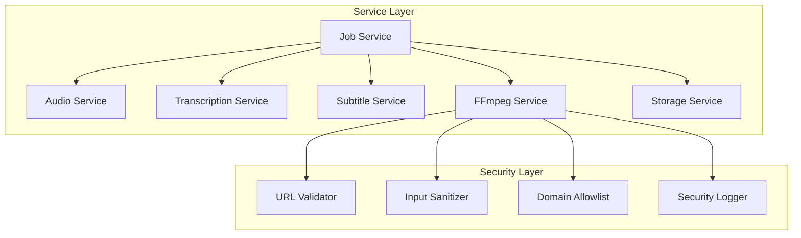

# Services Layer - Technical Documentation

## Overview

The services layer implements the core business logic for VideoCraft, providing clean abstractions for video generation, audio processing, subtitles, and security validation.

## Architecture



## Core Services

### Job Service (`job_service.go`)
Orchestrates the complete video generation workflow:
- Creates and manages async jobs
- Coordinates service calls
- Progress tracking and status updates
- Error handling and recovery

### Audio Service (`audio_service.go`)
Handles audio file analysis and timing:
- FFprobe integration for duration analysis
- Scene timing calculation
- Concurrent audio processing
- Duration validation

### Transcription Service (`transcription_service.go`)
Manages Python Whisper daemon communication:
- Long-running daemon lifecycle
- Word-level transcription with timestamps
- Graceful shutdown and restart
- Error recovery

### Subtitle Service (`subtitle_service.go`)
Generates ASS subtitle files:
- Progressive word-by-word timing
- ASS format styling and positioning
- Scene-based subtitle mapping
- Configurable subtitle styles

### Storage Service (`storage_service.go`)
File management and cleanup:
- Output directory management
- Temporary file cleanup
- File retention policies
- Storage metrics

## Security Implementation

### FFmpeg Security (`ffmpeg_service_security.go`)

The FFmpeg service implements comprehensive security measures to prevent command injection and unauthorized access:

#### Multi-Layered URL Validation

```go
func (s *ffmpegService) ValidateURL(rawURL string) error {
    // 1. Early rejection of dangerous URI schemes
    if err := s.checkForDataURI(rawURL); err != nil {
        return err
    }
    
    // 2. Character-based injection detection
    if err := s.checkForInjectionChars(rawURL); err != nil {
        return err
    }
    
    // 3. Path traversal detection
    if err := s.checkForPathTraversal(rawURL); err != nil {
        return err
    }
    
    // 4. URL structure and protocol validation
    return s.validateURLStructureAndProtocol(rawURL)
}
```

#### Input Sanitization

```go
func (s *ffmpegService) SanitizeInput(input string) (string, error) {
    // Remove prohibited characters using regex
    sanitized := prohibitedCharsRegex.ReplaceAllString(input, "")
    
    // Clean path traversal sequences
    sanitized = pathTraversalRegex.ReplaceAllString(sanitized, "")
    
    // Split by spaces and keep only first token
    tokens := strings.Fields(sanitized)
    if len(tokens) > 0 {
        sanitized = tokens[0]
    }
    
    // Reject dangerous commands
    if dangerousCommands[strings.ToLower(sanitized)] {
        return "", errors.New("input contains only malicious content")
    }
    
    return sanitized, nil
}
```

#### Domain Allowlist

```go
func (s *ffmpegService) ValidateURLAllowlist(rawURL string) error {
    if len(s.cfg.Security.AllowedDomains) == 0 {
        return nil // No allowlist configured
    }
    
    parsedURL, err := url.Parse(rawURL)
    if err != nil {
        return fmt.Errorf("invalid URL format: %w", err)
    }
    
    for _, allowedDomain := range s.cfg.Security.AllowedDomains {
        if parsedURL.Host == allowedDomain {
            return nil
        }
    }
    
    return errors.New("domain not in allowlist")
}
```

#### Security Patterns

- **Prohibited Characters**: `[;&|` + "`" + `$(){}]`
- **Path Traversal**: `\.\.\/|\.\.\\`
- **Allowed Protocols**: `http`, `https` only
- **Dangerous Commands**: `rm`, `cat`, `ls`, `chmod`, `sudo`, `bash`, `sh`, `cmd`, `powershell`, `wget`, `curl`, `nc`

#### Security Integration

Security validation is integrated at the command building stage:

```go
func (s *ffmpegService) BuildCommand(config *models.VideoConfigArray) (*FFmpegCommand, error) {
    // Security validation: Check all URLs in configuration
    if err := s.validateAllURLsInConfig(config); err != nil {
        return nil, fmt.Errorf("security validation failed: %w", err)
    }
    
    // Continue with command building...
}
```

## Testing

### Comprehensive Test Coverage

The services layer includes extensive test coverage:

#### FFmpeg Security Tests (`ffmpeg_service_security_test.go`)
- 18 core security validation tests
- Command injection prevention tests
- URL validation tests  
- Input sanitization tests
- Domain allowlist tests

#### Edge Case Tests (`ffmpeg_service_security_edge_test.go`)
- 16 additional edge case tests
- Unicode URL handling
- Performance testing (1000 URLs in <1ms)
- Case sensitivity tests
- Complex injection attempts

#### Test Structure
```go
func TestFFmpegService_URLValidation_CommandInjectionPrevention(t *testing.T) {
    tests := []struct {
        name           string
        maliciousURL   string
        expectedError  string
        shouldFail     bool
    }{
        {
            name:          "Command injection with semicolon",
            maliciousURL:  "http://example.com/video.mp4; rm -rf /",
            expectedError: "URL contains prohibited characters",
            shouldFail:    true,
        },
        // ... more test cases
    }
    
    for _, tt := range tests {
        t.Run(tt.name, func(t *testing.T) {
            err := service.ValidateURL(tt.maliciousURL)
            
            if tt.shouldFail {
                require.Error(t, err)
                assert.Contains(t, err.Error(), tt.expectedError)
            } else {
                assert.NoError(t, err)
            }
        })
    }
}
```

## Configuration

### Security Configuration

```go
type SecurityConfig struct {
    APIKey         string   `mapstructure:"api_key"`
    RateLimit      int      `mapstructure:"rate_limit"`
    EnableAuth     bool     `mapstructure:"enable_auth"`
    AllowedDomains []string `mapstructure:"allowed_domains"`
}
```

### Environment Variables

```bash
# Security settings
VIDEOCRAFT_SECURITY_ALLOWED_DOMAINS=trusted.example.com,cdn.trusted.org
VIDEOCRAFT_SECURITY_RATE_LIMIT=100
VIDEOCRAFT_SECURITY_ENABLE_AUTH=true
```

## Error Handling

Services implement structured error handling with context:

```go
// Domain-specific errors
var (
    ErrAudioAnalysisFailed     = errors.New("audio analysis failed")
    ErrTranscriptionFailed     = errors.New("transcription failed")
    ErrSubtitleGenerationFailed = errors.New("subtitle generation failed")
    ErrVideoGenerationFailed   = errors.New("video generation failed")
    ErrSecurityValidationFailed = errors.New("security validation failed")
)

// Error propagation with context
func (js *jobService) ProcessJob(ctx context.Context, job *models.Job) error {
    if err := js.processJobInternal(ctx, job); err != nil {
        js.UpdateJobStatus(job.ID, models.JobStatusFailed, err.Error())
        return fmt.Errorf("job processing failed: %w", err)
    }
    return nil
}
```

## Performance Considerations

### Concurrent Processing
- Audio analysis runs in parallel for multiple files
- Transcription daemon maintains persistent connection
- Security validation optimized for high throughput

### Resource Management
- Connection pooling for HTTP requests
- Memory-efficient stream processing
- Automatic cleanup of temporary resources

### Caching
- Whisper model cached in daemon process
- FFprobe results cached for duplicate URLs
- Security validation results cached

## Development Guidelines

### Interface Design
```go
type FFmpegService interface {
    GenerateVideo(ctx context.Context, config *models.VideoConfigArray, progressChan chan<- int) (string, error)
    BuildCommand(config *models.VideoConfigArray) (*FFmpegCommand, error)
    Execute(ctx context.Context, cmd *FFmpegCommand) error
    
    // Security methods
    ValidateURL(rawURL string) error
    SanitizeInput(input string) (string, error)
    ValidateURLAllowlist(rawURL string) error
}
```

### Testing Requirements
- Unit tests for all public methods
- Edge case coverage >95%
- Security vulnerability tests
- Performance benchmarks
- Integration tests for service interactions

### Security Best Practices
- Always validate inputs at service boundaries
- Log security violations with structured data
- Use allowlists instead of blocklists where possible
- Implement defense in depth with multiple validation layers
- Regular security audits and penetration testing

---

This documentation provides a comprehensive overview of the services layer implementation with emphasis on the new security features introduced in Task 1.