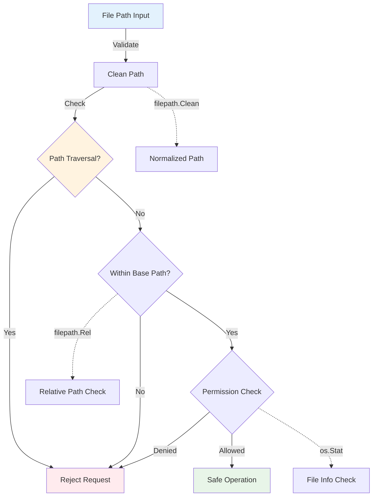

# VideoCraft Storage Layer - Secure File Management & Storage

The storage layer provides secure, efficient file management for VideoCraft's video generation pipeline. It implements path traversal protection, disk space management, and automated cleanup while supporting both local filesystem and cloud storage backends.

## 🗄️ Storage Architecture

```mermaid
graph TB
    subgraph "Storage Interface Layer"
        STORAGE_SVC[Storage Service]
        INTERFACE[Storage Interface]
        FACTORY[Storage Factory]
    end
    
    subgraph "Storage Backends"
        FILESYSTEM[Filesystem Backend]
        CLOUD[Cloud Backend (Future)]
        S3[S3 Backend (Future)]
    end
    
    subgraph "Security & Validation"
        PATH_VALIDATION[Path Validation]
        TRAVERSAL_PROTECTION[Traversal Protection]
        SIZE_LIMITS[Size Limits]
        PERMISSION_CHECK[Permission Checks]
    end
    
    subgraph "File Management"
        VIDEO_STORAGE[Video Storage]
        TEMP_MANAGEMENT[Temp File Management]
        CLEANUP[Automated Cleanup]
        DISK_MONITORING[Disk Space Monitoring]
    end
    
    subgraph "Operations"
        STORE[Store Files]
        RETRIEVE[Retrieve Files]
        DELETE[Delete Files]
        LIST[List Files]
        HEALTH[Health Checks]
    end
    
    STORAGE_SVC --> INTERFACE
    INTERFACE --> FACTORY
    FACTORY --> FILESYSTEM
    FACTORY --> CLOUD
    FACTORY --> S3
    
    FILESYSTEM --> PATH_VALIDATION
    FILESYSTEM --> TRAVERSAL_PROTECTION
    FILESYSTEM --> SIZE_LIMITS
    FILESYSTEM --> PERMISSION_CHECK
    
    FILESYSTEM --> VIDEO_STORAGE
    FILESYSTEM --> TEMP_MANAGEMENT
    FILESYSTEM --> CLEANUP
    FILESYSTEM --> DISK_MONITORING
    
    VIDEO_STORAGE --> STORE
    VIDEO_STORAGE --> RETRIEVE
    TEMP_MANAGEMENT --> DELETE
    CLEANUP --> LIST
    DISK_MONITORING --> HEALTH
    
    style STORAGE_SVC fill:#e3f2fd
    style FILESYSTEM fill:#f3e5f5
    style PATH_VALIDATION fill:#ffebee
    style VIDEO_STORAGE fill:#e8f5e8
```

## 📁 Storage Package Structure

```
internal/storage/
├── manager.go              # Storage interface and factory
├── filesystem/             # Filesystem storage implementation
│   └── manager.go         # Local filesystem backend
└── repository/            # Repository pattern implementations (future)
```

## 🔒 Security-First Design

### Path Traversal Protection



## 🛠️ Storage Interface

### Universal Storage Interface

```go
type Service interface {
    // Video storage operations
    StoreVideo(videoPath string) (string, error)
    GetVideo(videoID string) (string, error)
    DeleteVideo(videoID string) error
    ListVideos() ([]*VideoFileInfo, error)
    
    // File management operations
    StoreFile(filePath, category string) (string, error)
    GetFile(fileID string) (string, error)
    DeleteFile(fileID string) error
    
    // Storage management
    GetDiskUsage() (*DiskUsage, error)
    CleanupOldFiles(maxAge time.Duration) error
    
    // Health and monitoring
    HealthCheck() error
    GetStorageStats() (*StorageStats, error)
}

type VideoFileInfo struct {
    ID        string    `json:"id"`
    Filename  string    `json:"filename"`
    Size      int64     `json:"size"`
    CreatedAt time.Time `json:"created_at"`
    Path      string    `json:"path,omitempty"`
}

type DiskUsage struct {
    TotalSpace int64 `json:"total_space"`
    FreeSpace  int64 `json:"free_space"`
    UsedSpace  int64 `json:"used_space"`
    UsagePercent float64 `json:"usage_percent"`
}

type StorageStats struct {
    VideoCount    int64     `json:"video_count"`
    TotalSize     int64     `json:"total_size_bytes"`
    DiskUsage     DiskUsage `json:"disk_usage"`
    LastCleanup   time.Time `json:"last_cleanup"`
    HealthStatus  string    `json:"health_status"`
}
```

## 💾 Filesystem Storage Implementation

### Secure Filesystem Backend

```go
type service struct {
    cfg         *app.Config
    log         logger.Logger
    basePath    string
    tempPath    string
    lastCleanup time.Time
    mu          sync.RWMutex
}

func NewService(cfg *app.Config, log logger.Logger) Service {
    return &service{
        cfg:      cfg,
        log:      log,
        basePath: cfg.Storage.BasePath,
        tempPath: cfg.Storage.TempDir,
    }
}

func (s *service) StoreVideo(videoPath string) (string, error) {
    s.log.Debugf("Storing video: %s", videoPath)
    
    // Validate input path
    if err := s.validatePath(videoPath); err != nil {
        return "", fmt.Errorf("invalid video path: %w", err)
    }
    
    // Check if source file exists
    fileInfo, err := os.Stat(videoPath)
    if err != nil {
        return "", fmt.Errorf("source video file not found: %w", err)
    }
    
    // Validate file size
    if err := s.validateFileSize(fileInfo.Size()); err != nil {
        return "", fmt.Errorf("file size validation failed: %w", err)
    }
    
    // Generate unique video ID
    videoID := s.generateVideoID()
    
    // Create destination path
    destPath := filepath.Join(s.basePath, fmt.Sprintf("%s.mp4", videoID))
    
    // Ensure destination directory exists
    if err := s.ensureDirectoryExists(s.basePath); err != nil {
        return "", fmt.Errorf("failed to create storage directory: %w", err)
    }
    
    // Copy file to storage location
    if err := s.copyFile(videoPath, destPath); err != nil {
        return "", fmt.Errorf("failed to copy video file: %w", err)
    }
    
    // Verify copied file
    if err := s.verifyFile(destPath, fileInfo.Size()); err != nil {
        os.Remove(destPath) // Cleanup failed copy
        return "", fmt.Errorf("file verification failed: %w", err)
    }
    
    s.log.Infof("Video stored successfully: %s -> %s", videoPath, videoID)
    return videoID, nil
}
```

### Path Security Validation

```go
func (s *service) validatePath(filePath string) error {
    if filePath == "" {
        return errors.New("file path cannot be empty")
    }
    
    // Clean the path to resolve any .. or . components
    cleanPath := filepath.Clean(filePath)
    
    // Check for path traversal attempts
    if strings.Contains(cleanPath, "..") {
        return errors.New("path traversal detected")
    }
    
    // Ensure path is absolute or safely relative
    if filepath.IsAbs(cleanPath) {
        // For absolute paths, ensure they're within allowed directories
        if !s.isWithinAllowedDirectory(cleanPath) {
            return errors.New("path outside allowed directories")
        }
    }
    
    // Check for suspicious path components
    suspiciousPatterns := []string{
        "/etc/", "/proc/", "/sys/", "/dev/",
        "\\windows\\", "\\system32\\",
        ".ssh", ".env", "passwd", "shadow",
    }
    
    pathLower := strings.ToLower(cleanPath)
    for _, pattern := range suspiciousPatterns {
        if strings.Contains(pathLower, pattern) {
            return fmt.Errorf("suspicious path pattern detected: %s", pattern)
        }
    }
    
    return nil
}

func (s *service) isWithinAllowedDirectory(path string) bool {
    allowedDirs := []string{
        s.basePath,
        s.tempPath,
        "/tmp",
        "/var/tmp",
    }
    
    for _, allowedDir := range allowedDirs {
        rel, err := filepath.Rel(allowedDir, path)
        if err != nil {
            continue
        }
        
        // Path is within allowed directory if relative path doesn't start with ..
        if !strings.HasPrefix(rel, "..") {
            return true
        }
    }
    
    return false
}
```

### File Operations with Security

```go
func (s *service) copyFile(src, dst string) error {
    // Validate both source and destination
    if err := s.validatePath(src); err != nil {
        return fmt.Errorf("invalid source path: %w", err)
    }
    
    if err := s.validatePath(dst); err != nil {
        return fmt.Errorf("invalid destination path: %w", err)
    }
    
    // Open source file
    srcFile, err := os.Open(src)
    if err != nil {
        return fmt.Errorf("failed to open source file: %w", err)
    }
    defer srcFile.Close()
    
    // Create destination file with secure permissions
    dstFile, err := os.OpenFile(dst, os.O_WRONLY|os.O_CREATE|os.O_TRUNC, 0644)
    if err != nil {
        return fmt.Errorf("failed to create destination file: %w", err)
    }
    defer dstFile.Close()
    
    // Copy with progress tracking
    written, err := io.Copy(dstFile, srcFile)
    if err != nil {
        return fmt.Errorf("file copy failed: %w", err)
    }
    
    // Ensure data is written to disk
    if err := dstFile.Sync(); err != nil {
        return fmt.Errorf("failed to sync file: %w", err)
    }
    
    s.log.Debugf("File copied: %d bytes from %s to %s", written, src, dst)
    return nil
}

func (s *service) verifyFile(filePath string, expectedSize int64) error {
    fileInfo, err := os.Stat(filePath)
    if err != nil {
        return fmt.Errorf("failed to stat file: %w", err)
    }
    
    if fileInfo.Size() != expectedSize {
        return fmt.Errorf("file size mismatch: expected %d, got %d", 
            expectedSize, fileInfo.Size())
    }
    
    // Additional verification: check if file is readable
    file, err := os.Open(filePath)
    if err != nil {
        return fmt.Errorf("file not readable: %w", err)
    }
    file.Close()
    
    return nil
}
```

## 📊 Disk Space Management

### Intelligent Space Monitoring

```go
func (s *service) GetDiskUsage() (*DiskUsage, error) {
    var stat syscall.Statfs_t
    if err := syscall.Statfs(s.basePath, &stat); err != nil {
        return nil, fmt.Errorf("failed to get disk usage: %w", err)
    }
    
    // Calculate disk usage
    totalSpace := int64(stat.Blocks) * int64(stat.Bsize)
    freeSpace := int64(stat.Bavail) * int64(stat.Bsize)
    usedSpace := totalSpace - freeSpace
    usagePercent := float64(usedSpace) / float64(totalSpace) * 100
    
    return &DiskUsage{
        TotalSpace:   totalSpace,
        FreeSpace:    freeSpace,
        UsedSpace:    usedSpace,
        UsagePercent: usagePercent,
    }, nil
}

func (s *service) checkDiskSpace() error {
    usage, err := s.GetDiskUsage()
    if err != nil {
        return err
    }
    
    // Check if we're running low on space
    if usage.UsagePercent > 90 {
        return fmt.Errorf("disk usage critical: %.1f%% used", usage.UsagePercent)
    }
    
    if usage.FreeSpace < s.cfg.Storage.MinFreeSpace {
        return fmt.Errorf("free space too low: %d bytes remaining", usage.FreeSpace)
    }
    
    return nil
}
```

### Automated Cleanup System

```go
func (s *service) CleanupOldFiles(maxAge time.Duration) error {
    s.mu.Lock()
    defer s.mu.Unlock()
    
    s.log.Infof("Starting cleanup of files older than %v", maxAge)
    
    cutoffTime := time.Now().Add(-maxAge)
    cleanedCount := 0
    cleanedSize := int64(0)
    
    err := filepath.Walk(s.basePath, func(path string, info os.FileInfo, err error) error {
        if err != nil {
            s.log.Warnf("Error walking path %s: %v", path, err)
            return nil // Continue walking
        }
        
        // Skip directories
        if info.IsDir() {
            return nil
        }
        
        // Check if file is old enough for cleanup
        if info.ModTime().Before(cutoffTime) {
            s.log.Debugf("Cleaning up old file: %s (age: %v)", 
                path, time.Since(info.ModTime()))
            
            size := info.Size()
            if err := os.Remove(path); err != nil {
                s.log.Errorf("Failed to remove file %s: %v", path, err)
            } else {
                cleanedCount++
                cleanedSize += size
            }
        }
        
        return nil
    })
    
    s.lastCleanup = time.Now()
    
    if err != nil {
        return fmt.Errorf("cleanup walk failed: %w", err)
    }
    
    s.log.Infof("Cleanup completed: %d files removed, %d bytes freed", 
        cleanedCount, cleanedSize)
    
    return nil
}

func (s *service) autoCleanup() {
    if !s.cfg.Storage.CleanupEnabled {
        return
    }
    
    ticker := time.NewTicker(s.cfg.Storage.CleanupInterval)
    defer ticker.Stop()
    
    for range ticker.C {
        if err := s.CleanupOldFiles(s.cfg.Storage.CleanupAge); err != nil {
            s.log.Errorf("Auto-cleanup failed: %v", err)
        }
    }
}
```

## 📋 File Listing & Management

### Secure File Listing

```go
func (s *service) ListVideos() ([]*VideoFileInfo, error) {
    s.log.Debug("Listing stored videos")
    
    var videos []*VideoFileInfo
    
    err := filepath.Walk(s.basePath, func(path string, info os.FileInfo, err error) error {
        if err != nil {
            s.log.Warnf("Error walking path %s: %v", path, err)
            return nil
        }
        
        // Skip directories and non-video files
        if info.IsDir() || !s.isVideoFile(path) {
            return nil
        }
        
        // Extract video ID from filename
        videoID := s.extractVideoID(path)
        if videoID == "" {
            return nil
        }
        
        video := &VideoFileInfo{
            ID:        videoID,
            Filename:  info.Name(),
            Size:      info.Size(),
            CreatedAt: info.ModTime(),
            Path:      path,
        }
        
        videos = append(videos, video)
        return nil
    })
    
    if err != nil {
        return nil, fmt.Errorf("failed to list videos: %w", err)
    }
    
    // Sort by creation time (newest first)
    sort.Slice(videos, func(i, j int) bool {
        return videos[i].CreatedAt.After(videos[j].CreatedAt)
    })
    
    s.log.Debugf("Found %d stored videos", len(videos))
    return videos, nil
}

func (s *service) isVideoFile(path string) bool {
    ext := strings.ToLower(filepath.Ext(path))
    videoExtensions := []string{".mp4", ".avi", ".mov", ".webm", ".mkv"}
    
    for _, validExt := range videoExtensions {
        if ext == validExt {
            return true
        }
    }
    
    return false
}

func (s *service) extractVideoID(path string) string {
    filename := filepath.Base(path)
    ext := filepath.Ext(filename)
    videoID := strings.TrimSuffix(filename, ext)
    
    // Validate UUID format
    if len(videoID) == 36 && strings.Count(videoID, "-") == 4 {
        return videoID
    }
    
    return ""
}
```

## 🏥 Health Monitoring

### Comprehensive Health Checks

```go
func (s *service) HealthCheck() error {
    var healthErrors []string
    
    // Check if base directory exists and is writable
    if err := s.checkDirectoryHealth(s.basePath); err != nil {
        healthErrors = append(healthErrors, fmt.Sprintf("base directory: %v", err))
    }
    
    // Check if temp directory exists and is writable
    if err := s.checkDirectoryHealth(s.tempPath); err != nil {
        healthErrors = append(healthErrors, fmt.Sprintf("temp directory: %v", err))
    }
    
    // Check disk space
    if err := s.checkDiskSpace(); err != nil {
        healthErrors = append(healthErrors, fmt.Sprintf("disk space: %v", err))
    }
    
    // Check permissions
    if err := s.checkPermissions(); err != nil {
        healthErrors = append(healthErrors, fmt.Sprintf("permissions: %v", err))
    }
    
    if len(healthErrors) > 0 {
        return fmt.Errorf("storage health check failed: %s", strings.Join(healthErrors, "; "))
    }
    
    return nil
}

func (s *service) checkDirectoryHealth(dirPath string) error {
    // Check if directory exists
    info, err := os.Stat(dirPath)
    if err != nil {
        if os.IsNotExist(err) {
            // Try to create directory
            if err := os.MkdirAll(dirPath, 0755); err != nil {
                return fmt.Errorf("directory does not exist and cannot be created: %w", err)
            }
        } else {
            return fmt.Errorf("cannot stat directory: %w", err)
        }
    } else if !info.IsDir() {
        return fmt.Errorf("path exists but is not a directory")
    }
    
    // Test write permissions
    testFile := filepath.Join(dirPath, ".health_check_test")
    if err := os.WriteFile(testFile, []byte("test"), 0644); err != nil {
        return fmt.Errorf("directory not writable: %w", err)
    }
    
    // Cleanup test file
    os.Remove(testFile)
    
    return nil
}

func (s *service) GetStorageStats() (*StorageStats, error) {
    // Get disk usage
    diskUsage, err := s.GetDiskUsage()
    if err != nil {
        return nil, err
    }
    
    // Count videos and calculate total size
    videos, err := s.ListVideos()
    if err != nil {
        return nil, err
    }
    
    var totalSize int64
    for _, video := range videos {
        totalSize += video.Size
    }
    
    // Determine health status
    healthStatus := "healthy"
    if err := s.HealthCheck(); err != nil {
        healthStatus = "unhealthy"
    }
    
    return &StorageStats{
        VideoCount:   int64(len(videos)),
        TotalSize:    totalSize,
        DiskUsage:    *diskUsage,
        LastCleanup:  s.lastCleanup,
        HealthStatus: healthStatus,
    }, nil
}
```

## 🔧 Configuration

### Storage Configuration

```yaml
storage:
  # Storage backend
  type: "filesystem"             # filesystem, s3, gcs (future)
  
  # Filesystem settings
  base_path: "./generated_videos" # Base storage directory
  temp_dir: "./temp"             # Temporary files directory
  
  # Size limits
  max_file_size: 104857600       # 100MB maximum file size
  min_free_space: 1073741824     # 1GB minimum free space required
  max_disk_usage: 10737418240    # 10GB maximum total usage
  
  # Cleanup settings
  cleanup_enabled: true          # Enable automatic cleanup
  cleanup_age: "168h"            # Delete files older than 7 days
  cleanup_interval: "1h"         # Run cleanup every hour
  
  # Security settings
  allowed_extensions: [".mp4", ".avi", ".mov", ".webm"]
  max_path_length: 255           # Maximum file path length
  validate_paths: true           # Enable path validation
  
  # Performance settings
  buffer_size: 65536             # 64KB buffer for file operations
  sync_writes: true              # Sync writes to disk
```

## 🧪 Testing Strategy

### Storage Security Testing

```go
func TestStorageService_PathTraversalProtection(t *testing.T) {
    service := setupTestStorageService(t)
    
    maliciousPaths := []string{
        "../../../etc/passwd",
        "..\\..\\windows\\system32\\config\\sam",
        "/etc/shadow",
        "C:\\Windows\\System32\\config\\SAM",
        "./../../secret.txt",
        "../temp/../../../etc/hosts",
        "\\..\\..\\..\\etc\\passwd",
    }
    
    for _, maliciousPath := range maliciousPaths {
        t.Run(maliciousPath, func(t *testing.T) {
            err := service.validatePath(maliciousPath)
            assert.Error(t, err, "Should reject malicious path: %s", maliciousPath)
        })
    }
}

func TestStorageService_DiskSpaceManagement(t *testing.T) {
    service := setupTestStorageService(t)
    
    // Test disk usage monitoring
    usage, err := service.GetDiskUsage()
    require.NoError(t, err)
    assert.Greater(t, usage.TotalSpace, int64(0))
    assert.GreaterOrEqual(t, usage.FreeSpace, int64(0))
    
    // Test cleanup functionality
    err = service.CleanupOldFiles(24 * time.Hour)
    assert.NoError(t, err)
}
```

### Performance Testing

```go
func TestStorageService_ConcurrentOperations(t *testing.T) {
    service := setupTestStorageService(t)
    
    numWorkers := 10
    var wg sync.WaitGroup
    
    for i := 0; i < numWorkers; i++ {
        wg.Add(1)
        go func(workerID int) {
            defer wg.Done()
            
            // Create test video file
            testFile := createTestVideoFile(t, workerID)
            defer os.Remove(testFile)
            
            // Store video
            videoID, err := service.StoreVideo(testFile)
            require.NoError(t, err)
            
            // Retrieve video
            retrievedPath, err := service.GetVideo(videoID)
            require.NoError(t, err)
            assert.FileExists(t, retrievedPath)
            
            // Cleanup
            err = service.DeleteVideo(videoID)
            assert.NoError(t, err)
        }(i)
    }
    
    wg.Wait()
}
```

---

**Related Documentation:**
- [Filesystem Storage Backend](filesystem/CLAUDE.md)
- [Job Queue Integration](../core/services/job/queue/CLAUDE.md)
- [Video Engine](../core/video/engine/CLAUDE.md)
- [Configuration Management](../app/CLAUDE.md)