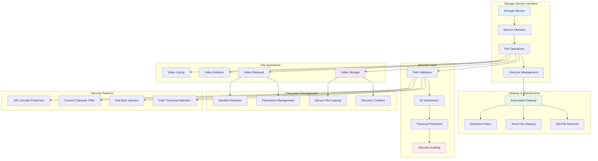

# VideoCraft Filesystem Storage - Secure File Management & Path Protection

The filesystem storage implementation provides secure, efficient file storage with comprehensive path traversal protection, security auditing, and automated cleanup. This backend serves as the primary storage layer for VideoCraft's generated videos and temporary files.

## 🗄️ Filesystem Storage Architecture



## 🎯 Service Interface Design

### Comprehensive Storage Interface

```go
type Service interface {
    // Core video storage operations
    StoreVideo(videoPath string) (string, error)
    GetVideo(videoID string) (string, error)
    DeleteVideo(videoID string) error
    
    // Video management operations
    ListVideos() ([]models.VideoInfo, error)
    
    // Maintenance operations
    CleanupOldFiles() error
}

type storageService struct {
    cfg *app.Config
    log logger.Logger
}

func NewService(cfg *app.Config, log logger.Logger) Service {
    return &storageService{
        cfg: cfg,
        log: log,
    }
}
```

## 🛡️ Advanced Security Patterns

### Comprehensive Security Validation

```go
// Security patterns for comprehensive path validation
var (
    // Storage-specific path traversal patterns
    storagePathTraversalRegex = regexp.MustCompile(`\.\.\/|\.\.\\|\.\.\\\/`)
    
    // Null byte injection detection
    nullByteRegex = regexp.MustCompile(`\x00`)
    
    // Control character detection
    controlCharRegex = regexp.MustCompile(`[\x00-\x1f\x7f]`)
    
    // Valid video ID pattern (alphanumeric, hyphens, underscores)
    validVideoIDRegex = regexp.MustCompile(`^[a-zA-Z0-9][a-zA-Z0-9_-]*$`)
)
```

### Multi-Layer Video ID Validation

```go
func (s *storageService) validateVideoID(videoID string) error {
    // Check for empty or whitespace-only ID
    if strings.TrimSpace(videoID) == "" {
        return errors.New("empty video ID not allowed")
    }

    // Check for path traversal patterns
    if storagePathTraversalRegex.MatchString(videoID) {
        return errors.New("path traversal detected")
    }

    // Check for null bytes
    if nullByteRegex.MatchString(videoID) {
        return errors.New("null byte injection detected")
    }

    // Check for control characters
    if controlCharRegex.MatchString(videoID) {
        return errors.New("control characters not allowed")
    }

    // Check for absolute paths
    if filepath.IsAbs(videoID) {
        return errors.New("absolute path not allowed")
    }

    // URL decode to catch encoded attacks
    decodedID, err := url.QueryUnescape(videoID)
    if err == nil && decodedID != videoID {
        // Check decoded version for path traversal
        if storagePathTraversalRegex.MatchString(decodedID) {
            return errors.New("path traversal detected")
        }
    }

    // Double decode to catch double-encoded attacks
    doubleDecodedID, err := url.QueryUnescape(decodedID)
    if err == nil && doubleDecodedID != decodedID {
        if storagePathTraversalRegex.MatchString(doubleDecodedID) {
            return errors.New("path traversal detected")
        }
    }

    return nil
}
```

### Advanced Input Sanitization

```go
func (s *storageService) sanitizeVideoID(videoID string) (string, error) {
    // Trim whitespace
    sanitized := strings.TrimSpace(videoID)

    // Remove any null bytes
    sanitized = nullByteRegex.ReplaceAllString(sanitized, "")

    // Remove control characters
    sanitized = controlCharRegex.ReplaceAllString(sanitized, "")

    // Ensure it's not empty after sanitization
    if sanitized == "" {
        return "", errors.New("video ID becomes empty after sanitization")
    }

    // Check if it matches valid pattern
    if !validVideoIDRegex.MatchString(sanitized) {
        return "", errors.New("invalid video ID format")
    }

    return sanitized, nil
}
```

### Path Boundary Validation

```go
func (s *storageService) validatePathWithinBounds(targetPath, allowedDir string) error {
    // Clean and resolve paths
    cleanTarget, err := filepath.Abs(filepath.Clean(targetPath))
    if err != nil {
        return fmt.Errorf("failed to resolve target path: %w", err)
    }

    cleanAllowed, err := filepath.Abs(filepath.Clean(allowedDir))
    if err != nil {
        return fmt.Errorf("failed to resolve allowed directory: %w", err)
    }

    // Check if target is within allowed directory
    relPath, err := filepath.Rel(cleanAllowed, cleanTarget)
    if err != nil {
        return fmt.Errorf("failed to determine relative path: %w", err)
    }

    // If relative path starts with ".." it's outside the allowed directory
    if strings.HasPrefix(relPath, "..") || strings.HasPrefix(relPath, "/") {
        return errors.New("path traversal detected")
    }

    return nil
}
```

## 💾 Video Storage Operations

### Secure Video Storage

```go
func (s *storageService) StoreVideo(videoPath string) (string, error) {
    s.log.Debugf("Storing video: %s", videoPath)

    // Generate unique video ID using UUID
    videoID := uuid.New().String()

    // Ensure output directory exists with proper permissions
    if err := os.MkdirAll(s.cfg.Storage.OutputDir, 0755); err != nil {
        return "", domainErrors.StorageFailed(err)
    }

    // Get file extension safely
    ext := filepath.Ext(videoPath)
    if ext == "" {
        ext = ".mp4" // Default extension
    }

    // Create secure destination path
    destPath := filepath.Join(s.cfg.Storage.OutputDir, fmt.Sprintf("%s%s", videoID, ext))

    // Copy file securely to destination
    if err := s.copyFile(videoPath, destPath); err != nil {
        return "", domainErrors.StorageFailed(err)
    }

    // Remove original temp file
    if err := os.Remove(videoPath); err != nil {
        s.log.Warnf("Failed to remove temp file %s: %v", videoPath, err)
    }

    s.log.Infof("Video stored with ID: %s", videoID)
    return videoID, nil
}
```

### Secure File Copying

```go
func (s *storageService) copyFile(src, dst string) error {
    sourceFile, err := os.Open(src)
    if err != nil {
        return err
    }
    defer sourceFile.Close()

    destFile, err := os.Create(dst)
    if err != nil {
        return err
    }
    defer destFile.Close()

    // Copy file contents efficiently
    _, err = destFile.ReadFrom(sourceFile)
    if err != nil {
        return err
    }

    // Copy file permissions to maintain security
    sourceInfo, err := os.Stat(src)
    if err != nil {
        return err
    }

    return os.Chmod(dst, sourceInfo.Mode())
}
```

## 📁 Video Retrieval with Security

### Multi-Layer Security Video Retrieval

```go
func (s *storageService) GetVideo(videoID string) (string, error) {
    s.log.Debugf("Getting video: %s", videoID)

    // Security validation
    if err := s.validateVideoID(videoID); err != nil {
        s.logSecurityViolation("Invalid video ID provided", map[string]interface{}{
            "video_id": videoID,
            "error":    err.Error(),
        })
        return "", err
    }

    // Sanitize and canonicalize the video ID
    sanitizedID, err := s.sanitizeVideoID(videoID)
    if err != nil {
        return "", err
    }

    // Build safe pattern within output directory
    pattern := filepath.Join(s.cfg.Storage.OutputDir, sanitizedID+".*")

    // Additional security check: ensure pattern is within output directory
    if validateErr := s.validatePathWithinBounds(pattern, s.cfg.Storage.OutputDir); validateErr != nil {
        s.logSecurityViolation("Path outside allowed directory", map[string]interface{}{
            "pattern":    pattern,
            "output_dir": s.cfg.Storage.OutputDir,
        })
        return "", errors.New("path traversal detected")
    }

    // Find matching files
    matches, err := filepath.Glob(pattern)
    if err != nil {
        return "", domainErrors.StorageFailed(err)
    }

    if len(matches) == 0 {
        return "", domainErrors.FileNotFound(videoID)
    }

    // Security check: verify all matches are within allowed directory
    for _, match := range matches {
        if matchErr := s.validatePathWithinBounds(match, s.cfg.Storage.OutputDir); matchErr != nil {
            s.logSecurityViolation("Match outside allowed directory", map[string]interface{}{
                "match":      match,
                "output_dir": s.cfg.Storage.OutputDir,
            })
            continue
        }
    }

    // Return first valid match
    videoPath := matches[0]

    // Final security check on result path
    if finalErr := s.validatePathWithinBounds(videoPath, s.cfg.Storage.OutputDir); finalErr != nil {
        s.logSecurityViolation("Result path outside allowed directory", map[string]interface{}{
            "video_path": videoPath,
            "output_dir": s.cfg.Storage.OutputDir,
        })
        return "", errors.New("path traversal detected")
    }

    // Verify file exists and is not a symlink
    fileInfo, err := os.Lstat(videoPath)
    if err != nil {
        return "", domainErrors.FileNotFound(videoID)
    }

    // Reject symbolic links to prevent traversal
    if fileInfo.Mode()&os.ModeSymlink != 0 {
        s.logSecurityViolation("Symbolic link access attempt", map[string]interface{}{
            "video_path": videoPath,
            "video_id":   videoID,
        })
        return "", errors.New("symbolic link access not allowed")
    }

    return videoPath, nil
}
```

## 🗑️ Video Management Operations

### Secure Video Deletion

```go
func (s *storageService) DeleteVideo(videoID string) error {
    s.log.Debugf("Deleting video: %s", videoID)

    // Use secure retrieval to get video path
    videoPath, err := s.GetVideo(videoID)
    if err != nil {
        return err
    }

    // Delete the file
    if err := os.Remove(videoPath); err != nil {
        return domainErrors.StorageFailed(err)
    }

    s.log.Infof("Video deleted: %s", videoID)
    return nil
}
```

### Video Listing with Metadata

```go
func (s *storageService) ListVideos() ([]models.VideoInfo, error) {
    s.log.Debug("Listing videos")

    // Safe pattern for listing all files in output directory
    pattern := filepath.Join(s.cfg.Storage.OutputDir, "*")
    matches, err := filepath.Glob(pattern)
    if err != nil {
        return nil, domainErrors.StorageFailed(err)
    }

    videos := make([]models.VideoInfo, 0, len(matches))

    for _, match := range matches {
        // Skip directories
        if info, err := os.Stat(match); err != nil || info.IsDir() {
            continue
        }

        // Extract video ID from filename
        filename := filepath.Base(match)
        ext := filepath.Ext(filename)
        videoID := strings.TrimSuffix(filename, ext)

        // Get file metadata
        fileInfo, err := os.Stat(match)
        if err != nil {
            s.log.Warnf("Failed to get file info for %s: %v", match, err)
            continue
        }

        video := models.VideoInfo{
            ID:        videoID,
            Filename:  filename,
            Size:      fileInfo.Size(),
            CreatedAt: fileInfo.ModTime().Format(time.RFC3339),
        }

        videos = append(videos, video)
    }

    s.log.Debugf("Found %d videos", len(videos))
    return videos, nil
}
```

## 🧹 Automated Cleanup & Maintenance

### Intelligent File Cleanup

```go
func (s *storageService) CleanupOldFiles() error {
    s.log.Debug("Starting cleanup of old files")

    cutoffTime := time.Now().AddDate(0, 0, -s.cfg.Storage.RetentionDays)

    // Cleanup output directory
    if err := s.cleanupDirectory(s.cfg.Storage.OutputDir, cutoffTime); err != nil {
        return err
    }

    // Cleanup temp directory
    if err := s.cleanupDirectory(s.cfg.Storage.TempDir, cutoffTime); err != nil {
        return err
    }

    s.log.Info("File cleanup completed")
    return nil
}

func (s *storageService) cleanupDirectory(dir string, cutoffTime time.Time) error {
    if _, err := os.Stat(dir); os.IsNotExist(err) {
        return nil // Directory doesn't exist, nothing to clean
    }

    pattern := filepath.Join(dir, "*")
    matches, err := filepath.Glob(pattern)
    if err != nil {
        return domainErrors.StorageFailed(err)
    }

    deletedCount := 0

    for _, match := range matches {
        fileInfo, err := os.Stat(match)
        if err != nil {
            continue
        }

        // Skip directories
        if fileInfo.IsDir() {
            continue
        }

        // Delete files older than cutoff time
        if fileInfo.ModTime().Before(cutoffTime) {
            if err := os.Remove(match); err != nil {
                s.log.Warnf("Failed to delete old file %s: %v", match, err)
            } else {
                deletedCount++
                s.log.Debugf("Deleted old file: %s", match)
            }
        }
    }

    if deletedCount > 0 {
        s.log.Infof("Deleted %d old files from %s", deletedCount, dir)
    }

    return nil
}
```

## 🔍 Security Auditing

### Comprehensive Security Event Logging

```go
func (s *storageService) logSecurityViolation(message string, fields map[string]interface{}) {
    fields["security_event"] = true
    fields["component"] = "storage_service"
    fields["timestamp"] = time.Now()
    fields["severity"] = "HIGH"
    
    s.log.WithFields(fields).Errorf("SECURITY_VIOLATION: %s", message)
}
```

## 🔧 Configuration

### Filesystem Storage Configuration

```yaml
storage:
  # Backend configuration
  type: "filesystem"             # Storage backend type
  
  # Directory settings
  output_dir: "./generated_videos" # Video storage directory
  temp_dir: "./temp"             # Temporary files directory
  
  # File management
  retention_days: 30             # Days to keep files
  max_file_size: 104857600       # 100MB maximum file size
  
  # Security settings
  validate_paths: true           # Enable path validation
  allow_symlinks: false          # Disable symlink following
  max_path_length: 255          # Maximum path length
  
  # Cleanup settings
  cleanup_enabled: true          # Enable automatic cleanup
  cleanup_interval: "24h"       # Cleanup frequency
  cleanup_parallel: true        # Parallel cleanup processing
  
  # Permissions
  dir_permissions: 0755          # Directory creation permissions
  file_permissions: 0644        # File creation permissions
```

## 📊 Performance Characteristics

### Efficient File Operations

- **UUID-based Naming**: Prevents filename collisions and predictable paths
- **Atomic Operations**: Ensures data consistency during file operations
- **Efficient Copying**: Uses `ReadFrom` for optimal file copying performance
- **Lazy Cleanup**: Deferred cleanup prevents blocking main operations

### Security Performance

- **Regex Compilation**: Pre-compiled security patterns for fast validation
- **Path Canonicalization**: Absolute path resolution prevents traversal
- **Multi-layer Validation**: Defense in depth without significant overhead
- **Structured Logging**: Efficient security event logging

## 🧪 Testing Strategy

### Security Testing

```go
func TestFilesystemStorage_SecurityValidation(t *testing.T) {
    maliciousVideoIDs := []string{
        "../../../etc/passwd",
        "..\\..\\windows\\system32\\config\\sam",
        "video\x00.mp4",
        "/absolute/path/video",
        "video%2e%2e%2fpasswd",
        "video%252e%252e%252fpasswd", // Double encoded
        "video\x1f.mp4", // Control character
    }
    
    service := NewService(cfg, logger.NewNoop())
    
    for _, maliciousID := range maliciousVideoIDs {
        t.Run(maliciousID, func(t *testing.T) {
            _, err := service.GetVideo(maliciousID)
            assert.Error(t, err, "Should reject malicious video ID: %s", maliciousID)
        })
    }
}

func TestFilesystemStorage_PathTraversalProtection(t *testing.T) {
    service := &storageService{
        cfg: &app.Config{
            Storage: app.StorageConfig{
                OutputDir: "/safe/directory",
            },
        },
        log: logger.NewNoop(),
    }
    
    maliciousPaths := []string{
        "/safe/directory/../../../etc/passwd",
        "/safe/directory/..\\..\\windows\\system32",
        "/etc/passwd",
        "../unsafe/path",
    }
    
    for _, path := range maliciousPaths {
        t.Run(path, func(t *testing.T) {
            err := service.validatePathWithinBounds(path, "/safe/directory")
            assert.Error(t, err, "Should reject path outside bounds: %s", path)
        })
    }
    
    // Test valid paths
    validPaths := []string{
        "/safe/directory/video.mp4",
        "/safe/directory/subfolder/video.mp4",
    }
    
    for _, path := range validPaths {
        t.Run(path, func(t *testing.T) {
            err := service.validatePathWithinBounds(path, "/safe/directory")
            assert.NoError(t, err, "Should accept valid path: %s", path)
        })
    }
}

func TestFilesystemStorage_VideoIDSanitization(t *testing.T) {
    service := &storageService{log: logger.NewNoop()}
    
    tests := []struct {
        input    string
        expected string
        wantErr  bool
    }{
        {
            input:    "valid-video-id",
            expected: "valid-video-id",
            wantErr:  false,
        },
        {
            input:    "  whitespace-video  ",
            expected: "whitespace-video",
            wantErr:  false,
        },
        {
            input:    "video\x00with\x00nulls",
            expected: "videowithulls",
            wantErr:  false,
        },
        {
            input:    "video\x1fwith\x7fcontrol",
            expected: "videowithcontrol",
            wantErr:  false,
        },
        {
            input:    "",
            expected: "",
            wantErr:  true,
        },
        {
            input:    "   ",
            expected: "",
            wantErr:  true,
        },
    }
    
    for _, tt := range tests {
        t.Run(tt.input, func(t *testing.T) {
            result, err := service.sanitizeVideoID(tt.input)
            if tt.wantErr {
                assert.Error(t, err)
            } else {
                assert.NoError(t, err)
                assert.Equal(t, tt.expected, result)
            }
        })
    }
}
```

### Integration Testing

```go
func TestFilesystemStorage_VideoLifecycle(t *testing.T) {
    // Setup test environment
    tempDir, err := os.MkdirTemp("", "storage_test_*")
    require.NoError(t, err)
    defer os.RemoveAll(tempDir)
    
    cfg := &app.Config{
        Storage: app.StorageConfig{
            OutputDir:      filepath.Join(tempDir, "output"),
            TempDir:        filepath.Join(tempDir, "temp"),
            RetentionDays:  1,
        },
    }
    
    service := NewService(cfg, logger.NewNoop())
    
    // Create test video file
    testVideoPath := filepath.Join(tempDir, "test_video.mp4")
    testContent := []byte("test video content")
    err = os.WriteFile(testVideoPath, testContent, 0644)
    require.NoError(t, err)
    
    // Test video storage
    videoID, err := service.StoreVideo(testVideoPath)
    require.NoError(t, err)
    assert.NotEmpty(t, videoID)
    
    // Test video retrieval
    storedPath, err := service.GetVideo(videoID)
    require.NoError(t, err)
    assert.FileExists(t, storedPath)
    
    // Verify content
    retrievedContent, err := os.ReadFile(storedPath)
    require.NoError(t, err)
    assert.Equal(t, testContent, retrievedContent)
    
    // Test video listing
    videos, err := service.ListVideos()
    require.NoError(t, err)
    assert.Len(t, videos, 1)
    assert.Equal(t, videoID, videos[0].ID)
    
    // Test video deletion
    err = service.DeleteVideo(videoID)
    require.NoError(t, err)
    assert.NoFileExists(t, storedPath)
    
    // Verify deletion
    _, err = service.GetVideo(videoID)
    assert.Error(t, err)
}

func TestFilesystemStorage_Cleanup(t *testing.T) {
    // Setup test environment with old files
    tempDir, err := os.MkdirTemp("", "cleanup_test_*")
    require.NoError(t, err)
    defer os.RemoveAll(tempDir)
    
    cfg := &app.Config{
        Storage: app.StorageConfig{
            OutputDir:     filepath.Join(tempDir, "output"),
            TempDir:       filepath.Join(tempDir, "temp"),
            RetentionDays: 1, // 1 day retention
        },
    }
    
    // Create directories
    os.MkdirAll(cfg.Storage.OutputDir, 0755)
    os.MkdirAll(cfg.Storage.TempDir, 0755)
    
    service := NewService(cfg, logger.NewNoop())
    
    // Create old file (2 days ago)
    oldFile := filepath.Join(cfg.Storage.OutputDir, "old_video.mp4")
    err = os.WriteFile(oldFile, []byte("old content"), 0644)
    require.NoError(t, err)
    
    // Set old modification time
    oldTime := time.Now().AddDate(0, 0, -2)
    err = os.Chtimes(oldFile, oldTime, oldTime)
    require.NoError(t, err)
    
    // Create recent file
    recentFile := filepath.Join(cfg.Storage.OutputDir, "recent_video.mp4")
    err = os.WriteFile(recentFile, []byte("recent content"), 0644)
    require.NoError(t, err)
    
    // Test cleanup
    err = service.CleanupOldFiles()
    require.NoError(t, err)
    
    // Verify old file was deleted
    assert.NoFileExists(t, oldFile)
    
    // Verify recent file still exists
    assert.FileExists(t, recentFile)
}
```

---

**Related Documentation:**
- [Storage Layer Overview](../CLAUDE.md)
- [Core Services](../../core/CLAUDE.md)
- [Security Architecture](../../security/CLAUDE.md)
- [Configuration Management](../../app/CLAUDE.md)